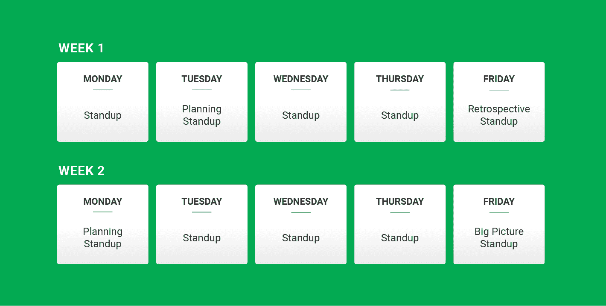

# 如何在远程团队中交流|工程师工具

> 原文：<https://circleci.com/blog/how-to-communicate-on-a-remote-team-tools-and-tips-for-engineers/>

沟通很难，远程团队的沟通更难。幸运的是，它在一个分布式团队中可以和在一个集中的团队中一样有效，如果不是更有效的话。这篇文章深入探讨了我们的团队如何应对远程通信的两个最大挑战:理解语气和支持协作框架。

虽然这篇文章是从我作为一名工程经理的角度写的，但所描述的实践和链接的模板对远程团队的任何人来说都是有价值的:它们是我们整个工程组织的人们协作、创意和回顾的成果。

## 了解分布式团队

超交流对确保人们理解他们同伴的意图大有帮助。在一个团队形成的早期，信任——一个高效团队的标志——刚刚建立起来，这一点尤其如此。为了奠定相互理解的基础，花时间去了解你团队中的每个人，并帮助他们相互了解。

为此，请:

*   进行异步介绍以收集信息并设定期望值。

*   在同步会话中实现这些一致同意的标准。

*   根据团队的意见，根据需要调整指导方针。

请记住，在高度分散的团队中，很难在每个人的日历上找到重叠的工作时间。这个重叠就是*同步时间*。同步时间是有价值的，应该如此对待。在进入同步交互之前，知道你希望达到什么。利用你的*异步时间*专注于个人工作，并为同步互动做准备。

### 异步引入

当你的团队正在[形成](https://en.wikipedia.org/wiki/Tuckman%27s_stages_of_group_development#Forming)时，使用异步时间收集信息，设定期望，并允许人们定义自己的界限。

*   确保你熟悉公司现有的沟通期望。踩遍别人的脚趾不是建立关系的好方法。如果你是一个团队的新成员，可以考虑发一条短信，解释你会在学习的过程中问很多问题。如果你使用 Slack，更新你的状态说类似的话。

*   发出一份详细的调查问卷，了解团队需要什么(或者，至少，团队成员认为他们需要什么)。如果你是一名即将加入新团队的经理，我建议你发出一些类似[的表格](https://docs.google.com/forms/d/e/1FAIpQLScRsQGHiJcru0Tuywq6iwKxr1LLemHgXW1Ch8Y6rSvNDk8iSA/viewform?usp=sf_link)，尽可能多地征求意见，并了解情况。

*   定义团队宣言。尽可能快地写下这篇文章。概括地说，这份文件应该总结出你对存在什么过程的理解，以便整理健康的实践和价值信号。[在过去的](https://docs.google.com/document/d/1L7SsKj_zj-davPNQs4yhEoL0fywU9HkWEerog5yE1o0/edit?usp=sharing)中，我将此归结为两个部分:

    *   **人(请确保你熟悉每个人的文章)** -我希望队友们互相了解，因为他们生活丰富，有好奇的兴趣，工作之外有优先事项。我表示我真的很关心这一点，首先填充我自己的个人资料，并将每个人的名字列为自己的部分。
    *   **团队流程(你可以略读，作为参考很好)** -我们团队协议中定义的框架很重要，我真诚地希望我们遵循它们。也就是说，为过程而过程不会增加价值；我很高兴我们 80%的时候都能实现我们的指导方针。

    要了解我如何围绕异步优先通信、反馈偏好和编程值等主题设置松散的基准，请查看此模板。

*   **准备同步时间。**在分布式团队中组织面对面交流的后勤工作可能会很困难(尤其是在全球夏令时不一致的月份)。让人们填写一份[团队时间表](https://docs.google.com/spreadsheets/d/1ECAlKmW8t-Yd1Ve1mFKAIdLsK8Vh-RNfTKQkavKV4dw/edit?usp=sharing)，并提醒他们在团队宣言中填写自己的[个人资料](https://docs.google.com/document/d/1L7SsKj_zj-davPNQs4yhEoL0fywU9HkWEerog5yE1o0/edit#heading=h.9efeb1usgavx)。

### 同步关系构建

同步时间对于团队开发的[风暴](https://en.wikipedia.org/wiki/Tuckman%27s_stages_of_group_development#Storming)、规范和执行阶段至关重要。利用这段时间了解您的直接下属，并为团队成员创造相互了解的空间。

请注意，异步通信并没有消失，它与同步通信一起，在您的通信框架中得到进一步的确立(见下文)。

*   最大化你的一对一。通过这个[相互了解](https://docs.google.com/document/d/1rf1KITtWzKSTLZ4kd4c4TPJwIWDMSLa4c85Osq_rYhA/edit?usp=sharing)练习，了解您的报告并推动协调。考虑从[这个广泛的集合](https://docs.google.com/document/d/1xRpJ0vtQtteYm389sxS1_X5BNq_r6_LG7VyBaevJTq0/edit?usp=sharing)中抓取一些问题来完成随后的 1:1。

*   及时参加饮水机聊天。远程团队不会在午餐时或走廊上相遇。创造空间和同步时间来连接。这可能意味着用开玩笑的时间来填充会议；这无疑意味着为共同的兴趣创建聊天组(也是异步友好的)。我们有#random、# wordnerds、# keyboards、#babies 和#bread，仅举几例。

*   **设置预定配对。**随机分配一个配对伙伴，每周轮换一次伙伴，直到每个人都和其他人至少配对过一次。在每场比赛开始时，每组的成员应该在一周内每天安排(尽最大努力)三个小时的配对活动。有时，“尽最大努力”只相当于一个小时的配对。特别是在时区跨度很大的团队中，实际上安排会议可以确保人们能够在工作时间进行联系。
    对我们来说，在整个团队进行几次轮换后，人们可以轻松地接触和临时配对。在我们的一次回顾会议中，我们决定停止预定的配对。

*   **创建团队频道并分享状态更新。(这也是异步友好的。)**我们有一个私人团队频道，人们可以在那里发布各种状态更新:他们上网时的早上好，关于他们正在挑选的东西的笔记，午休时间，热门话题和随机观察(关于“章鱼”复数形式的辩论，以及 Xbox 是否是一个必要的就地避难物品的争论跃入脑海)。
    我们使用 JIRA 和 ie，并将看板更新与渠道整合在一起，以及来自 ie 的关于员工 PTO 和生日的每周更新。

## 建立沟通框架

在远程团队中，信息尤其容易被遗漏。重要的是建立起作为通信强制功能的过程。没有必要跟在试图提取信息和上下文的人后面跑来跑去，让你的过程变得沉重。我们的团队采用受敏捷启发的方法，每两周召开一次会议。

提示:使用异步介绍中收集的可用性来选择会面时间。

### 知识转移会议

Scrum 风格的方法之所以受欢迎，是因为它们容易奏效。也就是说，在远程团队中，这些经典会议的焦点都有所不同:它们都更倾向于提前梳理信息脱节和错位。

我们的欧洲队友在一天结束时站起来，而我们的西海岸队员在早上站起来。这些工程师在 20 多个小时内不会再次重叠。

*   **(每日 30 分钟)。**每日签到是我们在任何一天唯一保证的同步时间。我们用 30 分钟来代替 5-15 分钟的会议，这样就有时间适当地交换内容和聊天。我们查看看板，重要的是，站立的领导者分享他们的屏幕，并在每张卡上做更新笔记，作为一种强制调整功能。在跨团队协作期间，甚至在发生事故时，这些笔记经常会派上用场(就像一个写得很好的包含“为什么”的 git 日志一样)。)

    将站立会议安排在其他常规团队会议之后，这样你就可以从一个会议直接进入另一个会议，如果时间允许，可以早点结束。

*   **[策划](https://docs.google.com/document/d/1RhpyEA0NzdeaOMWJsMSfHkYOQts0oKWJ64bDoXs1s8A/edit#heading=h.fcvfelfp1ffr) (1 小时，每周)。**我们在每周周五之前整理我们的积压工作，并建立异步点数扑克，希望每个人都能在我们周二的计划会议上填写。

    这使我们能够在计划会议上使用评估作为指标来决定每张卡的适当处理方式。用这个过程梳理出上下文。不要总是要求低年级的人解释为什么他们认为某事会很难。请一位给出高估值的高级工程师分享他们对该领域中的龙的了解。你的目标是揭露信息，而不是人。

    在计划结束时，我们下一个专栏中的卡片是按优先级排序的，我们希望它们基本上是正确的，并且是现成的。

*   **[回顾](https://docs.google.com/document/d/1RhpyEA0NzdeaOMWJsMSfHkYOQts0oKWJ64bDoXs1s8A/edit#heading=h.n5o9ca7ipvae) (1 小时，两周一次)。**这是检查团队流程并决定如何改变以更好地满足团队需求的绝佳时机。我们有一个 Slackbot 提醒，要求人们将主题添加到会议议程中。

    由于在 1:1 中提出了适合团队的问题，我通常会向他们提供回顾文档。这些对话引发了更大范围的讨论，比如何时以及如何进行代码评审(在什么情况下要求彻底的检查是可以的？不可以吗？我们如何在不升级分歧的情况下进行反击？)以及配对首选项和电话呼叫升级回顾。

    团队成员的问题、顾虑和想法应该尽可能地推动会议的内容。

*   **[大图](https://docs.google.com/document/d/1RhpyEA0NzdeaOMWJsMSfHkYOQts0oKWJ64bDoXs1s8A/edit#heading=h.i22nzslxvpg4) (1 小时，两周一期)。**这次会议为产品部门预留了空间，让工程部门了解我们正在做的事情和原因。它应该为团队成员提供更广泛的方向背景，以便:

    我们有时会利用这个会议来了解跟踪我们进展的方式。例如，我们的项目经理可能会提供一个细分市场中用户采用的速成班，或者我可能会带领团队向高管展示我们的速度。

    根据项目经理和团队的当前需求，这个会议也可以重新安排。这是同步时间的预留窗口。它可以被取消，用于事后审查，或变成站立，有额外的时间喝咖啡或娱乐。

*对于上述每个会议，在 Foo 团队会议文档的[两周中有更详细的分解，值得浏览一下。它包括关于在邀请正文中包含哪些内容的建议(特别是议程和存储在单个文件夹中以提高可发现性的会议笔记的链接)、许多要问的具体问题的示例和几个模板。](https://docs.google.com/document/d/1RhpyEA0NzdeaOMWJsMSfHkYOQts0oKWJ64bDoXs1s8A/edit?usp=sharing)*

配置您的日历，为您做一些繁重的工作。我使用谷歌日历，并从以下网站获得了大量的里程:

*   加上我的[工作时间](https://support.google.com/calendar/answer/7638168?hl=en)。此功能通知人们，当他们在我的办公时间之外发送邀请时。

*   [打开世界时钟](https://support.google.com/calendar/answer/37064?co=GENIE.Platform%3DDesktop&hl=en)。我的配置为显示加利福尼亚、日本和德国的时间。当我点击日历中的一个窗口时，世界时钟会显示该窗口每个人的当地时间。

*   [显示辅助时区](https://support.google.com/calendar/answer/37064?co=GENIE.Platform%3DDesktop&hl=en)。我的配置为显示爱尔兰和加利福尼亚的时间。我目前的团队分布在这些时区。

*   [将我的 Pagerduty 轮值](https://support.pagerduty.com/docs/schedules-in-apps)添加到我的日历中。除非我被传呼，否则我不想被传呼机通知。我按照我的日历生活，所以这有助于我在没有额外通知的情况下查看我何时待命。

*   [将缩放日程安排](https://chrome.google.com/webstore/detail/zoom-scheduler/kgjfgplpablkjnlkjmjdecgdpfankdle?hl=en-US)添加到我的日历。因为我 99.9%的会议都是虚拟的，它们都需要一个会议室链接。这个讨厌配置的扩展在我的日历邀请草稿上放了一个巨大方便的“缩放会议”按钮。

## 结论

有效的远程沟通需要意向性。通过采用本指南中的实践，挑选适合您的团队的方法，就有可能建立信任的基础和沟通框架，使远程团队蓬勃发展。由此产生的交流将与同处一地的团队的交流相媲美，并且对于上下文共享和信息可发现性来说将是固有的。

寻找进一步的阅读？从每日的混战中了解 pCloudy 的教训。