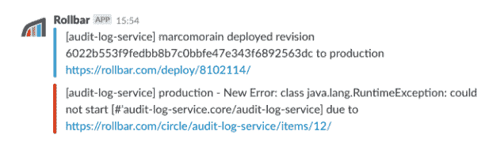

# 为持续部署设计服务的 3 种方式

> 原文：<https://circleci.com/blog/how-to-design-services-for-continuous-deployment-3-best-practices/>

持续交付的好处在其他地方得到了很好的证明[。在这篇文章中，我想分享一些我们在 CircleCI 使用的实践，以确保我们的服务可以安全地持续部署。](https://circleci.com/blog/a-brief-history-of-devops-part-iv-continuous-delivery-and-continuous-deployment/)

我们的堆栈由部署在 Kubernetes 上的服务组成。每个服务主要包含在自己的 git 存储库中，并独立于其他服务进行部署。当我们部署新版本的服务时，新代码由 Kubernetes 一个一个地推出。这意味着在任何时候，都可以同时有多个版本的代码投入生产。

以下是我们发现对我们团队很有效的实践列表。

1.  防止部署不完整的代码
2.  知道何时部署代码
3.  确保消息已送达

    ## 1。防止被破坏的代码被部署

一些 bug 确实通过了测试，并被部署到生产中。根据我的经验，单元测试中经常出现的一类错误是(经过良好测试的)软件组件在应用程序的顶层配置或组合不正确。

由于我们使用 Kubernetes 进行部署，我们可以在部署时使用它的强大功能为我们提供额外的安全网，帮助我们从生产流量中捕捉这些类型的错误。

我们的 Kubernetes 设置通常会一个接一个地部署新的 pod。考虑一个运行在 3 个 pod 上的服务。当部署服务的新版本时，一个 pod 开始运行新代码。一旦这个单元是健康的，一个旧单元被终止，第二个新单元被启动。像这样一个接一个地滚动 pod 可以确保我们在部署代码时，在生产中始终有 3 个健康的 pod。如果一个新的吊舱无法启动，Kubernetes 将尝试重新启动新的吊舱，一遍又一遍，而留下其余 3 个吊舱在原地。

我们可以利用这种行为。如果我们对服务进行编码以在初始化期间验证它们的配置，并且**没有捕捉到任何异常**，那么服务将无法启动，并且，Kubernetes 将阻止该代码版本接收生产中的流量。

例如，假设我们的服务有一个用于连接 redis 服务器的连接池。除了在启动时配置连接池，我们可以从连接池中获取一个连接并运行一个简单的语句，比如`ECHO "Hello World!"`，并确保不捕捉任何异常——如果服务失败，就让它崩溃吧！

除此之外，Kubernetes 有两种用于监控 pod 状态的探针——“活性”和“准备就绪”探针。“就绪”探测用于让 Kubernetes 知道服务何时完全启动并准备好接受传入的请求。

Kubernetes 不会将流量路由到 pod，直到就绪性探测报告成功。这意味着我们用就绪探测器测试的应用越多，Kubernetes 就越能保护我们不被部署错误。我最近写了一个新的服务，必须能够与 RabbitMQ 和 AWS S3 通信。通过确保与 RabbitMQ 的连接已连接，并且服务可以在返回成功的就绪探测之前将文件放入 S3，我确信我的服务配置正确。

## 2.知道何时部署代码

如果全天都在部署新版本的服务，我们必须让团队看到我们的部署。我们一起使用 CircleCI、Rollbar 和 Slack 来确保我们知道代码何时被部署。

我们使用 CircleCI 来构建和部署我们的服务(当然)，我们使用 [Rollbar 的部署跟踪](https://rollbar.com/docs/deploy-tracking/) API 来跟踪部署( [Sentry 也有类似的功能](https://docs.sentry.io/learn/releases/))。我们在每次部署时运行如下脚本:

```
curl https://api.rollbar.com/api/1/deploy/
  --form access_token=$ROLLBAR_ACCESS_TOKEN
  --form environment=production
  --form revision=$CIRCLE_SHA1
  --form local_username=$CIRCLE_USERNAME 
```

这给了我们两个好处。首先，Rollbar 知道我们的发布。这种报告，加上我们快速部署较小变更的 CD 实践，这意味着我们可以轻松地将报告给滚动条的异常与导致异常首次发生的 PR 相关联。

第二个好处是，我们可以启用 Rollbar 的 Slack 集成，每次部署团队拥有的服务时，每个团队都可以在 Slack 中得到通知。

在这里，您可以看到一些松弛的流量，我部署了一个包含 bug 的服务的新版本，紧接着是一个新的异常类的松弛通知。

让这些警报出现在 Slack 中确实有助于我随时跟踪谁在部署。



## 3.确保消息得到传递

我们在 CircleCI 大量使用 RabbitMQ 进行服务间的异步通信。典型的消息类似于运行特定项目构建的指令。

我们在生产环境中运行的任何服务都可能随时被终止，危险在于服务可能会消耗消息队列中的消息，并在有机会采取所需的操作之前被关闭。这与消息丢失具有相同的效果。考虑到这一点，我们推迟确认收到消息，直到我们执行了所需的操作。

在运行构建的情况下，这意味着我们将消息出队，在数据库中创建一个记录来表示构建，然后确认收到消息。现在的危险是，在数据库中创建记录之后，但在确认消息之前，服务可能会被终止。如果发生这种情况，RabbitMQ 会将消息重新排队，并再次尝试传递到队列的另一个使用者。

这导致消息可能会多次到达，并且消息可能会无序到达。

在我们的示例中，如果运行构建的消息被重新交付给第二个消费者，那么该构建的记录将已经存在于数据库中。为了检测这一点，我们需要在每个消息中包含一个惟一的标识符，可能是一个构建 ID。我们可以将这个构建 ID 和惟一性约束一起添加到数据库的构建记录中。这种约束使我们无法在数据库中创建多条记录。

从 RabbitMQ 消费时，我们使用以下模式:

我们确保所有的交换和队列都被声明为持久的，并且禁用自动删除。我们确保标记为持久的消息。我们在队列消费者中禁用消息的自动确认，而选择手动确认或否定消息。我们为消息添加了一些惟一的 ID 或幂等键，这样消费者就可以在需要时删除消息中的重复项。将去杜平消息的责任传递到尽可能远的下游，使我们的服务尽可能简单。

## 结论

在设计服务时，预先考虑 CD 过程以及它将如何影响您的代码是值得的。部署小的变更，并且尽可能频繁地部署。使用您的部署工具来进一步降低风险。请注意旧的 pod 的终止以及新的 pod 的部署，并注意确保您的飞行消息被可靠地传递。

通过使这些实践成为你工作流程的一部分，你正在采取措施使你的连续交付过程尽可能的平稳和安全。