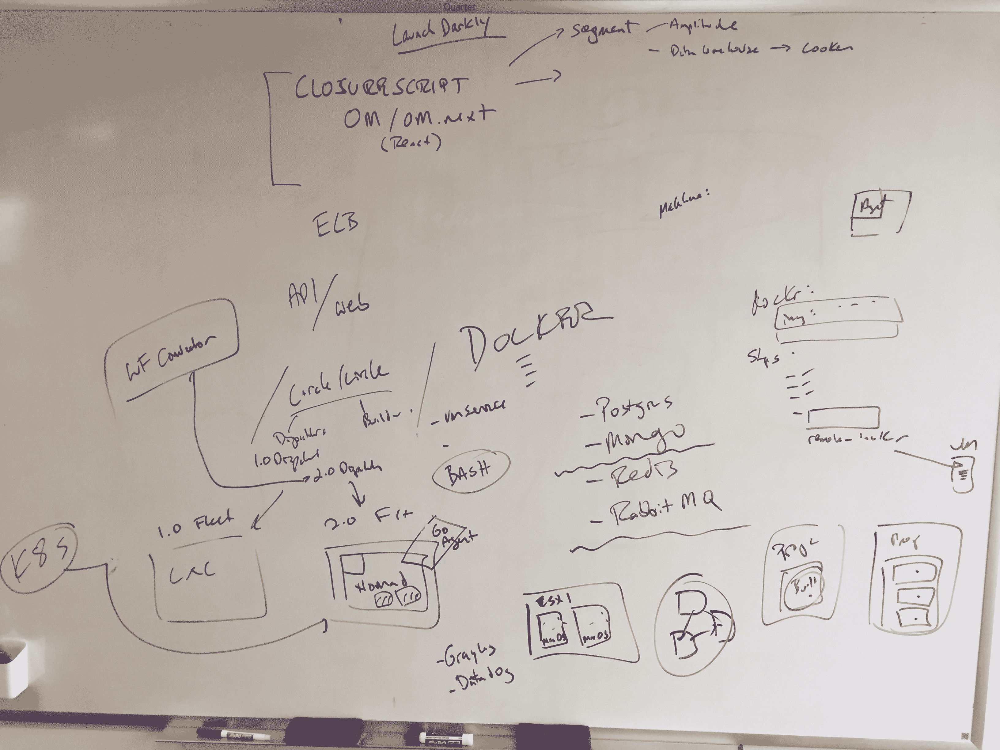

# 如何在 CircleCI 找到工作

> 原文：<https://circleci.com/blog/how-to-get-hired-at-circleci/>

**来自出版商的说明:**您已经找到了我们的一些旧内容，这些内容可能已经过时和/或不正确。尝试在[我们的文档](https://circleci.com/docs/)或[博客](https://circleci.com/blog/)中搜索最新信息。

* * *

在与我们的开发者代言人 Alek Sharma 进行了一次振奋人心的谈话后，我决定写一份同样振奋人心的号召书来描述我们的招聘流程。

那么，你是一名软件工程师。你擅长从抽象概念中创造价值，在你的脑海中编织各种功能。你知道真正的问题包括真正的工作——成功和失败的有力结合，彻底混合，并提供一把小雨伞。

你最想做的就是能够解决这些真正的问题，伸张正义，不受惩罚地攀登达蒙。但是你的抱负被面试过程的铁蹄碾碎了:他们没有接受你的挑战，而是让你经历了一次。在一连串的电话屏幕中，你说你的台词:

“是的，我很好奇。”

“自我激励？我每天早上都从自己做起。”

“我是重构工厂。”(这张在 Alek 的 LinkedIn 个人资料上，请不要偷。)

当你到达现场时，你被带进一个房间，在那里你坐了 13 分钟，啜饮一罐不冷不热的酸橙汁。一个严肃的工程师走了进来，介绍了自己，聊了几句。然而，最终:

“反转一个链表，在适当的位置……”你的审问者吟诵道。

然后他们用食指指着冰冷的白板。它甚至也不会是白色的——你会看到世博会标志的淡色条纹，是你不幸的前任留下的可耻痕迹。

你额头上冒出汗珠。如果你打开了*破解编码面试* …

## 从这场噩梦中醒来！

…因为你在 CircleCI，而且[我们不做白板面试](https://github.com/poteto/hiring-without-whiteboards)-手写代码不会编译或执行。

白板面试是为那些不知道自己想要什么的公司准备的。他们会让你写到手抽筋，但他们只会知道你在墙上的伪代码写得有多好。

这是我们在 CircleCI 使用白板的方式:

头脑风暴！图表！思维导图！所有这些都是使用白板的好东西。在任何地方你都不会看到某个可怜的灵魂的采访腐烂的遗迹。

我们不在乎你有多擅长解决任意的智力谜题，因为这不是我们在这里做的。

## 我们相信务实的工程师

我们*做的*是编写和发布软件。我们喜欢认为我们在做这件事上是务实的，这意味着我们更喜欢“装运”而不是“完美”。这就是为什么我们用 Clojure，一种设计用来完成事情的语言[。我们不雇佣纯粹主义者或教授——我们没有时间做这些。](https://clojure.org/about/rationale)

但是，这并不意味着我们马虎:不，我们通过编写测试和持续集成我们的代码来快速行动并避免破坏事情。

所以我们想听听你们是如何做这些事情的。我们会让你处理我们实际代码中的实际 bug，因为我们想让你**知道你将进入**什么状态。

## 我们也相信人类工程师

优秀的工程师知道如何沟通。

复杂的系统失去了它们的神秘性，争论变成了妥协，我们都变得更加快乐。这就是为什么我们的面试过程涉及这么多的谈话:我们想要喜欢你，我们想要你喜欢我们。当我们不能相处的时候，写出好的软件会困难很多。

沟通更为重要，因为我们的团队遍布世界各地:是的，我们在旧金山有工程师，但我们在波士顿、多伦多、都柏林、柏林、东京、悉尼等地也有工程师。

这就是为什么你会和我们一起研究一个真正的特性或缺陷。因为这就是你在工作中要做的事情；当然，不是每天——人们需要自己的私人空间——但是协作是在这里工作的重要组成部分。阅读 CircleCI 在[的实习经历](https://circleci.com/blog/every-voice-counts-my-time-as-a-circleci-intern/)以及他对 CircleCI 如何开展合作的看法。

因此，停止白板演示，现在就申请。