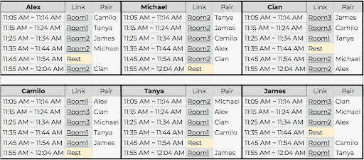

# 如何在工作中给出快速有效的反馈

> 原文：<https://circleci.com/blog/how-to-incorporate-fast-positive-feedback-into-your-team-s-work/>

健康的反馈对于创造一种团队成员感到安全、相互联系并有动力做好工作的文化至关重要。根据我的经验，快速反馈(Sfeedback)是在工作中促进健康反馈文化的一种简单而有效的方式。

反馈就像快速约会一样，给予和接受积极的反馈。团队成员相互配对，在快速(10 分钟)远程会议中给予和接受反馈。确保一切顺利运行需要一些准备，但好处是值得的。Sfeedback 可以帮助您的团队更加自如地提供和接受反馈，并鼓励他们在职业发展过程中将其融入到工作中。

需要注意的是，尽管 Sfeedback 对于给予和接受积极的反馈非常有用，但它并不是建设性反馈的最佳环境。查看这篇文章，了解更多关于[促进建设性反馈会议的最佳方式](/blog/how-to-give-constructive-feedback-that-your-team-will-appreciate/)。

## 如何准备远程反馈会话？

根据我的经验，Sfeedback 可以很好地与五人以上的人合作，因此每一对可以会面 10 分钟，整个会议只需要一个小时。每个人都应该提前有足够的时间为所有参与者准备反馈，因为在整个会议过程中，他们将与每个人单独会面。

当我准备课程时，我会尽量让过程简单。直到最近，我从来没有虚拟地这样做过，所以我花了更多的精力来准备这个会议，以确保它顺利进行。

1)第一步是召开一次会议，向您的团队介绍反馈。告诉他们在课程中会遇到什么，他们需要如何准备，重要的是，你为什么要做这个练习。让他们知道这对团队有什么好处。

2)在发送日历邀请前至少一周，设置反馈会议的日期。创建邀请，并统计有多少人可以加入，这样你就可以开始配对。

3)将总对数相加，计算每对在每节课中可以花费的时间。确保考虑过渡时间。

4)创建一个表示会话和对的 Sfeedback 表。

为了减少混乱(对我自己来说)，我创建了一个类似上面的表格，这样我就可以在心里模拟这个会话。当你安排两人一组时，尽量让一个人呆在同一个房间里，这样走动的人就少了。我也给了人们一分钟的缓冲时间来加入下一个电话。
5)为活动创建缩放链接。确保缩放设置允许人们在没有主持人的情况下加入。这一步可以是可选的，但我发现它为参与者节省了麻烦和时间。

6)创建个人日程表，通过 Slack 或电子邮件与他们分享。也给他们发一份如何准备课程的提纲(见下文)。

7)在课程结束时，将所有参与者召集到同一个缩放室，询问他们对该练习的总体感受。建议他们安排 1 对 1，跟进他们没有完成的任何重要反馈。

## 你如何参与反馈会议？

了解如何参与反馈会议与组织反馈会议一样重要！在会议之前，将这些说明发给你的团队，让他们知道如何准备。

1)确保为你的合作伙伴准备好周到的反馈，因为他们也会为你做同样的事情。例如，“你真棒”，虽然经常是真的，但不是有用的反馈。多想想为什么你觉得你的伴侣很棒，并与他们分享。表现出你关心你的队友的成长，你喜欢和他们一起工作，这很重要。这是一个鼓励他人并提醒他们对团队有多重要的机会。

2)尽量尊重时间窗口。快速提供您准备好的反馈，并进入下一个电话是乐趣的一部分。如果您没有检查您准备的所有反馈，请安排单独的一对一总结。

3)请将建设性的反馈留给下一次一对一的会议。阅读这篇文章，它涵盖了促进和参与建设性反馈会议的一些最佳实践。

4)最后，享受课程！这项活动的团队凝聚力和反馈一样有价值。

## 在反馈会话期间，您应该避免什么？

同样，Sfeedback 不是用来分享建设性反馈的。每个反馈会议大约 5 到 10 分钟，建设性的反馈需要更多的时间，以避免误解并确保有效的反馈。利用这个环节向你的队友介绍积极的反馈更合适。

自从在 CircleCI 向我的工程团队介绍 Sfeedback 以来，我已经看到了许多好处，但我认为最令人兴奋的是，我的初级团队成员现在更愿意提供和接收反馈。他们中的一些人甚至特别要求定期得到建设性的反馈。我的团队非常喜欢反馈会议，所以他们要求把它变成一种常规做法。