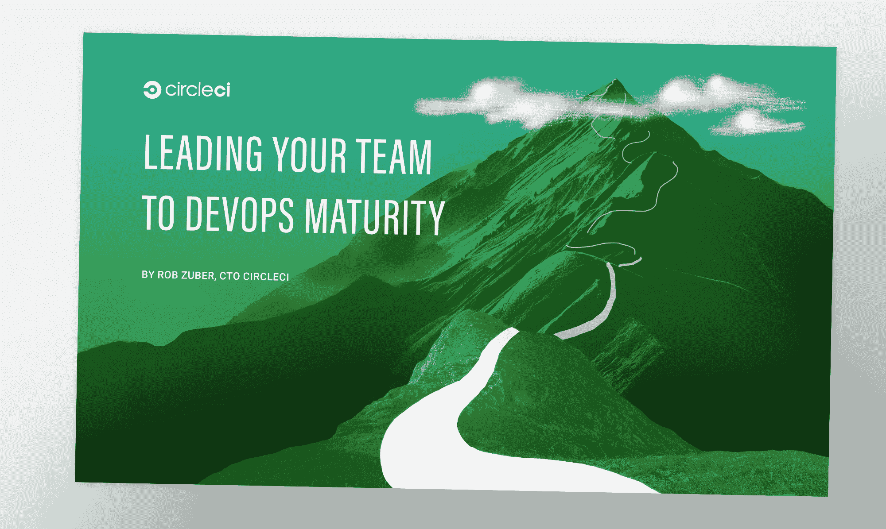

# DevOps 成熟度| CircleCI

> 原文：<https://circleci.com/blog/how-to-lead-your-team-to-devops-maturity/>

许多团队现在正在转向 DevOps，这是有充分理由的:使用 DevOps 实践有助于团队更好地响应市场变化。他们可以更快、更安全地部署代码，更不用担心中断生产。

但是切换到 DevOps 并不是一个非此即彼的命题。DevOps 是一种将运营知识带入开发的思维模式，是的，但是它也伴随着一整套过程、方法和使用工具的方式，使它与众不同。成熟的 DevOps 组织的领导者只是以不同的方式思考工程。

坏消息是，你不可能某天早上醒来就决定“做”DevOps。但好消息是，迈向 DevOps 是一个永无止境的旅程！这意味着任何团队都可以从现在开始成为一个更成熟的开发运维组织。

在我们最新的电子书中，CircleCI 首席技术官兼资深工程领导者 Rob Zuber 向我们展示了他职业生涯中在最高效的工程组织中应用的 DevOps 原则。他分析了一个不断改进的 DevOps 心态是什么样子的:一个苦苦挣扎的团队应该把精力集中在哪里？一个快速发展的团队接下来应该从哪里着手改进？如何在不损失速度的情况下开始测量管道中的所有东西？

阅读电子书，学习如何让你的团队更上一层楼。
[下载带领你的团队走向 DevOps 成熟](https://circleci.com/resources/devops-maturity-ebook/)。

