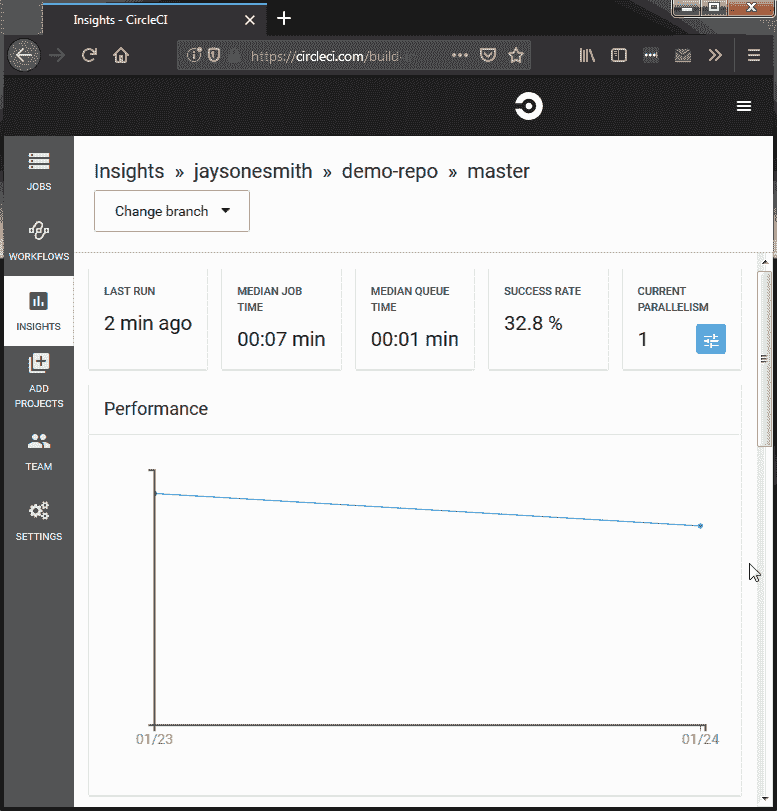

# 如何通过 CircleCI 输出 JUnit 测试

> 原文：<https://circleci.com/blog/how-to-output-junit-tests-through-circleci-2-0-for-expanded-insights/>

**来自出版商的说明:**您已经找到了我们的一些旧内容，这些内容可能已经过时和/或不正确。尝试在[我们的文档](https://circleci.com/docs/)或[博客](https://circleci.com/blog/)中搜索最新信息。

* * *

CircleCI 提供了关于您的工作和测试性能的有用信息。它可以告诉你最后一次运行的时间、平均工作时间、排队时间和成功率，以及一些帮助你可视化的图表。

这是所有项目一开始的样子。


有多少次你想知道:我的哪些测试失败了？我的哪项测试最失败？我失败的测试中哪一个运行最慢？

CircleCI 也可以帮你。让我们看看在哪里可以找到这些信息！

## 失败和最慢的测试

Insights 不仅可以给我们一个测试套件失败的概要，还可以通过测试名称甚至失败的频率来分解它。如果你有古怪的测试或一些严重的惯犯，他们会在这个列表中给你检查和挤压。与频率数据类似，Insights 还可以为您提供失败时哪些测试耗时最长的排名。这些数据有助于您轻松发现可能会超时的测试。

那么我们在哪里可以找到这些数据呢？如果你和我一起在洞察力页，你已经在那里。我们需要做的就是向下滚动:


你可能会问，“杰森，数据在哪里？”在我们释放洞察力的全部潜力之前，我们需要做一点准备。所需的步骤取决于您的设置，但是对于我们的示例，只需要两步。我们一起去看看吧。

## 释放力量

### 测试

对于本文，我写了一个演示项目，在 Cucumber 和 Ruby 的 RSpec 中运行一些非常基本的“测试”。每个工具都有一组相同的三个测试:

*   总是传递-断言 true 为真。
*   频繁传递-生成一个随机数，并断言它是否小于阈值。目前 0.95。
*   不太频繁通过-与之前的测试相同，但其阈值设置为 0.85。

这将给我们带来一些间歇性的测试失败，给我们的测试结果带来一些可变性。如果你很好奇，以下是步骤定义的样子:

```
Given('this step passes') {}

Given('this step often passes') do
  expect(Random.new.rand(1.0)).to be < 0.95
end

Given('this step less often passes') do
  expect(Random.new.rand(1.0)).to be < 0.85
end 
```

### 朱尼特

我们需要做的第一件事是让我们的测试工具以 JUnit XML 格式输出。什么是 JUnit XML？JUnit 本身是 Java 编程语言的单元测试框架，它以 Apache Ant JUnit XML 格式输出结果。如果您不是 Java 开发人员，这也完全没问题，因为跨语言的工具实现自己的格式化程序是很常见的，这些格式化程序遵循 [JUnit XML schema](https://github.com/windyroad/JUnit-Schema/blob/master/JUnit.xsd) 。对于我们的例子，我将展示如何为 RSpec 和 Cucumber 这样做，但是 CircleCI 提供了一个其他通用选项的[列表，您也可以使用。](https://circleci.com/docs/collect-test-data/)

这里有一个示例`.circleci/config.yml`文件，我们将一起修改它以获得更好的洞察结果:

```
version: 2.1
executors:
  default:
    docker:
      - image: circleci/ruby:2.5
commands:
  install_gems:
    description: "install dependencies"
    steps:
      - run: bundle check --path=vendor/bundle || bundle install --path=vendor/bundle --jobs=4 --retry=3
  rspec:
    description: "Run RSpec"
    steps:
      - run:
          command: bundle exec rspec
          when: always
  cucumber:
    description: "Run cucumber"
    steps:
      - run: 
          command: bundle exec cucumber
          when: always
jobs:
  test:
    executor: default
    steps:
      - checkout
      - install_gems
      - rspec
      - cucumber
workflows:
  pr:
    jobs:
      - test 
```

这是一个 2.1 配置，但不要让这吓到你，我们在这里做的是在较低的版本中也可用。

现在，我们对 RSpec 和 Cucumber 的命令非常简单:分别是`bundle exec rspec`和`bundle exec cucumber`。这允许工具将它们的结果输出到 stdout，这样它们就可以使用它们的默认格式。这对于在本地运行来说很好，但是当您想要轻松地看到工作流在 CircleCI 上运行时发生了什么故障时，这就不太好了。对于我们总共六次测试，读取控制台的测试输出不会太差，但是对于较大的测试套件，这可能是一项困难的任务。

这两个工具都允许非常容易地以 JUnit 格式输出。

### RSpec

*   将`rspec_junit_formatter`宝石添加到您的宝石档案中。
*   将`--format progress --format RspecJunitFormatter -o ~/test-results/rspec/rspec.xml`添加到 RSpec 命令中。
    **注意:**不需要初始的`--format progress`，但是如果不保留的话，RSpec 只会输出到 rspec.xml 文件，而不是 stdout。黄瓜也是一样。

### 黄瓜

*   将`-f pretty -f junit -o ~/test-results/cucumber/cucumber.xml`添加到您的黄瓜命令中。
    *   虽然 Cucumber 会为您运行的每个特性文件创建 XML 文件，但是我们仍然希望在路径的末尾有`cucumber.xml`。

下面是我们更新的`.circleci/config.yml`:

```
version: 2.1
executors:
  default:
    docker:
      - image: circleci/ruby:2.5
commands:
  install_gems:
    description: "install dependencies"
    steps:
      - run: bundle check --path=vendor/bundle || bundle install --path=vendor/bundle --jobs=4 --retry=3
  rspec:
    description: "Run RSpec"
    steps:
      - run:
          command: bundle exec rspec --format progress --format RspecJunitFormatter -o ~/test-results/rspec/rspec.xml
          when: always
  cucumber:
    description: "Run cucumber"
    steps:
      - run: 
          command: bundle exec cucumber -f pretty -f junit -o ~/test-results/cucumber/cucumber.xml
          when: always
jobs:
  test:
    executor: default
    steps:
      - checkout
      - install_gems
      - rspec
      - cucumber
workflows:
  pr:
    jobs:
      - test 
```

下面是我们的 RSpec 测试的 XML 输出示例，显示前两个测试通过，第三个测试失败:

```
<?xml version="1.0" encoding="UTF-8"?>
<testsuite name="rspec" tests="3" skipped="0" failures="1" errors="0" time="0.017001" timestamp="2019-01-24T22:17:57-07:00" hostname="JS-PC">
<properties>
<property name="seed" value="29522"/>
</properties>
<testcase classname="spec.demo_1_spec" name="demo 1 with tests for demonstration always passes" file="./spec/demo_1_spec.rb" time="0.001000"></testcase>
<testcase classname="spec.demo_2_spec" name="demo 2 with tests for demonstration sometimes passes" file="./spec/demo_2_spec.rb" time="0.001000"></testcase>
<testcase classname="spec.demo_3_spec" name="demo 3 with tests for demonstration more often passes" file="./spec/demo_3_spec.rb" time="0.014001"><failure message="expected: &lt; 0.85
     got:   0.9199158781050316" type="RSpec::Expectations::ExpectationNotMetError">Failure/Error: expect(r.rand(1.0)).to be &lt; 0.85
  expected: &lt; 0.85
       got:   0.9199158781050316
./spec/demo_3_spec.rb:8:in `block (3 levels) in &lt;top (required)&gt;&apos;</failure></testcase>
</testsuite> 
```

完成这些更改后，第 1 步就完成了！🎉继续第二步。

### 你的 JUnit 测试文件在哪里？

我们已经让我们的测试工具以正确的格式输出，他们正在将输出保存到我们项目的文件中。下一步是通过告诉 CircleCI 在哪里可以找到它们来使用它们。这是通过内置命令`store_test_results`完成的。

命令`store_test_results`接受一个路径，是我们对 CircleCI 说，“嘿，这是我的测试数据。”我们希望确保这个路径与我们的命令保存文件的路径相同。这个路径值可以是**绝对**或**相对**，但是注意，如果你使用的是相对位置，它是基于你当前的**工作目录**。

下面是在我们的配置中将`store_test_results`步骤添加到命令中的样子:

```
rspec:
    description: "Run RSpec"
    steps:
      - run:
          command: bundle exec rspec --format progress --format RspecJunitFormatter -o ~/test-results/rspec/rspec.xml
          when: always
      - store_test_results:
          path: ~/test-results/rspec/
  cucumber:
    description: "Run cucumber"
    steps:
      - run: 
          command: bundle exec cucumber -f pretty -f junit -o ~/test-results/cucumber/cucumber.xml
          when: always
      - store_test_results:
          path: ~/test-results/cucumber/ 
```

## 强尼，给他们看看他们赢了什么！

一辆全新的摩托车-不！不是新的踏板车，而是一些有用的数据，可以帮助我们了解测试套件的进展情况。现在让我们试着向下滚动我们的见解页面:

*请击鼓……*



很好，我们做到了！给定测试结果数据，CircleCI 将自动开始分析并为我们显示这些数据。如前所述，Insights 可以向我们显示关于最失败的测试、它们的套件、失败频率的数据，以及关于我们最慢的失败测试的类似数据。**测试套件**下的名称根据工具的不同而不同，Cucumber 输出特性名称，RSpec 使用包含 Spec 文件文件名的名称。

这里有一个稳定的图像，这样你可以看到更多:


### 但是等等，还有呢！

Insights 页面并不是从存储测试数据中获益的唯一领域。默认情况下，jobs 中的**测试摘要**选项卡只会显示一个按钮，指向`store_test_results`周围的文档。


随着见识的扩大，我们的总结现在也是如此。如果测试在您的工作中失败，围绕这些失败的数据将在信息框中向上冒泡，如下所示:


这些框会告诉你什么工具和特定的测试失败了，以及关于断言的一些信息。如果一个特定的工具有多个故障，为了便于查看，它们将被分组在同一个框中。蓝色的**查看大多数失败的测试**按钮将带您直接进入 Insights 页面。

如果您的所有测试都通过了，您还将获得一些汇总数据，包括关于运行了多少测试以及使用了什么工具的注释。


**注意:**为了确保您不会看到类似“您的作业在未知的情况下运行了 **6** 测试”的消息，您需要确保您正在为您正在使用的每个测试工具创建目录，如下所示:

```
test-results
├── cucumber
│   └── cucumber.xml
└── rspec
    └── rspec.xml 
```

如果你正在遵循上面的例子，我已经为你做好了准备，所以你不应该对`unknowns`的出现有任何问题。

## 两步走方法

1.  以 JUnit 格式输出测试结果
2.  用`store_test_results`命令告诉 CircleCI 那些结果在哪里

这两个简单的步骤使 CircleCI 能够为我们提供丰富的信息，以及对我们测试的健康和性能的更深入的了解。现在，您已经有了从现在开始将测试结果存储在您的`config.yml`文件中的工具，我强烈推荐您这样做。

* * *

Gemini Smith 是一名不断学习的软件工程师，对测试、交流和改进软件开发生命周期充满热情。主要用 Go 写作，她还通过公开演讲、宣传、咨询和指导对软件和测试社区做出贡献。

[阅读更多 Gemini Smith 的文章](/blog/author/gemini-smith/)