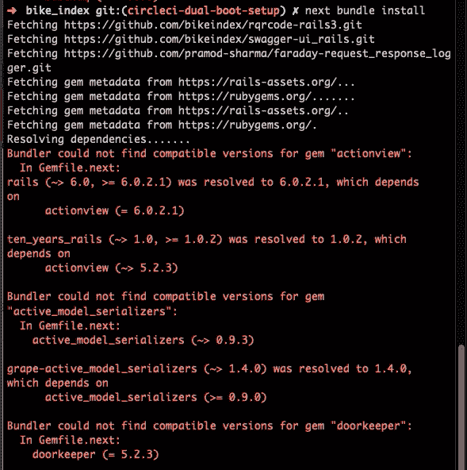
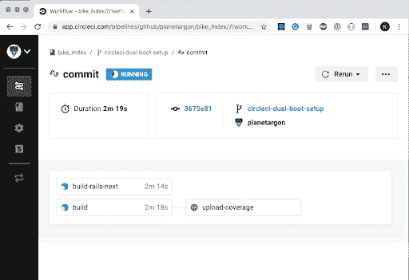
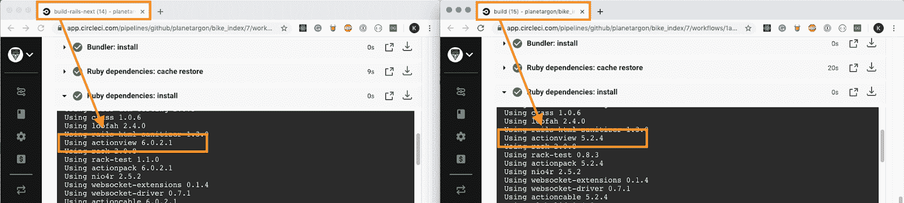

# 如何为 Rails 双引导设置持续集成管道

> 原文：<https://circleci.com/blog/how-to-set-up-a-continuous-integration-pipeline-for-a-rails-dual-boot/>

自从 GitHub 和 Shopify 使用双引导策略将他们的 Rails 应用程序从旧版本的 Rails 转移到 Rails Edge 上运行以来，双引导策略一直是一种流行的升级方法。Shopify 在他们的 [Rails 5 升级](https://engineering.shopify.com/blogs/engineering/upgrading-shopify-to-rails-5-0)中展示了这一策略，GitHub 在 2018 年[从 Rails 3.2 升级到 5.2](https://github.blog/2018-09-28-upgrading-github-from-rails-3-2-to-5-2/) 时也类似地解释了他们的策略。

双重引导的好处之一是，您可以增量升级，并且您的整个开发团队不需要停止构建新功能。也不需要单独的长期升级分支。升级的每个部分都可以被视为一个基于主分支的小工作单元。除非您要求，否则它不会在您的服务器上运行。

在 [Planet Argon](https://www.planetargon.com/) ，一个专注于 Rails 支持的机构，我们使用这种更新方法，并希望通过本教程分享我们的技术。它将通过一个开源的 Rails 应用程序[自行车索引](https://bikeindex.org/)来演示。自行车索引是一个自行车登记工具，帮助重聚失踪和/或被盗的自行车与他们的主人。我们有两个原因很高兴使用这项服务作为例子:该公司也位于波特兰，我们的工作室有一些骑自行车通勤者，包括我自己。

在本教程中，您将学习如何使用 [ten_years_rails](https://rubygems.org/gems/ten_years_rails/versions/0.2.0) gem 在您的应用程序中加入双重引导，并重新配置现有的 CircleCI 配置以支持双重引导的 CI 运行。

当您的应用程序的自动化单元和集成测试覆盖了您的代码库的很大一部分时，您可以通过在双重启动的升级端通过测试的数量来衡量您的升级进度。许多应用程序使用[持续集成](/continuous-integration/) (CI)工具来运行他们的测试套件，本演练将把双重引导过程集成到您的 CI 管道中，以快速确定新的更改是否影响当前版本或升级版本。

作为一个高层次的概述，[这里有一个 PR](https://github.com/bikeindex/bike_index/pull/1522) ，其中进行了一些更改，以使 Bike Index 的 CI 管道运行一个双启动流程。

## 先决条件

要完成本教程，您需要以下内容:

*   带有测试套件的 Ruby on Rails 应用程序
*   应用程序的现有 CircleCI 配置

我们开始吧！

## 更新您的 Gemfile

首先，我们将安装`ten_years_rails` gem 来设置我们的双重引导。使用此宝石需要 Ruby 2.3 或以上版本。将以下内容添加到您的 gem 文件中:

```
gem 'ten_years_rails' 
```

gem 包括一个“next”脚本，允许您在命令之前运行`next`,以便在升级的环境中测试它们。通过运行`next --init`初始化 gem。这将创建一个名为`Gemfile.next`的符号链接 Gemfile。

## 捆绑我们的宝石

现在让我们确保我们可以捆绑我们的宝石。

`ten_years_rails`通过在两个不同的 gem 文件之间交替工作:应用程序中已经存在的标准 gem 文件和符号链接的`Gemfile.next`。进入`Gemfile.next`包的内容基于`next?`方法。

我们的主要目的是升级 Rails。要指定放入`Gemfile.next`的版本，编写如下条件:

```
if next?
  gem 'rails', '~> 6.0', '>= 6.0.2.1'
else
  gem 'rails', '5.2.4'
end 
```

任何在`if`语句下安装的 gems 都将被安装在符号链接的`Gemfile.next`中，并且可以通过检查`Gemfile.next.lock`版本来验证。`else`语句中的宝石将被安装在`Gemfile.lock`文件中。

然后运行:

```
next bundle install 
```

如果您在使用`next`命令时遇到麻烦，您还可以传递`BUNDLE_GEMFILE=Gemfile.next`环境变量来指定在您当前的上下文中应该使用哪个 gem 文件。可能还有其他需要升级的依赖项。



我们不打算深入探讨这个问题，但是我学到的一个技巧是，需要升级的宝石可能没有你想象的那么多。不要被这个 bundler 输出吓倒。寻找版本与你正在做的不匹配的 gem，并为该版本创建一个条件。将它们的安装命令包装在`next?`条件中。

最初的测试可以是安装没有版本限制的 gem，让 Bundler 为您选择版本。

```
if next?
  gem 'devise'
else
  gem 'devise', '~> 3.5', '>= 3.5.10'
end 
```

## 设置您的 CI 渠道

一旦您的包成功安装，我们就可以启动并运行 CI 管道了。我们也可以进行测试，但在这一点上，没有必要。我们只是希望管道可以在两个独立的版本中运行在两个版本的 Rails 上。如果 RSpec 暂时惨败也没关系。

策略是使用[工作流添加一个新的作业](https://circleci.com/docs/jobs-steps/)来使用`Gemfile.next`运行 rails 的下一个 CI。

复制您现有的构建作业，并为该副本命名，以表明它是用于双引导的。我们选择了`build-rails-next`。

在`build-rails-next`作业中，您将在`BUDNLE_GEMFILE`的`ENVIRONMENT`键下添加一个键/值对，并指定`Gemfile.next`。

```
 "build-rails-next":
    working_directory: ~/bikeindex/bike_index
    parallelism: 2
    environment:
      RAILS_ENV: test
      NODE_ENV: test
      RACK_ENV: test
      BUNDLE_GEMFILE: Gemfile.next 
```

然后，在保存和缓存捆绑的 gem 的命令中，将文件更改为`Gemfile.next.lock`

```
 - type: cache-restore
        name: "Ruby dependencies: cache restore"
        key: cache-{{ .Environment.CACHE_VERSION }}-gems-{{ checksum "Gemfile.next.lock" }}

      - run:
          name: "Ruby dependencies: install"
          command: |
            set -x
            bundle check --path=~/.cache/bundle && use_local="--local"
            bundle install --deployment --frozen --path=~/.cache/bundle $use_local

      - type: cache-save
        name: "Ruby dependencies: cache save"
        key: cache-{{ .Environment.CACHE_VERSION }}-gems-{{ checksum "Gemfile.next.lock" }}
        paths:
          - ~/.cache/bundle 
```

最后，在配置底部的 workflows 部分调用新的构建作业:

```
workflows:
  version: 2
  commit:
    jobs:
      - build
      - "build-rails-next" 
```

您可以通过运行`circleci local execute`使用 [CircleCI 的 CLI](https://circleci.com/docs/local-cli/) 来测试您的更改。但是，如果您没有看到新的构建作业，您可能需要推动您的更改以使其工作。

我尝试使用本地 execute 方法来测试我的更改并遇到了错误，所以我在一个新的 commit 中向上推它们，并去 CircleCI 的网站检查这些更改。

您应该在 CircleCI 上看到两个构建任务，一个用于您的常规任务`build`，一个用于`build-rails-next`。



为了确认一切正常，检查安装在每个版本上的宝石，确保它们是正确的。在我们的示例中，`build`安装`actionview 5.2`，`build-rails-next`安装`actionview 6`。



你的 Rails 5 版本，没有被双引导改变所干扰，应该会完美地通过，而你的 Rails 6 版本将会光荣地失败。

## 结论

就是这样！现在，您可以开始 Rails 应用升级之旅了。继续修正规范、重构代码、咨询 CI 渠道，并利用`next?`方法来保持当前代码运行，并将升级代码合并到流程中。Rails 升级可能很困难，但是利用双引导方法可以提供一些结构。

升级快乐！

* * *

Kayla Reopelle 是 Argon 星球的开发人员。她最喜欢的 web 开发部分是重构遗留代码，使其更易于维护，并使非开发人员也能理解编码概念。工作之外，你可能会在波特兰的一条小径上骑自行车长途跋涉时偶遇她。

[阅读更多 Kayla Reopelle 的帖子](/blog/author/kayla-reopelle/)