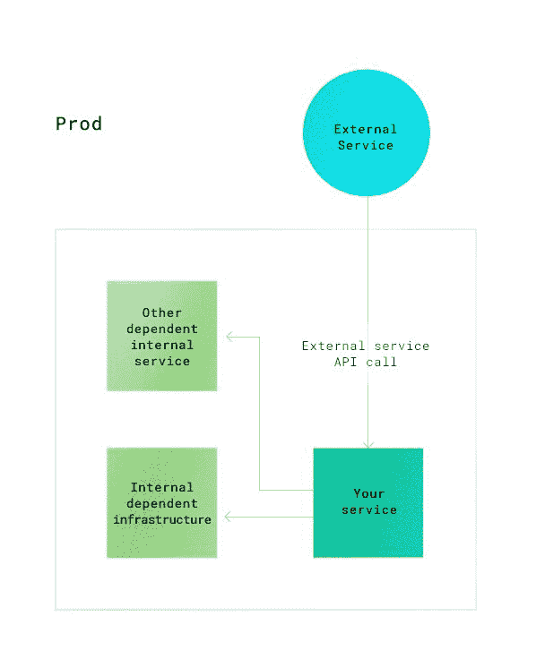
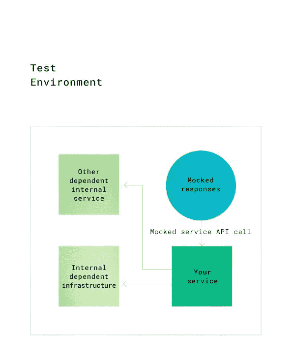
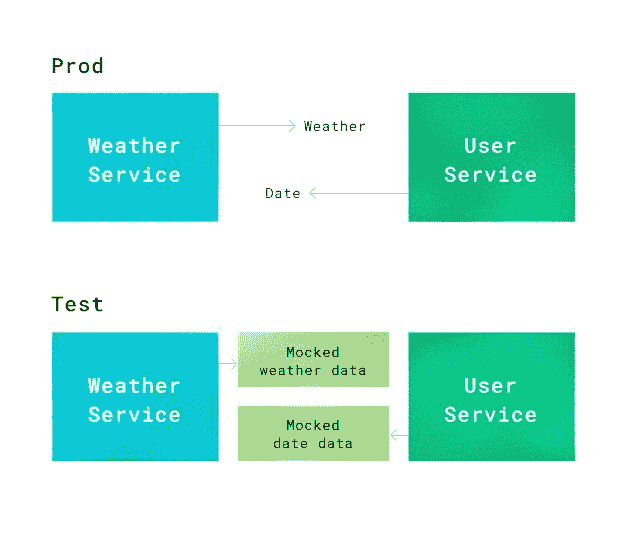

# 如何测试软件:模仿、存根和契约测试

> 原文：<https://circleci.com/blog/how-to-test-software-part-i-mocking-stubbing-and-contract-testing/>

## 使用模仿和存根的测试驱动开发

在[如何以及在哪里分离测试环境](https://circleci.com/blog/path-to-production-how-and-where-to-segregate-test-environments/)中，我谈到了构建一个结构化的生产路径:包括哪些测试，何时进行，以及为什么。在这篇文章中，我们将详细讨论如何做每一种测试。

我们将涵盖**嘲弄和存根**的技术，以及**测试驱动开发**来帮助每个测试层。首先，让我们回顾一下上一篇文章中的一个概念:测试金字塔。这有助于说明不同种类的测试之间的区别，以及什么时候做这些测试是有利的。

单元或组件测试(显示在我们金字塔的底部)执行起来既便宜又快速。严重依赖这些。只有当你穷尽了这些测试所能做的，你才应该继续进行更昂贵的测试(时间和资源)，比如集成测试和 UI 层测试。


在这个系列中，我将介绍每个开发人员工具箱中应该有的各种测试工具，并讨论何时、为什么以及如何使用它们。我将涵盖金字塔各层的测试，以及嘲讽、存根和契约测试的概念。在这个系列的第二篇中，我们将进入测试驱动开发和行为驱动开发(TDD 和 BDD)。

## 嘲讽和存根是用来做什么的？

很多人认为嘲讽和存根只是用于单元和组件测试。然而，我想向您展示如何在其他测试层中使用模拟对象或存根。

### 什么是模拟测试？

模仿意味着创建一个外部或内部服务的假版本，它可以代替真正的服务，帮助您的测试更快更可靠地运行。当您的实现与对象的属性交互，而不是与它的功能或行为交互时，可以使用模拟。

### 什么是存根测试？

存根和模仿一样，意味着创建一个替身，但是存根只是模仿行为，而不是整个对象。当您的实现只与对象的特定行为进行交互时，会用到这一点。

可以在这里找到一篇很棒的博文，它讲述了嘲笑和存根之间的区别。(https://Martin fowler . com/articles/mocksarentstubs . html){:target = " _ blank " rel = " no referrer noo pener " }

让我们讨论一下我们如何应用这些方法来改进我们在上面金字塔的所有层次的测试。

### 在单元+组件测试中使用模仿和存根

当您的代码使用外部依赖项(如系统调用或访问数据库)时，我建议使用 mock 或 your。例如，无论何时你运行一个测试，你都在练习实现。所以当一个`delete`或`create`函数发生时，你让它创建一个文件，或者删除一个文件。这项工作效率不高，它创建和删除的数据实际上并没有什么用处。此外，清理费用很高，因为现在每次都必须手动删除一些内容。在这种情况下，嘲讽/打击会有很大帮助。

使用 mocks 和 stubs 来伪造外部功能有助于您创建独立的测试。例如，假设测试将一个文件写入/tmp/test_file.txt，然后被测试的系统删除了它。那么问题就不在于测试不是独立的；那就是系统调用要花很多时间。在这种情况下，您可以存根文件系统调用的响应，这将花费更少的时间，因为它会立即返回。

另一个好处是您可以更容易地重现复杂的场景。例如，测试您可能从文件系统获得的许多错误响应比实际创建条件要容易得多。假设您只想删除损坏的文件。以编程方式编写损坏的文件可能很困难，但是返回与损坏的文件相关联的错误代码只是改变存根返回的内容。

## 模拟和存根测试示例

```
def read_and_trim(file_path)
	return os.open(file_path).rstrip("\n") #method will call system call to look for the file from the given file path and read the content from them and removing new line terminator. 
```

上面的代码与 Python 内置的 open 函数交互，该函数与一个系统调用交互，以便从给定的文件路径中实际查找文件。这意味着无论何时何地运行该函数的测试:

1.  您需要确保测试将寻找的文件存在；当它不存在时，测试失败。
2.  测试需要等待系统调用的响应；如果系统调用超时，测试失败。

这两种失败都不意味着您的实现没有完成它的工作。这些测试现在既不是孤立的(因为它们依赖于系统调用的响应)，也不是高效的(因为系统调用连接需要时间来传递请求和响应)。

上述实现的测试代码如下所示:

```
@unittest.mock.patch("builtins.open", new_callable=mock_open, read_data="fake file content\n")
def test_read_and_trim_content(self, mock_object):

    self.assertEqual(read_and_trim("/fake/file/path"), "fake file content")
    mock_object.assert_called_with("/fake/file/path") 
```

我们使用 Python 模拟补丁来模拟内置的开放调用。这样，我们只是在测试我们实际构建的东西。

在单元测试中使用模拟和存根的另一个好例子是伪造数据库调用。例如，假设您正在测试您的函数是否从数据库中删除了实体。对于第一个测试，您手动创建一个文件，以便有一个被删除。测试通过。但是，第二次，其他人(不是你)不知道他们必须手动创建实体。现在测试失败了。没有要删除的文件，因为他们不知道必须创建实体，所以这不是一个独立的测试。

在这种情况下，您需要防止修改数据或进行操作系统调用来删除文件。这将防止每当有人意外地未能创建测试数据时，测试变得不可靠。

### 内部函数的模仿和存根

模拟和存根对于单元测试来说非常方便。它们帮助你独立地测试一个功能或实现，同时也允许单元测试保持高效和廉价，正如我们在之前的[帖子](https://circleci.com/blog/path-to-production-how-and-where-to-segregate-test-environments/)中所讨论的。

单元/组件测试中 mocks 和 stubs 的一个很好的应用是当您的实现与另一个方法或类交互时。您可以模仿类对象或存根您的实现正在与之交互的方法行为。模仿或阻止其他功能或类，从而只测试您的实现逻辑，是单元测试的主要好处，也是从执行单元测试中获得最大好处的方法。

注意: *你的测试应该和你的代码一起成长。由于单元测试更多地关注于实现细节，而不是特性的整体功能，所以随着时间的推移，它将是变化最大的测试。随之而来的是，当你在测试中使用大量模拟数据时，你的模拟必须以你的代码进化的方式进化。否则，它可能会导致系统中的意外错误。测试不是你写一次就能指望永远有效的东西。当您更改代码并进行重构时，您有责任维护并改进您的测试以与之匹配。*

### 集成测试中的模仿

通过集成测试，您可以测试服务之间的关系。一种方法可能是为测试环境启动并运行所有依赖的服务。但这是不必要的。它会从您无法控制的服务中创建许多潜在的故障点，增加您测试的时间和复杂性。我建议通过使用 mocks 和 stubs 编写一些服务集成测试来缩小范围。我将向您展示这如何使您的测试套件更加可靠。

在集成测试中，规则不同于单元测试。在这里，您应该只测试您有权编辑的实现和功能。模拟和存根可以用于此目的。首先，确定哪些集成是重要的。然后，您可以决定哪些外部或内部服务可以被嘲笑。

假设您的代码与 GitHub API 交互，如下例所示。因为您个人无法改变 GitHub API 如何响应您的请求调用，所以您不必测试它。模仿预期的 GitHub API 响应可以让您更专注于测试内部代码库内的交互。

```
@unittest.mock.patch('Github')
def test_parsed_content_from_git(self, mocked_git):
   expected_decoded_content = "b'# Sample Hello World\n\n> How to run this app\n\n- installation\n\n dependencies\n"
   mocked_git.get_repo.return_value = expected_decoded_content

   parsed_content = read_parse_from content(repo='my/repo',
                                            file_to_read='README.md')

   self.assertEqual(parsed_content['titles'], ['Sample Hello World']) 
```

在上面的测试代码中，`read_parse_from_content`方法与解析来自 GitHub API 调用的 JSON 对象的类集成在一起。在这个测试中，我们测试两个类之间的集成。

因为我们在上面的测试中使用了 mock，所以通过避免调用 GitHub API，您的测试将会更快，依赖性也更小。这也将节省时间和精力，因为运行测试的环境不需要互联网接入。然而，为了让您在模拟依赖的外部服务时进行可靠的测试，理解外部依赖在现实世界中的行为是极其重要的。例如，如果上面代码示例中的`expected_decoded_content`不是 GitHub 返回回购文件内容的方式，模拟测试中的错误假设会导致意外的破坏。在编写具有模拟响应的测试之前，最好制作外部依赖调用的实际快照，并将其用作模拟响应。一旦用快照创建了模拟响应，就不应该经常改变，因为应用程序编程接口应该总是向后兼容的。然而，定期验证 API 以应对偶尔的意外变化是很重要的。





### 基于契约的测试中的模拟和存根(在微服务架构中)

当两个不同的服务相互集成时，它们各自都有“期望”，也就是关于它们给出什么和期望得到什么回报的标准。我们可以将这些视为集成端点之间的契约。由于这种标准化，契约测试可以用来测试集成。

让我们看一个例子。正如我提到的，版本标记的 API 不应该经常改变，可能永远不会改变。对于您选择的任何 API，您通常都能找到关于该 API 的文档，以及对它的期望。当您决定使用某个版本的 API 时，您可以依赖该 API 调用的返回。这是提供 API 的工程师和将使用其数据的工程师之间的假定契约。

您也可以使用契约的思想来测试内部服务。当使用微服务架构测试大规模应用时，安装整个系统和基础设施的成本可能会很高。这种应用程序可以从使用契约测试中受益匪浅。在测试金字塔中，契约测试位于单元/组件测试和集成测试层之间，这取决于系统中契约测试的覆盖范围。一些组织利用契约测试来完全取代端到端或功能测试。

基于契约的测试可以涵盖两件重要的事情:

1.  检查已达成一致的端点的连通性
2.  使用给定的参数检查来自端点的响应

作为一个例子，让我们设想一个天气预报应用程序，它包含一个与用户服务交互的天气服务。当用户服务使用日期(请求)连接到天气服务的端点时，用户服务处理日期数据以获取该日期的天气。这两个服务有一个约定:天气服务将维护用户服务始终可以访问的端点，并以相同的格式提供用户服务请求的有效数据。

现在，让我们看看如何在契约测试中利用模拟和存根。在测试中，您可以创建一个模拟响应，而不是用户服务向天气服务发出实际的请求调用。因为两个服务之间有一个契约，所以端点和响应不应该改变。这将使两个服务在测试过程中不再互相依赖，从而使测试更快、更可靠。

在上一篇文章中，我们谈到了在不同的环境中运行不同的测试，以及有时在不同的环境中用不同的配置运行相同的测试是多么有用。合同测试是后一种情况的一个很好的例子。当在不同的环境中使用不同的配置运行契约测试时，我们可以实现不同的目标。当它是一个较低层的环境时，比如 Dev 或 CI，用一个模拟的契约来运行测试将服务于在环境的约束下测试我们的内部实现的目的。然而，当它进入 QA 或 Staging 等上层环境时，同样的测试可以在没有模拟契约但有实际的外部依赖连接的情况下使用。Mbtest 是一个工具，可以帮助我上面解释的那种契约测试和模拟响应。



我们已经看了使用模拟和存根的不同测试层的例子。现在让我们回顾一下它们为什么有用:

1.  使用模拟和存根的测试速度更快，因为您不必连接外部服务。没有等待他们响应的延迟。
2.  您可以灵活地确定测试范围，只覆盖您可以控制和更改的部分。对于外部服务，如果他们错了或者测试失败了，你就无能为力了。嘲讽可以确保你把测试范围限定在你能做的范围内——而不是给你自己找不到解决的问题。
3.  模拟外部 API 调用有助于您的测试更加可靠
4.  契约测试使服务团队在开发中更加自主

在[测试驱动开发和行为驱动开发](https://circleci.com/blog/how-to-test-software-part-ii-tdd-and-bdd/)中，我们将探索测试驱动开发(TDD)和行为驱动开发(BDD)的原则，看看它们如何改善从功能测试到单元测试的一切结果。

阅读更多信息: