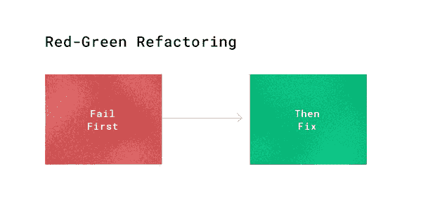
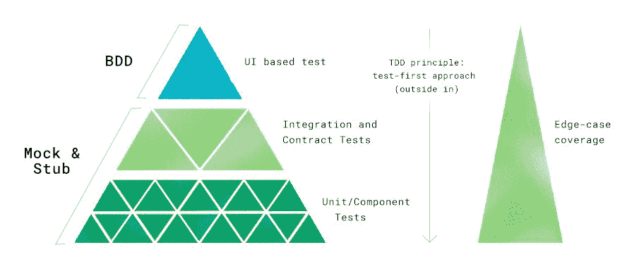

# 如何测试软件，第二部分:TDD 和 BDD - CircleCI

> 原文：<https://circleci.com/blog/how-to-test-software-part-ii-tdd-and-bdd/>

在我之前的[帖子](https://circleci.com/blog/how-to-test-software-part-i-mocking-stubbing-and-contract-testing/)中，我们讨论了 mocks 和 stubs:它们是什么，以及如何在各种测试场景中使用它们来给你自己更多的灵活性，加速你的测试，并从你的测试套件中获得更多的确定性。

在这篇文章中，我将介绍两种从一开始就考虑测试的软件开发方法:测试驱动开发(TDD)和行为驱动开发(BDD)。使用这些方法将会改善你思考软件开发的方式，并且极大地增强你的测试的效率。让我们开始吧:

## TDD:测试驱动开发

TDD(测试驱动开发)被认为是一种编写单元测试的方法。在这篇文章中，我们将讨论从功能测试到单元测试的所有事情中使用 TDD 原则。

### 红绿重构:测试驱动的开发原则

使用 TDD，您可以在实现代码之前设计代码。因此，TDD 迫使你在编写之前考虑组件的行为。这也是让你专注于你想要传递的东西的好方法。在 TDD 中，您为您的方法或实现编写测试，以测试该实现应该做什么。

记住，使用 TDD，*你的测试总是先失败*。你还没有写代码，所以*没有功能。这是好事！它证明你的测试不会只是通过任何旧的实现！*

接下来，是时候证明当实现有效并且服务于其目的时，您的测试*将*通过。一旦您检查到当实现不能正常工作时测试失败，而当实现能够正常工作时测试通过，您就可以重构代码，使之更好、更清晰。因为你已经有了测试，重构会容易得多，而且你可以确信你的测试会告诉你是否成功地改变了代码的行为。这叫做**红绿重构**。

首先，你让你的测试失败。**绿色:**然后，让它过去。



**先测试，后重构。这确保了你的代码是干净的，可以投入生产。我想强调的是:在你使你的代码变得完美之前，真正经历红色和绿色是很重要的。红色阶段将验证您的测试不只是会一直通过。当事情变得更复杂时，你可以确信它是确定的。后来，在绿色阶段，你的重点不是‘我怎样才能写出最好的代码？’而是‘我如何才能写出满足需求的代码？’将此视为证明您的测试通过有效用例的阶段。在下一个阶段，重构，你将有一个改变，重新审视你的代码。重构阶段是您可以编写更干净、更智能的代码并进行改进的时候。通常，工程师在开始时就开始写作，而忽略了他们应该交付的东西。其他时候，工程师会在创建实现的同时编写测试，并产生意想不到的错误。TDD 有助于避免这些错误。**

您编写的测试可能如下所示:

```
describe('sum()', function () {

    it('should return the sum of given numbers', function () {
      expect(simpleCalculator.sum(1,2)).to.equal(3);
      expect(simpleCalculator.sum(5,5)).to.equal(10);
    });

  }) 
```

**1。红色:**您的实现当前为空。您还没有实现，所以测试会失败。您希望验证您的测试是确定性的:它会告诉您什么时候应该失败或通过。

```
var Calculator = function () {
	return true // implementation goes here
} 
```

**2。绿色:**实施。让测试通过。这里我们将编写通过测试的代码。

```
var Calculator = function () {
	return{
		sum: function(number1, number2){
			return number1 + number2;
		}
	};
} 
```

现在您的测试将会满意，因为我们已经添加了函数。

重构代码:现在，重构你的代码，使之更清晰，可读性更强。前两步使您的测试可靠，并且您不必担心意外修改代码的行为。请记住，您通过经过红色和绿色阶段的测试验证了代码的功能。因此，一旦代码处于重构阶段，测试就不应该改变。如果您现在进行更改，您会增加源代码中出现功能故障的可能性。如果您需要更改测试，请确保在红/绿阶段进行更改。

一旦你有了一个有效的测试，你就可以重构代码，使之更清晰，更符合风格或整个类。

### 把所有的放在一起

上面的例子是一个单元测试。但是我们如何在测试金字塔的其他层上使用 TDD 呢(关于这个金字塔的深入解释，[参见我之前关于测试的帖子](https://circleci.com/blog/how-to-test-software-part-i-mocking-stubbing-and-contract-testing/))？


当我进行实现时，我将首先从 UI 层测试开始(使用 BDD，我将在下一节解释)。尽管这些 UI 测试在很长一段时间内都不会通过，但从测试开始有助于我专注于我实际尝试构建的东西，以及我的后端代码将如何与前端层交互。这种方法允许开发人员在编写实现之前设计实现。

从那里，我开始从事单元/组件测试或集成测试，这取决于工作本身。如果在我深入研究代码库之前，架构设计是清晰的，我就开始编写集成测试。这些也会失败一段时间。虽然在我写它们的时候，它们可能还不完整，但它们仍然有助于我思考我试图构建的东西和我最初的设计是什么。

当我转移到单元/组件测试时，我最终在单元测试层开始红绿重构，将 UI 和集成层留在“红色”阶段，并将我的单元测试完成到重构阶段。然后我回到集成测试，将文本变成绿色，然后重构。之后，同样的步骤适用于 UI 测试

正如你所看到的，我在测试的所有层面都应用了 TDD 原则。原理是一样的，唯一不同的是尺度。

## BDD:行为驱动开发

### 用户旅程故事和给定的时间和地点

每当有新的特性请求时，来自业务产品方面的人员为工程师编写故事级任务，包括用户故事和用户接受标准。这样，作为一名工程师，您可以理解业务的价值，并从用户的角度考虑他们将要实现的功能。通过查看用户故事，工程师也可以更好地理解工作的范围。

用户接受测试(UI 驱动测试)建立在用户接受标准和用户故事的基础上。UI 驱动测试通常使用类似于 [Selenium](https://www.seleniumhq.org/) 或[cumber](https://cucumber.io/)的工具，这些工具可以帮助测试用户在一个已经启动并运行的网站上的旅程。

用户旅程故事代表了用户的行为。使用所提供的业务需求，开发人员可以考虑用户将如何使用这一新功能的场景。这些场景可以用来编写测试。这被称为行为驱动开发(BDD)。

BDD 是 UI 驱动测试中广泛使用的方法。它是以一种被称为“给定，何时，然后”的结构编写的。
**给定-** 系统的状态，当- 该行为/动作发生并最终导致结果
**然后-** 该结果由行为状态中的行为引起

首先考虑用户的旅程和用户的行为是一个好主意，这样当你实现你的特性时，就可以考虑用户将如何与之交互。例如:

场景:用户登录网站。
**假设**用户访问了网站
**当**用户点击注册按钮
**然后**确保用户可以访问注册页面

下面是一些用 [Cypress](https://www.cypress.io/) 的简单测试代码示例(为了便于与这个工具集成，探索一下 [Cypress orb](https://circleci.com/blog/streamlined-web-application-testing-with-the-cypress-circleci-orb/) ):

```
describe('User can signup to the test-example site', function() {
  it('clicking "signup" navigate to a signup url', function() {
    // Given
    cy.visit('https://test-example.com/')

    // When
    cy.contains('signup').click()

    //Then
    cy.url().should('include', '/signup')
  })
}) 
```

在 UI 层测试中使用 BDD 是有意义的，因为它涉及到用户将与之交互的应用程序部分。其他层次的测试不太适合使用 BDD。虽然使用 BDD 的 UI 层测试对于构建高质量软件的过程来说是无价的，但是它非常昂贵且低效(参见本博客系列第一部分[中的测试金字塔)。](https://circleci.com/blog/how-to-test-software-part-i-mocking-stubbing-and-contract-testing/)

正如我们在上一篇文章中提到的，利用不同的层和不同种类的测试意味着当出现问题时，可以更快地准确定位出问题所在，并能够更快地修复它。这减少了调试时间，并使您能够更便宜、更快速地检测低级别的问题。

## 结论:快乐之路和边缘案例

当您编写测试时，很容易想到当一切顺利时会发生什么。对于工程师来说，考虑边缘情况可能是一个挑战。这是意料之中的。

当我们考虑 UI 层测试时，我们假设(几乎)整个站点已经启动并运行，并且您的测试正在运行。现在，很难想象用户可能采取的每一条途径，并且测试可能出现的每一条途径是非常昂贵的。因此，**关注快乐的路径和主要的失败路径是一个好的实践:这些将涵盖主要的行为和最坏的情况。**边缘案例错误通常是在类似 QA 的环境中通过 QA 探索性测试发现的。在这个过程中，QA 将分析业务风险，并将边缘情况场景传达给工程师，以确保他们在代码投入生产之前修复错误，并编写新的测试来覆盖边缘情况场景。



当工程师更好地理解系统和环境时，就更容易考虑边缘情况。这导致边缘案例中的测试被测试金字塔的较低层更好地覆盖——这总是更好的，因为它们更有效。也就是说，维护测试也是工程师工作的一部分。当您的代码发展时，您的测试也需要改变。拥有有意义的和行为驱动的测试比你拥有的测试数量更重要。毕竟，测试的目的是向产品交付高质量的软件。

让你的代码库更具可测试性是一项值得的投资，从长远来看，它将帮助你扩展你的业务和软件。这项基础工作将允许您优化软件的生产路径，让您每次部署时更有信心。