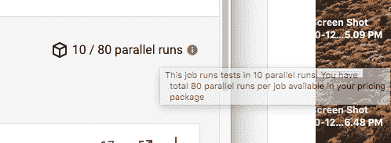
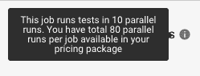
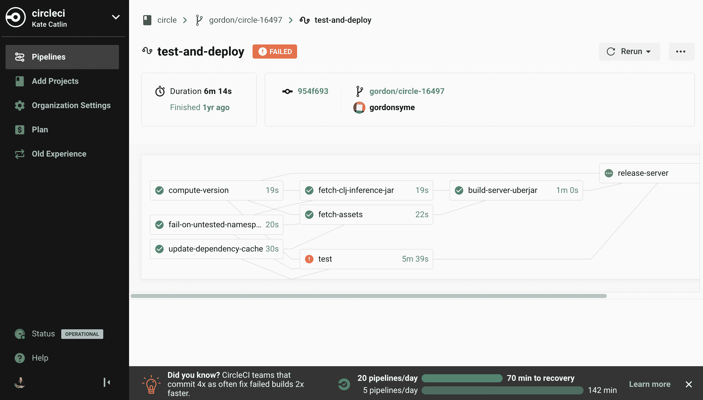
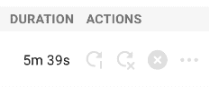
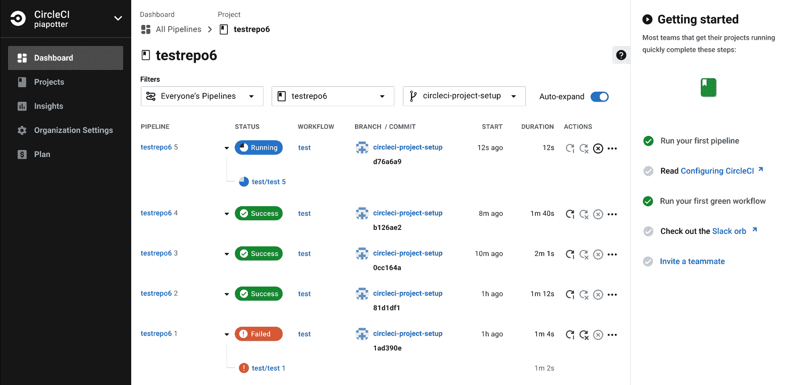

# 我们如何改进 CircleCI:成长工程团队的经验

> 原文：<https://circleci.com/blog/how-we-improve-circleci-learnings-from-the-growth-engineering-team/>

在 CircleCI 的增长工程团队中，我们定期进行或大或小、或复杂或简单的 UI 实验。每一个都揭示了更多关于我们的客户如何以及何时使用 CircleCI，以及我们如何让他们的体验更好。

我们的团队在设计这些实验时遵循三个价值观:增量、好奇心和为用户增加真正的价值。

以下是这些价值观如何变成实验的例子，以及我们从每个实验中学到了什么。

## 增量:UX 的小烦恼产生大影响

当新的成长工程师加入我们的团队时，我们要求他们在 CircleCI 上建立一个项目，并写下他们所有的困惑或沮丧之处。

一名工程师指出，当他将鼠标悬停在解释工作页面上的[并行度](https://circleci.com/blog/six-optimization-tips-for-your-config/)的工具提示上时，过了几秒钟才弹出:

我们的团队构建了原始的工具提示作为不同测试的一部分，但是因为我们优先考虑小的、增量的改进，我们当时使用了开箱即用的浏览器功能(以获得更快的反馈)，而不是构建我们自己的适当工具提示组件。从这个实验中，我们发现向用户提供更多关于并行性的信息会导致更多的组织提升他们的并行性水平。

如果我们构建一个更好的工具提示，我们会看到更多的并行使用吗？

我们运行了一个 A/B 测试，将浏览器的原生工具提示(我们用作黑客)转换成一个真正的、定制的工具提示，它会立即弹出:

我们再次观察到，与对照组相比，处理组(使用新的工具提示)的组织利用并行性有了显著的提高(从 12.5%提高到 14.9，p=0.00，没有比这更显著的统计数字了！)

这是一个很小的 UX 调整，以至于我们最初争论是否要进行测试。我们认为它不会改变什么，但它确实显示了一个重要的提升。

通过增量，我们可以更多地了解用户如何与工作页面交互。我们还了解到一个更广泛的事实:UX 的小改进会产生很大的不同。

## 好奇心:了解用户正在尝试做什么，并帮助他们更快地完成

随着时间的推移，我们发现一些帮助用户提高效率的尝试并不奏效。例如，我们开展了一项我们认为非常有吸引力的教育活动，向用户展示他们可以通过更频繁地运行较小的提交来更快地从失败的管道中恢复。

令我们惊讶的是，看了广告的治疗组比没看广告的治疗组平均少跑了几条管道。

我们很好奇这些结果是否与我们试图改变用户现有的工作流程，而不是加速他们当前的工作流程有关。如果我们在用户的现有流程中运行不同的实验，结果可能会有所改善。

我们了解到，大多数用户希望重新运行管道，他们只是不想为此进行多次额外的点击。我们新的 A/B 实验显示了顶层仪表板上的“重新运行管道”按钮——用户最常与之交互的页面。这不是一个新功能，但是我们想知道把按钮放在更中心的位置是否会促使用户更频繁地重新运行管道。

我们的直觉是正确的——这一变化导致管道重新运行的比率更高。

我们还发现，通过将重新运行按钮放在一个中心位置，更多的组织可以看到重新运行是一个选项，并且有大量新组织第一次开始使用该功能。

这两个结果之间的对比表明，将我们的实验与用户当前的工作流程相结合比试图让他们做一些新的或不同的事情更有效。这是一个我们通过更多的实验反复证实的结论。

## 增加价值:减少“快乐的时间”

我们从数据和 UX 研究会议中了解到，一些新用户需要很长时间来设置。这导致他们没有充分利用可用的工程资源来优化他们的管道，或者在某些情况下，完全离开平台。

根据我们[开发者关系](https://circleci.com/blog/devops-did-not-exist/)团队的意见，我们决定尝试在 UI 的右侧面板添加一个“入门”清单。该清单包括鼓舞士气的项目，如“运行您的第一条管道”和“运行您的第一个绿色工作流程”，以及阅读更多关于配置 CircleCI 的高级文档。

这里的目标是减少用户体验 CircleCI 全部价值的时间——或者我们喜欢称之为“减少快乐的时间”。

该实验使组织在加入该平台三周内的参与度提高了 27%。

我们了解到，减少快乐的时间对我们的用户有真正的影响。如果我们能够加快他们的入职速度，并帮助他们在这一过程中减少气馁，他们就可以更快地开始工作，这将为他们、他们的团队以及他们更大的组织增加真正的价值。

这才是真正的意义所在:我们进行这些参与实验，以了解如何让 CircleCI 更好地为我们的用户服务。随着我们继续运行测试，我们继续了解我们的用户需要什么来使他们更有生产力、更成功和更快乐。

你喜欢这些价值观的声音吗？你有兴趣做这种很酷的实验吗？我们团队在招人！查看 CircleCI 成长团队的最新[空缺职位。](/careers/jobs/)