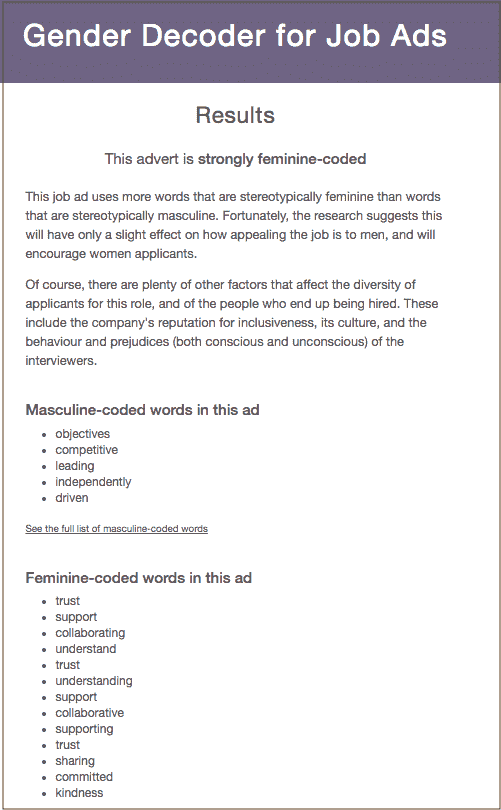

# 我们如何面试 CircleCI 的工程师

> 原文：<https://circleci.com/blog/how-we-interview-engineers-at-circleci/>

**来自出版商的说明:截至 2020 年 9 月，我们关于工程招聘流程的最新信息可以在[这里](https://circleci.com/blog/how-we-interview-software-engineers-what-we-ve-learned-what-we-ve-changed/)找到。**

自 2018 年初以来，我们已经有超过 1000 名候选人通过了工程招聘流程。我们的工程面试由初步筛选后的四个阶段组成。我们分析了通过招聘流程各个阶段的候选人比例，结果如下。

从任何一组 1000 名申请者中:

250 会通过初筛。117 将通过招聘经理的电话筛选。
44 人将通过面试的微观技能评估部分。
7 将通过宏观技能考核。
不到 3 人将通过现场面试并获得聘用。

在我们的[系列 C](https://circleci.com/blog/we-raised-our-series-c-what-s-next/) 之后，我们在目前所学的基础上进一步加大了招聘力度。我们最近在内部讨论了很多关于我们如何面试的问题，我想人们可能会对工程师职位的面试流程感兴趣，为什么。

## 反思技术面试

关于软件行业的面试实践已经说了很多。我们已经看到或听到了这一切:从不透明的设计到彻头彻尾的奇怪(我曾经被遗弃在一个会议室，独自一人，只有一个午餐袋，不知道接下来会发生什么)。

没有人喜欢这种类型的面试。指导他们的人不知道，候选人也不知道。毕竟，如果没有一个旨在施压、迷惑或恐吓的过程，求职面试就已经够紧张的了。

我们面试候选人的唯一目标是:

1.  确定最佳候选人，并邀请他们加入我们的公司。
2.  为所有候选人提供积极的体验。

自从我加入 CircleCI 以来，我们一直在努力设计一个我们希望自己经历的面试流程，一个在帮助我们找到团队最佳补充的同时向候选人表示尊重的流程。

### 面试结构

我们设计了一个 4 步技术面试，遵循所有候选人通过的初始筛选。我们所有的面试都遵循相同的顺序，每个阶段都是为了完成特定的评估:

**1。手机屏幕。**该职位的招聘经理将与候选人交谈，评估其经验、沟通能力以及在生产中处理自己代码的经验。

**2。微技能带回家的问题。**候选人完成一个编码问题，与面试官一起回顾。与候选人讨论问题有助于我们评估候选人的能力和思维过程，以及他们在编写软件时的优先事项和价值观如何与我们保持一致。我们知道的许多公司对于经理角色跳过这个阶段，因为他们不会写很多代码。我们将它包括在内，因为发现候选人的价值观和优先事项是否与他们将管理的团队的价值观和优先事项一致非常重要。

**3。宏观技能设计问题。**与工程团队高级成员的对话重点关注候选人在面对日益复杂的需求时如何设计和改进解决方案。答案没有对错之分，而是作为一个沙盒，让我们看到他们能力的界限在哪里。我们对这次测试的评分将取决于他们所面试职位的级别。

**4。现场面试。**现场面试的目标是让双方确定候选人应该是 CircleCI 团队的一员。候选人与工程团队成员配对，在实际的 CircleCI 代码库中一起解决问题/项目。这让我们的团队和候选人都体验了一起工作的感觉，并让我们了解这个人在更复杂的互动过程中是如何处理问题、合作和沟通的。在配对结束时，双方都应该觉得能够对合适与否做出自信的决定。**更新，2019 年 3 月:** *我们现在已经转向完全远程的采访流程，以反映我们实际的日常合作。我们仍然使用这个面试阶段，但是所有的面试都是远程进行的。*

### 创建尊重他人的流程

我们写了一份内部招聘指南，涵盖了我们在面试时试图坚持的价值观，我在下面分享了一些。对候选人表示尊重对我们来说非常重要，这可以通过多种方式表达出来。我考虑这些基本的礼节:当候选人到达时，有人迎接他们，或者不要让他们独自一人，想知道接下来会发生什么。我们的一些面试指南是:

*善良。面试压力很大，大多数公司都让候选人经受荒谬的考验，这只会让情况变得更糟。让我们举一个例子来说明事情可以变得更好。*

*考真本事。*我们是[专门反对“白板面试”的](https://circleci.com/blog/how-to-get-hired-at-circleci/)。我们要求自己，在任何情况下，都不要将候选人置于不代表他们正在面试的职位的日常现实的情况中。在白板上讨论设计方案是好的，但期望候选人背诵复杂的算法就不好了。

尊重考生的时间。我们准时开始和结束面试，目标是在 24-48 小时内给候选人反馈。

做你的家庭作业。不要让求职者回顾他们的工作经历。相反，在你面试之前先看看候选人的简历，准备好讨论有趣或相关的经历。

把大部分时间花在倾听上。如果你说话的时间超过了 20%,你就没有尽可能多地从候选人身上学到东西。

### 明智地使用词语

这要从职位描述说起。我们尽最大努力避免“兄弟文化”或其他带有高度偏见的语言。在我们所有的写作中，包括工作描述，我们努力使用强调合作、信任和学习的包容性语言。

如果你想知道你的职位描述是否传达了你不想传达的信息，Joblint 和 T2 性别解码器是两个很好的工具来解析有偏见的语言。

例如，这是我们通过性别解码器招聘高级后端工程师的广告:

我们在工程职位描述中有意使用中性和女性化的语言，以创建更具包容性的招聘流程。[研究表明](https://hbr.org/2014/08/why-women-dont-apply-for-jobs-unless-theyre-100-qualified),女性不太可能对过于男性化或带有攻击性语言的广告做出反应(尽管有资格)，而男性不管怎样都会申请。

## 持续学习

这一进程将继续发展，并借鉴我们的经验。例如，目前申请人的平均转换率为 0.5%，我们需要查看多达 4000 名候选人才能再雇佣 20 名工程师。

我们的最终目标是让最好的人在这里，做他们最好的工作。随着我们不断学习和完善，我们希望在保持高标准的能力和候选人经验质量的同时，提高我们的转化率。

我们的受访者对这一过程的反馈总体上是积极的，我们在完善我们的采访过程中始终欢迎各种反馈。如果您已经完成了我们的流程并有反馈，我很乐意收到您的来信。给我发邮件到 jeff@circleci.com。

如果你有兴趣申请这里的工作，我们也很乐意和你谈谈！在这里看看我们开放的角色[。](https://circleci.com/careers/)

有兴趣了解更多在这里工作的情况吗？阅读: