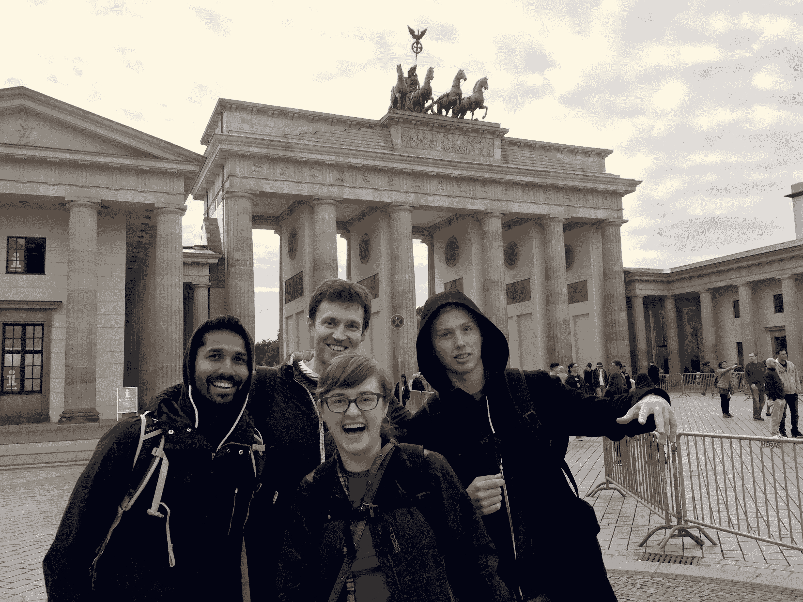

# 作为一个全球团队，我们如何坚持我们的包容性价值观- CircleCI

> 原文：<https://circleci.com/blog/how-we-uphold-our-inclusive-values-distributed-team/>

## 分散经营的好处

从早期开始，CircleCI 就有意打造一支全球化的员工队伍。这个简单的选择给了我们很多好处。首先，我们可以接触到地球上最优秀的人才。我们可以接触到的各种各样的观点有助于我们做出更好的决策。同样重要的是:它让我们能够一天 24 小时不间断地为客户提供价值。作为一家公司，团队成员遍布全球为我们带来了许多优势。

然而，更有价值的是，我们知道远程工作的灵活性也为我们的全球员工带来了相当大的好处。我们问他们喜欢远程工作的什么，以下是他们最喜欢的一些福利:

*   完美的办公室。你可以选择(或构建)你理想的工作环境:是意味着更安静、更少的社交干扰，还是窗外鸟儿歌唱的声音，以及你的狗在你脚边安静地打呼噜的轻微隆隆声。
*   没有浪费时间。你可以用拥挤的火车上的长时间通勤来换取更多与朋友、家人或喜爱的爱好共度的自由时光。
*   *无限的灵活性。*根据需要调整时间表，减轻平衡家庭和工作的压力。

## 我们是如何做到的

CircleCI 公司由 111 人组成(并且还在增长！)，其中 36 个是远程的，占公司的三分之一！我们的一些团队比其他团队拥有更大的远程组件，这取决于他们所做的工作类型，以及哪种类型的设置可以让我们更好地满足客户需求。有些团队，比如工程团队，天生适合异步工作，因为他们可以从 Slack 和 Github 等共享资源中获取所需的上下文，然后埋头单干。其他团队，如营销和销售团队，主要在同一时间同一地点工作会受益；例如，能够在销售电话后与队友分享实时反馈可以帮助团队成员更快地迭代和改进他们的过程。

我们从一开始就是一个分散的团队；异步运行是我们的天性。由于这一历史，自从我们成为一家公司以来，我们围绕位置无关协作的许多实践就一直伴随着我们。我们一直努力确保随着我们的成长，我们能够成为一个包容所有人的工作场所，无论工作地点在哪里。

> “这是我的第二份远程工作，CircleCI 带给我的两个最大的不同是我们得到的信任和每个人合理关心的程度。远程工作的能力是一回事，但 CircleCI 给了我远程发展的机会。真的很棒。”-Ryan O'Hara，科罗拉多州高级客户成功工程师

我们是如何做到的？从一开始，我们就接受了沟通实践，确保人们不必亲临现场就能了解情况。这渗透到每一件事，从投资坚实的影音到我们作为一个团队计划和执行任务的方式。

### 投资支持以下功能的系统

以下是我们在支持分布式工作人员方面取得的一些成效:

*   创造信任的文化。“这并不局限于远程工作，但是如果没有一个广泛的理解，即每个人都值得信任来完成他们的工作，健康的远程工作是不可能的。如果有哪怕一丁点儿的想法认为远程工作人员没有办公室工作人员努力，那么有效的远程工作就会变得极其困难。”-都柏林开发商 Conor McDermottroe
*   鼓励平等的机会。“我从未听说过决策过程中的推理，比如“[此人]不能参与此事，因为他们远离 CircleCI 的任何人。此外，我认为我们努力在互联网上分享信息和决策(例如 Slack 或 Google Docs)，这样无论你是在本地还是远程，每个人都可以看到。”-东京开发商 Hirokuni Kim
*   拥抱多媒体。“与仅仅进行语音通话相比，进行视频会议要容易得多。没有视频会议，我无法远程完成这项工作。”-乔纳森·莫里斯，洛杉矶销售总监
*   *聚在一起。*定期举行面对面的全体会议，从我们可以围坐在一张餐桌旁的时候起，我们就一直在这样做。“全体会议是认识其他同事的好机会，让我们觉得我们有共同的目标。”-内特·史密斯，多伦多开发人员

*小型全能运动队(在柏林也叫“小手”)*

 *### 你也能做到

这些是我们作为一家公司为保持我们的分布式组织或多或少平稳运行而做的一些事情。但是，作为一名远程工作者，在个人层面上并非没有挑战。在打开 Slack 和拨入 Zoom 的许多个早晨之后，我们的团队学到了一些东西。以下是一些让他们在别处工作的建议:

> “如果这是你第一次远程工作，你会有几个月感觉‘失衡’和效率低下。很容易让你的工作/生活平衡向两个方向倾斜:工作不够或者工作太多。我避免工作太晚的个人生活窍门是有一个 6:30 到家的妻子，如果我让她等太久才吃饭，她会生气。这可能不是对每个人都有效，但在可能的情况下是有效的。”-加利福尼亚州索诺玛县开发人员 David Goeke

> "养成良好的日常习惯."-Rose Kaplan-Bomberg，纽约成功工程师

> “我强烈建议你不时到办公室来，与许多其他员工互动，并支持这些关系。”-乔纳森·莫里斯，洛杉矶销售总监

CircleCI 支持各种各样的多样性。阅读戴维·洛佩斯写给酷儿青年的信，了解作为一个酷儿在营销和面试时有什么帮助。

我想分享我在帮助酷儿青年方面学到的东西，让他们走进任何一家科技公司的大门，加入一个团队，拥抱他们的技能，支持他们的抱负，接受他们的身份。以下是对我有所帮助的:

想为一家重视贡献而非位置的公司工作吗？查看我们的[空缺职位](/careers/)。*