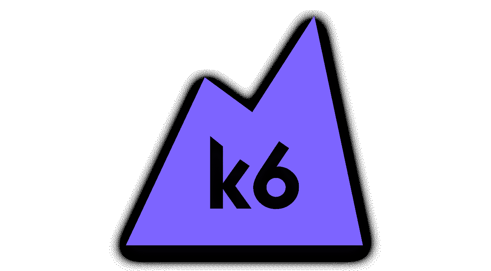

# 使用 k6 | CircleCI 进行 HTTP 请求测试

> 原文：<https://circleci.com/blog/http-request-testing-with-k6/>

> 本教程涵盖:
> 
> 1.  什么是 k6，它是如何工作的
> 2.  编写和执行 k6 测试
> 3.  分析 k6 测试结果

开发团队每天部署的许多多面应用程序是松散耦合的，每个服务的存在都是为了支持另一个服务。大多数开发 fullstack 应用程序的团队都知道测试这些服务之间的通信是必不可少的。该过程的一部分是测试 HTTP 请求端点，本教程正是关注于此。我将带领您学习如何扩展 k6 框架来测试我们的 HTTP 端点。您还将学习如何设置 k6 和，以及如何利用其他 API 测试框架中没有的特性。本教程在 k6 的[性能测试 API 中继续。](/blog/api-performance-testing-with-k6/)

## 先决条件

要学习本教程，您需要:

1.  [JavaScript](https://www.JavaScript.com/) 的基础知识
2.  HTTP 请求和测试的基本知识
3.  您系统上安装的 [Node.js](https://nodejs.org) (版本> = 10.13)
4.  一个[圆](https://circleci.com/signup/)的账户
5.  GitHub 的一个账户

> 我们的教程是平台无关的，但是使用 CircleCI 作为例子。如果你没有 CircleCI 账号，请在 注册一个免费的 [**。**](https://circleci.com/signup/)

## k6 是什么？

k6 是一个开源框架，旨在为开发人员带来性能测试的乐趣。此时，您可能会问自己，这与 HTTP 请求测试有什么关系？测试性能意味着向 API 端点发出请求。我们已经在使用该工具进行 HTTP 请求，为什么不用它来测试那些端点呢？发出请求会将您带到测试端点的中途。我将在本教程的后面描述如何完成测试。



k6 用 [goja](https://github.com/dop251/goja) 语言编写，是纯 Go 语言的 Ecmascript 5.1 实现。这种实现纯粹是出于性能原因，它包含了一些很棒的特性，使得具有 JavaScript 经验的软件开发人员可以很容易地进行测试。k6 附带了一个有用的 CLI，用于制作 API 支持的 k6 命令。k6 APIs 提供了对 JavaScript ES2015/ES6 的支持，以及负载测试的工具和功能，我们将在本教程的后续部分使用这些工具和功能。

既然我们知道了 k6 下运行的是什么，为什么不开始设置 k6 来运行我们的 HTTP 测试呢？

首先，[从](https://docs.github.com/en/repositories/creating-and-managing-repositories/cloning-a-repository) [Github 库](https://github.com/CIRCLECI-GWP/api-testing-with-k6)中克隆示例应用程序。

## 安装 k6

与 JavaScript 模块不同，k6 必须使用包管理器安装。在 macOS 中你可以使用[自制](https://brew.sh/)。在 Windows 操作系统中，你可以使用[巧克力糖](https://github.com/chocolatey/choco)。k6 文档中有更多适用于其他操作系统的安装选项。对于本教程，我们将遵循 macOS 安装指南。在 homebrew 中执行此命令:

```
brew install k6 
```

这是您开始编写 k6 测试时需要运行的唯一命令。

安装 k6 后，我们需要创建一个文件夹来存储我们的项目。我们将通过在我们想要存储测试的目录中执行以下命令来做到这一点:

```
$ mkdir http-request-testing-with-k6;
$ touch todos-testing.js 
```

这些命令将创建一个空项目，并创建我们的测试文件`todos-testing.js`。

## k6 测试结构

k6 使用的测试结构与大多数开发人员习惯的测试结构有点不同，尤其是那些来自 JavaScript 背景的开发人员。下面的代码片段显示了一个用 k6 编写的示例测试，声明我们正在从一个开源的 todo 应用程序 API 获得响应，我们将在本教程中使用该 API 进行测试。您可以向刚刚创建的项目中添加相同的测试。

```
// snippet from ./todos-testing.js
import http from 'k6/http';
import { check } from 'k6';

export let options = {
   vus: 1,
};

export default function () {
   group('API uptime check', () => {
       const response = http.get('https://todo-app-barkend.herokuapp.com/todos/');
       check(response, {
           "status code should be 200": res => res.status === 200,
       });
   }) 
```

首先，如果您仔细观察测试，它类似于 JavaScript 测试代码，但是文件格式与我们通常编写 JavaScript 测试的方式不同。让我给你分解一下测试结构。

因为我们 k6 使用`goja`而不是 JavaScript，所以我们只能使用 JavaScript 的某些方面来执行我们的测试。因此，我们不能访问像通常我们可以访问的`describe`或`it`块这样的方法，也不能访问像`chai`这样的断言库。k6 提供了`group()`和`check()`方法，它们的工作方式与我们使用`describe`和`assert`的方式相同。`group()`块允许我们在一个文件中编写多个测试，但是为了可读性，也可以将不同测试的配置分开。

k6 还捆绑了一个默认的`HTTP`请求模块，我们可以用它来发出所有的 API 请求，无论是`GET` `POST`、`PUT`还是`DELETE`。当用纯 JavaScript 编写测试时，这个`http()`方法相当于`fetch()`。对于测试的其余部分，我们使用`check()`方法断言响应是`200`，并且我们可以继续使用这个断言块断言我们需要的任何其他响应。

**提示**:*k6 测试中的`options = {}`对象对于运行 HTTP 测试是可选的，但是当我们使用 K6 运行负载测试时，它非常方便。在这个特定的测试中，我们告诉 k6，我们希望只使用单个虚拟用户(vus)或者单个迭代来运行测试，这对于这个测试的上下文是有意义的。*

## k6 测试的生命周期

k6 遵循一个`init code`、`setup code`、`VU code`和`teardown code`的生命周期。这个循环显示了测试通常是如何运行的，以及测试在执行时可以访问哪些资源。下面是展示 k6 测试生命周期的示例代码块:

```
// 1\. init code

export function setup() {
  // 2\. setup code
}

export default function (data) {
  // 3\. VU code
}

export function teardown(data) {
  // 4\. teardown code
} 
```

`init`和`VU`阶段作为测试入口点，而`teardown`和`setup`提供了 API 测试可以在测试完成执行之前和之后运行的脚本。拆卸和安装方法是可选的，所以 k6 中最简单的测试形式可以只使用`VU`代码方法，如下面的代码片段所示:

```
// snippet from ./todos-testing.js
export default function () {
    const response = http.get('https://todo-app-barkend.herokuapp.com/todos/');
    check(response, {
        "status code should be 200": res => res.status === 200,
    });
} 
```

默认函数`VU code`中的代码在为单次迭代(一次 VU)或者为负载测试的多次迭代调用测试时运行。

`VU`代码发出 API HTTP 请求并执行断言，但是它不能导入其他模块或从文件系统加载文件。这就是 k6 在不同的执行模式下执行时知道哪些测试应该保存在内存中的原因。这种策略提高了 k6 的性能，优化了测试设计。

现在这变得有趣了，是时候将 CI/CD 集成到我们的应用程序中，这样您就可以执行测试了。对于本教程，我们将使用 CircleCI 为应用程序设置 CI/CD。

**注意** : *如果您已经克隆了项目存储库，那么您可以跳过这部分教程。如果你想学习如何建立自己的项目，我在这里添加了一些步骤。*

## 设置 Git 并推送到 CircleCI

要设置 CircleCI，通过运行以下命令初始化项目中的 Git 存储库:

```
git init 
```

接下来，在根目录下创建一个`.gitignore`文件。在文件中添加`node_modules`来防止 npm 生成的模块被添加到您的远程存储库中。然后，添加一个提交，[将你的项目推送到 GitHub](https://circleci.com/blog/pushing-a-project-to-github/) 。

登录 CircleCI 并转到项目仪表板。您可以从与您的 GitHub 用户名或您的组织相关联的所有 GitHub 存储库列表中选择您想要设置的存储库。本教程的项目名为`http-request-testing-with-k6`。在“项目”面板上，选择设置所需项目的选项。选择使用现有配置的选项。

**注意:** *在启动构建之后，预计您的管道会失败。您仍然需要将定制的`.circleci/config.yml`配置文件添加到 GitHub 中，以便正确构建项目。*

## 设置 CircleCI

在根目录下创建一个`.circleci`目录，然后添加一个`config.yml`文件。配置文件保存每个项目的 CircleCI 配置。在此配置中使用 CircleCI k6 `orb`执行 k6 测试:

```
# snippet from .circleci/config.yml configuration file 
version: 2.1
orbs:
 k6io: k6io/test@1.1.0
workflows:
 load_test:
   jobs:
     - k6io/test:
         script: todos-testing.js 
```

### 使用第三方球体

CircleCI orbs 是 yaml 配置的可重用包，它将代码压缩成一行。要允许使用像`python@1.2`这样的第三方球体，您可能需要:

*   如果您是管理员，请启用组织设置，或者
*   向您组织的 CircleCI 管理员请求权限。

设置好配置后，[将](https://docs.github.com/en/get-started/using-git/pushing-commits-to-a-remote-repository)配置推送到 GitHub。CircleCI 将开始建设这个项目。

瞧啊。转到 CircleCI 仪表板，展开构建详细信息。验证测试运行成功，并集成到 CircleCI 中。


现在您已经设置了 CI 管道，您可以继续用 k6 编写更多的 HTTP 请求测试。

## 验证 k6 响应

既然您已经了解了 k6 的结构以及如何编写一个基本的测试，下一步就是用 k6 编写可伸缩的测试。使用您的`todo` API 创建一个名为`write k6 tests`的 todo 项目:

```
// snippet from ./todos-testing.js
  group('Create a Todo', () => {
       const response = http.post('https://todo-app-barkend.herokuapp.com/todos/',
       {"task": "write k6 tests"}
       );
       todoID = response.json()._id;
       check(response, {
           "status code should be 200": res => res.status === 200,
       });
       check(response, {
           "Response should have created todo": res => res.json().completed === false,
       });
   }) 
```

该代码块传递一个 todo 项，并向我们的 todo 应用程序 API 发出 HTTP 请求，这样就创建了您的 Todo 项。很简单，对吧？

为了使这更有趣，添加另一个测试来获取创建的 todo 项。这里的挑战是进入之前测试的范围。要做到这一点，需要为前面的测试返回的响应创建一个全局范围。然后在后续测试中使用 todo 项的`Id`。这里有一个例子:

```
// snippet from ./todos-testing.js
group('get a todo item', () => {
    const response = http.get(`https://todo-app-barkend.herokuapp.com/todos/${todoID}`
       );
    check(response, {
        "status code should be 200": res => res.status === 200,
    });
    check(response, {
        "response should have the created todo": res => res.json()[0]._id === todoID,
    });
    check(response, {
        "response should have the correct state": res => res.json()[0].completed === false,
    });
   }) 
```

该测试验证创建的 todo 项与您创建的是同一项，并且其属性没有更改。在本地运行这个测试成功通过，表明就像在 JavaScript 测试中一样，k6 可以在测试中共享状态。

这个示例代码中还显示，使用`groups()`来分离不相关的测试会在测试失败时增加松散耦合。它还提高了测试的可读性。

## 使用场景为多个环境配置 k6

作为一个负载测试工具，k6 附带了一些很棒的特性，可以在不同的环境中执行一些操作，比如编写测试，而不需要太多的配置。`scenario`特性就是一个很好的例子。[场景](https://k6.io/docs/using-k6/scenarios/)提供 k6 测试的深度配置，使得根据配置偏好配置每个单独的 [`VU`](https://k6.io/docs/using-k6/scenarios/executors/per-vu-iterations/) 成为可能。

```
export let options = {
   scenarios: {
     example_scenario: {
       env: { EXAMPLEVAR: 'testing' },
       tags: { example_tag: 'testing' },
     },
   }
 } 
```

这个代码块展示了如何将场景对象捆绑在 k6 `options`对象中。它传递包含不同环境的环境配置的`env`对象。金矿！

要自己做这件事，创建一个名为`environmentConfig.js`的文件，或者使用克隆的存储库中的文件。为开发和试运行环境添加一个配置，并将它们传递给不同的测试。

```
// snippet from ./environmentConfig.js
export function developmentConfig(filename) {
   let envConfig = {
     BASE_URL: "http://todo-app-barkend.herokuapp.com/todos/",
     ENV: "DEVELOPMENT",
   };
   return Object.assign({}, envConfig, filename);
 }
  export function stagingConfig(filename) {
   let envConfig = {
     BASE_URL: "https://todo-app-barkend.herokuapp.com/todos/",
     ENV: "STAGING",
   };
   return Object.assign({}, envConfig, filename);
 } 
```

这个代码块展示了如何为不同的环境配置测试。注意，它为开发环境使用了一个`HTTP`(非 SSL) URL，为登台环境使用了一个`HTTPS`(支持 SSL)URL。

一旦您为单个环境设置了变量，您就可以使用场景使用`options`对象将它们导入到不同的测试中。创建两个新文件来测试这个特性，一个用于开发环境，一个用于测试环境。将此代码片段用于开发环境测试:

```
// snippet from scenario-tests/todos-development-tests.js
import { developmentConfig } from '../environmentConfig.js';

export const options = {
   scenarios: {
     example_scenario: {
       env: developmentConfig(),
       executor: 'shared-iterations',
       vus: 1
     }
   }
 };

export default function () {
   group('API uptime check - development', () => {
       const response = http.get(`${__ENV.BASE_URL}`);
       check(response, {
           "status code should be 200": res => res.status === 200,
       });
   });
…
}); 
```

这个代码块展示了如何利用`scenarios`配置，同时在不同的环境中运行同一组测试。

**注意** : *可以在克隆的存储库中的`scenarios-tests`文件夹中找到不同配置的用于测试和开发的完整测试。*

使用这种方法，您可以在`DEV`、`UAT`，甚至`PROD`环境中运行测试，即使相同测试的配置对于每个环境是不同的。为了验证成功，您可以运行`scenario-tests`文件夹中的测试。

对于开发环境/配置，运行:

```
K6 run scenario-tests/todos-development-tests.js 
```

对于暂存环境，运行:

```
K6 run scenario-tests/todos-staging-tests.js 
```

为了确保这些测试在 CI/CD 管道上运行，您需要修改`.circleci/config.yml`来包含这些运行命令:

```
# snippet from .circleci/config.yml configuration file 
    jobs:
      - k6io/test:
          script: todos-testing.js
      # Add more jobs here
      - k6io/test:
          script: scenario-tests/todos-development-tests.js
      - k6io/test:
          script: scenario-tests/todos-development-tests.js 
```

场景允许您将 k6 测试配置为单独的迭代。当您希望在一个文件中编写多个负载测试场景，并为每个场景使用不同的配置时，它们提供了可扩展性。

## 在 CircleCI 验证管道成功

通过本教程，我们已经能够成功地运行我们的测试，但是这并不能证明它们将总是在 CI 上工作。为了增加我们对这个过程的信心，让我们提交我们的更改并再次推送到 GitHub。由于我们已经配置了 CircleCI，一旦更改被推送到 GitHub 远程存储库，构建应该会自动开始。


万岁！我们对三个测试文件的所有构建都进行了绿色检查。这只能意味着一件事:庆祝时间！

## 结论

在本教程中，我们了解了什么是 k6 框架以及它是如何工作的。我们了解到它是用`goja`语言创建的，但是是为使用 ES6 JavaScript 语法而编写的，这优化了它作为负载测试工具的性能。我们还学习了 k6 测试的不同生命周期阶段，以及如何编写和断言 k6 测试。我们学习了如何在多种环境中配置 k6，并利用了 k6 中的`options`和`scenarios`对象。现在前进，走向成功！

通过完成使用 k6 的[性能测试 API 教程，以您所学为基础。](/blog/api-performance-testing-with-k6/)

* * *

Waweru Mwaura 是一名软件工程师，也是一名专门研究质量工程的终身学习者。他是 Packt 的作者，喜欢阅读工程、金融和技术方面的书籍。你可以在[他的网页简介](https://waweruh.github.io/)上了解更多关于他的信息。

[阅读更多 Waweru Mwaura 的帖子](/blog/author/waweru-mwaura/)