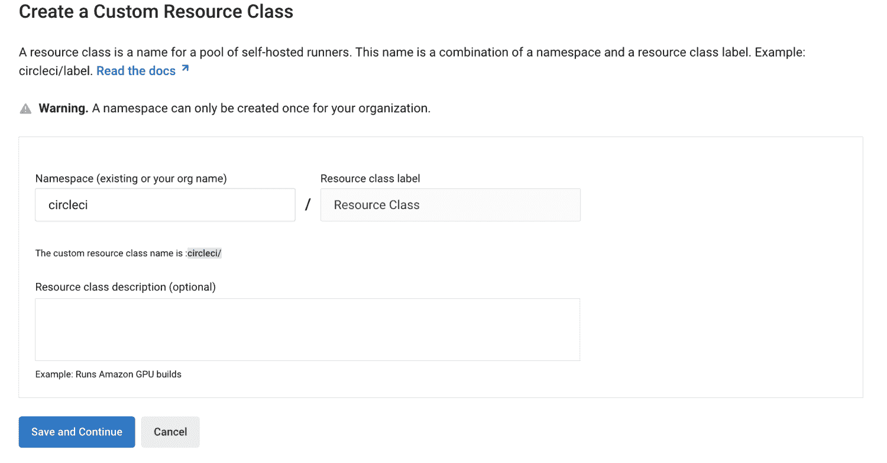
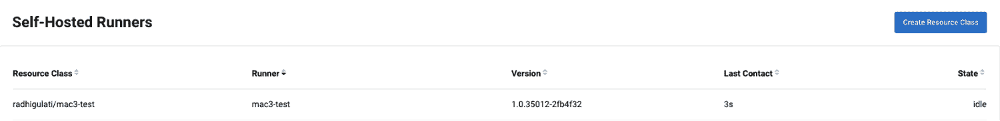

# 在 5 分钟或更短时间内安装自托管转轮| CircleCI

> 原文：<https://circleci.com/blog/install-runner-in-five-minutes/>

## 在 CircleCI 用户界面中快速轻松地设置和实时跟踪跑步者

我们最近修改了我们的免费增值计划，成为这个星球上对开发者最慷慨的免费 CI/CD 层。除了在免费计划中提供强大的功能和资源，我们还将自托管跑步者扩展到了[所有 CircleCI 计划](https://circleci.com/blog/new-cicd-free-plan-what-devs-get/)。

丰富免费计划的功能是不够的，所以我们努力使我们的平台对所有技能和规模的开发者尽可能友好和直观。今天，我们很高兴为自主跑步者推出新的简化用户体验。我们已经在 UI 中添加了对自托管跑步者的一流支持。无论您是对数百万用户的下一个伟大的移动应用程序进行代码签名，还是在地下室的 Raspberry Pi 上测试新固件，您都可以无缝地利用 CircleCI 的自托管运行程序来完成工作。

现在，您可以在不到 5 分钟的时间内快速开始安装和使用自托管运行程序，并通过 UI 获得全新的安装体验。我们还将帮助您在单一视图中跟踪您的所有跑步者活动，以便您可以监控和调整您的自托管跑步者池，以满足您的云管道的需求，做出明智的扩展决策，并识别和修复停滞的作业或失败的基础架构。

## 在 5 分钟或更短的时间内开始自主跑步

首先，在 CircleCI UI 中快速轻松地配置您的第一个 runner 资源类，而无需下载额外的软件。资源类是标签，使您能够为特定的作业子集(即对于将在 macOS 机器上运行的作业，您可能有一个资源类，对于将在 Linux EC2 实例上运行的作业，您可能有一个资源类。

要创建您的第一个资源类，请访问 CircleCI UI 中的“Self-Hosted Runners”选项卡，以创建您的名称空间(您的组织拥有的唯一标识符)和资源类。创建名称空间后，按照自导式安装流程安装您的第一个自托管 runner。

一旦您在 UI 中确认检测到新的自托管运行程序，您就可以使用 UI 中显示的示例配置文件，或者使用现有的配置文件来运行新安装的自托管运行程序的作业。

请参见[文档](https://circleci.com/docs/runner-overview/#available-circleci-runner-platforms)以获取支持的操作系统、版本和架构的最新列表。

## 实时跟踪您的自主跑步者

在跑步者设置和安装之后，CircleCI UI 现在跟踪活动的跑步者代理，并维护与您的帐户相关联的跑步者代理的显示。该显示器包括活动和备用流道的实时视图，有助于为扩展决策提供信息，并使卡住的作业或失败的基础设施能够快速识别并轻松修复。

## 为您的 CircleCI 帐户激活自托管跑步者用户界面

要将自托管跑步者作为 CircleCI 云设置的一部分，CircleCI 帐户的管理员应导航至`app.circleci.com`，然后:

1.  转到组织设置页面
2.  点击**自助跑步者**
3.  接受跑步者条款

你可以在 CircleCI 学院的[自助跑步者课程中了解更多关于自助跑步者健身的信息。](https://academy.circleci.com/runner-course/1255642/scorm/1u4csmxye5e8c)

## 下一步是什么？

查看我们的[社区论坛](https://discuss.circleci.com/t/self-hosted-runners-on-every-plan-draft/43846/)，了解如何开始使用 app.circleci.com。

## 问题/评论？

如果您有关于如何改善跑步者体验的想法，请访问 Canny 浏览或提交新想法。前往我们的社区论坛，[讨论](https://discuss.circleci.com/t/self-hosted-runners-on-every-plan-draft/43846/)，让我们知道您如何使用 runner。更多详细信息，请访问[文档](https://circleci.com/docs/runner-overview/)。