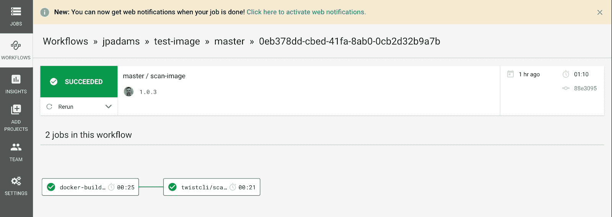
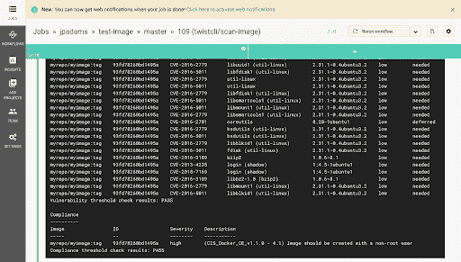
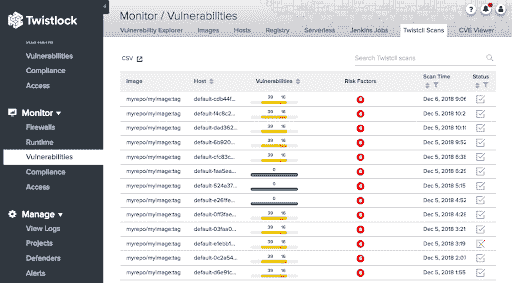

# 用扭锁和圆环扫描集装箱图像

> 原文：<https://circleci.com/blog/integrating-container-image-scanning-into-circleci-builds-with-the-twistlock-orb/>

开发人员和 DevOps 团队是采用容器的主要驱动力。DevSecOps 的实践将安全性嵌入到当今的现代工作流中，而不会增加来自组织安全方面的不必要的摩擦。这并不意味着安全团队被排除在外。相反:通过与开发人员已经在使用的工具(如 CircleCI)集成，安全团队制定的标准将作为构建和部署过程的一部分不断得到应用。

通过在容器映像在生产环境中运行之前对其进行扫描来实现 DevSecOps，可以产生一些好处，例如向开发人员提供快速反馈，以及将不安全或不符合要求的工作负载排除在生产环境之外。与安全和合规性相关的质量关来自与安全团队的协商，并作为 CI 流程的一部分自动完成。因此，开发人员可以快速获得反馈，并可以在开发某个功能时修复安全漏洞和合规性问题，而不会产生上下文切换的成本，或者更糟糕的是，将易受攻击的代码发布到产品中的风险。通过这种方式，在 CI/CD 过程中设置安全性和遵从性质量关口可以极大地增强开发人员容器的安全性，而不会降低它们的速度。

## 通过 CircleCI Orb 注册表使用 Twistlock

扭锁球可以在 [CircleCI Orb 注册表](https://circleci.com/developer/orbs/orb/twistlock/twistcli-scan)中找到。此外，我们的 [GitHub repo](https://github.com/add-twistlock/twistcli-scan-image-orb) 包括关于配置 Twistlock 许可证、在 Twistlock 中为 CI 用户角色设置凭证的关键细节，以及其他可能有帮助的参数、命令和脚本。

## 使用 twistcli 扫描图像

CircleCI orb 利用了我们的命令行控制和配置工具`twistcli`。`twistcli`工具支持扫描图像以发现漏洞和合规性问题，并且无需原生插件即可与任何 CI 工作流集成。

下面，您可以看到一个示例`.circleci/config.yml`文件，它将在 CircleCI 中的构建之后扫描您的图像，然后将图像推送到您的容器注册表:

```
version: 2.1
orbs:
  twistcli: twistlock/twistcli-scan@1.0.4
jobs:
  docker-build-and-save:
    executor: twistcli/default
    steps:
      - checkout
      - run: 'docker build -t myrepo/myimage:tag .'
      - run: mkdir -p workspace
      - run: 'docker save myrepo/myimage:tag -o workspace/image.tar'
      - persist_to_workspace:
          root: workspace
          paths:
            - image.tar
workflows:
  scan-image:
    jobs:
      - docker-build-and-save
      - twistcli/scan-image:
          requires:
            - docker-build-and-save
          context: tl_scan_context
          image: 'myrepo/myimage:tag'
          imagetar: image.tar
          vuln-thresh: critical
          comp-thresh: ''
          only-fixed: true 
```

在示例`config.yml`文件中，`vuln-thresh`和`comp-thresh`指的是 Twistlock 将在每个构建中警告或阻止的特定严重性级别。虽然许多用户可能会选择简单地扫描他们的映像以查找漏洞或合规性问题，但您可以自定义这些设置，以阻止构建在映像不符合您的安全要求时将映像推送到您的注册表中(如下图所示)。例如，如果有已知的供应商修补程序，许多用户会选择阻止关键漏洞进入他们的容器注册表。

此外，您可以选择将`only-fixed`设置为 true 或 false，以仅识别具有已知供应商修补程序的问题。

要深入了解整个样本`config.yml`文件，您可以跳到 [Twistlock orb GitHub repo](https://github.com/add-twistlock/twistcli-scan-image-orb#4-adapt-the-example-configyml-to-your-environment) 的这个特定部分。

## 在 CircleCI 中查看扫描结果

一旦配置了 CI 用户角色和脚本，您就可以在 CircleCI 和 Twistlock 控制台中看到每个构建的漏洞扫描结果。下面，您可以看到一个 CircleCI 工作流示例，我在其中扫描了一个 Docker 版本:



此外，我可以查看详细的扫描结果，包括表面 CVEs、软件包信息、供应商修复状态和严重性。我还可以看到针对 300 多项 Docker、Kubernetes 和 Linux CIS 基准的合规性检查:



如果您对跨团队和环境的所有扫描结果的更全局视图感兴趣，您可以通过导航到**监控>漏洞> Twistcli 扫描**在 Twistlock 控制台中查看所有扫描。在那里，您可以看到每个构建的状态，或者单击任何扫描来查看更详细的扫描结果，就像在 CircleCI 中一样。在下面的屏幕截图中,“Status”列显示我的所有扫描都符合我的策略要求，只有靠近底部的一个扫描不符合我的策略要求:



## 摘要

我们很自豪能够与 CircleCI 合作，将安全性嵌入到 DevOps 工作流中。要了解更多关于您和您的团队如何操作 DevSecOps 的信息，请查看我们的信息图 [7 个提示，以导航操作 DevSecOps](https://www.twistlock.com/7-tips-navigate-operationalizing-devsecops/) 。

* * *

Jeremy Adams 为 Twistlock 带来了超过 10 年的 IT 运营和自动化经验。在那里，他与整个云原生生态系统的合作伙伴合作，将安全性集成到他们的 DevOps 工作流中，以发布安全的应用程序并保护他们免受主动威胁。此前，Jeremy 曾在 Puppet 和 Sun Microsystems 担任以客户为中心的技术职务。他是一名退伍军人，快乐地移居到俄勒冈州的波特兰。