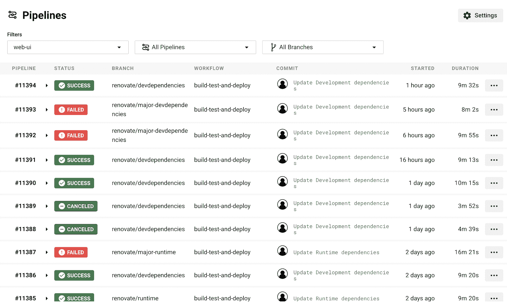
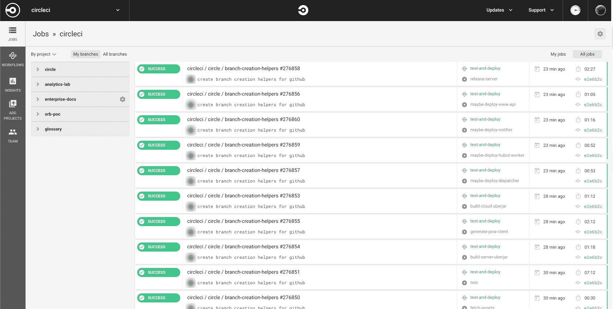
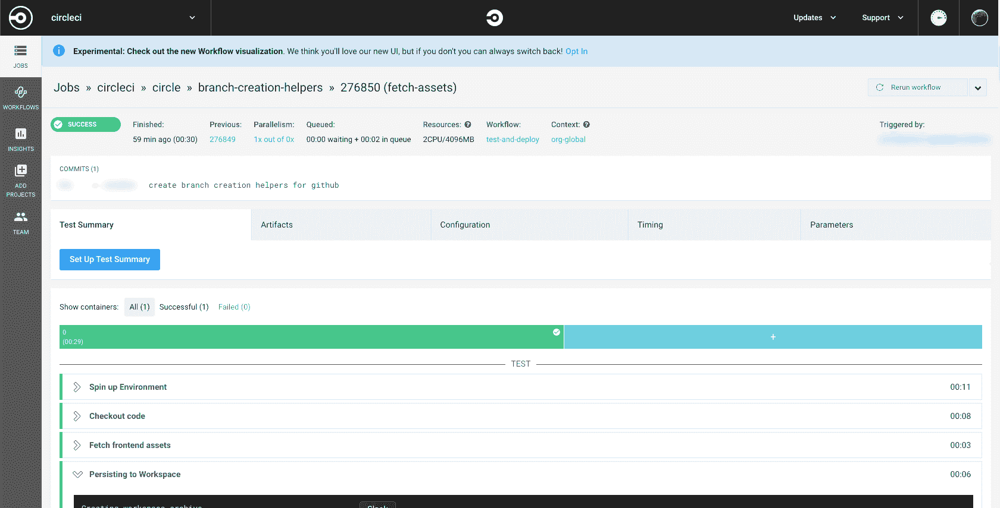
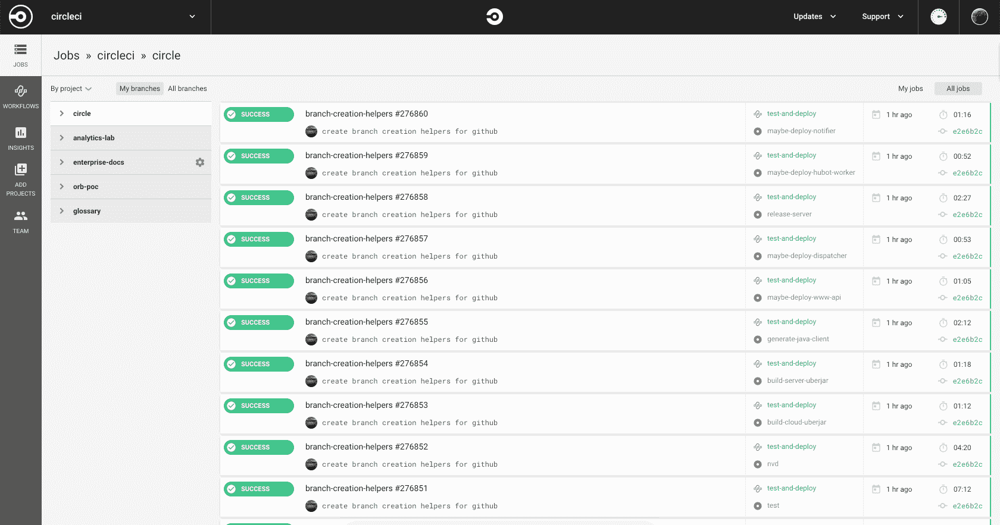

# 介绍我们重新设计的 UI | CircleCI

> 原文：<https://circleci.com/blog/introducing-our-redesigned-UI-built-for-increased-user-productivity/>

我们正在推出一个新的用户界面，它有一个以管道为中心的仪表板、一个改进的作业详细信息页面和一个更新的配置视图，以便于调试。在 2020 年春季面向所有用户推出之前，现在就选择试用新的用户界面！

* * *

在过去的一年里，我们的团队在广泛的用户反馈的帮助下彻底改造了我们的前端。到今年春天，我们计划让所有用户都使用我们的新 UI。

当我们构建新的 UI 时，我们不断地问自己，“这里要做的工作是什么？”或者说，我们用户的目标是什么，我们如何帮助他们实现这些目标？

为了寻找答案，我们进行了近 100 次采访，阅读了 12，174 份应用内调查回复(还在继续)，参与了大量 [CircleCI 讨论](https://discuss.circleci.com/)帖子和推文，并对我们的 MVP 替代方法[WAFL——架构良好、功能有限的](/blog/wafl-a-scalable-mvp-alternative/)进行了测试。

接下来是对新用户界面主要变化领域的概述，以及对这些变化背后的思考过程的解释。

## 为什么我们要重建用户界面？

旧的 UI 是为 CircleCI 1.0 的基于作业的世界和基于容器的使用模型而设计的。运行层次结构的不同级别之间的导航对于许多用户来说是混乱的。

但也许更重要的是，我们的代码库已经经历了这么多代开发人员和框架，以至于高速迭代变得越来越困难。即使是很小的改变也需要大量的时间。

因此，我们组建了一个团队，同时从用户体验和代码基础架构两方面着手。

## 用户界面的主要变化是什么？

CircleCI 用户要做的主要工作是定位和修复应用程序中的错误，同时还要做一项相关的工作，使每一个好的、经过验证的更改都能够无缝地发送给用户。这是一个大的、广泛的目标，我们只能通过将每个目标分解成具体的功能性工作(主要工作的实际需求)来实现它们，同时在我们的后端和 API 的约束下工作。

为了更好地支持用户在应用中最常见的目标，我们对用户界面进行了三大改进。

### 1.创建了一个以管道为中心的仪表板

对于与 CircleCI 仪表板交互的用户来说，三个最常见的目标是:

**1。从特定的 CircleCI 作业导航到该作业的最近一次运行。**

**2。从失败的运行导航到最近通过的管线运行。**

**3。快速检查手头的项目是否健康。**

当用户试图完成这三个目标时，我们以前的以工作为中心的仪表板产生了不必要的问题。

例如，如果您在一个工作流中有 20 个作业，而您组织中的其他用户经常运行他们自己的作业，那么运行将会很快分散，并且很难找到您正在寻找的确切的作业(在确切的运行中)。

也很难判断这个项目是否健康。比方说，每次运行中有 9/10 的工作通过。在旧的 UI 中，如果你看一下仪表板，它可能看起来像是一个非常健康的项目，而实际上每个管道(围绕这些作业的信封)可能都失败了。

我们的新用户界面包含了一个以管道为中心的仪表板。管道表示在您触发项目工作时运行的整个配置，它可能包括多个工作流中包含的多个作业。

通过将单个管道中的所有作业打包在一起，可以更容易地导航到您最近的运行或最近经过的运行。在一个项目中，扫描大多数运行是通过还是失败也更容易。

### 2.设计了更高效的工作详情页面

我们几乎所有用户的核心目标是找出特定作业失败的原因并修复它。为此，用户通常会直接导航到作业详细信息页面，找出问题所在。

当我们设计新的 UI 时，我们希望让用户更容易阅读任务的步骤输出或测试摘要，以便更好地识别错误的来源。以下是我们简化从作业详细信息页面查找和修复错误的一些方法:

*   **将标准输出或测试输出在页面上向上移动。**我们已经减少了 STDOUT 之前页面顶部的屏幕空间，这通常是用户识别错误来源所需的唯一信息。

*   删除不太相关和很少使用的信息。这包括排队时间、参数选项卡、计时选项卡、页面顶部的横幅等等。虽然数量有限的用户认为信息很重要，但绝大多数用户并不这样认为。

*   使 STDOUT 框跳转到输出的底部。大多数时候，用户需要的信息在 STDOUT 的末尾或接近末尾。这有助于他们更快地找到它。

*   包含对长标准输出框的屏幕高度限制。之前，我们注意到在观察用户会话时，一些用户会深入到 a STDOUT 中，以至于忘记了他们正在进行的步骤。限制 STDOUT 的高度可以更快地加载页面，并有助于使页面更易于管理。

*   **突出显示 Bash 命令和错误代码。** Bash 命令和错误代码现在可以在一个小灰框中找到，帮助用户快速区分。

*   **增加了一个弹出标签来全屏查看标准输出。**这有助于用户不受干扰地浏览，并在与他人分享时轻松链接到失败的步骤。

*   **在作业详细信息页面中添加了从失败重新运行。**以前，用户只能从作业页面重新运行整个工作流，而现在他们可以从失败的作业重新运行工作流。

*   **将选择工具默认设置为仅显示失败的并行运行。**用户很少查看通过的并行运行，因此我们决定让选择工具默认只显示失败的并行运行，以帮助用户更快地找到他们正在寻找的信息。

*   **从文件夹中取出未嵌套的工件。**我们看到许多用户点击多个文件夹来获得一个工件，有时当他们点击所有的工件时，忘记了他们需要哪个工件。开发人员喜欢 CNTL+F，通过解除构件嵌套，我们使他们能够直接使用它。

### 3.为调试重建了配置视图

我们在旧 UI 的 configuration 选项卡上确定了两个主要的用户目标:

1.  **配置选项卡上的主要用户目标是将最近通过的运行与最近失败的运行进行比较，以识别变化并调试错误。**这通常在管道列表中完成。
2.  第二个用户目标是在配置和输出之间创建一个思维图，并将预期结果与实际结果进行比较，以调试错误。这最好在工单详情页面完成。

因为用户依赖两个不同的位置来完成这些目标，所以我们将配置从 Job Details 页面上的选项卡更改为全屏、类似模块的视图，可以在新 UI 的任何级别打开。将来，我们还希望有一个“比较配置”功能，以便更直接地修复这些错误。

同样值得注意的是:用户几乎总是通过源配置(你写的)调试，很少通过编译配置(后处理)调试。

然而，Job Details 页面先前首先显示编译后的配置，下面的源配置是灰色的。我们在新的 UI 中完全改变了这一点。现在，在弹出的配置页面中，顶部有两个按钮可以将您的视图从源代码更改为已编译的，源代码设置为默认设置。这有助于用户轻松查看最相关的信息，并且无需滚动即可查看其源代码和编译后的配置。

## 准备好加入了吗？

在接下来的几个月里，我们将逐步向所有用户推出新的用户界面。

我们鼓励您选择测试新的用户界面，并在整个过程中与我们分享您的反馈。

您可以选择加入新的用户界面，方法是导航到任何支持管道处理的项目的作业详细信息页面，然后单击页面顶部的横幅:

—

在探索新的用户界面时，请向我们提供您的反馈！你可以发起 [CircleCI 讨论](https://discuss.circleci.com/)帖子、[tweet in me](https://twitter.com/Kate_Catlin)，或者[注册一个长达一小时的用户会议](https://docs.google.com/forms/d/e/1FAIpQLSetaFN3Mj7GcRtLslxGqmD5SLdIoJnvBGscgB15OMFwSDqpYw/viewform)。