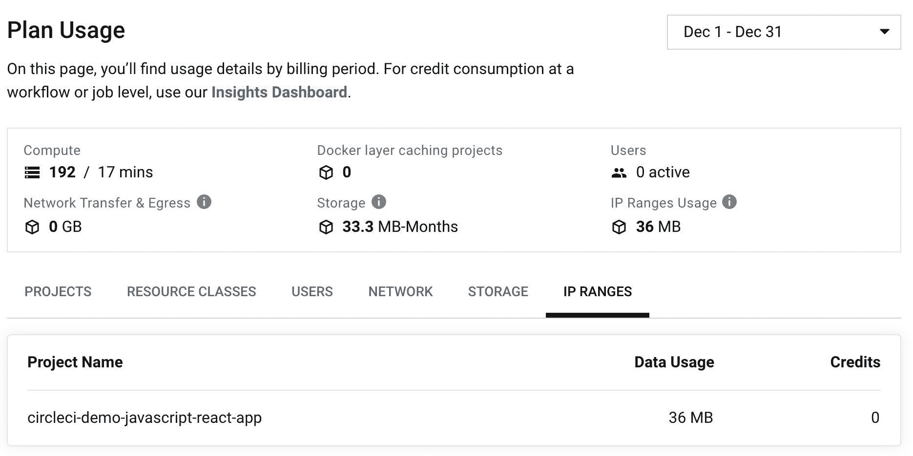

# IP 范围-更好的安全性，更大的信心| CircleCI

> 原文：<https://circleci.com/blog/ip-ranges-better-security/>

本文由 Sebastian Lerner 和 Radhika Gulati 共同撰写。

**注意:** *启用了 IP 范围功能的作业使用每 GB 数据需要 450 信用点。*

今天，我们宣布我们的[最受欢迎的功能请求之一](https://circleci.canny.io/cloud-feature-requests/p/ip-allow-list-for-builds)，IP 范围，现已面向 CircleCI 云客户全面开放。此功能通过限制与其基础架构通信的连接，使团队能够满足法规遵从性要求。

没有公司愿意让整个互联网访问他们的工件库或其他敏感环境。有了 IP 范围，团队就可以只对 CircleCI 开放基于 IP 的防火墙。

借助 IP 范围，使用 Docker executor 的[性能和规模计划](https://circleci.com/pricing/)中的客户可以通过与 CircleCI 可验证关联的 IP 地址路由作业流量。我们很自豪成为首批提供此功能的 CI/CD 平台之一。

> [了解更多关于我们定价计划的信息](https://circleci.com/pricing/)

## 更好的安全性，更大的信心

IP 范围功能允许 CircleCI 客户满足其基于 IP 的合规性要求，同时仍然受益于在 CircleCI 云上运行的强大计算和无缝作业编排。

当通过配置文件在 Docker 作业上启用 IP 范围时，CircleCI 会通过[文档](https://circleci.com/docs/ip-ranges/#listofipaddressranges)中列出的大约 30 个 IP 地址中的一个来重新路由任何传出的通信。这一特性让团队确信流向其私有环境的流量来自 CircleCI。

可能需要基于 IP 的受限访问的一些示例包括:

*   访问私有工件库
*   部署包含敏感数据的内部应用程序
*   从防火墙依赖性管理器中提取依赖性
*   在内部环境中运行测试用例

启用 IP 范围功能的作业所使用的每 GB 数据需要 450 个配额。要查看 IP 范围内的数据使用情况，请访问 CircleCI UI 中“计划使用情况”页面内的“IP 范围”选项卡。

## 了解有关 IP 范围的更多信息

查看[我们的文档](https://circleci.com/docs/ip-ranges/)了解更多有关如何在作业中启用 IP 范围的信息。访问 [Canny](https://circleci.canny.io/webhooks) 浏览或提交新想法，并前往我们的社区论坛[讨论](https://discuss.circleci.com/)，给我们关于 IP 范围的反馈。