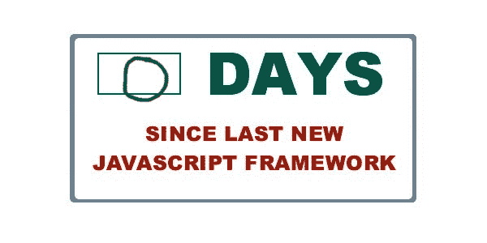

# 这真的是未来的 CircleCI

> 原文：<https://circleci.com/blog/it-really-is-the-future/>

上周我写了 [It's the Future](/blog/its-the-future/) ，一篇讽刺容器生态系统的文章，略微嘲讽了 Docker、Google、CoreOS 和一堆其他技术。很多 Docker 爱好者喜欢成为笑柄，但也有很多人喜欢和分享这一点，他们大喊“我告诉过你这都是废话”。

很容易理解为什么人们会认为容器生态系统是狗屎，正如我讽刺的那样。毕竟，乍一看并不清楚 Docker 是什么。这是容器化，类似于虚拟化，但又不完全是。它有一个 Dockerfile，有点像 Chef，但它与一个叫做 layers 的东西结合在一起，这个东西包含了一个奇怪的文件系统之类的东西。它解决了与 AWS、Heroku、VMware 和 vagger 类似的问题，但在每种情况下，它都略有不同，起初并不特别清楚，也不清楚为什么会这样。它有 27 个竞争版本的工具，你不能确切地说是什么，有着有趣的名字，如 machine 和 swarm 和法兰绒和 weave 和 etcd 和 rkt 和 kubernetes 以及 compose 和 flocker。这在某种程度上与新的、闪亮的微服务有关，但考虑到一开始保持单个服务运行是多么困难，这似乎是一个非常愚蠢的想法。在这一切之后，它有一种奇怪的邪教氛围，几十家初创公司和大公司都在竞争获得“开发者心智份额”，这可能有一天会以某种方式与金钱相关，这一切都非常 1999 年，肯定有某种 Koolaid 喝醉了。

看看整个 Docker 和 container 的事情，得出结论说都是扯淡，真的不是没有道理。

但事实并非如此。

这实际上是我们构建应用程序的未来。

## 为什么是仇恨？

许多对 [It's the Future](/blog/its-the-future/) 做出反应的人都认为它是 100%准确的，一点也不讽刺，并质疑围绕这整个容器的炒作。为什么？

Docker 和容器生态系统(以下简称“Docker”)正在采用应用程序开发人员世界的一系列标准，如虚拟化、面向服务的架构和操作系统，并以不同的目标和优势重新交付它们。当它这样做的时候，它引起了很大一部分开发者社区的愤怒:讨厌任何新事物的坏脾气者。

与你可能期望的相反，软件行业绝对充满了讨厌进步的人。这种人会在米开朗基罗完成后走进西斯廷教堂，宣称他们已经有了一幅完美的上帝的画像，他们更喜欢他们的天花板是白色的，反正壁画也没那么酷。

与此同时，大多数软件行业像高中生一样做决定:他们痴迷地查看自己圈子里的酷东西，可能会四处看看 Instagram 和脸书上有什么，然后盲目地跟随他们被带到的地方。围绕这些技术，他们形成了从众的小团体，甚至走得更远，围绕他们适合的技术利基来塑造他们自己的身份——他们甚至用他们的帮派颜色覆盖他们的笔记本电脑——并且讨厌和抱怨奇怪或不同的事情。

Docker 进入了那个世界:一种做几乎所有事情的新方式。它抛弃了关于操作系统、部署、ops、打包、防火墙、PaaSes 以及其他一切的旧规则。一些开发人员立即喜欢上了它，有时是因为它解决的问题等正当理由，有时是因为它是一个闪亮的玩具，允许他们在其他孩子使用它之前变得很酷。其他开发者讨厌它——他们说这纯粹是炒作；他们说，这和之前发生的事情没什么两样，我不明白为什么每个人都在谈论它——通常是出于部落原因，而不是理性原因。

所以对 Docker 的反应不一定是基于技术本身。大多数憎恨者对 Docker 解决重要和复杂问题的方法没有真正的反应。这主要是因为，如果您没有花时间扩展大型系统，这些问题是您可能不会注意到的。如果你不能直观而深刻地理解“牛不是宠物”的含义以及为什么它很重要，那么 Docker 和相关工具所做的许多选择对你来说都将是怪异和可怕的。

## 融合世界

Docker 处于两个学科的结合点:web 应用程序和分布式系统。在过去的十年中，我们在网络社区中一直在假装我们可以通过知道如何编码来构建网络应用程序。我们写了一些 HTML，一些 JavaScript 和一些 Rails，我们有一个网站。我们添加一些表单和一些处理程序，也许还有一个 API，我们就完成了:这足以推出一个产品，它可以获得牵引力、客户和收入，并改变世界！

与此同时，在过去的二十年里，分布式系统人员一直在做一些相当无聊的事情。他们试验了 CORBA 和 SOAP 等复杂的协议，并学习了如何处理 CAP 定理、时钟同步是如何不可能的以及两个一般问题等问题，这些问题对大多数人来说似乎主要是理论性的。那些问题和它们的解决方案对于那些仅仅试图用他们的知识来编写和使用 web 应用程序的人来说是相当无趣的。

但是有趣的事情发生了。Web 应用程序变得足够大，以至于它们开始需要伸缩。足够多的人来到了互联网上，网络应用程序不能再停留在一个 VPS 上，或者只是纵向扩展。当我们开始扩展时，我们开始在我们的应用程序中看到所有这些错误，这些错误有着有趣的名字，如“竞争条件”、“网络分区”、“死锁”和“拜占庭失败”。这些问题是分布式系统人员已经研究了很长时间的问题，这些问题的解决方案不仅困难，而且在许多情况下理论上是不可能的。

在这种可扩展性危机的早期，Heroku 发生了。Heroku 让水平扩展基础设施变得非常容易，让我们再次假装我们真的只是在制作简单的 web 应用程序。作为一个行业，我们为自己赢得了 5 年的假装和自欺欺人。

我们现在已经达到了这种自我错觉的极限，当我们从这种错觉中走出来时，我们发现自己正在尝试尽早构建可伸缩性，重新设计破碎的东西以便它们可以伸缩，并了解整体架构的缺点以及为什么使用单一数据库不会继续为我们工作。我们想出了诸如不可变架构、“宠物对牛”、微服务以及一整套最佳和最差实践的短语，试图使其中一些变得更容易。

此时，在此轮班期间，Docker 进来并试图解决许多问题。但是 Docker 没有告诉我们，我们可以假装不存在扩展的问题，我们可以继续以基本相同的方式做事，就像 Heroku 所做的那样，而是告诉我们，分布式系统从根本上来说就是我们一直在做的事情，所以我们需要接受它，并开始在这种模式下工作。现在，我们面对的不再是简单的 web 框架、数据库和操作系统，而是 Swarm、Weave、Kubernetes 和 etcd 等工具，这些工具不会假装一切都很简单，而是要求我们不仅要解决问题，还要深入理解我们正在解决的问题。

好处是，我们获得了构建可伸缩架构的能力，只要我们不假装我们可以抽象它。我们现在需要知道什么是网络分区，如何处理它，如何在 AP 和 CP 系统之间进行选择，以及如何构建能够在真实网络和机器的压力下进行扩展的架构。有时弗吉尼亚会有一场暴风雨，有时东西会着火，有时鲨鱼会咬到海底电缆，有时会有延迟，传递失败，机器会死亡，抽象会泄露。

一切都需要更有弹性，更可靠，我们需要承认这些是我们在开发应用程序时需要考虑的事情。我们需要这样做，不是因为它闪闪发光，或者因为它是一些神话般的最佳实践，而是因为像亚马逊、网飞和谷歌这样的人已经投入了 15 年的血汗和行业经验来解决这个问题，并告诉我们如何建立真正规模的系统。

## 真正的问题解决了

那么 Docker 到底在为我们解决什么问题呢？我们在构建 web 应用程序时所做的一切都是极其脆弱的，Docker 正在迫使我们保持理智:

*   到目前为止，我们一直将机器(DevOps 的 ops 部分)与应用程序(dev 部分)分开部署。我们甚至有两个不同的团队来管理应用程序堆栈的这些部分。这是荒谬的，因为应用程序依赖于机器、操作系统和代码，单独考虑它们是没有意义的。容器在开发者的工具包中统一了操作系统和应用程序。

*   到目前为止，我们一直在 AWS 和 Heroku 以及其他缺乏管理面向服务架构的真正工具的 IaaSes 和 PaaSes 上运行我们的面向服务架构。Kubernetes 和 Swarm 管理和编排这些服务。

*   到目前为止，我们一直使用完整的操作系统来部署我们的应用程序，以及它们带来的所有安全影响，而不是我们可以部署的绝对最小的东西。容器允许您公开一个非常小的应用程序，只有您需要的端口，甚至可以小到一个静态二进制文件。

*   到目前为止，在机器上线后，我们一直在摆弄它们，要么使用“配置管理”工具，要么多次将应用程序重新部署到同一台机器上。由于容器是由编排框架按比例放大和缩小的，所以只启动不可变的映像，运行中的机器永远不会被重用，从而消除了潜在的故障点。

*   到目前为止，我们一直使用的语言和框架主要是为单台机器上的单个应用程序设计的。面向服务架构的 Rails 路线的等价物以前并不存在。现在 Kubernetes 和 Compose 允许您指定跨服务的拓扑。

*   到目前为止，我们一直在按照 AWS 提供的规模部署大型虚拟化服务器。我们不能说“我想要 0.1 的 CPU 和 200 兆的内存”。我们不仅浪费了虚拟化开销，还使用了超出应用需求的资源。容器的部署需求要小得多，并且在共享方面做得更好。

*   到目前为止，我们一直在使用多用户操作系统部署应用和服务。Unix 的构建是为了让几十个用户同时在其上运行，共享二进制文件、数据库、文件系统和服务。这与我们构建 web 服务时所做的完全不匹配。同样，容器只能保存简单的二进制文件，而不是整个操作系统，这导致在应用程序或服务中需要考虑的事情少了很多。

## 唯一不变的是变化

我们的行业如此迅速地神化新的和令人兴奋的技术，以至于它不会等待这些技术成熟。Docker 正以令人难以置信的速度前进，这意味着它还没有接近稳定或成熟。我们有多种容器运行时间、图像格式、编排工具和主机操作系统选项，每种选项都有不同级别的效用、范围、吸引力和社区支持。

环顾我们这个行业的其他部分，事情不会变得稳定，直到它们变得陈旧和乏味。举个例子，在我们得到休息之前，有多少协议必须终止？我们在 SOAP 和 CORBA 的尸体上构建了 REST、AJAX 和 JSON，利用了我们在构建它们时学到的经验。在大约 10 年的时间里，这是两次重大的技术转变。然而，我们仍然没有为基于 REST 的 API 提供与十年前 SOAP 相同水平的工具，尤其是 SOAP 还没有完全消亡。

同样的事情也发生在前端，事实上很多人将我对 Docker 生态系统的模仿与前端开发中的狗屎秀相提并论。自从我们十年前逃离 Java 以来，编程语言也发生了同样的事情。一直以来，直到问题得到很好的解决，开发人员会不断提出新的解决方案。Docker 生态系统有大量的问题需要解决。

所以我们可以预期 Docker 还没有那么成熟。当你尝试它的时候，仍然会有许多边缘情况和奇怪的事情发生，当我们几年后回顾它们的时候，它的一些决定是奇怪的，实际上可能是完全错误的。最佳实践仍然需要不断尝试、失败、再尝试、再失败，直到我们把它们做好。

这将需要几年的时间，直到我们弄清楚所有这些事情，并安顿下来。但这并不意味着容器是废话，或者我们可以忽略它们。我们总是面临着这样一个选择:是继续使用我们已知的技术，还是跨越一步尝试新事物，吸取教训，适应、迭代和改进我们周围的行业。

如果你在找我，我会在未来。

***想动作快又不坏东西？[免费注册](https://circleci.com/signup/)软件团队喜欢使用的现代持续集成和交付平台。***

***你的防火墙后面需要牛逼的 CI/CD？[给我们留言](mailto:enterprise@circleci.com)或注册 CircleCI 企业的[30 天免费试用。](https://circleci.com/enterprise/)***