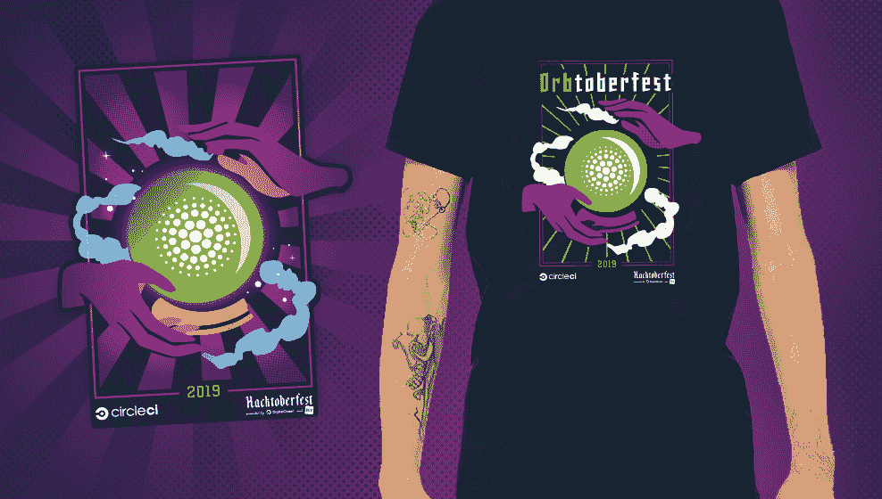

# Hacktoberfest 2019 -啤酒节| CircleCI

> 原文：<https://circleci.com/blog/join-the-party-get-your-hacktoberfest-prs-with-circleci-orbs/>

Hacktoberfest 是由 DigitalOcean 和 DEV 举办的为期一个月的开源软件庆典。它鼓励所有技能水平的个人通过在十月份完成开源项目的拉请求来参与开源软件。Hacktoberfest 对整个全球社区开放，关于活动的更多细节，如何参与，以及奖品，可以在[这里](https://hacktoberfest.circleci.com/#/)找到。

今年，CircleCI 将以我们自己的活动参与 Hacktoberfest，我们称之为#Orbtoberfest！我们甚至在派对上加入了自己的特别 Hacktoberfest 礼品。通过向球体捐款获得您的 Hacktoberfest PRs，并获得双倍奖励！

 *阅读规则，看看你能赢得什么[这里](https://hacktoberfest.circleci.com/#/)。*

 *CircleCI orbs 是开源的、可重用的配置包，可以帮助加快开发速度，并将您最喜欢的工具连接到您的 CI 管道。可重用的配置增加了一致性，减少了错误，并让开发人员轻松地将 CircleCI 与他们喜欢的工具集成:从[通信](https://circleci.com/developer/orbs/orb/circleci/slack)到[安全](https://circleci.com/developer/orbs/orb/snyk/snyk)到[部署](https://circleci.com/developer/orbs/orb/circleci/aws-serverless)。此外，创建 orb 既简单又有趣:任何能够编写 bash 脚本[的人都可以构建 orb](/blog/how-to-make-an-easy-and-valuable-open-source-contribution-with-circleci-orbs/) 。

从#啤酒节开始，在 Github 上找到标有`orbtoberfest`的问题，并发送您的 PRs。直接在 [GitHub](https://github.com/search?l=&o=desc&q=label%3Aorbtoberfest+state%3Aopen&s=comments&type=Issues) 上找到`orbtoberfest`问题或者询问[水晶球](https://hacktoberfest.circleci.com/)你下一步应该尝试什么！你可以在我们的 [Hacktoberfest 页面](https://hacktoberfest.circleci.com/#/)上浏览一些建议的问题，困难从更新文档到添加全新的功能。

您也可以[在我们的社区论坛](https://discuss.circleci.com/t/participate-in-hacktoberfest-on-circleci/32557/4)上加入讨论。

CircleCI 全体员工祝你黑客生涯愉快！

阅读更多关于 CircleCI orbs 的信息:*