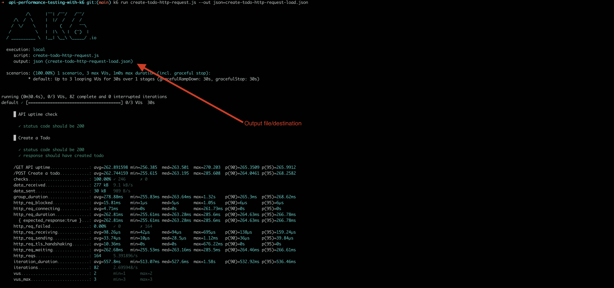
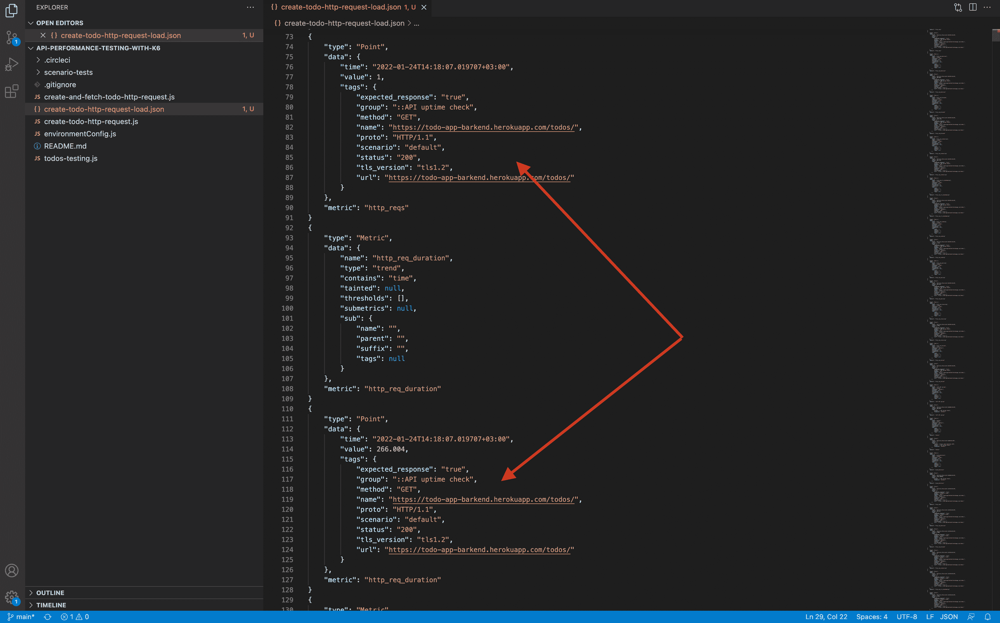
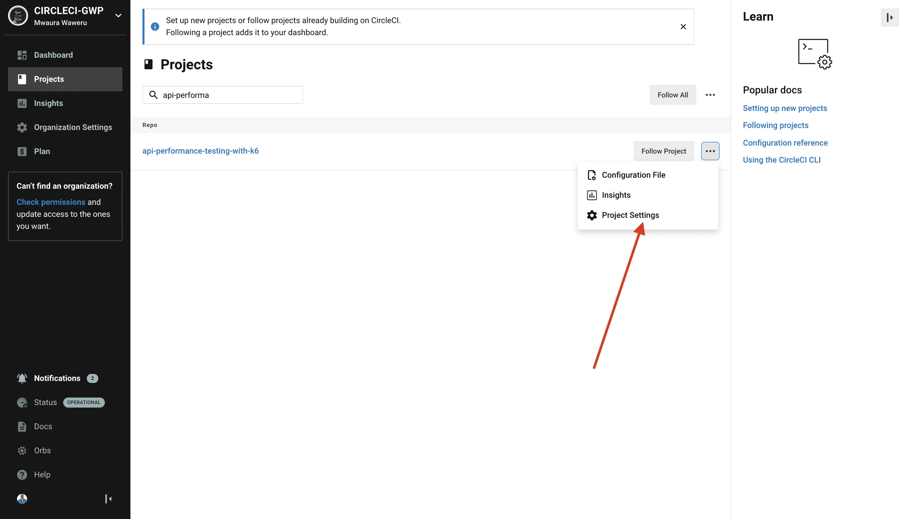
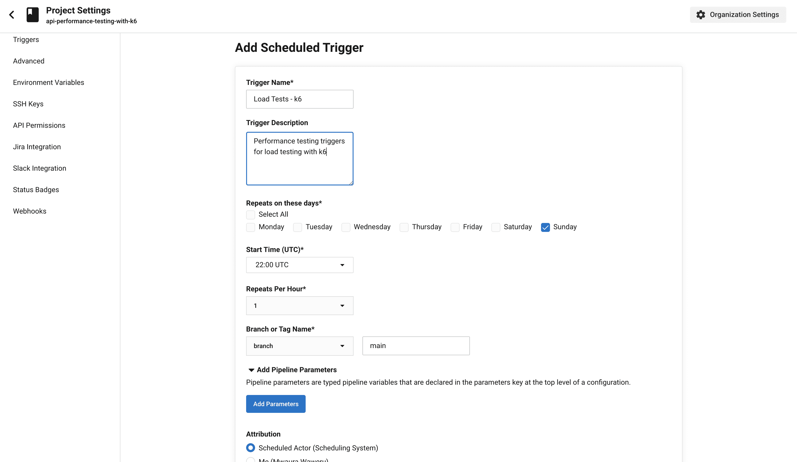

# 用 k6 | CircleCI 调度负载测试和持久化输出

> 原文：<https://circleci.com/blog/k6-results-output-and-scheduling-pipelines/>

> 本教程涵盖:
> 
> 1.  导出 k6 测试结果
> 2.  持续 k6 结果输出
> 3.  为负载测试安排 CI/CD 管道

在这个 k6 系列中，我已经用 k6 介绍了 [HTTP 请求测试，用 k6](https://circleci.com/blog/http-request-testing-with-k6/) 介绍了[性能测试。我设计这些教程是为了向你介绍 k6，并向你展示如何使用 k6 进行微服务的性能测试。作为 k6 系列的第三篇教程，这将涵盖如何在本地存储 k6 测试结果，以及如何使用 CircleCI 的](https://circleci.com/blog/api-performance-testing-with-k6/)[调度管道](https://circleci.com/docs/scheduled-pipelines/)特性来调度负载测试。

## 先决条件

要学习本教程，您需要:

1.  [JavaScript](https://www.JavaScript.com/) 的基础知识
2.  HTTP 请求和测试的基本知识
3.  您系统上安装的 [Node.js](https://nodejs.org) (版本> = 10.13)
4.  一个[圆](https://circleci.com/signup/)的账户
5.  GitHub 的一个账户

> 如果你还没有完成 k6 性能测试教程，我建议你在开始本教程之前完成。

本教程直接建立在“用 k6 进行性能测试”教程的基础上。你的第一步是[为教程](https://docs.github.com/en/repositories/creating-and-managing-repositories/cloning-a-repository)克隆的 [GitHub 库。](https://github.com/CIRCLECI-GWP/api-performance-testing-with-k6)

您可以使用以下命令克隆 GitHub 存储库:

```
git clone https://github.com/CIRCLECI-GWP/api-performance-testing-with-k6.git 
```

太好了！你已经准备好开始学习了！

## 持续 k6 结果输出

在使用 k6 进行性能测试的教程中，我介绍了如何将 k6 指标和日志输出到云中，以便整个团队进行分析和查看。在本教程中，我将引导您在运行测试的机器上本地持久化测试输出。

k6 提供了多个导出测试结果的选项，供您以后查看。支持 k6 导出的服务包括 Amazon CloudWatch、Apache Kafka、Influx DB、New Relic、Prometheus、Datadog 等。本教程重点介绍如何使用 JSON 输出获得相同的结果。

要在 k6 上运行外部测试结果输出，您需要定义`--out`标志。您在之前的教程中以稍微不同的方式完成了这项工作。在这种情况下，您将在之前克隆的存储库中为 Heroku API 运行一个简单的负载测试。

负载测试在 30 秒内运行多个虚拟用户。在 30 秒内，测试:

*   使用 API 创建多个`todo`项目。
*   确保每个 Todo 项都是使用应用程序端点创建的。

下面是这个测试的代码片段:

```
// create-todo-http-requests.js file
import http from 'k6/http';
import { check, group } from 'k6';
import { Trend } from 'k6/metrics';

const uptimeTrendCheck = new Trend('/GET API uptime');
const todoCreationTrend = new Trend('/POST Create a todo');

export let options = {
   stages: [
       { duration: '0.5m', target: 3 }, // simulate ramp-up of traffic from 0 to 3 users over 0.5 minutes.
   ],
};

export default function () {
   group('API uptime check', () => {
       const response = http.get('https://todo-app-barkend.herokuapp.com/todos/');
       uptimeTrendCheck.add(response.timings.duration);
       check(response, {
           "status code should be 200": res => res.status === 200,
       });
   });

   let todoID;
   group('Create a Todo', () => {
       const response = http.post('https://todo-app-barkend.herokuapp.com/todos/',
           { "task": "write k6 tests" }
       );
       todoCreationTrend.add(response.timings.duration);
       todoID = response.json()._id;
       check(response, {
           "status code should be 200": res => res.status === 200,
       });
       check(response, {
           "response should have created todo": res => res.json().completed === false,
       });
   })
} 
```

`create-todo-http-requests.js`文件中的第一个`group()`块运行正常运行时间检查，以验证 API 正在响应。另一个块创建`todo`项，并验证它们是否被正确创建。

您可以用命令`k6 run test-file`运行这个测试。因为我们想从这个测试中得到更多，我们将使用一个不同的命令。除了验证正确执行之外，我们还希望看到 JSON 文件中的执行日志。

为此，调用`--out outputFile.json`标志。这个标志确保您的测试响应以 JSON 格式记录。执行以下命令:

```
k6 run create-todo-http-request.js --out  json=create-todo-http-request-load.json 
```

该测试正常执行，但也会创建一个文件:`create-todo-http-request-load.json`。这个新文件包含该运行中所有测试的执行信息。

一旦 k6 在定义了测试度量输出的情况下执行，它就会记录该输出，并在测试执行时显示出来。



测试执行后，您可以打开输出文件，并在 JSON 文件中查看结果输出。



JSON 输出文件包含 k6 用来生成数据的指标。您还可以查看:

*   负载测试运行时发出的所有请求
*   请求的时间戳
*   执行每个请求所花费的时间

使用这些数据，您可以确定最慢和最快的响应，并识别瓶颈。这不仅让您更好地理解您的测试，而且生成的结果输出文件是永久的。这使得数据导出成为一种有效的方式，可以持久化数据以供以后查看，并将该运行与其他测试运行进行比较。既然您已经尝试了导出 JSON，那么您可以尝试导出其他文件类型，比如 CSV 或 XML。

## 使用 CircleCI 调度管道调度负载测试

执行负载测试需要时间，并且会占用大量系统资源。只有当没有用户访问您的系统时，或者当您知道对应用程序用户的影响很小甚至没有影响时，您才可能希望运行负载测试。另一种方法是建立一个模拟生产环境的并行负载测试环境。

作为 CI/CD 从业者，您知道资源将永远是一个限制因素，质量将永远是一个优先事项。这使得设置调度管道来运行负载测试成为一个很好的选择。

使用[调度管道](https://circleci.com/blog/using-scheduled-pipelines/)，您可以自动化运行负载测试的过程，以便它们只在您预计系统中用户数量有限时发生。

### 在 CircleCI 上设置预定管道

要将您的管道配置为按计划运行，请转到 CircleCI 仪表板并选择**项目设置**。选择项目。在这种情况下，使用`api-performance-testing-with-k6`项目。单击项目旁边的省略号(…)。



点击**触发**。

在触发页面，点击**添加预定触发**显示触发表单。


当您希望执行负载测试时，填写表单以添加执行负载测试的触发器。对于本教程，将触发器配置为每周在`22:00 UTC`的`Sunday`只执行一次。保存计划的管道。



您现在有了一个管道，它将每周运行一次，以确保您的负载测试正常工作。您可以根据需要编辑时间表。您可能会忘记执行您的负载测试，但是 CircleCI 总是会在您选择的准确时间为您执行。要了解更多关于计划管道如何帮助您优化开发时间和资源使用的信息，请阅读[计划持续集成管道的好处](https://circleci.com/blog/benefits-of-scheduling-ci-pipelines/)。

## 结论

在本教程中，我们回顾了如何使用 k6 运行负载测试，并添加了将测试指标导出到外部目的地。在这种情况下，它是一个 JSON 文件，但是您也可以将其导出为 CSV 或 XML。我们还介绍了创建调度管道来执行负载测试的过程。我们能够具体管理 CircleCI 管道执行负载测试的条件和时间。我希望这些信息对您团队的工作有所帮助。

通过完成本系列中的其他两个教程，以您所学到的知识为基础:

* * *

Waweru Mwaura 是一名软件工程师，也是一名专门研究质量工程的终身学习者。他是 Packt 的作者，喜欢阅读工程、金融和技术方面的书籍。你可以在[他的网页简介](https://waweruh.github.io/)上了解更多关于他的信息。

[阅读更多 Waweru Mwaura 的帖子](/blog/author/waweru-mwaura/)