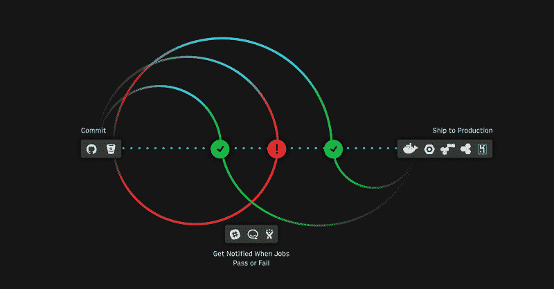

# 2.0 -持续集成工作流| CircleCI

> 原文：<https://circleci.com/blog/launching-today-circleci-2-0-reaches-general-availability/>

**来自出版商的说明:**您已经找到了我们的一些旧内容，这些内容可能已经过时和/或不正确。尝试在[我们的文档](https://circleci.com/docs/)或[博客](https://circleci.com/blog/)中搜索最新信息。

* * *

我们的使命是让团队尽最大努力。今天发布的 CircleCI 2.0 代表着在这条道路上前进了一大步。经过 5 年多的时间和 6500 多万次构建，我们对最有效的工程团队的工作方式有了更多的了解。他们很早就做出承诺，而且经常这样做，新想法会立即得到认可。他们可以迅速发现问题，甚至更快地解决问题。实现 CI/CD 可以让团队更快地发布更好的软件，让个人开发人员无所畏惧地开发代码和创新。随着 CircleCI 2.0 的发布，我们吸取了多年来与开发人员合作的经验，并为团队提供了他们一直要求的帮助他们更好地工作的东西:

**强大:**先进的缓存策略和灵活的资源分配加快了构建速度。通过使用 [SSH 访问和本地构建](https://circleci.com/blog/ssh-vs-local-jobs-two-forms-of-debugging-and-when-to-do-them/)快速排除故障和修复，加快构建周期并确保代码质量。

**灵活性:**无限制运行 CI/CD:在环境更新时不暂停工作。语言包容性让您的团队可以自由使用任何工具链或框架。

**控制:**使用[工作流](https://circleci.com/blog/introducing-workflows-on-circleci-2-0/)让团队将构建-测试-部署阶段作为单独的工作运行，允许团队完全定制他们的开发过程。

我们重新设计了我们的构建引擎，在速度和控制上都取得了很大的进步。在 CircleCI 2.0 测试版发布以来的 7 个月里，超过 4000 家组织已经在这个新平台上运行了 100 多万个版本。他们非常积极地宣传这极大地改进了他们的构建流程:

**“工作流+ [Docker 缓存](https://circleci.com/blog/how-to-build-a-docker-image-on-circleci-2-0/)在 CircleCI 2.0 中表现出色。我对我们能用这个做什么感到兴奋！在 CircleCI 上，我们的 Docker 构建时间已经从大约 12 分钟缩短到不到 2 分钟。太棒了。"——乔希·多佛，高级软件工程师，CrateJoy**

你可以在这里阅读更多关于早期 2.0 用户所说的[。](https://twitter.com/i/moments/877210697834184704)

但是我们还没有开发完。在这个基于云的软件产品的时代，一个好的产品是永远做不完的。CircleCI 2.0 也不例外。下一步是什么？对我们新定价的深入解释(现有用户注意:除非您升级您的计划，否则您的定价不会改变)，以及针对我们的移动和防火墙后客户的 CircleCI 2.0。

所以，在这里。本着持续发布、反馈和迭代的精神，我们渴望听到您对 CircleCI 2.0 的看法！请在此与我们[分享您的想法。](https://discuss.circleci.com/c/circleci-2-0)

最后，我们要特别感谢所有使用我们的测试版、提供了令人难以置信的反馈并帮助我们将 CircleCI 2.0 发展到现在的水平以及它将继续发展的团队。