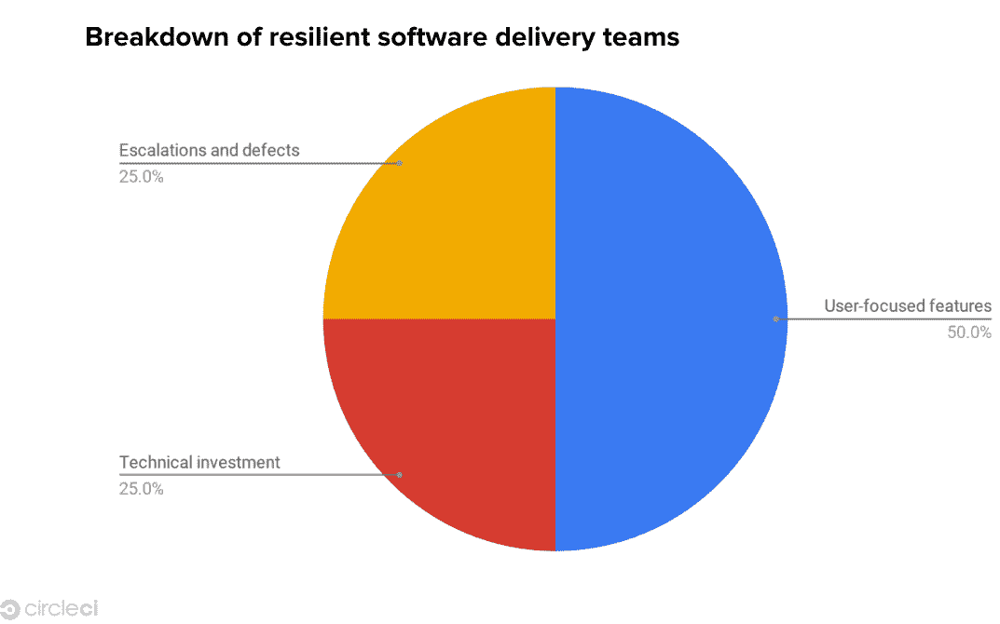

# 了解如何建立一个有弹性的软件团队

> 原文：<https://circleci.com/blog/learn-how-to-build-a-resilient-software-team/>

2020 年的过山车突出了运行良好的软件交付团队提供的竞争优势。在新冠肺炎来袭的那一刻，每个人都必须变得不仅是远程优先，而是仅远程优先，许多工程团队被迫考虑他们现有的手动流程的数量。突然间，他们不再依赖于某人的桌子下有一台构建机器的事实，如果那台机器有问题，他们可以重启它。突然间，他们需要自动化一切。

这种自动化的想法，即能够快速可靠地移动，不再是“拥有就好”，而是当今软件交付团队的核心职责。我有幸不仅领导了一家专注于向工程师交付价值的开发人员至上的公司，还目睹了成千上万世界上最好的团队如何将他们的代码从想法转移到交付。虽然我对如何最好地将自动化引入工程团队有很多强烈的意见，但很明显，最先进、最强大的自动化工具需要一个关键因素来取得成功:人。

对于企业来说，疫情的第一阶段是关于系统:更新和[建立你的技术栈](https://circleci.com/blog/rise-above-your-competitors-with-ci-cd-a-q-a-with-jim-rose-and-cack-wilhelm/)，这样你就可以完全远程操作。我相信下一个阶段将是团队和人。

**(听我们的播客第一集，[有目的的软件工程](https://www.youtube.com/watch?v=XMnNKjzfxm0)，Brad Henrickson 在自信提交。)**

## 经验教训:建立弹性软件团队

拥有一个足够大的团队来处理日常事务，同时能够创新，这是至关重要的。在一个用户期望和需求急剧增加的世界里，尤其如此。您需要足够多的个人贡献者来处理不断增加的维护和升级开销。如果你的团队太小，创新的步伐就会变慢。

保持软管中的压力——前进动力的感觉——对你的团队和你的客户来说都是至关重要的。你需要保持稳定的创新心跳。通过不断地回答社区的问题，您提供了一个一致的节奏和信心，相信正在取得进展。

弹性软件交付团队的分解应该是这样的:

*   你所做的 50%是针对以用户为中心的特性——你正在做的事情将会改善你的用户的生活。
*   25%集中在技术投资上—您需要做什么来维护您的系统？它会在哪里翻倒？
*   25%集中在升级和缺陷上——系统是否没有按照预期的方式运行？系统崩溃了，阻止用户构建吗？

随着您的系统变得越来越大，专门用于维护系统的时间自然也会增加。你必须扩大你的团队规模，以保持以用户为中心的工作比例。最终，团队变得太大，这时你就要把他们分成更小的小组。想想亚马逊的两个披萨法则。

虽然理想的团队规模将取决于经验、职责的总范围、随叫随到的负担等等，但 5 到 20 名代码贡献者是合适的目标。当然，在沟通和协调成本变高的情况下，有一个规模上限，但是您总是希望有足够多的开发人员来维护服务并继续创新它。

我认为，尤其是现在，更大的团队更好的另一个原因是，2020 年向我们展示了生活是如何阻碍我们最好的计划的。如果你的团队太小，有人去长期休假，有紧急情况，或者只是需要休息，你就没有足够的火种来让火继续燃烧。

你想让你的团队有足够的人手来应对生活的冲击。

## 分布式团队呢？

如果构建弹性团队总体上很难，那么构建弹性分布式团队就更难了。当我们分布在不同的地点和时区时，所有团队面临的许多挑战都会加剧。建立和领导团队的最有效的方法就是不容易应用。这意味着作为领导者，我们经常需要更有创造力。

根据我的经验，成功的领导者专注于建立结构和支持联系、沟通和协作。

作为人类，我们努力与一个更大的目标联系在一起，但我们也想感觉与周围的人联系在一起。当我们在视频通话中以像素的形式或在聊天应用程序中以图标的形式与人互动时，我们很容易忘记屏幕的另一端也有人。首先也是最重要的，我们需要对我们的队友是谁感到好奇，并知道是什么驱使他们。

作为领导者，我们也有责任确保团队中的每个人都清楚自己的期望。当您的组织处于高速增长模式时尤其如此。几年前，CircleCI 的工程团队逐年增加一倍，并变得更加全球化。相反，管理团队小得令人难以置信。在所有这些增长之后，我们在发展我们的工程文化方面遇到了挑战。我们的知识非常孤立，我们需要找到一条前进的道路，让我们能够扩展业务。

因此，我们创建了一个[工程能力矩阵](https://circleci.com/blog/7-steps-to-building-an-engineering-competency-matrix/)，它融入了我们所做的一切。从招聘到结构化反馈，再到绩效评估，它帮助我们让每个人都遵循相同的标准，并在我们扩展时明确预期。

协作也很重要。使用[分布式团队](https://circleci.com/blog/building-strong-distributed-teams-one-pixel-at-a-time/)，很容易意外地开发出按时区划分的“子团队”。避免这种情况的一种方法是鼓励跨时区工作，即所谓的“乒乓”配对。乒乓配对在原理上类似于传统的配对编程，但却是异步的。

为了便于乒乓操作，我们发现以下方法很有用:

*   将我们正在进行的工作限制为 3 张卡。这鼓励我们在开始任何新的事情之前寻找已经在进行中的票。
*   尽快发布进行中的拉请求(PRs)。很自然地，除非有人正在积极地处理某项任务，否则任何人都应该能够通读 PR(和其他相关的沟通)并继续处理它。
*   移交正在进行的工作。无论是在空闲时间异步进行，还是在人们的工作时间发生重叠时进行视频通话，尤其是在一天的边缘，一个人的一天即将结束，而另一个人的一天刚刚开始。

归根结底，您的平台或服务以及技术的弹性当然依赖于良好的 CI/CD 实践、基于云的监控、测试和其他 DevOps 流程。但是人的因素是必不可少的。

当你开始看到性能滞后时，那就是疲劳。作为商业领袖，我们有责任创建有弹性的系统和团队，无论是现在还是将来。创建一个高效的软件交付团队的最重要的组成部分之一是优先考虑运行它的人。

如果你想了解更多关于建立一个弹性软件团队的信息，请查看我们的 [2020 年软件交付报告](https://circleci.com/resources/2020-state-of-software-delivery/)。

*本文最初发表于[DevProJournal](https://www.devprojournal.com/software-development-trends/learn-how-to-build-a-resilient-software-team/)T3*