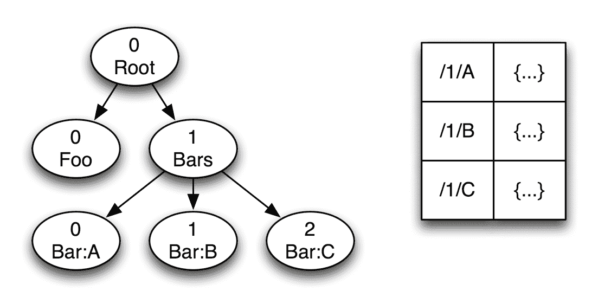
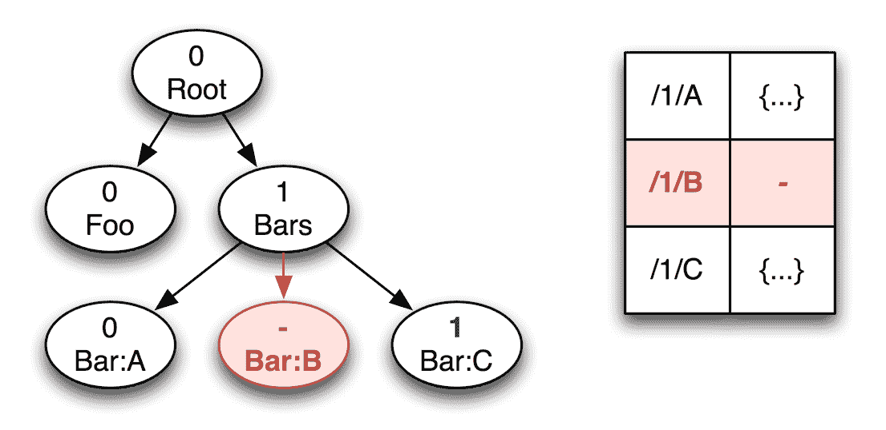

# 地方政府，全球关注- CircleCI

> 原文：<https://circleci.com/blog/local-state-global-concerns/>

**来自出版商的说明:**您已经找到了我们的一些旧内容，这些内容可能已经过时和/或不正确。尝试在[我们的文档](https://circleci.com/docs/)或[博客](https://circleci.com/blog/)中搜索最新信息。

* * *

CircleCI 最近的[开源前端](https://github.com/circleci/frontend)是使用 Om 在 ClojureScript 中构建的。将 Clojure 的功能原语和 React 的编程模型结合起来，可以产生一种独特的强大的用户界面方法。以前复杂的功能，如[高效的撤销](http://swannodette.github.io/2013/12/31/time-travel/)，实现起来变得非常简单。简单的版本变得更加强大。您不仅获得了高效的撤销，还获得了序列化应用程序的整个状态以进行检查、调试或重新加载的能力！虽然快照应用状态的承诺从一开始就是 Om 故事的一部分，但我们一直在努力将这个概念从想法变成现实。

## 新优势，新成本

和任何新技术一样，也有一些问题需要解决。使用 Om 拍摄快照需要避免使用组件本地状态。CircleCI 的前端设计时就考虑到了这一约束，精心安排所有组件将它们的状态存储在一个全局数据结构中。作为这种努力的回报，我们得到了强大的调试工具:保存和恢复完整应用程序状态的能力。但是代价是什么呢？组件本地状态是 React.js 的一个重要特性，支持对单个组件进行本地推理。在共享应用程序状态数据结构上敲打的组件可以呈现与全局变量相同的风格。幸运的是，我们可以恢复 React 的本地状态设计的好处，而不牺牲我们强大的新全局调试工具。请继续阅读，找出方法。

## 组件本地状态

著名的 react[diffs virtual DOM](http://calendar.perfplanet.com/2013/diff/)为真实的浏览器 DOM 产生一个最小的批量变化集，它把它当作一个“外部”服务。很少有人理解，从概念上讲，React 也将一组变化应用于另一个外部服务:组件状态图。这个状态图是一个全局可变字典，它保持了组件局部状态的假象。正如我们说一个组件被“装载”到浏览器的 DOM 上，它的状态也被装载到状态图上。类似地，当一个组件从浏览器 DOM 中卸载时，它的状态必须从状态图中卸载。我们的目标是将组件状态装载到我们的全局应用程序状态中，而不是 React 的私有状态映射。要做到这一点，我们必须更多地了解 React 是如何工作的。

当 React 呈现函数返回 DOM 树时，这些节点表示潜在的有状态组件。为了将返回的无状态树与有状态后备存储相关联，我们需要通过组件 id 连接这两个数据集。为了减轻程序员手动分配和管理 id 的负担，React 通过组件树的路径计算 id。考虑这个例子 DOM 和相应的状态图:

DOM 中的每个节点都标有子索引和组件类型。“Bar”类型的节点也标有区别键(A、B 和 C)。假设只有 Bar 类型具有组件本地状态，右边的状态表将组件 id(路径)映射到它们的私有状态图。默认情况下，在路径中使用子索引，但是程序员可以用键覆盖它，这样当子索引来来去去或者简单地重新排序时，路径就稳定了。想象一个 todo 任务列表，其中服务器提供的 task-id 作为显式键:重新排序任务不应该混淆它们的完成状态。例如，让我们重新渲染没有中间的酒吧节点。

颜色表示计算的差异:ID 为“/1/B”的“Bar:B”节点及其对应的状态表条目已被删除。请注意，“Bar:C”已被重新编号，但显式键意味着“/1/C”ID 是稳定的。与传统的面向对象的小部件库不同，我们可以从根重新呈现，并依靠框架机器来为我们管理状态图。添加一个新的有状态子节点的工作方式类似，但是当一个 ID 被新添加到状态图中时，组件类型可以提供默认的状态值。从这个角度来说，传统的 addChild 和 removeChild 方法无异于用 malloc 和 free 进行手动内存管理！如果我们放弃 React 的组件本地状态，除了与不协调的全局变量相关的典型问题之外，我们还会承受手动 ID 管理的负担。

## 从工具到调解

组件状态的封装支持对单个组件进行有用的本地推理。不幸的是，封装经常会阻碍诸如自省和检测之类的全局关注。Om 的许多妙招，包括快照调试，都依赖于应用程序状态的统一外部表示。

React.js 正确地封装了状态，既有利于本地推理，也保护了 diff 引擎的不变量。与所有优秀的调试工具一样，React 开发工具打破了这种封装，让你窥视原本封闭的组件内部。检测对象以观察封装的数据通常是无害的，但是改变封装的数据是非常危险的。我们 Clojure 程序员知道我们可以用不可变的值做得更好。别名状态值不可能与 diff 引擎的不变量相冲突:不可变的值不会改变！这意味着我们可以安全地将组件本地状态挂载到我们的全局应用程序状态中。

带着不变的价值观和对强大调试工具的渴望，Om 的创造者大卫·诺伦写道[摘下眼罩](http://swannodette.github.io/2014/02/27/taking-off-the-blindfold/)。Om 为检测每个组件提供了面向方面的钩子。David 没有提到的是，他的钩子支持调解和插装。通过拦截组件接口上的所有操作，无论是公共的还是私有的，仲裁使我们能够全局地增强所有组件的行为。通过重写 get-state 和 set-state！，我们可以重用 React 的 ID 管理和抽象状态接口，但是我们可以将状态值重定向到我们的全局应用程序状态！

## 诉讼中的国家调解

这是 CircleCI 前端的样子:

通过对 React diff 引擎和它的状态服务之间的所有请求进行仲裁，我们有效地替代了我们自己的状态服务。我们的状态服务只是将组件本地状态装载到应用程序状态数据库中，这只是存储在普通 Clojure 原子中的一个值。CircleCI 前端在 [frontend.state-graft 名称空间](https://github.com/circleci/frontend/blob/04a70704dec726455c5843200c10b8516b13d82c/src-cljs/frontend/state_graft.cljs)中实现这个状态仲裁。因此，我们可以拥有组件状态封装蛋糕，也可以吃掉全局状态值。

## 摘要

Om 撤销演示风格的快照在开发和调试中非常有用。我们可以保存和恢复应用程序状态，以便更快地迭代和重现错误。这种能力以前与组件本地状态不一致。既然组件本地状态被安装到了全局应用程序状态上，我们就可以普遍地依赖这些调试工具，而不会牺牲组件本地状态的独立推理优势。

这项技术解决了 Om 模型中的一个难题。Circle 团队已经解决了该解决方案实施中的问题。David Nolen 致力于在不久的将来向所有 Om 用户提供这些改进。请继续关注他的[推特消息](https://twitter.com/swannodette)，了解这方面的最新进展。

感谢 Sean Grove、David Nolan 和 Cheng Lou 审阅本文的草稿。