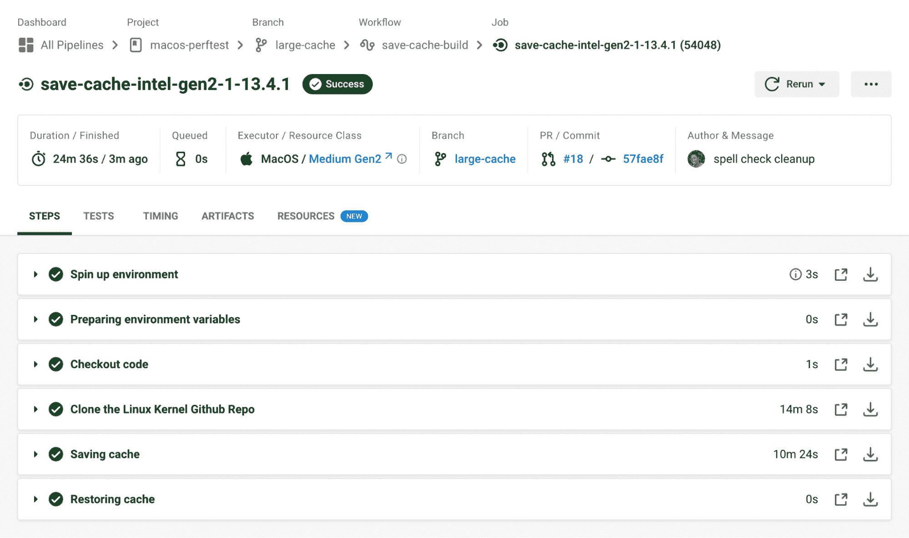
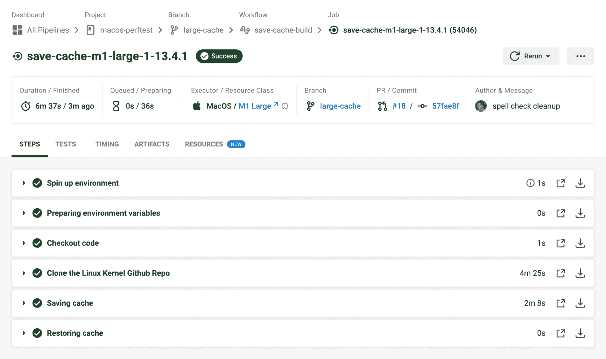

# 基于苹果芯片构建，M1 支持 CI/CD 管道

> 原文：<https://circleci.com/blog/m1-mac-resource-class/>

全球的苹果开发者利用 CircleCI 的大量 macOS 资源来快速构建、测试和部署软件。今天，CircleCI 推出了其首个 M1 资源，为客户提供破纪录的构建速度，将他们的软件交付提升到一个新的水平。最新增加的 M1 大型资源满足了对方便、云托管的苹果芯片支持的快速增长的需求，并帮助开发团队跟上苹果硬件创新的步伐。

作为一流的 CI/CD 平台，CircleCI 致力于为 Apple 社区配备顶级工具，帮助更快地将产品交付给最终用户。请继续阅读，了解 CircleCI 上 M1 的更多细节，以及如何在 M1 的基础上推动项目进入苹果开发的未来。

## 加速 iOS 与 M1 建立管道

2020 年，苹果推出了一套 Mac 笔记本电脑，里面有一个特别的惊喜——一个为实现最佳效率而构建的 M1 芯片。自首次亮相以来，Apple silicon 就兑现了其提供卓越速度和性能的承诺。

M1 的效率源于其标志性的“片上系统”，该系统将各种组件(包括 CPU、GPU、RAM 和 Secure Enclave)统一到一个处理器中。M1 的简化内存架构允许处理器组件利用中央数据池，消除了在每个组件之间复制数据所用的时间。随着效率的飞跃，可以有把握地说未来是以硅为基础的。

## M1 给 iOS 开发者带来的好处

**更方便的端到端测试，包括 GPU 测试:**自动化测试是[持续集成/持续交付管道](https://circleci.com/blog/what-is-a-ci-cd-pipeline/)不可或缺的一部分，因为能够快速自信地构建和部署有效的代码至关重要。测试 macOS 和 iOS 平台的最大挑战之一是针对游戏和虚拟现实应用等 GPU 密集型应用的图形处理单元(GPU)测试。

以前，在 macOS 平台上有效运行自动化 GPU 测试的唯一方法是使用一个[专用主机](https://circleci.com/blog/dedicated-hosts-for-mac-os/)。一些开发人员通过在本地 GPU 设备上进行测试来解决这一限制，但在 CI 管道中执行自动化 GPU 测试可以实现更频繁、一致的测试，从而更好地了解最终用户体验。

CircleCI 的 M1 资源包括硬件加速，将通常由运行在 CPU 上的软件完成的任务转移到 GPU，以加快处理时间。例如，由 CPU 处理时可能看起来不稳定的 3D 渲染任务在由 GPU 执行时会看起来不稳定。这有助于在管道内进行快速、有效和流畅的 GPU 测试，提供关于应用程序内视觉效果的快速反馈，并有助于在发布更新之前最大限度地减少破坏性更改。

**提高构建速度以获得更好的产品体验:**说到提供高质量的产品体验，速度就是游戏的名字。为了建立忠诚度和信任度，工程团队必须在几分钟之内向客户交付增强功能和错误修复。在基准测试中，M1 将 macOS 的工作速度提高了 2 倍，为构建速度设立了新的标准。这对 iOS 团队尤其有用，因为它加快了应用商店的审核过程，有助于应用更快地获得批准和发布。向应用商店提交和重新提交花费的时间越少，就有越多的时间可以用来编写重要的代码。

## M1 计算如何提高构建速度

下面是一个作业示例，该作业将一个大型存储库(约 4GB)的克隆下载下来，然后保存并检索缓存。



在英特尔硬件上，这项工作需要将近 24 分钟。克隆存储库和保存缓存的步骤占了总构建时间的大部分。下面是在我们的新 M1 资源上运行的相同作业的示例。



在 M1 上，同样的工作不到 7 分钟就完成了，几乎是在英特尔硬件上运行所需时间的四分之一！请注意，性能结果将因工作流程而异。

## 如何在 CircleCI 管道中使用 M1 资源类

使用 M1 构建需要对 CircleCI 上的配置文件进行简单的更新。下面是一个配置示例供参考:

```
# .circleci/config.yml
version: 2.1
  jobs: # a basic unit of work in a run
    build-and-test: # your job name
macos:
  xcode: 13.4.1 # indicate your selected version of Xcode
resource_class: macos.m1.large.gen1
steps: # a series of commands to run
  - checkout  # pull down code from your VCS
  - run: bundle install
  - run:
      name: Fastlane
      command: bundle exec fastlane $FASTLANE_LANE
  - store_artifacts:
      path: output
  - store_test_results:
      path: output/scan

    workflows:
      build-test:
jobs:
  - build-and-test 
```

这个配置使用`resource_class`键来指定`build-and-test`作业应该使用`macos`执行程序的 M1 大型实例。注意，您还可以决定在您的构建中使用哪个版本的 Xcode 。

## 与 M1 合作对我的 iOS 渠道意味着什么？

苹果在从基于英特尔的 M1 芯片转向基于 Arm 的芯片方面的大力投资表明，最终苹果的所有开发都将在苹果芯片上运行。在 CircleCI 为 Mac 建造的团队可以通过在他们的管道中建造 M1 来保持领先。下面，我们将回答一些从 Mac 社区听到的常见问题。

**我能在 M1 计算平台上为英特尔构建吗？**在 M1 上测试英特尔应用可以通过添加一个安装 Rosetta 的步骤来轻松完成，Rosetta 是一个通用软件工具，它使 M1 Mac 能够使用为英特尔 Mac 构建的应用。关于这样做的例子，你可以参考我们 macOS orb 的 [PR。](https://github.com/CircleCI-Public/macos-orb/pull/46/files)

M1 将在 CircleCI 上计算多少成本？你可以在我们的[定价页面](https://circleci.com/pricing/)上找到 M1 的定价，以及 CircleCI 的所有其他 macOS 资源。

## 结论

在 CircleCI 上构建和测试苹果应用程序的下一代已经到来。从简化端到端测试到加快上市时间，M1 可以帮助世界各地的工程团队交付高质量的应用，并以最高的效率扩展开发人员的运营。

M1 目前在[规模计划](https://circleci.com/pricing/)中可用。在我们的[文档](https://circleci.com/docs/using-macos/)中了解更多关于 CircleCI 对 macOS 的全面支持。