# 使用 PractiTest orb | CircleCI 管理自动化测试数据

> 原文：<https://circleci.com/blog/manage-test-data-with-practitest/>

CI/CD 工具提供的软件测试数据是有价值的，但是它并不总是足够全面，不足以给管理者提供他们需要进行改进的洞察力。为了做出有效的商业决策，管理人员需要了解整个测试过程，这将有助于他们理解需要做什么以及如何做。

一些可视化工具提供了编辑自动化脚本和添加 REST API 调用来报告运行和结果的选项。这些工具可以在以后以更全面的方式可视化您的测试数据和结果。但是添加这些 API 调用可能需要大量的工作，这些工作可能不适合您的组织工作流和优先级。此外，这并不能满足对你的总体 QA 工作的整体观点的需求。

在本教程中，您将学习如何通过将测试数据从您的 CI/CD 管道导出到[practice test](http://www.practitest.com?utm_medium=referral&utm_source=circleci&utm_campaign=blog&utm_content=&utm_term=2022)来获得对您的整个测试操作的更大可见性，包括您的自动化测试。

## 直接向 PractiTest 获取有价值的测试数据

PractiTest 是一个端到端的测试管理工具，能够向您展示您想要了解的关于整个测试操作的一切，包括:

*   执行进度运行图
*   测试运行时报告
*   基于运行的报告
*   更多

对于 CI/CD 用户，PractiTest 创建了鞭炮工具。based 自动将 XML 测试结果转换成 PractiTest 中的测试，让您动态地组织数据，并基于您的测试数据创建可定制的仪表板图形和报告。

有了[practist 鞭炮球](https://circleci.com/developer/orbs/orb/practitest/firecracker)，CircleCI 用户可以轻松地将 practist 集成到他们的管道中。通过将 orb 添加到您的 CircleCI 配置中，所有运行结果都将被填充到 PractiTest 中，您将获得整个测试过程的完整动态视图。这不需要对自动化脚本进行任何代码更改。

## 先决条件

要学习本教程，您需要:

## 入门指南

在 PractiTest 中，创建一个 API 令牌。我们建议使用个人 API 令牌，该令牌可以由帐户所有者启用，并且可以在个人设置页面上找到。

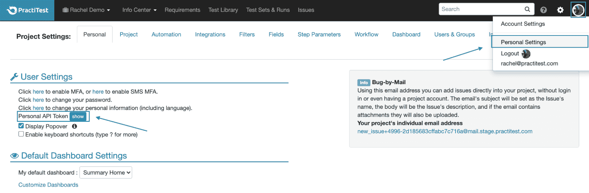

在您的 CircleCI 设置中，创建一个[上下文](https://circleci.com/docs/contexts/)，并将其命名为`PT API Token`(确保使用与此处显示的名称完全相同的名称)。添加一个名为`FIRE_EMAIL`的环境变量，并将您的电子邮件作为值(这将是测试人员的电子邮件，它将在稍后的 PractiTest 运行中出现)。然后添加另一个名为`FIRE_API_TOKEN`的环境变量，并将您之前检索到的 PractiTest API 令牌作为值。

## 将 PractiTest 添加到您的持续集成工作流

在这个例子中，我们将在 GitHub 中使用一个非常基本的测试项目，我们将把它添加到 CircleCI 管道中。鞭炮 orb 将向 PractiTest 报告所有的运行和结果，在这里您可以创建高级的、可定制的测试结果显示。

首先，分叉[示例 GitHub 项目](https://github.com/PractiTest/circleci.test)。接下来，登录您的 CircleCI 帐户。在项目页面上，找到名为`circleci.test`的新分叉的 PractiTest 项目，并按**设置项目**。选择项目报告中提供的现有配置。如果您收到一条错误消息，指出您需要为您的帐户启用第三方 orb，您可以在组织安全设置中这样做。

接下来，从下拉列表中选择主分支，并按下右上角的**编辑配置**。

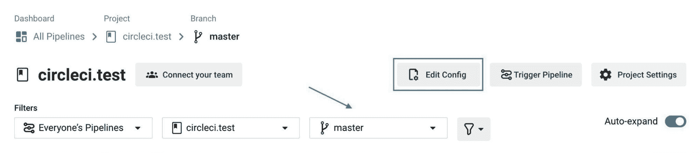

如果因为 orb 中的参数尚未定义而收到错误消息，可以忽略它。在配置文件中，您可以找到用于修改 PractiTest 集成的参数。

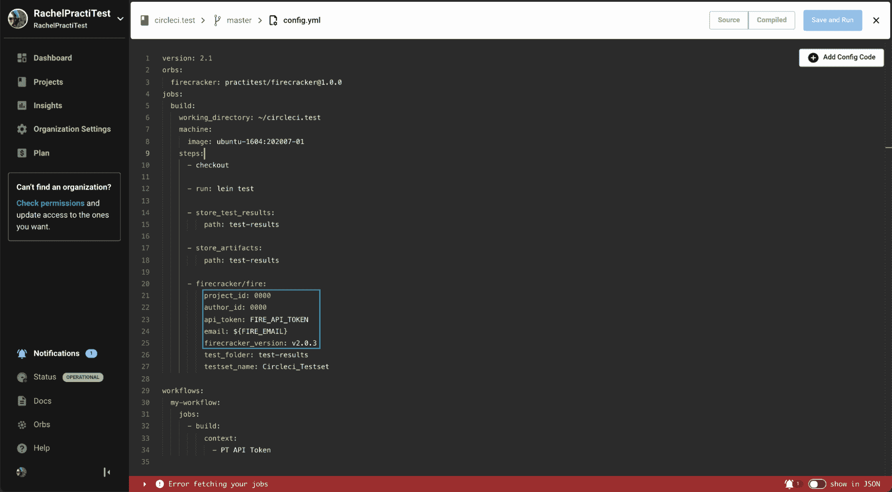

让我们从所需的参数开始:

*   `firecracker_version`:确保你使用的是最新的[鞭炮罐版本](https://github.com/PractiTest/practitest-firecracker/releases)号。
*   `author_id`:您可以在**个人设置>下的网址中找到测试运行人员的 PractiTest 用户 ID，点击此处更改您的个人信息**。复制 URL 中的四个数字并粘贴为`author_id`。
*   `api_token`和`email`:这些将由您在先决条件部分创建的上下文自动定义。
*   `project_id`:要找到你想要结果报告的项目的 ID，进入 PractiTest 中的需求、测试库、测试集&运行或发布模块。`/p/`后面的四个数字是项目 ID。
*   `api_uri`:如果您的 PractiTest 账户在欧盟数据中心，请在此参数中添加`https://eu1-prod-api.practitest.app/`。

其他参数，如`testset_name`，将定义结果在 PractiTest 中的显示方式，但现在我们将保持它们不变。

按下**保存并运行**。CircleCI 将自动构建示例项目，并用测试结果更新 PractiTest。要在 PractiTest 中找到结果，请转到测试集&运行模块。您将看到一个名为`Circleci_Testset`的新测试集，如配置中所定义的。

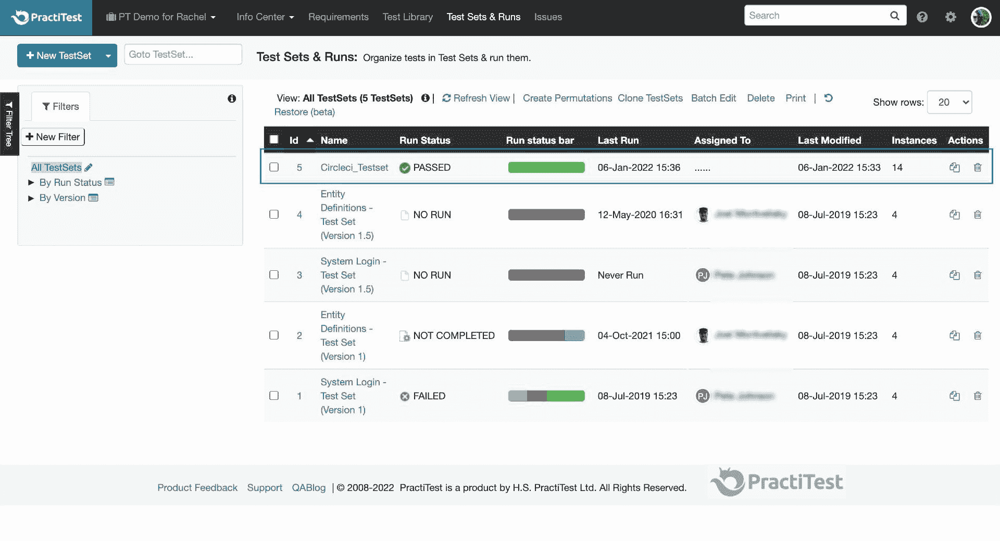

在测试集中，您将看到从这个构建中报告的测试以及每个测试和步骤的结果。

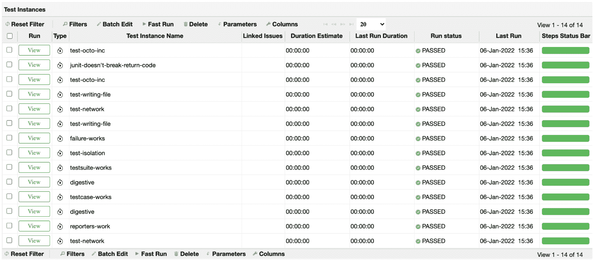

万岁！你已经完成了运行爆竹球的基本步骤。在 PractiTest 中，您可以使用仪表板和报告以各种方式显示您的测试数据。在本教程的后面部分，您将会看到一些这样的例子。首先，让我们看看在 CircleCI 测试失败时会发生什么。

## 在 PractiTest 中记录测试结果

一旦您将鞭炮 orb 添加到您的管道中，对项目代码的每一个更改都会自动触发 CircleCI 创建一个新的构建并用结果更新 PractiTest。

例如，转到 GitHub 中的项目，打开测试文件夹，通过将 end `is`语句更改为`{:pass 1, :fail 1, :error 3}`来编辑名为`test_report`的 CLJ 文件，使其失败。然后提交您的更改。

如果你回到 CircleCI，你会看到它正在运行，但是这一次构建会因为测试失败而失败。在 PractiTest 中，您将看到相同的测试集现在处于“失败”状态。

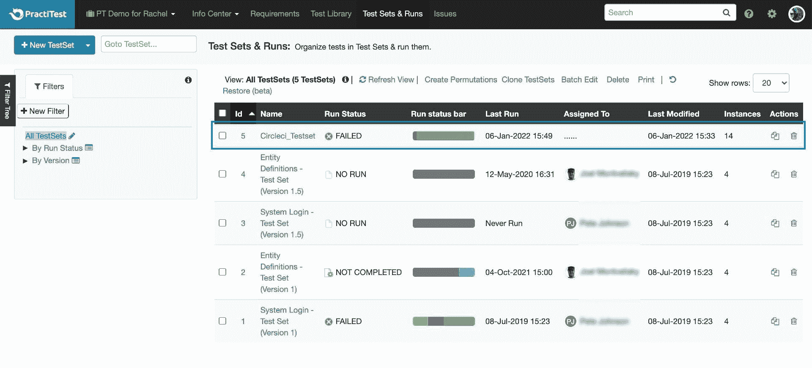

您可以打开测试集来查看失败的确切实例。

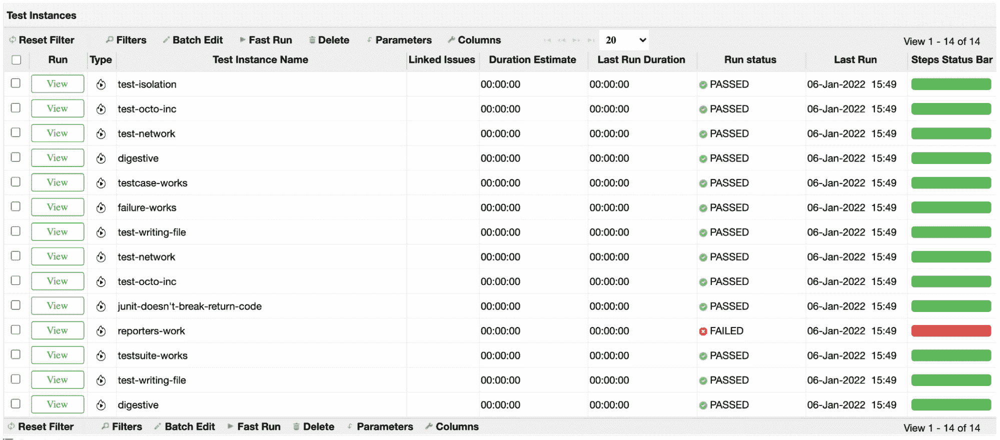

如果打开实例，您将看到两次运行:第一次通过了，第二次失败了。通过单击失败的运行，您可以查看有关此特定运行的结果以及失败原因的更多信息。

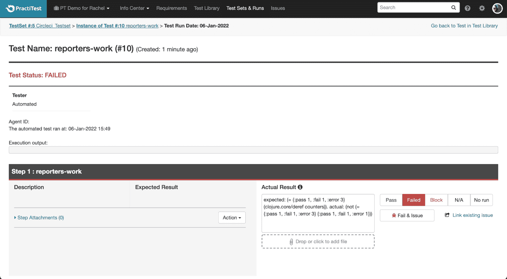

现在，您已经熟悉了基本的流程和配置，可以开始进行更高级的设置了。

## 为详细结果设置高级参数

使用鞭炮 orb，您可以定义额外的参数来获得更有见地的结果，这将让您创建广泛的仪表板图形和报告。

对于一些高级参数，我们建议您在 PractiTest 中创建目标自定义字段，以匹配将从 CircleCI 接收的测试结果。您可以将这些字段用于下面解释的附加参数。

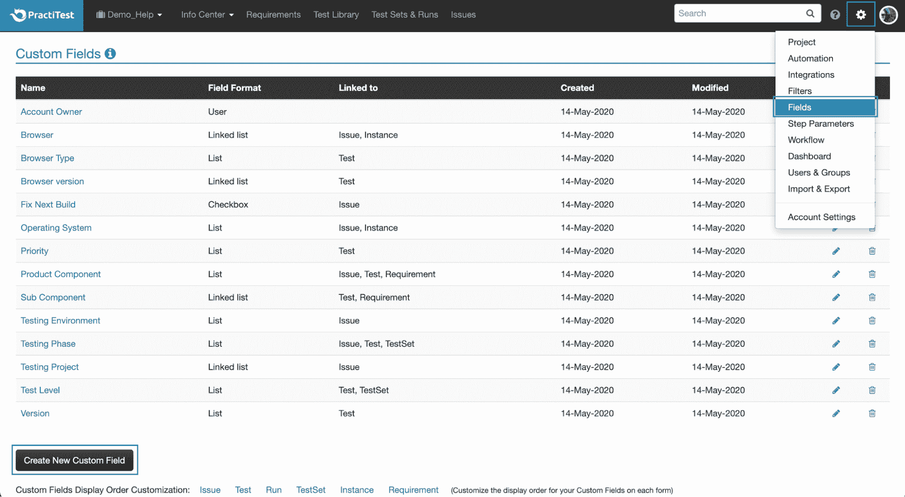

下面是一些可以在配置文件中定义的额外参数。这些也可以在 [CircleCI 文档](https://circleci.com/developer/orbs/orb/practitest/firecracker)中找到。

如果你不想以机器用户的身份运行 CircleCI，你可以在 Docker 容器中运行鞭炮。通过在运行测试的步骤之前插入下面的参数(这样，如果测试失败，CircleCI 仍将执行鞭炮并将结果上传到 PractiTest):

```
setup_remote_docker:
  version: 19.03.13 
```

如果您想要将更多的测试集字段从您的构建映射到 PractiTest，使用`additional_testset_fields`参数。例如，如果您在 PractiTest 中创建了一个名为“分支”的测试集字段，并希望向其中添加分支值，请按如下方式添加行:

```
additional_testset_fields: |
  \"custom-fields\":{\"---f-field_id\":\"${CIRCLE_BRANCH}\"},\"system-fields\":{} 
```

将上面的`field_id`替换为项目设置>字段>分支字段中可用的字段 ID。字段 ID 是 URL 末尾的五个数字。一旦完成，CircleCI 中的分支值将自动填充到 PractiTest 中的分支字段中。

如果您想要从您的构建映射更多的测试字段到 PractiTest，使用`additional_test_fields`参数。例如，您可以使用 XML 测试结果中的一个名为`full-class-name`的字段(可以在 CircleCI 以前版本的工件中找到),并将其映射到 PractiTest 中的 prerequisites test 系统字段:

```
additional_test_fields: |
  \"custom-fields\":{},\"system-fields\":{\"preconditions\":\"?full-class-name\"} 
```

这样，`full-class-name`字段中的值将自动填充到每个构建的前提条件字段中。

如果你想添加更多的内嵌参数，你可以使用`extra_params`参数。例如，如果您想将命令行`display action log`添加到您的构建中，您可以添加`extra_params: --display-action-logs`。

在命令行中独立运行鞭炮时，鞭炮帮助中提供了不同的内联参数选项。有关更多信息，请联系 PractiTest 支持人员。

默认情况下，bracket 将为 PractiTest 中的所有测试结果创建一个测试集。如果您希望基于`Suite-Name`属性创建多个测试集，使用`multitestset: true`并删除原始配置文件中的`testset_name`参数。

默认情况下，构建中的所有 XML 测试用例都作为一个多步骤测试报告给 PractiTest。如果您希望每个 XML 测试用例被报告为一个单步测试，那么添加`test_case_as_pt_test_step: false`参数。

如果您没有使用`multitestset`参数，或者如果您将它设置为`false`，您可以使用`testset_name: CallMeAnything`来定义接收结果的单个测试集的名称。

## 可视化您的测试数据

在 PractiTest 中，您可以对数据进行切片和切块，以创建有洞察力的仪表板和报告。例如，您可以基于任何 PractiTest 过滤器和测试字段创建实例管状聚合报告。

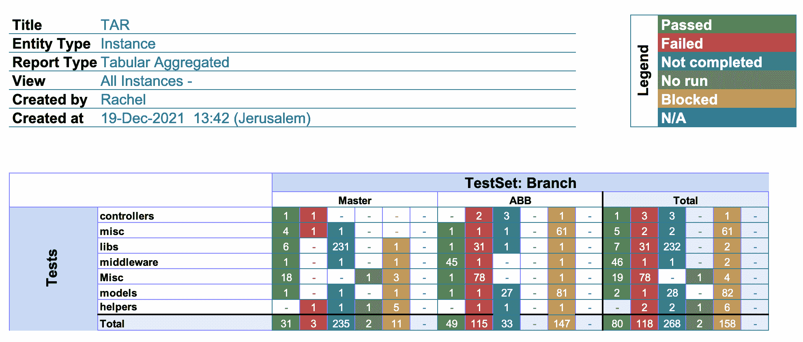

您还可以为您的实例创建一个基本的饼图，来呈现您的任何测试字段，比如测试区域、分支、模型或者阶段。

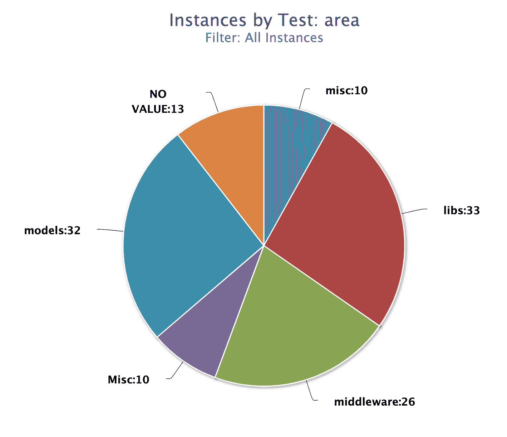

如果您想要跟踪执行进度，您可以创建一个实例执行进度图，并过滤结果以准确显示您想要跟踪的内容。

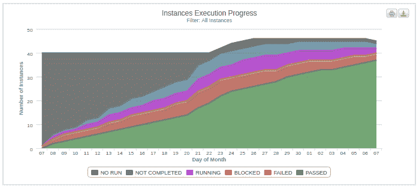

## 结论

将 PractiTest 与您的 CircleCI 集成是集中您所有测试工作的另一个步骤，无需使用 API 的开销。PractiTest 让您整合所有正在使用的工具，使您的工作流程无缝高效。

拥有一个可以动态组织数据和可视化数据的地方，可以让您更好地管理测试，并根据所有相关信息做出更明智的业务决策。访问 PractiTest 帮助中心，了解更多关于[如何使用鞭炮](https://www.practitest.com/help/methodology-tips/firecracker/?utm_medium=referral&utm_source=circleci&utm_campaign=blog&utm_content=&utm_term=2022)以及[如何将鞭炮工具与 CircleCI](https://www.practitest.com/help/integrations/circleci-integration/?utm_medium=referral&utm_source=circleci&utm_campaign=blog&utm_content=&utm_term=2022) 集成。你也可以在 CircleCI 开发者中心找到更多关于[爆竹球](https://circleci.com/developer/orbs/orb/practitest/firecracker)的信息。