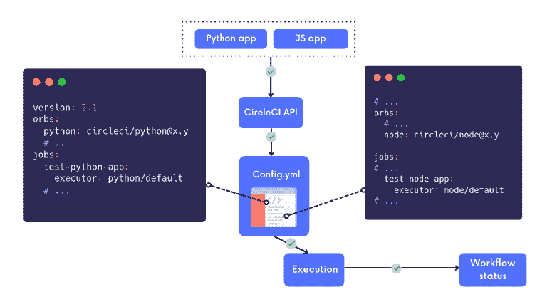
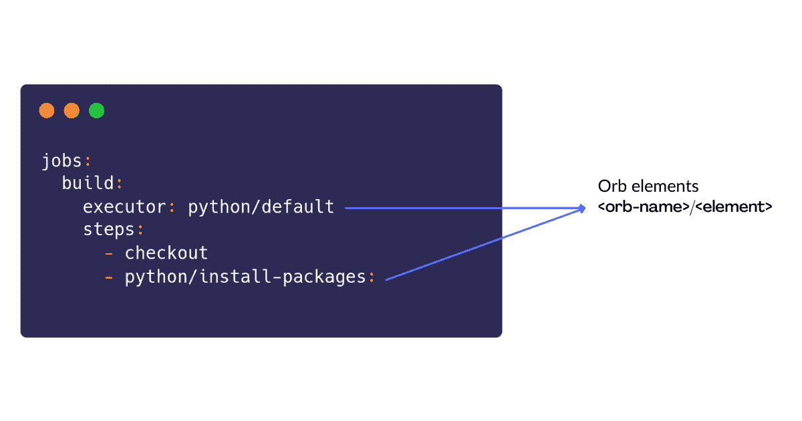
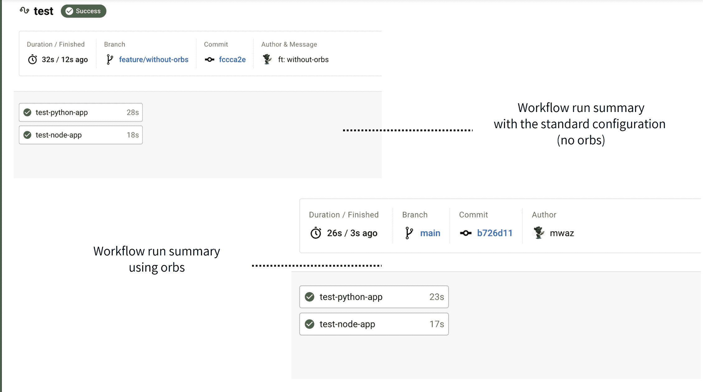

# 使用多个 CircleCI orbs | CircleCI 配置管道

> 原文：<https://circleci.com/blog/multiple-orbs-pipeline-config/>

> 本教程涵盖:
> 
> 1.  什么是球体以及如何使用它们
> 2.  为什么你可能想要使用多个球体
> 3.  使用多个 orb 设置配置

持续集成/持续交付(CI/CD)工具为开发人员提供了自动化软件开发过程的能力。一旦开发人员将代码推送到 git，您的 CI/CD 系统就可以进行构建、测试、试运行、集成测试、部署和伸缩。太棒了！

在本教程中，我们将看看 CircleCI orbs 以及它们如何支持您的 CI/CD 练习。我们将了解如何使用多个 orb，以及 orb 如何帮助各种应用程序类型的多重构建。

## 先决条件

开始之前，请确保您具备以下要求:

1.  一个[圆](https://circleci.com/signup/)的账户
2.  GitHub 的一个账户
3.  基本 CI/CD 知识
4.  对管道工作原理的基本理解

在 [GitHub](https://github.com/CIRCLECI-GWP/circleci-multiple-orbs-config) 上可以获得演示应用的克隆版本。每个项目目录中都有设置和安装说明。

## 什么是球体？

orb 是可重用的 YAML 配置包，它将配置减少到几行代码，允许开发人员轻松地打包、发布和重用配置。

球体非常有用，因为它们:

1.  节省花费在项目设置上的时间
2.  提高组织效率
3.  简化第三方集成

球体可以成为你的配置文件中的英雄。

要使用 orb，请进入 CircleCI [orb 注册表](https://circleci.com/developer/orbs)。在那里，您将找到适合您的技术堆栈的 orb 以及开始使用的说明。如果你不能为你的技术栈找到一个 orb，你可以按照 CircleCI [最佳实践](https://circleci.com/docs/orbs-best-practices/#orb-best-practices-guidelines)和[入门](https://circleci.com/docs/orb-author-intro/)指南创建一个专门的 orb。



## 使用多个球体

CircleCI 支持在同一个配置文件中使用多个 orbs 这一节将向您展示如何使用您之前克隆的项目。

克隆的项目结合了一个 Flask API 和一个节点。JS 命令行应用程序。我们已经对这两个应用程序进行了测试；它们需要使用 [Python](https://circleci.com/developer/orbs/orb/circleci/python) 和[节点](https://circleci.com/developer/orbs/orb/circleci/node) orbs 在 CircleCI 上运行。

## 为什么是多个球体？

就采用哪种技术以及何时采用而言，开发人员具有很强的适应性。大多数当前的应用程序都是由 API 组成的，带有一个前端插件来使用 API。假设 API 是用 Python 构建的。开发人员决定使用像 React 这样的 JavaScript 框架作为前端。在这种情况下，我们有一个 Python 和 JavaScript 应用程序。

为这种类型的应用程序配置 CI/CD 管道时，您应该将所有配置放在一个配置文件中。这是因为 CircleCI 在`.circleci/config`中需要一个配置文件。

因为 orb 是灵活的，所以我们可以将 orb 组合在一个单独的`config.yml`文件中，在 CircleCI 上运行我们的测试。多个 orb 将导致更快的项目执行，更健壮的 CI/CD 管道，以及优秀的可重用性。

## 设置多个球体

配置多个 orb 的过程类似于配置单个 orb 的过程。

首先，请按照下列步骤操作:

1.  在您的`.circleci/config.yml`文件的顶部，添加下面一行来指定 CircleCI 版本

    ```
    version: 2.1 
    ```

2.  Invoke the orbs you wish to use. For example:

    ```
    orbs:
     node: circleci/node@5.0.2
     python: circleci/python@2.0.3 
    ```

    这个代码块在 CircleCI 版本之后列出了 orb。然后我们将在整个脚本中使用这两个。因为 orb 使用不同的名称引用，所以它们彼此完全独立。

3.  将节点元素引入到现有的工作流和作业中。此时，orb 的元素可以用作`<orb-name>/<element>`。



现在您已经了解了配置多个 orb 的基础知识，您可以开始使用 Python 和节点 orb 配置您的克隆应用程序了。这些 orb 是独一无二的，正确的配置可以在 orb[文档](https://circleci.com/developer/orbs)指南中找到。

下面是将配置文件分解成几个包含`version`、`orbs`、`jobs`和`workflow`的块。

### CircleCI 版本

```
version: 2.1 
```

### 球

这些是在管道中使用的特定 orb 版本:

```
orbs:
 node: circleci/node@5.0.2
 python: circleci/python@2.0.3 
```

### 乔布斯

您可以考虑让每个应用程序有两个单独的作业，因为您要测试两个。每个 orb 都有自己的执行任务。

**作业 A**

角色:测试 Python 应用程序

使用的宝珠:Python 宝珠

```
jobs:
 test-python-app:
   executor: python/default
   steps:
     - checkout
     - python/install-packages:
         app-dir: ~/project/flask-api
         pip-dependency-file: requirements.txt
         pkg-manager: pip
     - run:
         command: |
           pytest -v
         name: Test 
```

**作业 B**

角色:测试 JavaScript 应用程序

使用的 Orb:节点 orb

```
 test-node-app:
   executor: node/default
   steps:
     - checkout
     - node/install-packages:
         app-dir: ~/project/nodejs-cli
         cache-path: ~/project/nodejs-cli/node_modules
         override-ci-command: npm install
     - run:
         command: |
           npm run test
         working_directory: ~/project/nodejs-cli 
```

### 工作流程

工作流决定了已定义作业的执行顺序。

```
workflows:
 test:
   jobs:
     - test-python-app
     - test-node-app 
```

## 比较有和没有多个 orb 的配置

在[示例 GitHub 库](https://github.com/CIRCLECI-GWP/circleci-multiple-orbs-config)中可以找到`config.yml`的完整打包版本以供参考。典型配置不使用 CircleCI orbs。

当您查看配置文件时，请注意不同之处，并使用不同的工作流运行每个工作流。例如，运行一个使用多个 orb 的[、](https://github.com/CIRCLECI-GWP/circleci-multiple-orbs-config/blob/main/.circleci/config.yml)和一个使用标准配置的[、](https://github.com/CIRCLECI-GWP/circleci-multiple-orbs-config/blob/feature/without-orbs/.circleci/config.yml)而没有 orb。

除了 orb 提供的组织和可读性，回顾工作流运行时揭示了 orb 提供的更多好处。下面的屏幕截图显示了两个工作流的成功运行:一个使用标准配置，另一个使用 orbs。



此图显示，使用多个 orb 的配置运行的工作流比使用标准配置运行的工作流执行速度稍快。两种工作流中完成每项作业所需的时间略有不同。

球体又一次胜利了！

## 结论

本教程展示了在 CI 管道中使用多个 orb 的好处。您能够基于不同应用程序的架构配置 CI 管道来使用多个 orb。您已经体验了多个 orb 如何加速工作流运行、提高可重用性以及简化与第三方应用程序的集成。直到下一次，继续建设！

* * *

Waweru Mwaura 是一名软件工程师，也是一名专门研究质量工程的终身学习者。他是 Packt 的作者，喜欢阅读工程、金融和技术方面的书籍。你可以在[他的网页简介](https://waweruh.github.io/)上了解更多关于他的信息。

[阅读更多 Waweru Mwaura 的帖子](/blog/author/waweru-mwaura/)