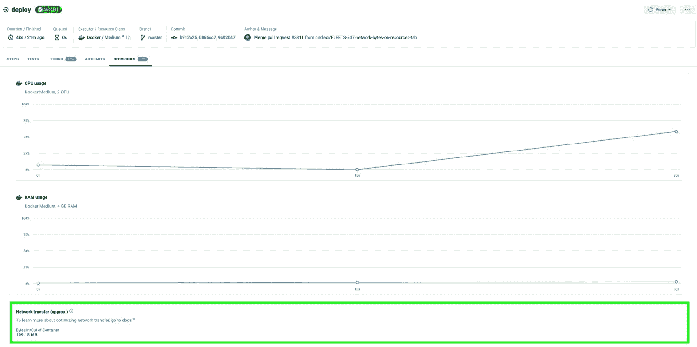

# 通过对资源选项卡| CircleCI 的新增强功能，预测 IP 范围的成本

> 原文：<https://circleci.com/blog/network-transfer-ip-ranges/>

我们请求最多、最受欢迎的功能之一是 Docker executor 的 [IP 范围，该功能最近对所有执行或规模计划的客户开放。使用 IP 范围，您可以通过与 CircleCI 可验证关联的 IP 地址路由作业流量。这使您的团队能够通过限制与基础架构通信的连接来满足法规遵从性要求。](https://circleci.com/blog/ip-ranges-better-security/)

对于任何新特性，你都想知道它会给你的团队带来多少成本。今天，我们在 CircleCI web 应用程序的工作详细信息页面的资源选项卡中引入了一个简单(但功能强大)的附加功能，以帮助您更好地预测使用新 IP 范围功能的成本。

## 在用户界面中查看网络传输数据

当作业启用 IP 范围功能时，每传输 GB 数据，该功能会消耗 [450 个配额。我们已经将网络传输数据(进出容器的所有流量)添加到资源选项卡(显示在下面的绿框中),以便让您*更加*了解您的工作正在执行时发生的情况，并帮助 IP 范围用户做出明智的决策。](https://discuss.circleci.com/t/ip-ranges-pricing-model/42464)

**这些数据使您能够:**

*   得出在给定作业上启用 IP 范围的估计成本
*   优化具有已启用 IP 范围的作业的项目的信用消耗

如果您考虑在作业上启用 IP 范围，您可以通过获取网络传输数据(转换为 GB)并乘以 450 配额来估算成本。如果您已经在项目中的几个作业上启用了 IP 范围，此特定于作业的数据将允许您了解项目中每个作业产生的成本，并相应地进行优化。

我们从客户那里听到了大量的反馈，资源选项卡中的[资源利用率图表](https://circleci.com/blog/optimize-resources-dashboard/)帮助他们无缝地调整计算规模，以利用我们平台上的多种资源规模。我们致力于发展这一势头，并将继续增强“资源”选项卡，让您进一步了解在您的工作执行过程中会发生什么，同时对 IP 范围等新功能进行无摩擦的成本预测。

**您对资源选项卡中还包括什么有什么想法吗？**通过 [Canny](https://circleci.canny.io/cloud-feature-requests) 分享它们，让我们知道您在工作执行过程中发现了哪些有价值的资源可见性。

*资源选项卡上的数据使用量是近似值。出于计费目的，计划使用页面应始终用作事实的来源。*