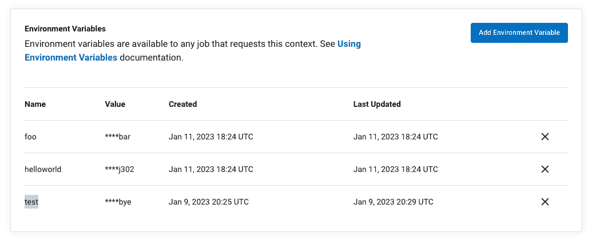

# 用于安全机密管理的新 CircleCI 功能| CircleCI

> 原文：<https://circleci.com/blog/new-features-secure-secrets-management/>

当安全事故发生时，软件提供商和用户采取迅速有效的行动至关重要。为了应对我们最近的[安全事件](https://circleci.com/blog/jan-4-2023-incident-report/)，我们亲眼目睹了我们的客户、技术合作伙伴和工程团队如何通过开放和协作来帮助遏制威胁并降低未经授权访问客户系统的风险。

在本帖中，我们想重点介绍一些我们为应对 2023 年 1 月 4 日的安全事件而推出的新功能和工具。其中包括:

*   一个交互式 CLI 工具，用于识别 CircleCI 中为您的组织项目存储的所有机密
*   对 CircleCI UI 和 API 进行了更改，以简化机密审计
*   全面访问自助审核日志，以查看 30 天内 CircleCI 环境的变化。

总的来说，这些更新使客户更容易通过我们的 UI 或 API 轮换机密，并验证所有受影响的管道和凭据都已得到保护。在许多情况下，这些变化是由我们的社区成员的问题、请求和积极响应激发的，因为他们致力于重置凭据并监控其项目和相关服务的活动。我们感谢您对此事件的贡献和持续支持。

## 使用 CircleCI-Env-Inspector 识别秘密

CircleCI-Env-Inspector 是一个命令行界面(CLI)工具，您可以使用它来生成存储在 CircleCI 上的所有机密的 JSON 报告。此工具对于在项目环境变量和组织范围的上下文中拥有大量机密的组织特别有用，因为它提供了需要手动轮换的项目的完整列表。请注意，该工具将只返回姓名和其他识别信息，但*不会*返回秘密值，这意味着没有意外暴露敏感信息的风险。

 <//videos.ctfassets.net/il1yandlcjgk/2KqmeXHsf4Wveib8cGmPHP/28442b569a5fb4a7703e80ea98bc5a50/environment-inspector.mp4> 

Environment inspector

要使用 Env-Inspector 工具，请访问并克隆[项目存储库](https://github.com/CircleCI-Public/CircleCI-Env-Inspector)，然后生成一个 [CircleCI API 令牌](https://app.circleci.com/settings/user/tokens)，它可以访问您想要检查的所有项目。要列出整个组织的所有项目中使用的秘密，您需要从一个组织管理员帐户生成 API 令牌。

一旦有了 API 令牌，导航到 Env-Inspector 存储库的根目录并运行命令`run.sh`。在提示符下输入您的 API 令牌，工具将返回存储在项目环境变量和上下文中的所有秘密的列表。下面是一个输出示例:

```
{
  "contexts": [
    {
      "name": "CONTEXT_NAME",
      "url": "https://app.circleci.com/settings/organization/<VCS>/<ORG>/contexts/<CONTEXT-ID>",
      "id": "xxx",
      "variables": [
        {
          "variable": "GITHUB_TOKEN",
          "context_id": "xxx",
          "created_at": "yyy"
        }
      ]
    }
  ],
  "projects": [
    {
      "name": "ORG/REPO",
      "url": "https://app.circleci.com/settings/project/<VCS>/<ORG>/<REPO>/environment-variables",
      "variables": [{ "name": "VAR", "value": "xxxx" }],
      "project_keys": [
        {
          "type": "deploy-key",
          "preferred": true,
          "created_at": "xxx",
          "public_key": "yyy",
          "fingerprint": "zzz"
        }
          ]
    }
  ]

} 
```

输出包括几条信息，您可以使用这些信息来识别存储在项目中的机密，包括上下文或项目的名称、URL、ID 号以及凭据创建和上次更新的日期和时间。

CircleCI Env-Inspector 是一个开源工具，我们欢迎社区以问题或项目存储库请求的形式做出贡献。

## 确认机密已经使用`updated_at`时间戳进行了轮换

为了让客户放心，他们的长期秘密已经被更改，我们在 web 应用程序的上下文 API、环境变量和上下文管理页面中引入了`updated_at`时间戳。此信息允许您验证机密是否已成功轮换，并识别任何需要更新的机密。

在 API 中，`updated_at`数据在对列出上下文环境变量的 [`GET`请求和添加或更新现有上下文变量](https://circleci.com/docs/api/v2/index.html#operation/listContexts)的 [`PUT`请求的响应中提供。以下是对上下文 API 的更新请求的示例响应:](https://circleci.com/docs/api/v2/index.html#operation/addEnvironmentVariableToContext)

```
{
  "variable" : "a_variable",
  "updated_at" : "2023-01-09T20:32:18.568Z",
  "context_id" : "b5a5561a-7159-48f1-854f-1e53a8f315e0",
  "created_at" : "2023-01-09T20:26:57.020Z"
} 
```

响应包括变量的名称、更新的日期和时间、存储变量的上下文的 ID 号以及变量更新的原始日期和时间。

对于喜欢通过 web 应用程序更新秘密的用户，我们还更新了我们的上下文 UI，以提供关于变量何时创建和上次更新的信息。



要查看贵组织的上下文环境变量，请访问**组织设置>上下文**。

## 将 SSH 检出密钥与 SHA256 指纹进行比较

作为我们对客户的补救指导的一部分，我们建议在 CircleCI 和您的目标环境中轮换所有 SSH 密钥。为了让您更容易地跨系统比较签出密钥，我们添加了从我们的 v1.1 API 返回 SHA-256 公钥指纹的能力。这是对返回 MD5 指纹的现有能力的补充。

下面是检索阿沙-256 标识符的 API 调用示例:

```
curl -H “Circle-Token: " https://circleci.com/api/v1.1/project/:vcs-type/:username/:project/checkout-key?digest=sha256 
```

`?digest=sha256`查询参数指定响应将返回结帐键的 SHA-256 散列。

有关旋转 SSH 密钥的更多信息，请访问我们的[支持文章](https://support.circleci.com/hc/en-us/articles/12015682624667-Best-Practices-for-Rotating-User-SSH-keys-and-Additional-SSH-keys)。

## 使用自助审计日志审查 CircleCI 环境中的活动

为了帮助客户审计和分析其组织下的活动，CircleCI 在审计日志中记录重要的系统事件。客户可以通过两种方式访问这些日志:

1.  通过请求客户支持
2.  直接从 web 应用程序中的自助服务门户

传统上，自助审核日志仅向我们的规模、性能和服务器计划的客户提供。为了帮助所有客户保护他们的系统，我们暂时扩展了自助服务功能，将客户纳入我们的免费计划。

用户可以通过访问**组织设置>安全**并选择一个日期范围来请求在之前 365 天中任何 30 天期间的系统活动日志。免费计划的客户每天可以请求一个审计日志，而付费计划的客户每天最多可以请求三个日志。


CircleCI 审计日志记录重要的系统活动，比如创建或删除上下文、项目环境变量、SSH 密钥或 API 令牌；工作流作业开始、完成或批准的时间；和对预定流水线的改变。这些日志包括以下数据:采取操作的时间、启动操作的用户、受操作影响的实体(组织、项目、帐户或版本)以及操作是否成功。

请注意，虽然查看您的 CircleCI 审计日志是确保 CI/CD 环境中没有发生未授权活动的重要步骤，但我们强烈建议您也查看 2022 年 12 月 21 日至 2023 年 1 月 4 日期间您的构建流程中使用的所有连接服务的审计日志。

## 结论

这篇文章中强调的新功能和更新是由我们的工程团队制作的，以立即帮助客户应对 1 月 4 日的安全事件。但是，定期轮换静态凭据是一种安全最佳实践，我们鼓励您继续将这些功能作为日常安全工作的一部分。保护管道安全的其他步骤包括:

我们感谢我们的客户在保持管道安全方面的持续合作和警惕，我们的团队将随时为您提供支持。如果您对事件、我们的持续响应或我们对客户的建议有任何疑问，请访问我们完整的[事件报告](https://circleci.com/blog/jan-4-2023-incident-report/)或联系[客户支持](https://support.circleci.com/hc/en-us)。