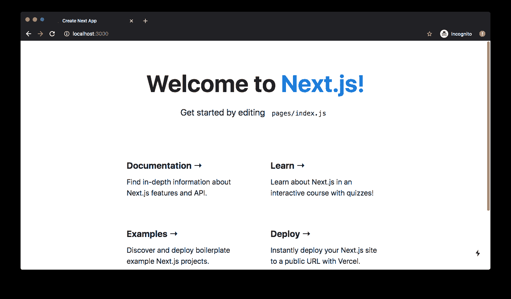
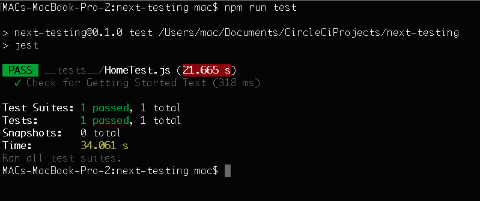
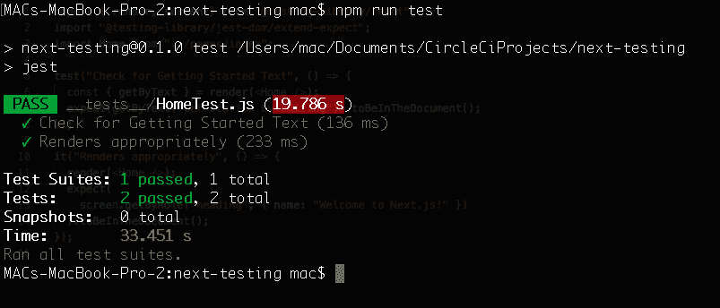
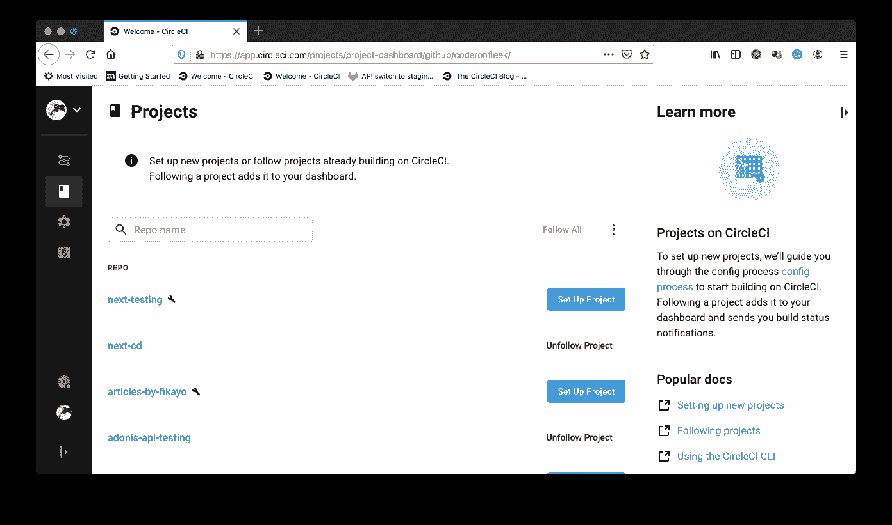
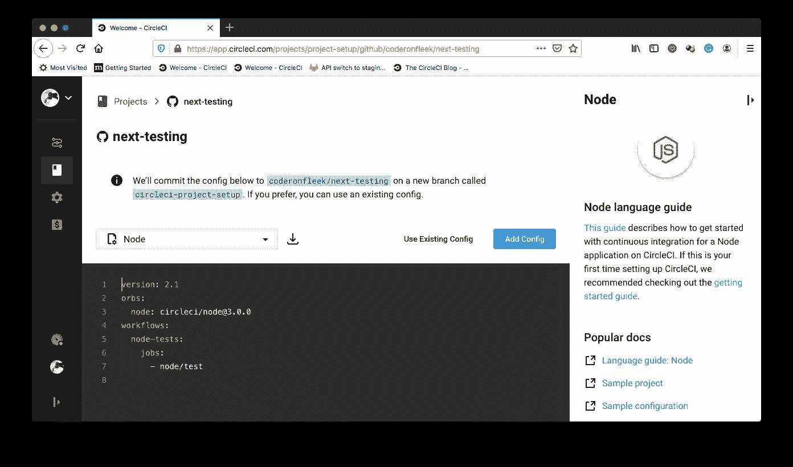
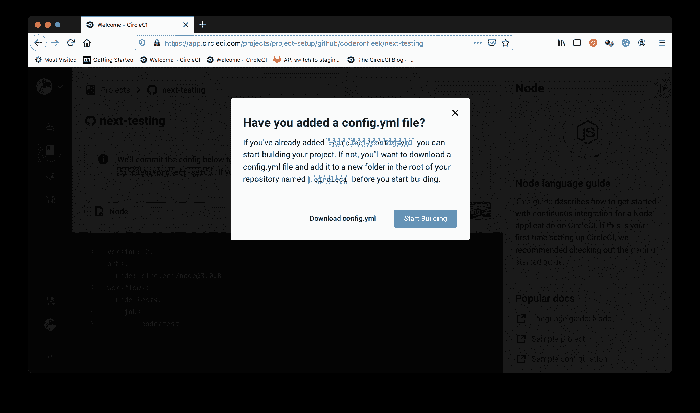
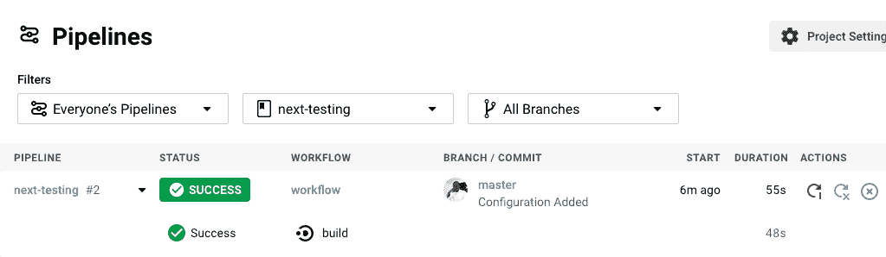
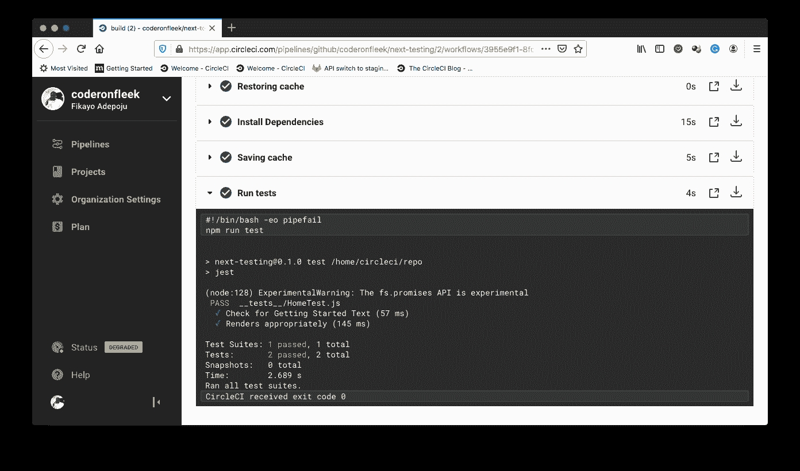

# Next.js 应用程序的持续集成| CircleCI

> 原文：<https://circleci.com/blog/next-testing/>

[Next.js](https://nextjs.org/) 被标榜为**生产**的 React 框架。它使 [React.js](https://reactjs.org/) 开发人员能够通过提供开箱即用的功能，如路由、代码分割、捆绑、类型脚本和内置 CSS 支持，来开发生产级应用程序。这些是生产应用程序开发所必需的功能。在本教程中，我将向您展示如何通过建立一个测试框架来自动测试添加到我们的应用程序中的特性，并确保它不会在这个过程中中断，从而不断地将特性集成到您的 Next.js 应用程序中。

## 先决条件

要遵循本教程，需要做一些事情:

1.  Javascript 的基础知识
2.  您系统上安装的 [Node.js](https://nodejs.org) (版本> = 10.13)
3.  一个[圆](https://circleci.com/signup/)的账户
4.  GitHub 的一个账户

安装并设置好所有这些之后，让我们开始本教程。

## 创建新的 Next.js 项目

首先，通过运行以下命令创建一个新的 Next.js 项目:

```
npx create-next-app next-testing 
```

**注意** : *如果你使用的是 Node.js 版本 13，你需要你的版本是> =13.7 才能成功运行这个命令。*

这将在一个`next-testing`文件夹中自动创建一个 Next.js 应用程序(你可以给这个文件夹取任何你选择的名字)。一旦搭建过程完成，进入项目的根目录并运行应用程序:

```
cd next-testing
npm run dev 
```

这将在`http://localhost:3000`启动一个服务于应用程序的开发服务器。在您的浏览器中加载此 URL。



## 安装和设置 Jest 进行测试

下一步是建立测试框架和运行测试所需的工具。我们将使用 [Jest](https://jestjs.io/) 作为我们的测试框架，并安装一些实用程序来确保我们的测试顺利运行。下面是我们将要安装的软件包列表:

*   `jest`:测试框架
*   `@testing-library/jest-dom`:通过提供自定义的`matchers`来测试 DOM 的状态，从而扩展了`jest`
*   React 测试库提供了简单完整的 React DOM 测试工具
*   `@testing-library/dom`:测试 DOM 节点的基础测试库
*   `babel-jest`:用于在我们的测试套件中传输 Javascript

使用以下命令立即安装这些软件包:

```
npm install -D jest @testing-library/react @testing-library/jest-dom @testing-library/dom babel-jest 
```

一旦安装了这些，下一步就是创建一个`.babelrc`配置文件来指示`babel-jest`使用 Next.js 的定制预置。在你的项目的根目录下创建`.babelrc`文件并输入以下配置:

```
{
  "presets": ["next/babel"]
} 
```

接下来，我们需要配置 jest 来完成以下任务:

*   忽略`.next`构建文件夹和`node_modules`文件夹
*   在我们的测试中使用`babel-jest`来传输 Javascript
*   在我们的测试中模拟静态文件(CSS 导入和文件)

在`package.json`文件中，为`jest`添加以下部分:

```
...
"jest": {
    "testPathIgnorePatterns": [
      "<rootDir>/.next/",
      "<rootDir>/node_modules/"
    ],
    "transform": {
      "^.+\\.(js|jsx|ts|tsx)$": "<rootDir>/node_modules/babel-jest"
    },
    "moduleNameMapper": {
      "\\.(jpg|jpeg|png|gif|eot|otf|webp|svg|ttf|woff|woff2|mp4|webm|wav|mp3|m4a|aac|oga)$": "<rootDir>/__mocks__/fileMock.js",
      "\\.(css|less)$": "<rootDir>/__mocks__/styleMock.js"
    }
}
... 
```

仍然在`package.json`文件中，将`test`脚本添加到`scripts`部分:

```
...
"scripts": {
    ...
    "test": "jest"
},
... 
```

## 为 Jest 测试模仿静态资产

在上一节中，我们添加了一个`jest`配置来指示`jest`在我们的测试中模拟 CSS 文件导入和其他静态文件。这样做是因为这些类型的文件在测试中没有用，所以我们可以安全地模拟它们。在编写设置时，你会注意到我们指向了两个模拟文件`fileMock.js`和`styleMock.js`，它们分别用于模拟静态文件和 CSS 文件。

让我们创建这些文件。在项目的根目录下创建一个`__mocks__`文件夹。然后创建`fileMock.js`文件并输入以下代码:

```
module.exports = "placeholder-file"; 
```

在这个`__mocks__`文件夹中创建`styleMock.js`文件，并输入以下代码:

```
module.exports = {}; 
```

有了这些文件，您就能够安全地模拟静态资产和 CSS 导入。

## 呈现 React.js 组件

现在我们可以开始编写测试了。该项目包含运行它们所需的一切。在项目的根目录下创建一个`__tests__`文件夹(这是一个特殊的文件夹，`jest`在其中寻找测试文件),并添加一个名为`HomeTest.js`的测试文件。在文件中输入以下代码:

```
import { render, screen } from "@testing-library/react";
import "@testing-library/jest-dom/extend-expect";
import Home from "../pages/index";

test("Check for Getting Started Text", () => {
  const { getByText } = render(<Home />);
  expect(getByText("Get started by editing")).toBeInTheDocument();
}); 
```

在上面的代码中，React 测试库中的`render`对象被导入来呈现我们的 React.js 组件。`screen`对象也被导入，这使我们可以访问页面文档。对于我们的断言，`extend-expect`模块是从`@testing-library/jest-dom`导入的。最后，我们将要测试的组件，我们在`/pages/index.js`中找到的索引页面组件，被导入。

然后包含一个测试来呈现在`/pages/index.js`文件中导出的主页组件(`<Home />`)，并检查页面上显示的`Get started by editing`文本是否确实存在于组件中。

通过运行以下命令来运行此测试:

```
npm run test 
```



继续添加另一个测试，将下面的代码添加到`__tests__/HomeTest.js`:

```
...
it("Renders appropriately", () => {
  render(<Home />);
  expect(
    screen.getByRole("heading", { name: "Welcome to Next.js!" })
  ).toBeInTheDocument();
}); 
```

上面的测试使用`screen`对象来访问 React.js DOM，并断言一个包含文本`Welcome to Next.js!`的`heading`。这是我们主页上的第一项。

再次运行测试套件

```
npm run test 
```



## 持续集成的自动化测试

现在您已经运行了您的测试，一切都很好。但是我们在这里不仅仅是为了“好”让我们使用[持续集成](https://circleci.com/continuous-integration/)来自动运行我们的测试。有了自动化，我们的测试将在每次我们向我们的存储库推送更新时运行。

从[将你的项目推送到 GitHub](https://circleci.com/blog/pushing-a-project-to-github/) 开始。

接下来，转到 CircleCI 仪表板上的**添加项目**页面。



点击**设置项目**。



在设置页面上，点击**使用现有配置**。接下来，您将得到一个提示，要么为 [CI 管道](https://circleci.com/blog/what-is-a-ci-cd-pipeline/)下载一个配置文件，要么开始构建。



点击**开始构建**开始构建。这个构建将会失败，因为我们还没有设置配置文件。这是我们的下一步。

在项目的根目录下创建一个名为`.circleci`的文件夹，并添加一个名为`config.yml`的配置文件。在该文件中，输入以下代码:

```
version: 2.1
jobs:
  build:
    working_directory: ~/repo
    docker:
      - image: circleci/node:10.16.3
    steps:
      - checkout
      - run:
          name: Update NPM
          command: "sudo npm install -g npm@5"
      - restore_cache:
          key: dependency-cache-{{ checksum "package-lock.json" }}
      - run:
          name: Install Dependencies
          command: npm install
      - save_cache:
          key: dependency-cache-{{ checksum "package-lock.json" }}
          paths:
            - ./node_modules
      - run:
          name: Run tests
          command: npm run test 
```

在上面的管道配置代码中，我们首先导入一个 Docker 映像，其中包含运行 Next.js 应用程序所需的 Node.js 版本。然后，`npm`被更新，依赖项被安装，缓存它们以便后续的构建更快。

最后，项目中包含的所有测试都用`npm run test`命令运行。

保存该文件，并将所有更改提交到远程存储库。这将触发管道再次运行我们的构建脚本。



要查看测试详情，请点击**构建**。



太棒了，不是吗？

## 结论:减轻锅炉板块代码负担

完整的项目可以在 GitHub 上的这里[看到。](https://github.com/CIRCLECI-GWP/next-testing)

对于构建生产应用程序来说，Next.js 是一个令人印象深刻的框架，因为它提供了减轻样板代码负担的特性。你不希望在产品中出现的一件事就是代码损坏。在本教程中，您了解了如何测试您的特性，并确保测试在您每次推送新代码时自动运行。这对于确保有缺陷的代码不会被推送到任何部署环境中有很大的帮助。

编码快乐！

* * *

Fikayo Adepoju 是 LinkedIn Learning(Lynda.com)的作者、全栈开发人员、技术作者和技术内容创建者，精通 Web 和移动技术以及 DevOps，拥有 10 多年开发可扩展分布式应用程序的经验。他为 CircleCI、Twilio、Auth0 和 New Stack 博客撰写了 40 多篇文章，并且在他的个人媒体页面上，他喜欢与尽可能多的从中受益的开发人员分享他的知识。你也可以在 Udemy 上查看他的视频课程。

[阅读 Fikayo Adepoju 的更多帖子](/blog/author/fikayo-adepoju/)