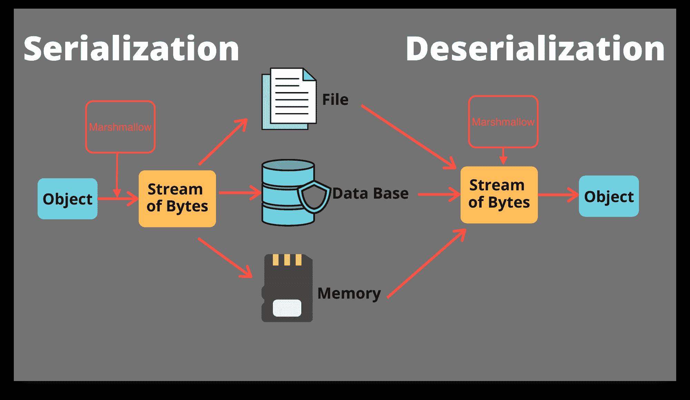
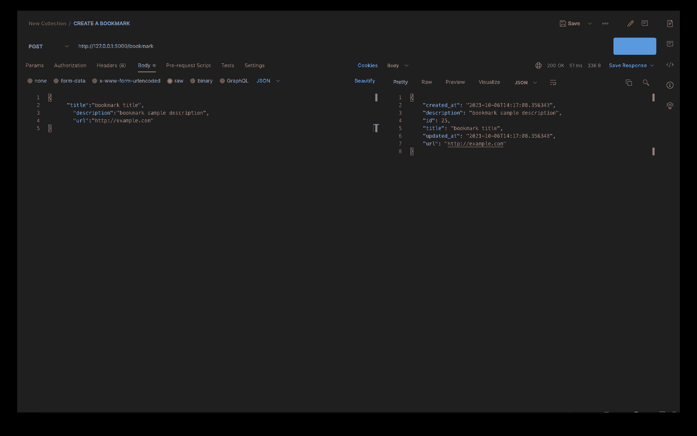
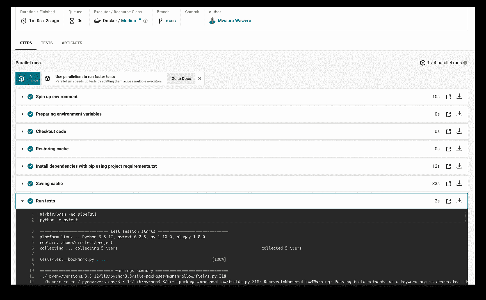
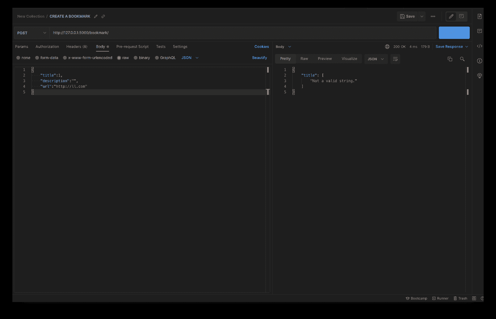

# Python 中用棉花糖进行对象验证和转换

> 原文：<https://circleci.com/blog/object-validation-and-conversion-with-marshamallow/>

Marshmallow 是一个 Python 库，它将复杂数据类型与 Python 数据类型相互转换。它是验证和转换数据的强大工具。在本教程中，我将使用 Marshmallow 来验证一个简单的书签 API，用户可以在其中保存他们喜欢的 URL 以及每个站点的简短描述。

本教程将涵盖:

1.  用棉花糖序列化和反序列化对象
2.  测试序列化和反序列化的对象
3.  用棉花糖验证对象

## 先决条件

要充分利用本教程，您需要:

1.  我们机器上安装的 Python 版本> = 3.5
2.  GitHub 账户。你可以在这里创建一个。
3.  CircleCI 账户。你可以在这里创建一个。
4.  对 SQLite 数据库有基本的了解。
5.  对 Flask 框架的基本理解。

> 我们的教程是平台无关的，但是使用 CircleCI 作为例子。如果你没有 CircleCI 账号，请在 注册一个免费的 [**。**](https://circleci.com/signup/)

## 克隆存储库并创建虚拟环境

从[克隆](https://docs.github.com/en/repositories/creating-and-managing-repositories/cloning-a-repository)来自[这个 GitHub 链接](https://github.com/mwaz/marshmallow-object-validation-and-conversion)的库开始。一旦你克隆了库，下一步就是创建一个[虚拟环境](https://docs.python.org/3/library/venv.html)，并激活它来安装我们的 Python 包。使用此命令:

```
pip3 install -r requirements.txt 
```

**注意:** *为了避免全局安装包，使用 Python 3.5 默认捆绑的虚拟环境。默认的虚拟环境允许轻松管理 Python 项目中的依赖关系。*

要创建默认虚拟环境，请运行以下命令:

```
virtualenv api-venv 
```

创建后还需要激活。更多关于 Python 虚拟环境的信息可以在[这里](https://docs.python.org/3/library/venv.html)找到。

## 为什么是棉花糖？

通常在处理数据时，需要将数据从一种数据结构转换成另一种数据结构。Marshmallow 是一个 Python 库，它可以将复杂的数据类型转换成本地的 Python 数据类型，反之亦然。

Python 解释器支持一些内置的数据类型，包括整数、布尔、元组、列表、字典、浮点、集合和数组。对于想要创建能够处理不同类型操作的复杂程序的开发人员来说，这些是必不可少的。

Marshmallow 的一个优点是它可以与任何数据库技术一起工作。它是平台无关的，这对开发者来说总是一个胜利。

为了进一步推广棉花糖，我们将使用这些技术:

*   **Marshmallow-sqlalchemy** 是 SQL 对象关系映射器 sqlalchemy 的扩展。
*   **Flask-marshmallow** 是一个针对棉花糖的 Flask 扩展，可以很容易地将棉花糖与 Flask 一起使用。它还为棉花糖对象生成 URL 和超链接。

## 理解棉花糖模式

理解棉花糖模式是如何工作的对于使用它是必不可少的。模式作为 Marshmallow 的核心，通过声明的模式跟踪数据。模式定义了数据的结构以及数据的验证。

我们书签应用程序的模式示例如下:

```
class BookMarkSchema(ma.Schema):
    title = fields.Str(required=True, allow_none=False)
    url = fields.URL(
        relative=True, require_tld=True, error="invalid url representation"
    )
    description = fields.String(required=False, allow_none=True)
    created_at = fields.DateTime(required=False, allow_none=True)
    updated_at = fields.DateTime(required=False, allow_none=True) 
```

这个模式为我们的模式中的字段创建验证并定义数据类型。模式已经过时，是时候序列化和反序列化数据了。



## 在烧瓶应用程序中实现棉花糖

为了构建我们的书签 API，我们将首先构建一个`BookMarkModel`类。这个类将在我们的表、关系和字段的结构上连接到数据库引擎。我们还将添加一个`BookMarkSchema`类来序列化和反序列化模型中的数据。这些类可以在`/src/app.py`文件中的克隆存储库中找到。

为了展示 Marshmallow 如何将数据从 Python 类型解析为序列化对象，我们使用了 SQLAlchemy。序列化的对象可以存储在数据库中，以后可以从数据库中反序列化为可接受的 Python 数据类型。

首先为模型和模式定义类创建一个结构。

```
# Adding SQLAlchemy
app.config['SQLALCHEMY_TRACK_MODIFICATIONS'] = False
app.config['SQLALCHEMY_DATABASE_URI'] = 'sqlite:///' + os.path.join(BASE_DIR, 'db.sqlite3')
db = SQLAlchemy(app)

# Add Marshmallow
ma = Marshmallow(app)

# Create the API model (SQLAlchemy)
class BookMarkModel(db.Model):
    pass

# Create schema (marshmallow)
class BookMarkSchema(ma.Schema):
    class Meta:
        pass

bookMarkSchema = BookMarkSchema()
bookMarksScehma = BookMarkSchema(many = True) 
```

这个代码片段首先将`SQLAlchemy`连接到我们的应用程序，默认情况下使用 SQLite。当 URL 被配置时，它连接到那个 SQL 数据库。然后，当数据从我们的模型发送和接收时，snipped 实例化 Marshmallow 到`serialize`和`deserialize`。

当与单个书签交互时，`bookMark = BookMarkSchema()`模式负责反序列化单个数据集(即`POST`、`READ`和`UPDATE`路线)。相反，`bookMarks = BookMarkSchema(many =True)`用于反序列化数据集中的项目列表，例如获取所有请求的书签。

## 在 Marshmallow 中序列化和反序列化数据

在前面的代码片段中，我们基于我们的`BookMarkModel`创建了一个棉花糖模式。在本节中，我们将使用 b Marshmallow 在保存到数据库时序列化数据，在从数据库检索时反序列化数据。

## 序列化 Python 数据

序列化是将 Python 对象转换成可以存储在数据库中或传输的格式的过程。在 Flask 中，我们使用 SQLAlchemy 连接到我们的数据库。我们需要将 SQLAlchemy 对象转换成 JSON 数据，然后可以与我们的 API 进行交互。棉花糖是这个过程中一个很好的工具。在本节中，我们将在创建书签后使用 Marshmallow 返回一个 JSON 对象。我们将通过向 SQLite 数据库添加一个新书签来实现这一点。

```
# CREATE a bookmark
@app.route("/bookmark/", methods=["POST"])
def create_bookmark():
    title = request.json["title"]
    description = request.json["description"]
    url = request.json["url"]

    book_mark = BookMarkModel(
        title=title,
        description=description,
        url=url,
        created_at=datetime.datetime.now(),
        updated_at=datetime.datetime.now(),
    )

    result = bookMarkSchema.dump(book_mark)

    db.session.add(book_mark)
    db.session.commit()
    return result, 201 
```

这个代码片段使用`BookMarkModel`类创建一个新的书签。它使用`db.session.add`和`db.session.commit`方法向数据库连续添加和保存书签。为了序列化对象，代码片段使用了`BookMarkSchema`类的`dump`方法，该方法返回一个格式化的 JSON 对象。

为了验证这一点，我们可以用 Postman 向数据库添加一个书签，并检索它。首先使用以下命令运行 Flask 应用程序:

```
 FLASK_APP=src/app.py flask run 
```

一旦应用程序开始运行，我们现在可以使用 Postman 和`POST` route `/bookmark`向我们的 API 请求创建一个新的书签。



该请求返回的响应是一个 JSON 对象。成功！现在已经创建了一个书签并用 Marshmallow 序列化了，您可以从数据库中检索它并反序列化它。

## 将 JSON 数据反序列化回 SQLite

反序列化与序列化相反。为了序列化，我们将数据从 Python 转换为 JSON。为了反序列化，我们将 JSON 数据转换为 SQLAlchemy 对象。当从 SQLite 数据库中反序列化对象时，Marshmallow 会自动将序列化的数据转换为 Python 对象。Marshmallow 为此使用了`load()`函数。

```
book_mark = BookMarkModel(
        title=title,
        description=description,
        url=url,
        created_at=datetime.datetime.now(),
        updated_at=datetime.datetime.now(),
    )
    try:
        json_input = request.get_json()
        result = bookMarkSchema.load(json_input)
    except ValidationError as err:
        return {"errors": err.messages}, 422 
```

对于反序列化，这个代码片段返回一个 SQLAlchemy 对象，该对象是从我们的 API 的 JSON 响应转换而来的。

既然已经序列化和反序列化了一些数据，下一步就是编写测试。测试将确保端点返回正确的数据。为了完全确保一切正常，我们还将在 CircleCI 上运行这些测试。

## 测试序列化

测试通过验证您的代码是否按预期运行来激发您对应用程序的信心。在本节中，我们将创建一个测试来确保我们的序列化按预期工作。

```
# Test if one can add data to the database
def test_add_bookmark():
    my_data = {
        "title": 'a unique title',
        "description": 'a bookmark description',
        "url": 'unique bookmark url',
    }
    res = app.test_client().post(
        "/bookmark/",
        data=json.dumps(my_data),
        content_type="application/json",
    )
    assert res.status_code == 201 
```

该测试验证了我们可以成功创建一个新书签。它还测试响应是否是我们在创建方法时定义的 201 状态代码。现在，我们可以通过将测试添加到 CircleCI 管道中来进一步验证成功。

## 设置 Git 并推送到 CircleCI

要设置 CircleCI，通过运行以下命令初始化项目中的 Git 存储库:

```
git init 
```

然后，在根目录下创建一个`.gitignore`文件。在文件中添加任何您不想添加到远程存储库中的模块。下一步是添加一个提交，然后[将你的项目推送到 GitHub](https://circleci.com/blog/pushing-a-project-to-github/) 。

登录 CircleCI 并进入 Projects，在这里您应该会看到与您的 GitHub 用户名或您的组织相关联的所有 GitHub 存储库。您希望为本教程设置的特定存储库是`object-validation-and-conversion-with-marshmallow`。在“项目”面板上，选择设置选定项目的选项，然后将该选项用于现有配置。

**注意:** *在启动构建之后，预计您的管道会失败。您仍然需要将定制的`.circleci/config.yml`配置文件添加到 GitHub 中，以便正确构建项目。*

## 设置 CircleCI

首先，在您的根目录中创建一个`.circleci`目录。为每个项目的 CircleCI 配置添加一个`config.yml`文件。在这个设置中，我们将使用 CircleCI Python `orb`。使用此配置来执行您的测试。

```
version: 2.1
orbs:
  python: circleci/python@1.2

workflows:
  sample:
    jobs:
      - build-and-test
jobs:
  build-and-test:
    docker:
      - image: cimg/python:3.8
    steps:
      - checkout
      - python/install-packages:
          pkg-manager: pip
      - run:
          name: Run tests
          command: python -m pytest 
```

### 使用第三方球体

CircleCI orbs 是可重用 yaml 配置的可重用包，它将多行代码压缩成一行。要允许使用像`python@1.2`这样的第三方球体，您可能需要:

*   如果您是管理员，请启用组织设置，或者
*   向您组织的 CircleCI 管理员请求权限。

设置好配置后，[将](https://docs.github.com/en/get-started/using-git/pushing-commits-to-a-remote-repository)配置推送到 Github。CircleCI 将开始建设这个项目。

瞧啊。转到 CircleCI 仪表板，展开构建详细信息。验证测试运行成功，并集成到 CircleCI 中。



现在您已经设置了 CI 管道，您可以继续使用 Marshmallow 来验证数据。

## 使用棉花糖的对象验证

Marshmallow 提供了一种在将对象数据发送到数据库之前验证对象数据的简单方法。Marshmallow 模式使用模式中的`validate()`方法来创建书签。在这一步中，我们将添加验证以确保书签标题只允许字符串，而不允许其他类型。

```
 class BookMarkSchema(ma.Schema):
    title = fields.String(required=True, allow_none=False)
    ... 
```

当规则被传递给模式时，我们可以使用`validate()`方法来验证创建新书签的方法上的数据:

```
def create_bookmark():
    title = request.json["title"]
    description = request.json["description"]
    url = request.json["url"]

    # Validate the data from request before serialization
    error = bookMarkSchema.validate({"title": title, "description": description, "url": url})
    if error:
        return jsonify(error) 
```

在上面的代码片段中，我们使用`validate()`方法来检查返回的数据是否与我们描述的模式验证相匹配，如果出现错误，我们将把错误返回给用户。

为了验证这是否有效，向 Postman 发出一个`POST`请求，在`title`中输入一个整数值。您的 API 应该抛出一个错误。



当与请求一起发送的无效`title`导致错误时，您将知道您的验证工作正常。

## 为更多端点添加测试

本教程没有涵盖用于克隆存储库的所有端点。如果您想自己继续，可以为端点添加测试，比如获取所有书签或获取单个书签。使用此代码:

```
# Test if all bookmarks are returned
def test_get_all_bookmarks_route():
    res = app.test_client().get("/bookmarks/")
    assert res.headers["Content-Type"] == "application/json"
    assert res.status_code == 200

# Test if a single bookmark is returned
def test_get_one_bookmark_route():
    res = app.test_client().get("/bookmark/1/")
    assert res.headers["Content-Type"] == "application/json"
    assert res.status_code == 200 
```

这些测试验证了我们可以检索我们创建的书签，无论是所有书签还是一个书签。测试还验证了接收到的数据是一个`JSON`对象，与 Marshmallow 的序列化过程一致。

在我们称之为聚会之前，我们需要保存并提交我们的测试，并将它们推送到 GitHub。成功的管道运行意味着一切顺利。

## 结论

在本文中，我们探索了使用 Marshmallow 反序列化和序列化数据以及执行验证的强大功能。通过这篇文章，我们已经经历了创建模型、创建模式以及连接它们的过程。我们还学习了如何使用验证来只允许特定类型的响应。我希望本教程对您有所帮助，并且希望您能够更好地理解如何使用 Marshmallow 进行序列化和反序列化。通过为更多的端点添加测试，让团队的其他成员参与进来，并将您所学到的知识应用到您自己的项目中。

* * *

Waweru Mwaura 是一名软件工程师，也是一名专门研究质量工程的终身学习者。他是 Packt 的作者，喜欢阅读工程、金融和技术方面的书籍。你可以在[他的网页简介](https://waweruh.github.io/)上了解更多关于他的信息。

[阅读更多 Waweru Mwaura 的帖子](/blog/author/waweru-mwaura/)