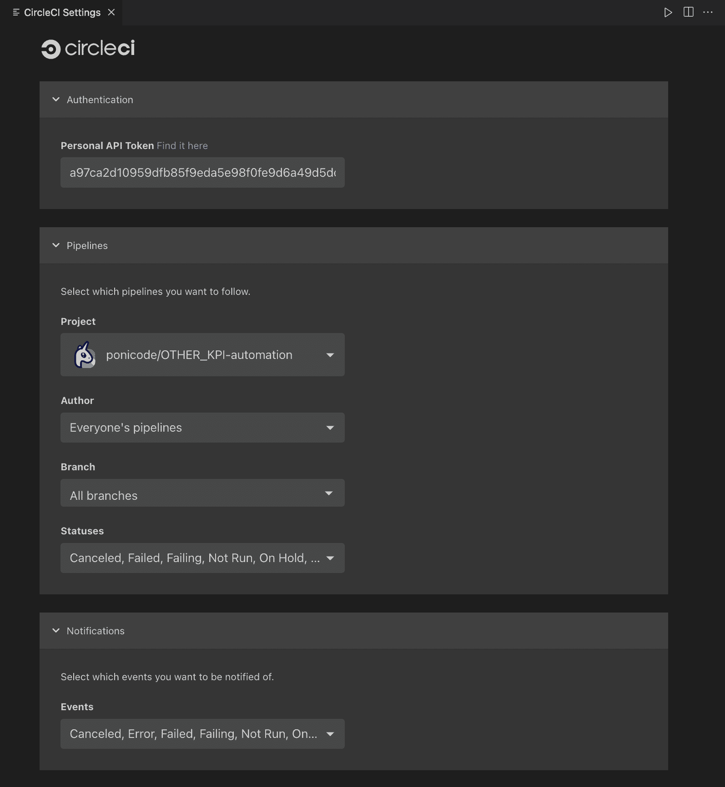
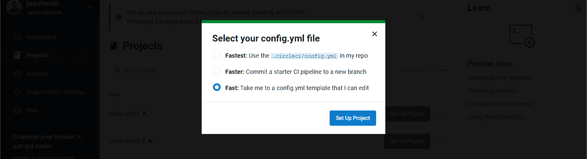
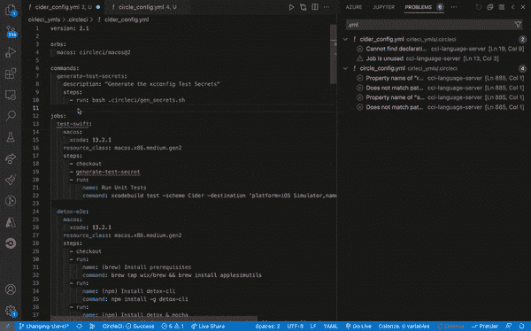
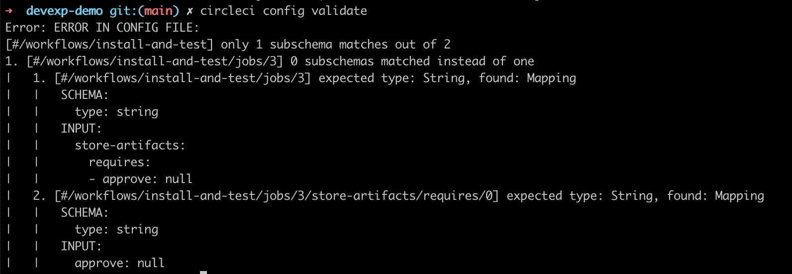
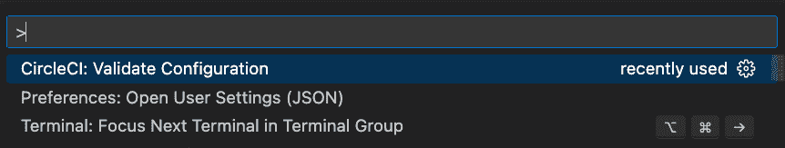
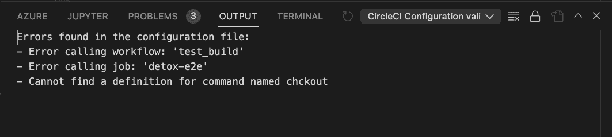
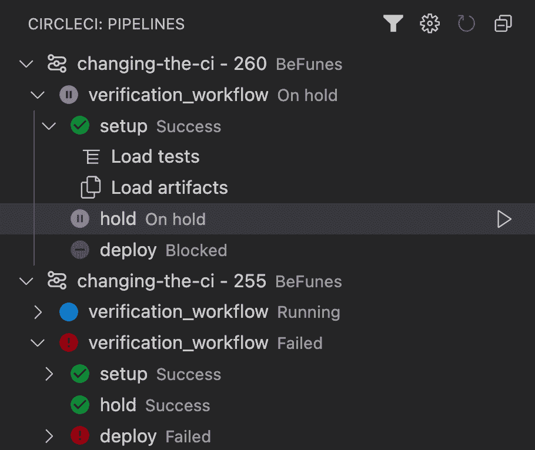
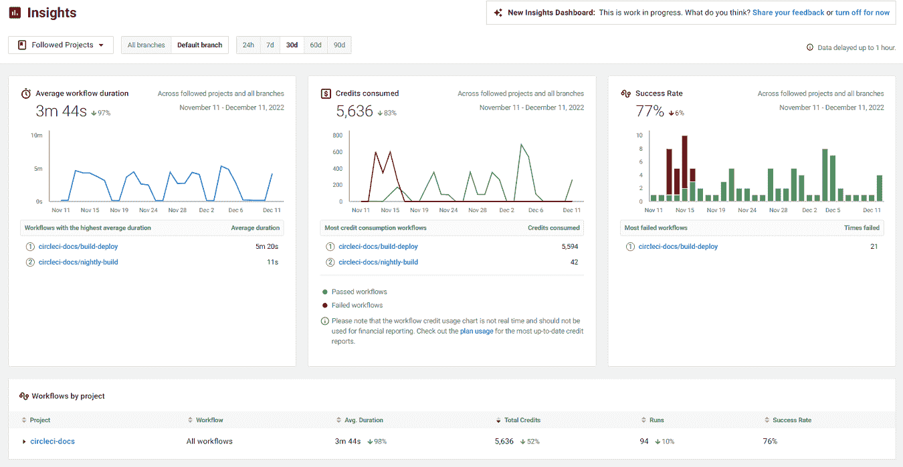
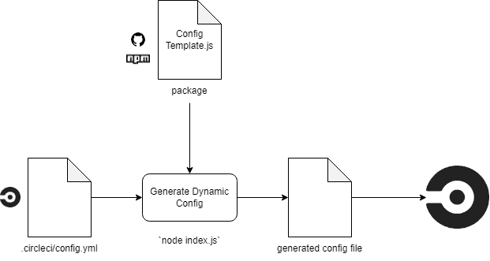

# CircleCI onboarding toolkit:帮助您更快发货的用户友好型工具

> 原文：<https://circleci.com/blog/onboarding-toolkit/>

持续集成和交付(CI/CD)通过自动化构建、测试和部署过程来优化团队开发流程，以确保快速可靠地交付高质量的软件。采用一流的 CI/CD 工具是您的组织能够做出的最佳投资之一[以缩短交付周期、消除痛苦的手动流程并控制基础设施成本。](https://www.businesswire.com/news/home/20211214005039/en/CircleCI-Can-Deliver-664-ROI-13.98M-NPV-According-to-Total-Economic-Impact-Study)

尽管有这些好处，将新技术引入您的工具链有时会涉及一个漫长而令人沮丧的学习过程。幸运的是，CircleCI 提供了几个工具，您可以使用它们来简化入职流程，并在几分钟内启动和运行一个快速安全的管道，无论您的经验水平如何。

在这篇博文中，我们将重点介绍一些流行的特性，这些特性使得设置、管理和共享 CircleCI 管道变得更快、更直观。我们将了解一个典型的入职流程，并指出您可以在何处以及如何使用以下工具来快速上手:

我们还将探讨诸如 [CircleCI CLI](https://circleci.com/docs/local-cli/) 、 [Insights dashboard](https://circleci.com/docs/insights/) 和[私有和公共 orbs](https://circleci.com/docs/orb-intro/) 等功能如何帮助您优化管道，以实现更轻松、更安全、更高效的交付。我们开始吧！

## 步骤 0:将项目连接到 CircleCI

使用 CircleCI 自动化开发工作流的第一步是连接您的代码库，以监控代码库中的更改。CircleCI 支持[所有主流版本控制系统](https://circleci.com/product/vcs/)，包括 GitHub、GitLab、Bitbucket。按照我们的[快速启动指南](https://circleci.com/docs/getting-started/)连接您的回购并建立一个[项目](https://circleci.com/docs/projects/)。

如果你是一个 VS 代码用户，现在也是安装我们官方 VS 代码扩展的好时机，它提供了几个特性来帮助你在你的 IDE 中设置和管理你的管道。您可以从“设置”窗格中选择要跟随的项目、分支和状态。

您可以直接在 VS 代码中安装扩展，或者从 Visual Studio marketplace 下载。

## 步骤 1:设置管道配置文件

CircleCI 使用 [YAML 配置文件](https://circleci.com/docs/introduction-to-yaml-configurations/)存储在您的项目报告的`.circleci`目录中，以定义您的管道中要执行的各种作业。如果您的项目报告中还没有配置文件，您可以在项目设置期间为您的首选编程语言添加一个示例配置，方法是在项目设置对话框中选择“快速”选项，或者复制我们文档中的[示例配置](https://circleci.com/docs/sample-config/)之一。

虽然可以在 CircleCI web 应用程序中直接编辑您的`config.yml`文件，但 **CircleCI VS 代码扩展**提供了一个**配置助手**，通过在您的开发环境中直接使用实时反馈来帮助您创建、修改和排除配置文件故障。

扩展中的一些配置管理功能包括:

*   语法验证
*   语法突出显示
*   转到定义和转到引用
*   悬停文档和使用提示
*   自动完成

在您的 IDE 中提供这些特性可以缩短您的配置学习曲线，并且更容易根据您团队的独特需求来定制您的管道。

喜欢用 JavaScript 或 TypeScript 编写配置的更有经验的开发人员也可以使用我们的开源配置 SDK。通过 SDK，您可以利用完整的 JavaScript 生态系统，并将您的配置编写为更高级的编排逻辑的代码。

 </blog/media/2022-09-19-config-sdk.mp4> 

您可以在[介绍 CircleCI 配置 SDK](https://circleci.com/blog/config-sdk/) 中了解更多关于配置 SDK 的信息。有关在配置文件中编排工作流的所有可能方式的更多信息，请访问我们文档中的[配置介绍](https://circleci.com/docs/config-intro/)和[配置参考](https://circleci.com/docs/configuration-reference/)。

## 步骤 2:验证您的配置并运行工作流

现在您已经配置了您的管道，您可以在 CircleCI 上触发工作流运行之前在本地验证您的配置文件。这可以通过捕捉错误并防止错误配置的工作流在云中运行来节省您的时间和金钱。

在触发管道之前，有两种方法可以验证 CircleCI 配置:

*   从命令行使用 **CircleCI CLI**
*   通过命令中的 **VS 代码扩展**

CircleCI CLI 是从本地环境与配置文件和管道进行交互的有用工具。要使用它来验证您的配置并排除故障，首先[安装 CLI](https://circleci.com/docs/local-cli/) ，然后使用命令`circleci config validate`。CLI 将在终端中显示配置文件中任何错误的详细信息。

同样的命令也可以通过 VS 代码扩展获得。您可以输入 cmd+shift+P 打开命令面板，然后选择命令“CircleCI: Validate Configuration”。

任何识别出的错误都会显示在 VS 代码输出面板中。

一旦您确认您的配置文件没有错误，您就可以通过提交对项目存储库中的应用程序代码的更改来触发管道。您可以使用**管道管理器**在 VS 代码扩展中监控您的工作流状态。

从“管道”面板，您可以快速识别成功或失败的工作流，取消正在运行的作业，从头重新运行失败或取消的工作流，为具有手动审查要求的作业提供批准，下载构建工件，等等。

## 步骤 3:扩展和优化您的配置

现在，您已经有了一个工作流程，您可以寻找在范围和效率方面从您的工作流中获得更多的方法。扩大管道中执行的工作范围的一些选项包括:

好消息是，您不需要从头开始实现这些类型的作业。CircleCI 提供了许多**orb**，或可重用的配置代码包，专为使第三方工具更容易、更安全地集成到您的工作流中而构建。[在我们的博客](https://circleci.com/blog/automate-and-scale-your-ci-cd-with-circleci-orbs/)上了解更多关于使用球体的信息。

随着您的管道变得越来越复杂，您可能还会发现使用以下优化之一使其运行得更快的机会:

寻找优化机会的最佳方式之一是咨询 CircleCI web 应用程序中的 **Insights 仪表盘**。在此面板中，您可以查看有关工作流持续时间、吞吐量、成功率和恢复时间的历史数据，以及每个工作流运行消耗的配额。

花时间了解更多关于[优化技术](https://circleci.com/blog/six-optimization-tips-for-your-config/)以及如何[使用 Insights dashboard](https://circleci.com/blog/how-the-insights-team-uses-insights-to-optimize-pipelines/) 来评估您的管道性能，可以在 CI/CD 管道上花费大量时间和金钱。

VS 代码扩展通过提供关于未使用的作业、废弃的键或映像的警告，以及标记新的可用版本的 orb 或映像，使得发现未优化的配置变得容易。它还根据我们在新用户中发现的模式提供了一些使用提示。

## 步骤 4(高级):共享并保护您的配置

一旦您有了一个复杂的、快速运行的管道，就该与其他团队和项目分享您的工作，以便他们可以达到相同的性能水平。CircleCI 的 orbs 和 config SDK 允许您打包并跨团队共享配置，以便于重用重要的工具和流程。

使用 orb，您可以抽象出配置的关键部分，以便可以将它们导入到整个组织的其他项目中。球体可以是公共的，也可以是私有的。私有 orb 对于与团队共享内部工具和框架特别有用。你可以在我们的文档中了解更多关于 [orb 创作](https://circleci.com/docs/orb-author-intro/)的信息，或者跟随我们的教程[为你的组织创建私有 orb](https://circleci.com/blog/building-private-orbs/)。

Config SDK 用户还可以将配置片段作为可导入的 JavaScript 包共享。您可以将包发布到 NPM、GitHub 或其他存储库，您的团队可以访问这些存储库来跨项目重用公共工作流或作业。在 [config SDK wiki](https://github.com/CircleCI-Public/circleci-config-sdk-ts/wiki/Write-Package) 中了解更多关于发布配置包的信息。

最后，随着 CI/CD 的使用在整个组织中扩展，您可能希望实现一些规则来确保管道的一致性和安全性。**配置策略**是我们的规模计划中提供的一项功能，可让您对组织管道中使用的工作负载和工具实施全局要求和限制。任何违反策略的管道都将自动失败。

配置策略对于大规模管理 CI/CD 渠道的平台团队尤其有用。您可以将它与本指南中的其他功能结合使用，不仅可以帮助新用户快速上手，还可以帮助他们遵循组织的最佳实践。

## 结论

现代 CI/CD 技术的用途极其广泛，但有时会让新用户感到不知所措。如果您刚刚开始使用 CircleCI，或者如果您正在将新的团队成员带到该平台上，请利用我们用户友好的工具来帮助释放自动化开发流程的所有好处。

除了这些工具，CircleCI 还提供广泛的定制支持和按需学习资源，帮助您迈向 DevOps 成熟:

在 CircleCI，我们相信软件应该是一个想法问题，而不是交付问题。我们很高兴你成为我们社区的一员，我们迫不及待地想看看你下一步会做什么。请务必通过 [Twitter](https://twitter.com/CircleCI) 或 [LinkedIn](https://www.linkedin.com/company/circleci) 联系我们，让我们知道您是如何使用 CI/CD 来提升您组织的软件交付实践的。