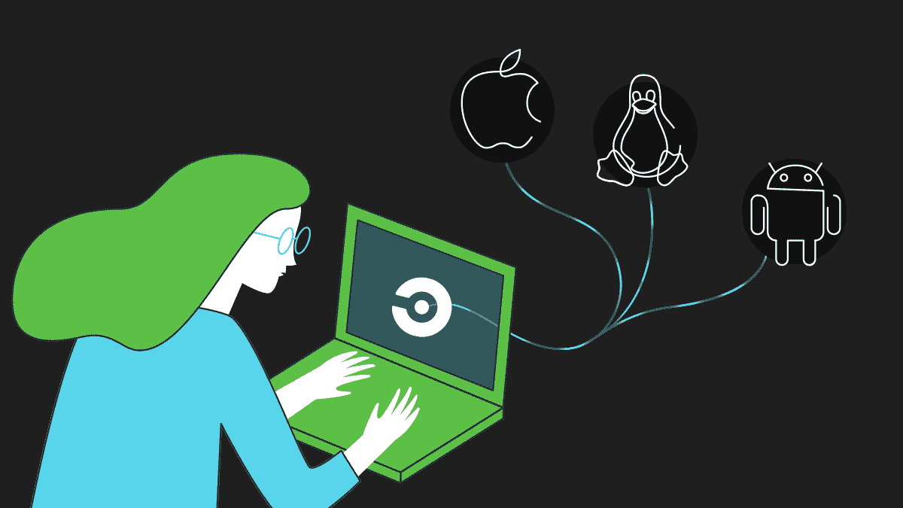

# 还有一点:苹果开发者现在可以在 CircleCI 2.0 - CircleCI 上为 macOS、iOS、tvOS 和 watchOS 构建

> 原文：<https://circleci.com/blog/one-more-thing-apple-developers-can-now-build-for-macos-ios-tvos-and-watchos-on-circleci-2-0/>

**来自出版商的说明:**您已经找到了我们的一些旧内容，这些内容可能已经过时和/或不正确。尝试在[我们的文档](https://circleci.com/docs/)或[博客](https://circleci.com/blog/)中搜索最新信息。

* * *

从今天开始，CircleCI 2.0 可供为 iOS、macOS、tvOS 或 watchOS 构建应用程序的客户使用。为苹果设备构建的团队现在可以访问工作流来定制他们的应用交付管道，使用单个配置文件为苹果平台、Android 和 Linux 构建，并完全控制他们的 Xcode 版本。

开发人员现在还可以安排作业，使得在 App Store 和谷歌 Play 商店中跨所有操作系统同时更新应用等任务变得容易。

### 推一次，处处测试

CircleCI 2.0 是为希望获得快速反馈的团队而构建的:一旦完成拉取请求，最新版本的应用程序将自动部署到试飞中。这使得在 iPhones、Apple Watches、MAC 和 Apple TV 上一次性更新和测试您的应用程序变得非常容易。因为构建现在可以通过一个配置文件在 macOS 和 Linux 上运行，团队现在也可以使用他们自己的定制 Docker 映像来[在他们的 pull 请求](https://circleci.com/docs/testing-ios/)中运行 Danger 和 SwiftLint 等流行工具，而不必等待这些工具安装在 Mac 机器上。对于那些想要为他们构建的所有操作系统整合他们的工具链的团队来说，这个更新也应该是令人兴奋的。拥有为不同操作系统构建的多个团队的组织现在可以在一个工具上简化他们的流程，有助于确保一致性、顺利扩展并节省时间。

### 选取您自己的 Xcode 版本

有了 CircleCI 2.0，跟上苹果的更新和 Xcode 版本就容易多了。我们已经添加了对跨所有作业容纳多个 Xcode 版本的支持。这意味着您可以完全控制所使用的 Xcode 版本，确保作业在符合每个应用程序要求的版本上运行，并且依赖关系始终是最新的。想在并行作业中运行 Xcode 9.0 和 9.0.1 的测试吗？没问题。

### 加入 React Native、Envoy、Lyft 和许多其他应用程序——在 CircleCI 2.0 上灵活地构建您的应用程序

> " [Envoy](https://github.com/envoyproxy/envoy) 旨在通过简化微服务架构的扩展来帮助团队避免重复和无差别的繁重工作。我们一直在寻找一个共享这一理念的解决方案，并允许我们在相同的配置中构建 macOS 和 Linux。我们在切尔莱西找到的。通过使用工作流，我们能够在超大机器上运行我们的 Linux 作业，同时运行我们的 macOS 构建，这使得一次为多个操作系统进行构建、测试和部署变得非常容易。”
> –马特·克莱恩，Lyft 软件工程师兼 Envoy 维护人员

> “ [React Native](https://github.com/facebook/react-native) 项目最近迁移到 CircleCI 2.0，以利用更快的构建时间和工作流。由于能够同时构建 iOS、Android 和 Linux 作业，我们能够从多个 CI 平台中辞职，并将一切(包括自动化部署)与我们新的 CircleCI 设置相集成。”
> ——迈克·格拉博斯基，React Native 的撰稿人

> “我非常喜欢 macOS 的 CircleCI 2.0！我喜欢作业强大的可配置性和可定制性，绝对的速度，以及跨平台 macOS/Linux 作业并发运行的能力。”Lyft 的 iOS 开发人员 JP Simard

查看我们关于 circle ci 2.0iOS 项目的[文档，今天就开始构建。](https://circleci.com/docs/ios-tutorial/)

如果您还没有在 CircleCI 上构建 iOS，请从这个针对 iOS 项目的[入门指南](https://circleci.com/docs/ios-tutorial/)开始。