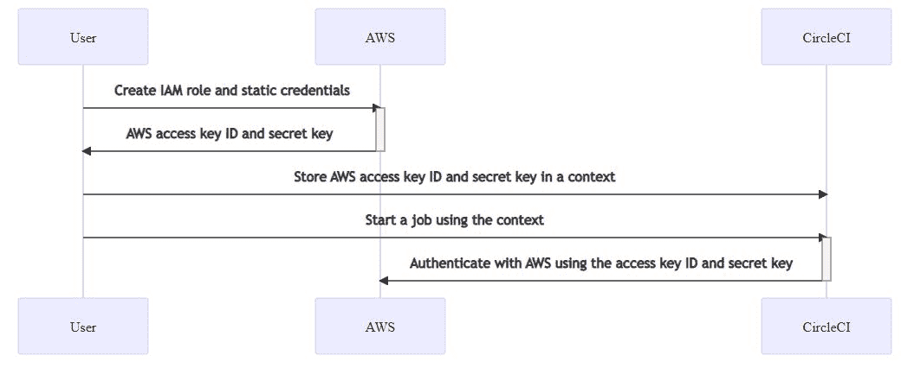
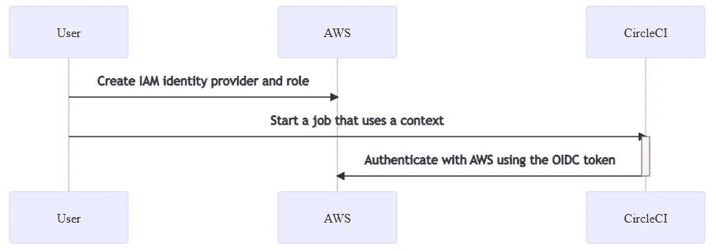
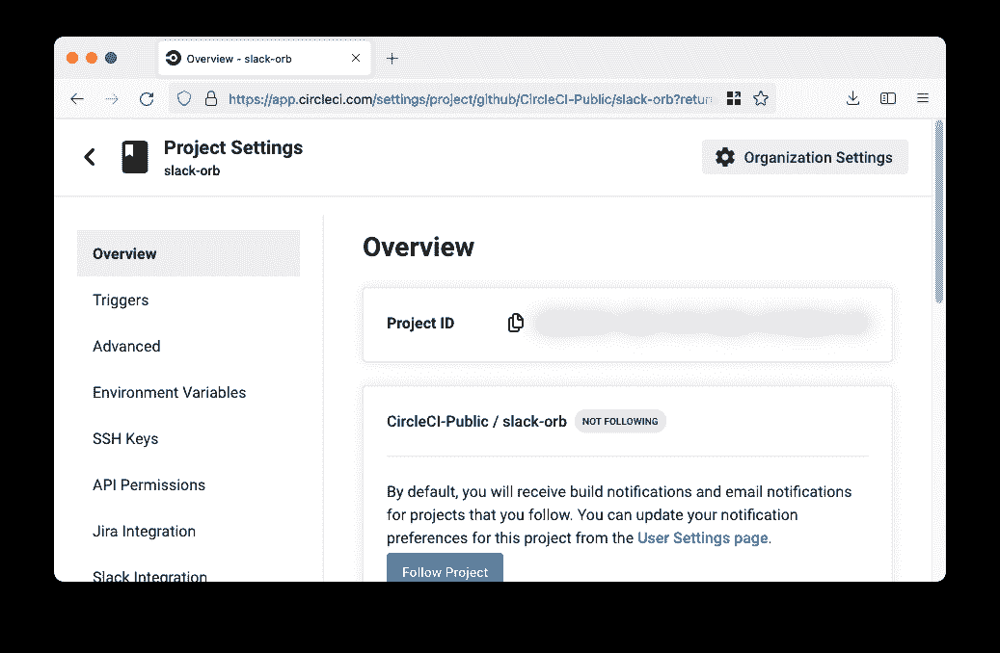

# 使用 OpenID Connect 身份令牌向云提供商认证作业| CircleCI

> 原文：<https://circleci.com/blog/openid-connect-identity-tokens/>

在 CircleCI 作业中引入 OpenID Connect 身份令牌！此令牌使您的 CircleCI 作业能够向支持 OpenID Connect 的云提供商(如 AWS、Google 云平台和 HashiCorp Vault)进行身份验证。在这篇博文中，我们将向您介绍 OpenID Connect，解释它在 CI/CD 系统中的用途，并展示如何使用它通过 AWS 和 GCP 进行身份验证，让您的 CircleCI 作业安全地与您的帐户交互，而无需任何静态凭据。

如果您对使用 OIDC 向第三方凭证管理器进行认证感兴趣，您还可以查看我们关于使用 OIDC 将 CircleCI 与 HashiCorp Vault 集成的教程[。](https://circleci.com/blog/oidc-with-vault/)

## 什么是 OpenID Connect？

OpenID Connect (OIDC)是一种认证协议，允许云服务验证最终用户的身份。它向 OAuth2.0 添加了一个身份层，oauth 2.0 是一个授权协议，用于提供对云资源的单点登录(SSO)访问。自 2014 年推出以来，云提供商已经广泛采用 [OpenID Connect](https://www.zdnet.com/article/cloud-era-authentication-infrastructure-taking-shape/) 作为提供对受保护资源的安全访问的标准。

根据 [OpenID Connect Foundation](https://openid.net/foundation/) ， [OpenID](https://openid.net/connect/) “允许客户端基于授权服务器执行的认证来验证最终用户的身份。”当您使用 CircleCI 的 OpenID 连接令牌时，客户端是 AWS 等云提供商。最终用户是你在 CircleCI 运行的作业。授权服务器本身就是 CircleCI。

综上所述，这意味着像 AWS 这样的云提供商可以验证您的作业的身份，并允许它像经过身份验证的用户一样采取行动。这意味着您的工作可以安全地与 AWS 交互。

## 为什么 OpenID Connect 在 CI/CD 中有用？


在您的 CI 工作流中，您可能想要将二进制文件、测试工件或者日志上传到云存储中。也许您想要将一个包提交给一个工件存储库。或者您可能想要部署到您的生产环境中。如果您想要安全地访问这些云资源中的任何一个，您的作业需要拥有凭据以通过云提供商的身份验证。CircleCI 的[上下文](https://circleci.com/docs/contexts/)让您安全地存储凭证，并在整个组织的工作中使用它们。



但是，这些凭据是静态的。物理密钥授予对空间的访问权，直到锁被更改，类似地，这些[静态凭证在您轮换它们](https://circleci.com/blog/securing-ci-cd-pipelines-with-circleci-contexts-rest-api/)之前是有效的，这可能是您想要做的安全最佳实践。您可以使用 [CircleCI CLI](https://circleci.com/docs/local-cli/#context-management) 或 [CircleCI API for Contexts](https://circleci.com/docs/api/v2/#operation/addEnvironmentVariableToContext/) 在 CircleCI web UI 中旋转按键。

轮换需要时间投入，这会降低您的工程能力。OpenID 连接令牌避免了这个缺点。当您将云提供商配置为信任来自 CircleCI 作业的 OpenID Connect 令牌时，您的云提供商将识别 CircleCI 的签名，并将您的作业请求视为可信。您的作业可以安全地与您的云提供商进行交互，以便您可以上传到云存储，更改生产状态，或者执行您决定允许的任何操作。



当您的 CircleCI 作业启动时，CircleCI 会对 OpenID 连接令牌进行签名，并使其可供您的作业使用。您的作业可以将此令牌提交给您的云提供商，云提供商将验证其真实性，授予您的作业临时凭据，并允许它采取一些操作。

你可以在我们的[文档](https://circleci.com/docs/openid-connect-tokens/)中读到 CircleCI 的 OIDC 令牌的结构。

## 使用 OpenID 连接令牌从 CircleCI 作业与 AWS 进行交互

下面是一个如何使用 CircleCI 的 OpenID 连接令牌与 AWS 交互的示例。首先，我们将进行一次性设置，将您的 AWS 帐户配置为信任 CircleCI 的 OpenID Connect 令牌。然后，我们将运行一个作业，该作业使用令牌与 AWS 进行交互，并将图像上传到 ECR。

### 设置 AWS

首先，在 AWS 中创建 IAM 身份提供者和 IAM 角色。这允许您的 AWS 帐户信任 CircleCI 的 OpenID 连接令牌。你只需要做一次。

在 IAM 中，创建一个 OpenID Connect [身份提供者](https://docs.aws.amazon.com/IAM/latest/UserGuide/id_roles_providers_create_oidc.html)。您将需要您的组织 ID，您可以通过转到您的 CircleCI 组织设置并从概览页面复制组织 ID 来找到它。

对于提供者 URL，提供`https://oidc.circleci.com/org/<organization-id>`，其中`<organization-id>`是您的 CircleCI 组织的 ID。

对于受众，请提供相同的组织 ID。

在 IAM 中，[创建一个角色](https://docs.aws.amazon.com/IAM/latest/UserGuide/id_roles_create_for-idp_oidc.html#idp_oidc_Create)。对于受信任的实体，选择 **Web 身份**，然后选择您之前创建的身份提供者。对于观众，选择唯一选项，即**添加权限**。这允许您指定 CircleCI 作业可以做什么和不可以做什么。只选择您的工作需要的权限，这是一个 [AWS 最佳实践](https://docs.aws.amazon.com/IAM/latest/UserGuide/best-practices.html#grant-least-privilege)。

**注:** *你可能会发现[创建自己的策略](https://docs.aws.amazon.com/IAM/latest/UserGuide/access_policies_create-console.html#access_policies_create-start)* 很有用。

### 从 CircleCI 作业与 AWS 交互

现在您已经设置了一个 IAM 角色，您已经准备好编写一个与 AWS 交互的 CircleCI 作业了。最简单的方法是使用 CircleCI 的 [AWS CLI orb](https://circleci.com/developer/orbs/orb/circleci/aws-cli) 来生成临时密钥，并配置一个使用 OIDC 的配置文件。

orb 是可重用的 YAML 配置包，它将重复的配置压缩成一行代码。在这种情况下，AWS CLI orb 使您能够在配置中仅用六行或更少的代码生成临时会话令牌、AWS 访问密钥 ID 和 AWS 秘密访问密钥。CircleCI 有几个支持多种 AWS 服务的 orb。你可以在我们的[开发者中心](https://circleci.com/developer/orbs?query=aws&page=1&pageSize=15)找到它们。

首先，在您想要使用 OIDC 的工作流程中选择 CircleCI 作业。确保这些作业中的每一个都使用有效的 [CircleCI 上下文](https://circleci.com/docs/contexts/)。OpenID 连接令牌仅适用于至少使用一个上下文的作业。上下文可能不包含环境变量。你可以在我们的 [OIDC 代币文档](https://circleci.com/docs/openid-connect-tokens/)中读到 CircleCI 的 OIDC 代币。

在你的配置中，一定要导入`aws-cli` orb。接下来，在与任何 AWS 服务交互之前，在您的作业中运行`aws-cli/setup`命令。您需要为`aws-cli/setup`命令提供与您在上一步中创建的角色相关联的`role-arn`以及您的`aws-region`。您可以选择提供一个`profile-name`、`role-session-name`和`session-duration`。

如果您提供一个`profile-name`，临时密钥和令牌将被配置到指定的配置文件。您必须对其余的 AWS 命令使用相同的`profile-name`。否则，如果没有提供密钥和令牌，它们将被配置为默认配置文件。此外，如果您不提供`role-session-name`或`session-duration`，它们的默认值分别是`${CIRCLE_JOB}`(您的作业名称)和`3600`秒。

下面是一个完整的配置文件示例，其中包含一个使用 OIDC 配置概要文件并使用它登录 AWS ECR 的作业。您可以使用这个配置文件来运行其他 AWS 命令，比如 S3、EKS、ECS 等等，只要已经为`role-arn`配置了适当的权限。

```
version: '2.1'
orbs:
 # import CircleCI's aws-cli orb
 aws-cli: circleci/aws-cli@3.1
jobs:
 aws-example:
   docker:
     - image: cimg/aws:2022.06
   steps:
     - checkout
     # run the aws-cli/setup command from the orb
     - aws-cli/setup:
         role-arn: 'arn:aws:iam::123456789012:role/OIDC-ROLE'
         aws-region: "us-west-1"
         # optional parameters
         profile-name: "OIDC-PROFILE"
         role-session-name: “example-session”
         session-duration: 1800
     - run:
         name: Log-into-AWS-ECR
         command: |
           # must use same profile specified in the step above       
           aws ecr get-login-password --profile "OIDC-PROFILE"
workflows:
 OIDC-with-AWS:
   jobs:
     - aws-example:
         # must use a valid CircleCI context
         context: aws 
```

### 高级用法

你可以利用 CircleCI 的 [OIDC 令牌](https://circleci.com/docs/openid-connect-tokens/#format-of-the-openid-connect-id-token)中声明的格式来限制你的 CircleCI 作业在 AWS 中可以做什么。例如，如果某些项目应该只能访问某些 AWS 资源，您可以限制您的 IAM 角色，以便只有特定项目中的 CircleCI 作业可以担任该角色。

为此，请编辑您的 IAM 角色的信任策略，以便只有您选择的项目中的 OIDC 令牌才能担任该角色。信任策略决定了在什么条件下可以担任该角色。

首先，在**项目设置>概述**下找到你项目的项目 ID。



然后将以下条件添加到您的角色的信任策略中，以便只有您选择的项目中的作业可以担任该角色:

```
"StringLike": {
  "oidc.circleci.com/org/<your organization ID>:sub": "org/<your organization ID>/project/<your project ID>/user/*"
} 
```

它使用 [StringLike](https://docs.aws.amazon.com/IAM/latest/UserGuide/reference_policies_elements_condition_operators.html#Conditions_String) 来匹配 CircleCI 的 OIDC 令牌在您选择的项目中的子声明。现在，您的其他项目中的工作不能承担这个角色。

## 使用 CircleCI OIDC 代币向 GCP 认证

您需要部署一些 GCP 基础设施，以便 GCP 能够识别 CircleCI 发送的令牌。需要创建三种资源:

*   工作负载身份池
*   工作负载身份池提供程序
*   服务帐户

您可以手动或使用 Terraform 以编程方式完成此操作。我们将在本文中讨论这两个问题。开始之前，您需要检索您的组织 ID。登录 [CircleCI](https://app.circleci.com/) 点击**组织设置**即可找到。您的 ID 将显示在页面的顶部。记下您的 ID，以便在后面的步骤中使用。

### 手动创建 GCP 资源

要创建工作负载标识池及其提供者，请导航到[工作负载标识池](https://console.cloud.google.com/iam-admin/workload-identity-pools)页面，然后单击**创建池**。命名您的池并选择 **Open ID Connect (OIDC)** 作为提供商。选择提供商名称和提供商 ID。接下来，将发行者 URL 设置为`https://oidc.circleci.com/org/<YOUR ORGANIZATION ID>`。点击**允许的观众**并输入您的组织 ID。在属性映射下，配置以下属性:

```
google.subject = assertion.sub
attribute.org_id = assertion.aud 
```

单击“保存”创建新的工作量标识池和工作量标识池提供程序。

下一步是将服务帐户绑定到工作负载标识池。[创建一个服务帐户](https://cloud.google.com/iam/docs/creating-managing-service-accounts)或使用一个现有的帐户，该帐户有权执行管道作业所需的 GCP 操作。接下来，从 Workload Identity Pools 页面中选择您新创建的工作量身份池。点击页面顶部的**授予访问权限**。从下拉菜单中选择服务帐户。接下来，单击【仅 匹配过滤器的身份，选择 **org_id** 作为属性名称，输入您的 CircleCI 组织 id 作为属性值，然后单击**保存**。关闭“配置您的应用程序”提示。

此时，所有必需的 GCP 资源都应该准备就绪。

### 使用 Terraform 以编程方式创建资源

此 GitHub repo 包含一个 Terraform 计划，该计划将部署使用 CircleCI OIDC 令牌进行身份验证所需的 GCP 基础架构。如果您之前没有在 GCP 使用过 Terraform，您需要[安装 Terraform](https://learn.hashicorp.com/tutorials/terraform/install-cli) 并[配置它以与 GCP](https://registry.terraform.io/providers/hashicorp/google/latest/docs/guides/getting_started#configuring-the-provider) 一起使用。

要使用该计划，请填写示例文件`terraform.tfvars`，然后运行`terraform validate`和`terraform plan`。如果输出看起来不错，您可以使用`terraform apply`来部署资源。有关 Terraform 计划如何运作的更多详细信息，请查看 repo 的自述文件。

## 使用 oidc 令牌从 circleci 作业使用 gcp 进行身份验证

[这个 GitHub repo](https://github.com/jtreutel/circleci-gcp-oidc-test) 包含了如何在 CircleCI 作业中使用 gcloud 向 GCP 认证的示例。相关的配置部分如下所示。此配置中的命令需要四个环境变量:

*   `GCP_PROJECT_ID`
*   `GCP_WIP_ID`
*   `GCP_WIP_PROVIDER_ID`
*   `GCP_SERVICE_ACCOUNT_EMAIL`

您可以在上下文中或在项目级别配置它们。如果您需要使用多个 GCP 项目，我们建议您创建一个上下文来保存每个项目的变量。如果您需要在一个 GCP 项目中使用多个服务帐户，您可以在作业级别使用环境键来覆盖`GCP_SERVICE_ACCOUNT_EMAIL`的值，如[所示，例如](https://github.com/jtreutel/circleci-gcp-oidc-test/blob/master/.circleci/config.yml#L76)。这个示例作业中的验证步骤假设服务帐户拥有执行`gcloud iam service-accounts get-iam-policy`的权限。

```
version: "2.1"

orbs:
  gcp-cli: circleci/gcp-cli@2.4.1

commands:
  gcp-oidc-generate-cred-config-file:
    description: "Authenticate with GCP using a CircleCI OIDC token."
    parameters:
      project_id: 
        type: env_var_name
        default: GCP_PROJECT_ID
      workload_identity_pool_id: 
        type: env_var_name
        default: GCP_WIP_ID
      workload_identity_pool_provider_id: 
        type: env_var_name
        default: GCP_WIP_PROVIDER_ID
      service_account_email: 
        type: env_var_name
        default: GCP_SERVICE_ACCOUNT_EMAIL
      gcp_cred_config_file_path: 
        type: string
        default: /home/circleci/gcp_cred_config.json
      oidc_token_file_path: 
        type: string
        default: /home/circleci/oidc_token.json
    steps:
      - run:
          command: |
            # Store OIDC token in temp file
            echo $CIRCLE_OIDC_TOKEN > << parameters.oidc_token_file_path >>
            # Create a credential configuration for the generated OIDC ID Token
            gcloud iam workload-identity-pools create-cred-config \
                "projects/${<< parameters.project_id >>}/locations/global/workloadIdentityPools/${<< parameters.workload_identity_pool_id >>}/providers/${<< parameters.workload_identity_pool_provider_id >>}"\
                --output-file="<< parameters.gcp_cred_config_file_path >>" \
                --service-account="${<< parameters.service_account_email >>}" \
                --credential-source-file=<< parameters.oidc_token_file_path >>
  gcp-oidc-authenticate:
    description: "Authenticate with GCP using a GCP credentials file."
    parameters:
      gcp_cred_config_file_path: 
        type: string
        default: /home/circleci/gcp_cred_config.json
    steps:
      - run:
          command: |
            # Configure gcloud to leverage the generated credential configuration
            gcloud auth login --brief --cred-file "<< parameters.gcp_cred_config_file_path >>"
            # Configure ADC
            echo "export GOOGLE_APPLICATION_CREDENTIALS='<< parameters.gcp_cred_config_file_path >>'" | tee -a $BASH_ENV
jobs:
  gcp-oidc-defaults:
    executor: gcp-cli/default
    steps:
      - gcp-cli/install
      - gcp-oidc-generate-cred-config-file
      - gcp-oidc-authenticate
      - run:
          name: Verify that gcloud is authenticated
          environment:
            GCP_SERVICE_ACCOUNT_EMAIL: jennings-oidc-test@makoto-workbench.iam.gserviceaccount.com
          command: gcloud iam service-accounts get-iam-policy "${GCP_SERVICE_ACCOUNT_EMAIL}"
      - run:
          name: Verify that ADC works
          command: |
              ACCESS_TOKEN=$(gcloud auth application-default print-access-token)
              curl -f -i -H "Content-Type: application/x-www-form-urlencoded" -d "access_token=${ACCESS_TOKEN}" https://www.googleapis.com/oauth2/v1/tokeninfo

workflows:
  main:
    jobs: 
      - gcp-oidc-defaults:
          name: Generate Creds File and Authenticate
          context: 
          - gcp-oidc-dev 
```

## GCP 的高级 OIDC 用法

到目前为止，我们已经完成了使用 OIDC 令牌向 GCP 进行身份验证所需的最低配置。根据[最小特权](https://circleci.com/blog/minimize-risk-using-the-principle-of-least-privilege-and-aws-iam-permissions/)的原则，我们建议配置您的工作负载身份池提供者，根据 OIDC 令牌的声明限制访问。这可以通过以 [CEL 表达式](https://github.com/google/cel-spec)的形式向提供者添加属性条件来实现。

CEL 表达式可以使用 CircleCI 标记中包含的声明来限制谁能够模拟服务帐户。除了一些常见的标准声明之外，令牌还包含对项目 ID 和上下文的声明。

以下是限制特定组织和用户访问的表达式示例:

```
attribute.org_id=='01234567-89ab-cdef-0123-4567890abcde' && 
google.subject.matches('org/([\da-f]{4,12}-?){5}/project/([\da-f]{4,12}-?){5}/user/76543210-ba98-fedc-3210-edcba0987654') 
```

下面是另一个将访问权限限制在能够访问特定上下文的用户的示例(参见我们的文档以了解更多关于如何限制对上下文的访问的信息):

```
attribute.org_id=='01234567-89ab-cdef-0123-4567890abcde' && 
attribute.context_id=='76543210-ba98-fedc-3210-edcba0987654' 
```

以下示例将限制特定项目的任何用户的访问权限:

```
attribute.org_id=='01234567-89ab-cdef-0123-4567890abcde' && 
attribute.project_id=='76543210-ba98-fedc-3210-edcba0987654' 
```

您可以使用这些声明来分别限制对单个项目中的作业或对特定上下文具有访问权限的用户的访问。有关 CircleCI OIDC 代币索赔的更多详细信息，请参见我们的[文档](https://circleci.com/docs/openid-connect-tokens/#format-of-the-openid-connect-id-token)。

## 结论

干得好！过去使用上下文的作业现在包含 CircleCI 的 [OpenID 连接令牌](https://circleci.com/docs/openid-connect-tokens/)。使用这些令牌在您的工作中安全地与云提供商交互，而没有密钥轮换的负担。