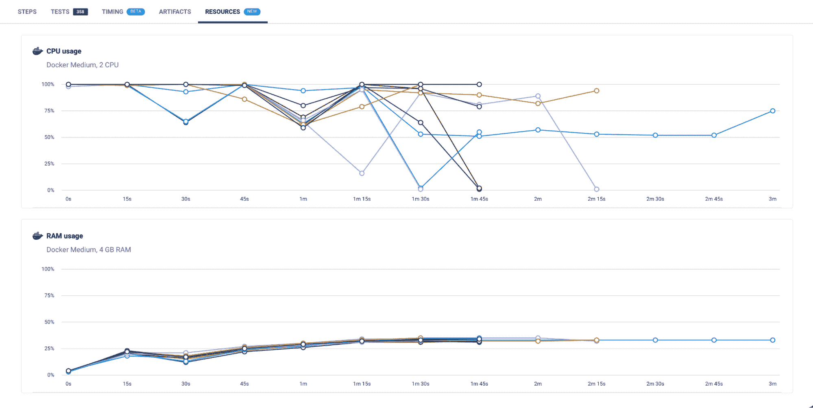

# 使用 CircleCI 资源仪表板| CircleCI 优化您的资源类

> 原文：<https://circleci.com/blog/optimize-resources-dashboard/>

本文由史蒂夫·阿尔米和拉迪卡·古拉提共同撰写。

CircleCI cloud 在多个执行环境中提供了 20 多个资源类(不同的 CPU 和 RAM)。为您的工作找到最佳的资源类大小——不要太大也不要太小——有时可能是一个挑战。

为了帮助解决这个问题，您可以在 UI 中查看 Docker、Linux、Windows、macOS、Arm 和 GPU 执行器的 CPU 和 RAM 使用情况。

仪表板位于作业详细信息页面的资源选项卡中，显示作业中所有并行运行的 CPU 和 RAM。

了解您工作中利用的资源将有助于您的团队通过以下方式优化您的 CircleCI 体验:

*   更大的资源类，以最大限度地减少等待验证更改所花费的时间
*   有机会将较轻的工作负载转移到较小的资源类别，并将配额重新分配给更密集的工作负载
*   CircleCI 平台上优化的信用消费

在使用 CI/CD 平台时，更深入地了解您如何使用资源非常重要。我们的工程团队将致力于改进和扩展资源利用率仪表板，以支持更多的资源类类型。

我们继续依赖您的反馈。请通过 [Canny](https://circleci.canny.io/cloud-feature-requests) 分享您的想法，让我们知道资源仪表板如何帮助您的团队以及您希望看到的新功能。