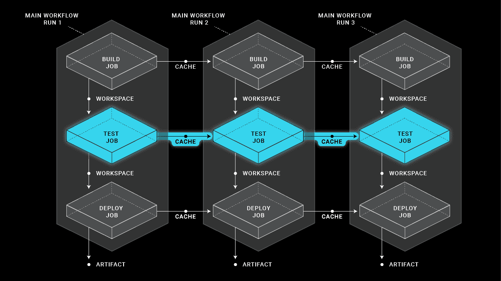
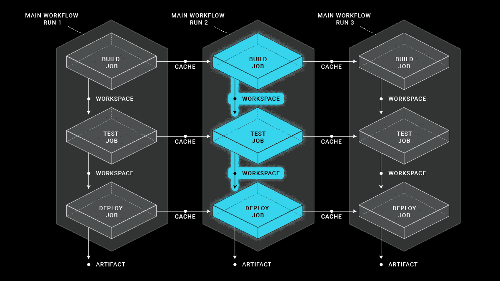
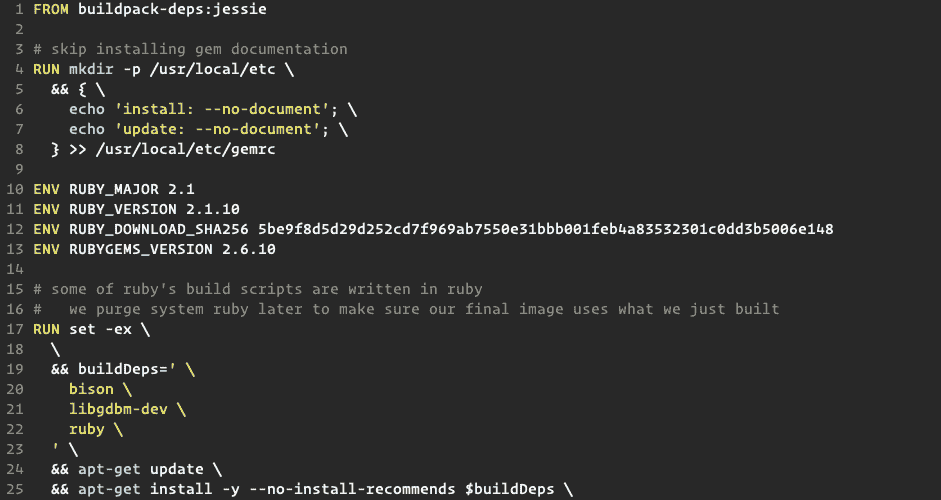
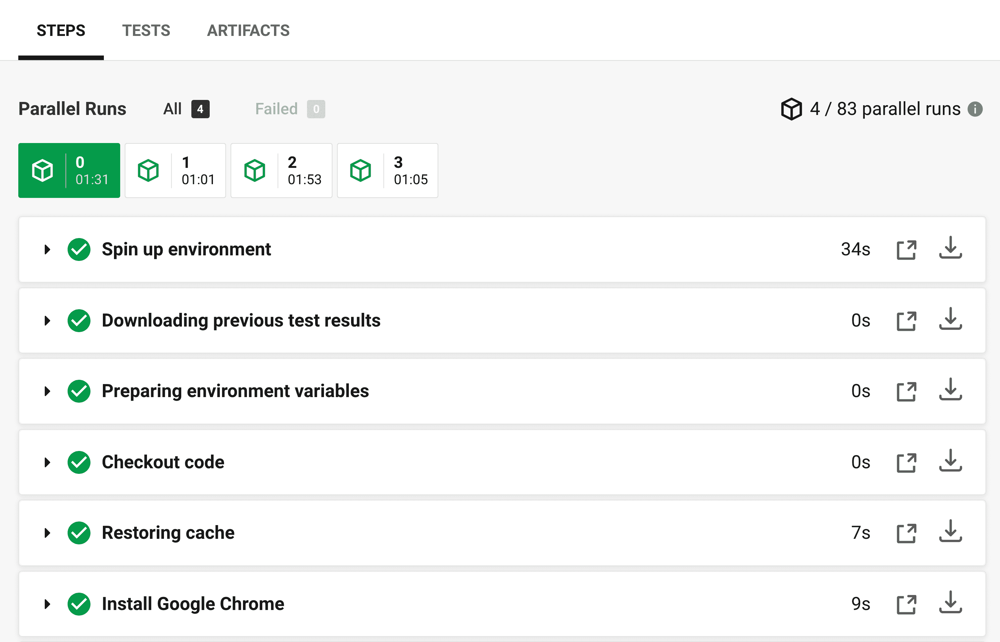
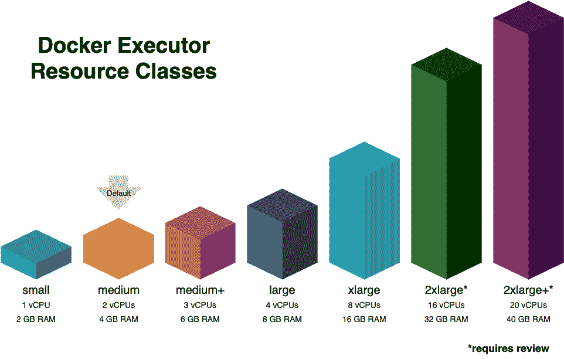
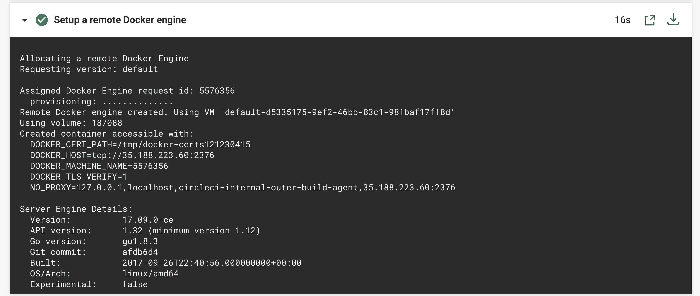
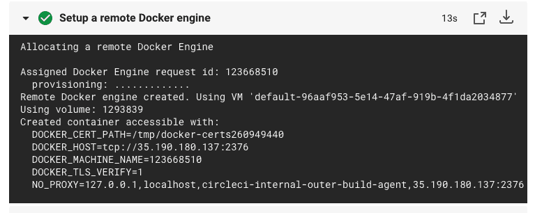
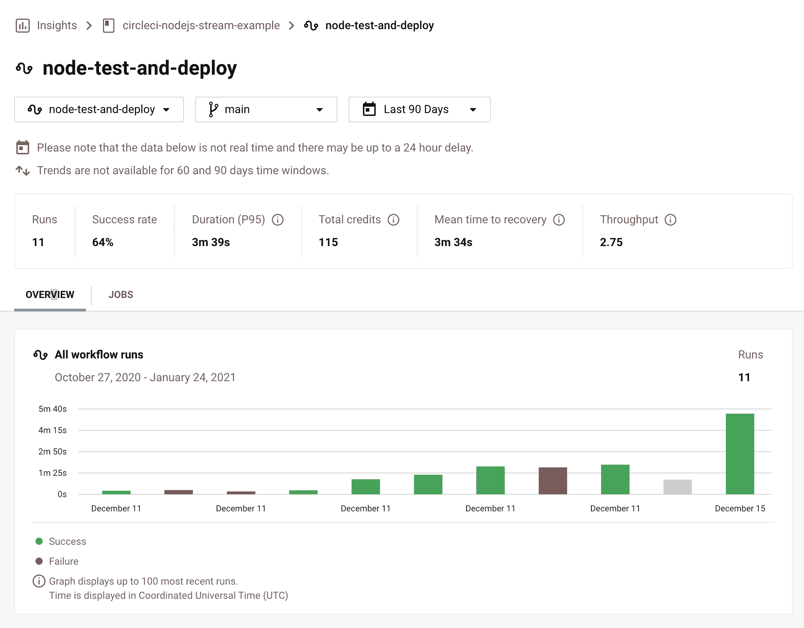
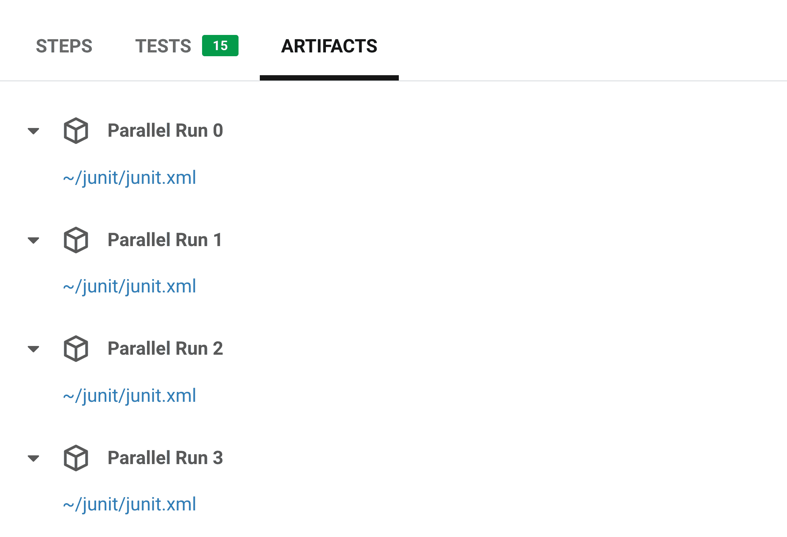
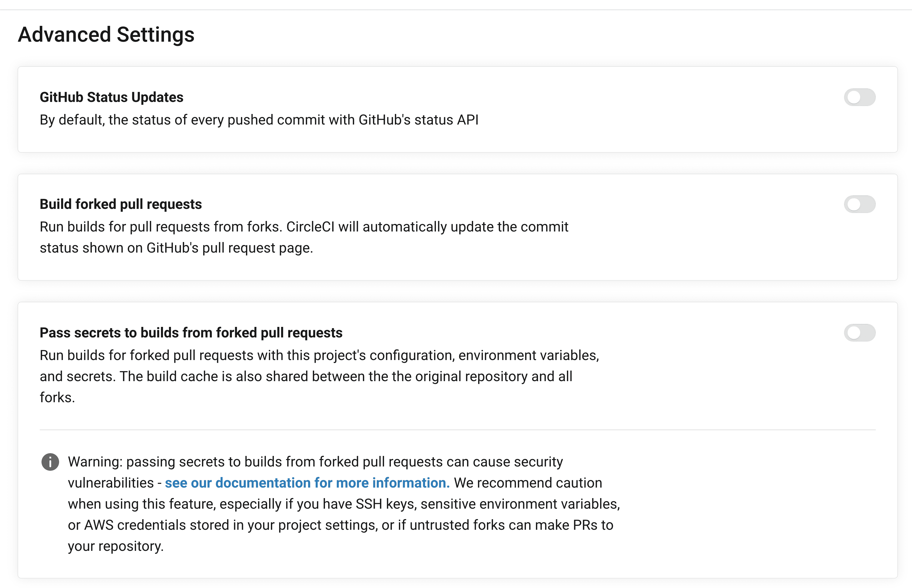

# 优化 OSS 版本| CircleCI

> 原文：<https://circleci.com/blog/optimizing-open-source-projects-on-circleci/>

在之前的一篇博客文章中，我写了我如何在 CircleCI 上优化 React Native Camera 的构建。我们从这项工作中了解到，维护人员甚至没有意识到这些优化。我所做的一切都可以在[我们的文档](https://circleci.com/docs/)中参考，但正如那句老话所说，“你不知道你不知道的。”现在，我们想借此机会推广 CircleCI 上所有项目可用的大量优化。

构建时间非常宝贵，尤其是当你是一个预算有限的 OSS 项目时。我们的文档中有一页是专门针对[优化](https://circleci.com/docs/optimizations/#section=projects)的，但是我们决定写一篇博客文章来强调和介绍使我们的平台与众不同的各种功能。

以下几乎所有的特性都是免费的，任何用户都可以使用，无论是私人项目还是公共项目。高级功能将被如此标记。尽管我很想为更多的项目开放 PRs，但这并不实际。我能做的下一件最好的事情是给每个人配备知识和资源，让他们自己去做。

## CircleCI 的优化特性

CircleCI 有许多特性，开发人员可以使用它们来加速构建和部署。

### 依赖缓存



我们系统中的每项工作都在一个全新的环境中运转。这是为了防止以前的工作和意外行为造成的污染。但这意味着同一作业的后续运行将再次下载相同的依赖项。

为了解决这个问题，我们提供了[依赖缓存](https://circleci.com/docs/caching/)。您可以缓存项目的依赖项，从而大大加快构建过程。

#### 依赖关系缓存的示例

例如，如果构建一个 Node.js 应用程序，您应该缓存`node_modules`。你将缓存存储为一个键，我们有[个模板](https://circleci.com/docs/caching/#using-keys-and-templates)可以用于这个键。

在下面的例子中，我将我的`node_modules`文件夹缓存到一个包含`package.json`的 SHA256 的键中。这样，如果我的依赖项发生变化，缓存键也会发生变化，随后会为新的依赖项创建一个新的缓存。有些人可能会选择使用他们的`package.lock`或`yarn.lock`文件的校验和。

```
version: 2.1
jobs:
  my-job:
    executor: my-executor
    steps:
      - checkout
      - restore_cache:
          keys:
            - v1-dependencies-{{ checksum "package.json" }}
            - v1-dependencies- # Fallback cache
      - run: yarn
      - save_cache:
          key: v1-dependencies-{{ checksum "package.json" }}
          paths:
            - node_modules 
```

有关更多信息和示例，请访问我们的 awesome 文档:

### 与工作区共享文件和工件



正如上一节提到的，我们系统中的每个作业都在一个全新的环境中旋转。为了在工作流中的作业之间共享文件和工件，您可以使用[工作区](https://circleci.com/docs/workflows/#using-workspaces-to-share-data-among-jobs)。工作区允许您轻松地将工作从一项工作转移到下一项工作，以避免重复劳动。

#### 跨工作区共享文件的示例

在下面的例子中，我将我的 Go 二进制构建和 Docker 映像构建分离到不同的作业中。为了避免再次克隆存储库和/或重做构建，我已经通过工作区转移了所需的文件。

```
version: 2.1
jobs:
  my-build-job:
    executor: my-executor
    steps:
      - checkout
      - run: go build -o APP_NAME cmd/**/*.go
      - persist_to_workspace:
          root: .
          paths:
            - Dockerfile
            - cmd
            - internal
            - go.mod
            - go.sum
  my-docker-job:
    executor: my-other-executor
    steps:
      - attach_workspace:
          at: .
      - run: docker build -t TAG_NAME . 
```

有关更多信息和示例，请访问我们的 awesome 文档:

### 重用以前构建的 Docker 映像

特别是，工作区对于在作业之间传输构建的 Docker 图像非常有用。我们的许多客户都在我们的平台上进行 Docker 构建，在某些情况下，他们将构建 Docker 映像和测试分开进行。

您可以通过使用`docker save`和`docker load`命令传输保存的图像。

#### 重复使用先前构建的 Docker 映像的示例

在本例中，我在第一个作业中构建了 Docker 映像，并在将其保存到工作空间之前将其写入`docker-cache/image.tar`。下一个作业连接到那个工作区，然后在运行它和测试套件之前加载映像。

```
version: 2.1
jobs:
  my-build:
    executor: my-executor
    steps:
      - checkout
      - setup_remote_docker
      - run:
          name: Build and Save Docker Image
          command: |
            docker build -t MY_APP:MY_TAG .
            mkdir docker-cache
            docker save -o docker-cache/image.tar MY_APP:MY_TAG
      - persist_to_workspace:
          root: .
          paths:
            - docker-cache
  my-test:
    machine: true
    steps:
      - attach_workspace:
          at: .
      - run:
          name: Load, Run Docker Image and Tests
          command: |
            docker load < docker-cache/image.tar
            docker run -d -p 8080:80 MY_APP:MY_TAG
            mvn test -Dhost=http://localhost:8080 
```

### 创建自定义 Docker 图像执行器



我们的平台提供了各种[执行环境](https://circleci.com/docs/executor-types/)，其中之一就是 Docker。我们有针对各种框架和语言的[便利图片](https://circleci.com/docs/circleci-images/)，对于大多数用例，我们建议使用这些图片作为起点。然而，对于非常高级或复杂的用例，您可以轻松地制作自己的[定制 Docker 图像](https://circleci.com/docs/custom-images/)来用作执行者。

通过使用自定义映像，您可以使用所有必需的依赖项和所需的任何其他设置来预烤环境。默认情况下，我们从 Docker Hub 获取图像，但是如果您需要从其他来源获取图像(使用 auth ),您可以在配置中轻松更改。请记住指定完整的 URL:

```
version: 2.1
jobs:
  build:
    docker:
      - image: quay.io/project/IMAGE:TAG
        auth:
          username: $QUAY_USER
          password: $QUAY_PASS 
```

有关更多信息和示例，请访问我们的 awesome 文档:

### 测试拆分和并行性



您还可以在我们的平台中使用[测试分割和并行](https://circleci.com/docs/parallelism-faster-jobs/)。通过拆分测试并并行运行不同的工作负载，您可以极大地减少测试套件的挂钟时间。我们的免费计划中的开源组织在 Linux、Docker、Arm 和 Windows 版本上享有高达 30 倍的并发性，而我们的性能计划客户在所有执行者上享有高达 80 倍的并发性。如果您对您团队的更多资源感兴趣，[今天就联系我们](https://support.circleci.com/hc/en-us/requests/new)。

有关更多信息和示例，请访问我们的 awesome 文档:

### 可配置资源



默认情况下，所有执行环境都在中等大小上运行，这取决于执行器的类型。然而，我们的平台允许用户灵活地[为他们的构建配置不同的资源](https://circleci.com/docs/configuration-reference/#resource_class)(vcpu 和 RAM)。

有些工作不需要很多资源，所以你可以选择一个`small` Docker 容器来节省计算和信用。但是还有其他工作会受益于一个`2xlarge+`集装箱。无论如何，CircleCI 可以配置为满足您的工作负载需求。

#### 使用可配置资源的示例

在这个例子中，我已经指定我的构建使用`xlarge`资源类，这意味着我将拥有 8 个 vCPUs 和 16GB RAM。这只是对配置的一行修改。

```
version: 2.1
jobs:
  build:
    docker:
      - image: circleci/node:10.15.1-browsers
    resource_class: xlarge
    steps:
      # ... steps here 
```

### Docker 层缓存



对于构建 Docker 图像的客户，他们可以利用一个叫做 [Docker 层缓存](https://circleci.com/docs/docker-layer-caching/)的功能。正如您可以缓存应用程序的依赖关系一样，您也可以缓存 Docker 映像层，以加快 Docker 映像的后续构建。

为了最好地利用这个特性，你会希望把不断变化的项目(例如，复制或添加源代码等。)在 Dockerfile 文件的底部附近，最不频繁改变的项目在顶部。

#### Docker 层缓存示例

使用它就像给 YAML 添加一个额外的键一样简单。如果将 Docker 执行器与远程 Docker 一起使用:

```
jobs:
  build:
    executor: my-executor
    steps:
      - checkout
      - setup_remote_docker:
          docker_layer_caching: true
      # ... other steps here 
```

或者，如果使用我们的`machine`执行者:

```
jobs:
  build:
    machine: true
      docker_layer_caching: true
    steps:
      # ... steps here 
```

有关更多信息和示例，请访问我们的 awesome 文档:

## 便利功能

除了优化构建时间的特性之外，我们还有许多便利的特性，有助于提高生产率和改善整体开发人员体验。

### 可重复使用的配置和 orb(带参数)

 </blog/media/2021-01-31-orbs-browser-example.mp4> 

一年前，我们推出了 orbs 和可重用配置。使用新的 2.1 配置，您可以在项目内以及跨项目和组织定义可重用的作业、执行者和命令，并进行参数化。这对您来说意味着几件事:

*   您可以定义一次配置并重用它:这对于想要定义或建立共享的执行器、作业和命令，并在 orb 中维护它们作为单一事实来源的团队来说非常好。这些参数允许您将不同的输入插入到相同的作业或命令逻辑中，以获得最大的可重用性。
*   **你不必重新发明轮子**:举个例子，AWS 是一个广泛使用的云服务提供商。如果你正在部署，比如说， [AWS ECS](https://aws.amazon.com/ecs/) ，你可能会意识到其他人也在做同样的事情。每个人都重写相同的配置是没有意义的，事实证明[你不需要](https://circleci.com/developer/orbs/orb/circleci/aws-ecs)。
*   你可以像维护代码一样维护它们:orb 只是打包的 YAML，所以它们可以像其他代码一样被版本化、测试和发布。这意味着整个过程可以自动化和跟踪，作为开发人员，您不必学习任何新的语言或框架来使用 orb。

#### orb 用法示例

在下面的例子中，我将我的文件部署到 AWS S3。不必编写许多行配置来更新 AWS CLI，只需这样配置，那样做，等等。，我必须只写五行:两行“导入”orb，然后三行使用它(带参数)。

```
orbs: # "Import" the orb
  aws-s3: circleci/aws-s3@2.0.0

jobs:
  deploy:
    docker:
      - image: circleci/python:2.7
    steps:
      - attach_workspace:
          at: .
      - aws-s3/sync: # Using said orb
          from: .
          to: my_awesome_bucket 
```

有关更多信息和示例，请访问我们的 awesome 文档:

### 数据库和服务



你知道你可以为你的测试旋转数据库吗？还是其他服务形象？在第一个`docker`之后指定的任何图像都被视为服务图像。它将在与主执行容器相同的网络中运行。

#### 启动多个服务的示例

在下面的例子中，我正在构建一个 Postgres 数据库，用于在主容器中测试我的应用程序。默认情况下，如果不指定名称，可以通过`localhost`访问容器，但是如果指定了名称，也可以使用它。

```
jobs:
  build:
    docker:
      # Primary Executor
      - image: cimg/openjdk:11.0.9

      # Dependency Service(s)
      - image: postgres:10.8
        name: postgres # Can access via postgres:5432
        environment:
          POSTGRES_USER: postgres
          POSTGRES_PASSWORD: postgres
          POSTGRES_DB: postgres 
```

如果您正在使用一个完整的`machine`执行器，您可以像对待任何其他虚拟机一样简单地对待它，并构建一个 Docker 容器网络。

```
jobs:
  build:
    machine: true
    steps:
      - run: docker-compose up
      # OR
      - run: docker run -d -p 5432:5432 -e POSTGRES_USER=postgres postgres
      - run: docker run -d -p 8080:80 MY_APP:MY_TAG
      # ...etc. 
```

有关更多信息和示例，请访问我们的 awesome 文档:

### 测试总结

 </blog/media/2021-01-31-failed-test.mp4> 

你在运行测试套件吗？我们有一个**测试总结**特性，它解析 JUnit XML 格式的文件并存储数据。这使您能够看到您运行了多少测试的摘要，以及它们是否都通过了。如果它们中的任何一个失败了，您将会看到是哪一个，并且它们的输出将会在那里被访问。方便快速地访问重要信息。

#### 测试总结的使用示例

要实现这一点，您需要配置您的测试套件，将结果以 JUnit XML 格式输出到一个文件中。然后你将文件存储在一个文件夹中，并使用`store_test_results` YAML 键:

```
jobs:
  build:
    executor: my-executor
    steps:
      # Other build steps
      - run:
          name: Run TestCafe tests
          command: |
            yarn runTests -- ${TESTFILES} # Outputs > /tmp/test-results/results.xml
      - store_test_results:
          path: /tmp/test-results
      # ...etc. 
```

[查看构建](https://app.circleci.com/pipelines/github/mvxt/circleci-se-challenge/197/workflows/7c58c2cf-38f4-4f5e-a749-c00f361d317a/jobs/718)和[查看我的配置](https://github.com/mvxt/circleci-se-challenge/blob/master/.circleci/config.yml#L57)。

有关更多信息和示例，请访问我们的 awesome 文档:

### 洞察力

当我们收集您所有项目、管道、工作流和作业的所有构建信息和测试摘要时，我们开始跟踪它们每一个运行的时间、频率和成功率。这样，您可以很容易地看到项目管道的哪些部分最有问题，应该首先改进。您可以在 CircleCI 仪表盘的 **Insights** 选项卡中找到这些信息。



有关 Insights 的更多信息，您可以阅读初始版本和文档:

如果洞察力让你兴奋，你可能也会对我们的 [2020 年软件交付状态报告](https://circleci.com/resources/2020-state-of-software-delivery/)感兴趣，其中我们探索了来自超过 160，000 个软件项目、构建时间以及团队如何合作的信息。

### 人工制造



CircleCI 的作业每次都在新的、干净的、隔离的执行环境中运行。随后，如果您想让任何文件或构建工件可供外部访问，您可以使用我们的[加工特性](https://circleci.com/docs/artifacts/)。工件文件使它们在您的**作业详情**页面的**工件**选项卡中可用——顺便提一下，因为我们为此使用 AWS S3，只要引用路径正确，您就可以预览文件，就好像它们是静态托管的一样。

#### 示例工件创建

这个例子和上面的一样:我已经运行了一个测试套件，并将结果输出到`/tmp/test-results/results.xml`。然后，我使用`store_artifacts`键构建这些文件，它们现在可以在**构件**选项卡上查看。

[查看构建](https://app.circleci.com/pipelines/github/mvxt/circleci-se-challenge/jobs/748)和[查看我的配置](https://github.com/mvxt/circleci-se-challenge/blob/master/.circleci/config.yml#L59)。

```
jobs:
  build:
    executor: my-executor
    steps:
      # Other build steps
      - run:
          name: Run TestCafe tests
          command: |
            yarn runTests -- ${TESTFILES}
      - store_artifacts:
          path: /tmp/test-results
          destination: .
      # ...etc. 
```

有关更多信息和示例，请访问我们的 awesome 文档:

### 加入构建

 </blog/media/2021-01-31-ssh-into-build.mp4> 

测试输出不明显？构建失败的原因你无法确定？你可以在我们的平台上用 SSH 重新运行。这将重新运行相同的构建，但是这次 SSH 端口是打开的。使用与 GitHub 或 Bitbucket 帐户相同的 SSH 密钥，您可以在运行时登录并验证执行环境，以实时调试构建。通过直接访问环境，您可以实际检查环境、`tail`日志，或者查看其他项目来研究构建。

相对于在环境之外的反复试验，这对于高效调试来说是非常有用的特性。

有关更多信息和示例，请访问我们的 awesome 文档:

### 构建分叉的拉请求和传递秘密

开源项目通常需要来自社区开发人员的跨项目分支的协作。默认情况下，CircleCI 只会在 GitHub 上你自己的项目上构建分支，而不会在外部分叉上构建。如果你希望允许跨分支构建拉请求，你可以在你的项目设置中切换——在**高级设置**标签下。

您的 CircleCI 管道可能还需要秘密来执行某些操作，比如签署二进制包，或者与外部服务交互，例如在部署到云环境时。您也可以在同一个选项卡下切换。



有关更多信息，请参见相关文档页面:

## 结论

在上面提到的所有功能中，只有三个是高级或半高级的。对于使用 CircleCI 的开发人员来说，有很多功能可以提高构建速度和生产力。我们的用户一次又一次地告诉我们他们有多爱我们的产品，喜欢我们提供的功能；从现在开始，我们只会对体验进行改进。