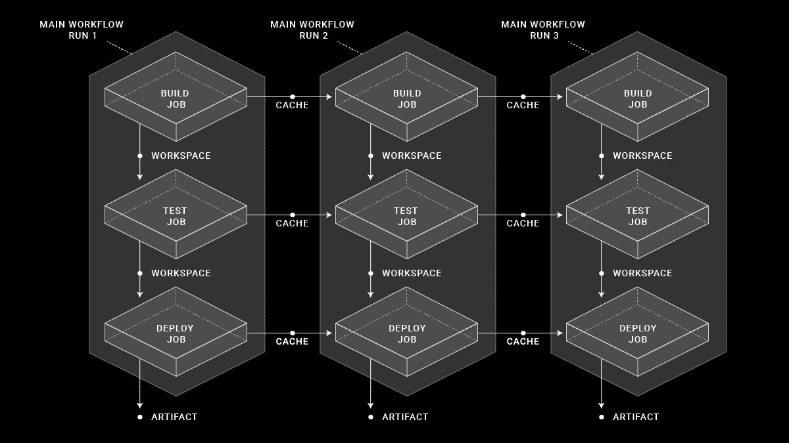
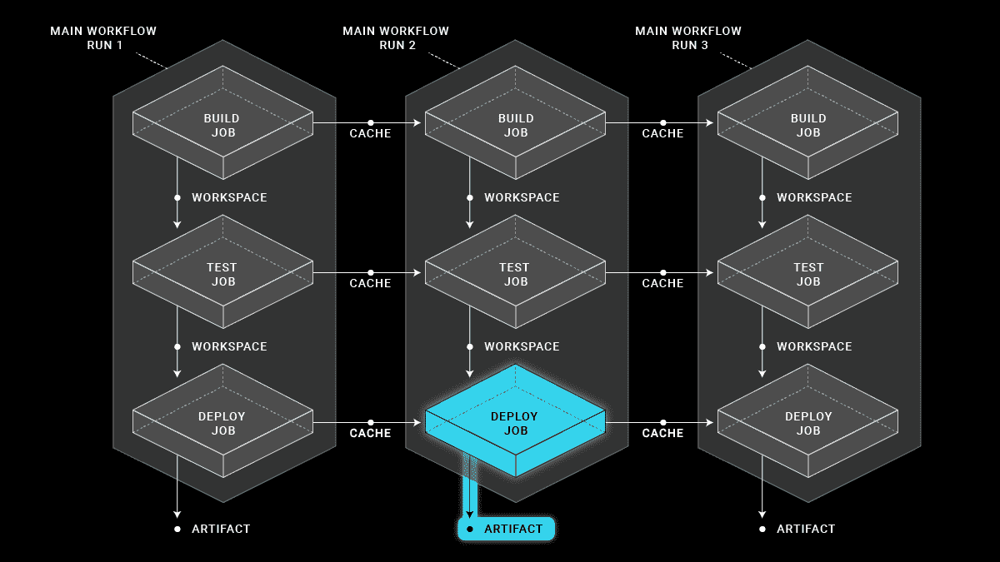

# 在工作流中持久化数据:何时使用缓存、工件和工作区

> 原文：<https://circleci.com/blog/persisting-data-in-workflows-when-to-use-caching-artifacts-and-workspaces/>

CircleCI 提供了许多不同的方法来将数据移入和移出作业，持久化数据，以及使用工作区在作业之间移动数据。为正确的任务使用正确的特性将有助于加速您的构建，提高可重复性，并提高效率。

对于任何曾经等待 CI 测试套件变绿的人来说，更快的 CI 运行的好处是显而易见的。

重复性也很重要。可重复的 CI 流程意味着，如果您对您的回购中的相同 SHA 再次运行相同的流程，您将获得相同的结果。当 CI 流程不可重复时，您会发现自己在浪费时间重新运行作业来实现环保。

## 数据如何在 CircleCI 作业之间流动

数据可以以不同的方式在 CircleCI 作业之间流动。工作空间在单个工作流中的作业之间保存数据。缓存在不同工作流版本中的相同作业之间保存数据。工件在工作流完成后保存数据。它们之间的用例、实现和数据停留的时间各不相同。

### CircleCI 工作区

 *工作区在工作流程中的连续作业之间移动数据。*

当在作业中声明工作空间时，可以添加一个或多个文件或目录。每次添加都会在工作区文件系统中创建一个新层。然后，下游作业可以根据自己的需要使用该工作空间，或者在其上添加更多层。

一种常见的方法是使用工作区将生成的版本号从构建作业传递到部署作业。它们也可以用来传递编译好的二进制文件——但是由于它们需要在每个作业中被上传和下载，这比仅仅传递元数据要慢。

与缓存不同，工作空间不会在运行之间共享，因为一旦工作流完成，它们就不再存在。有一个例外，即重新运行工作流。关于这一点的更多信息以及对工作空间的全面深入了解，可以在明天的博客文章中找到:[深入 CircleCI 工作空间](https://circleci.com/blog/deep-diving-into-circleci-workspaces/)。

### CircleCI 中的缓存

 *缓存在多个工作流运行中的同一作业之间持久保存数据。*

缓存使您可以重用以前作业中昂贵的提取操作的数据。初始作业运行后，通过不重做工作，作业的未来实例将运行得更快。一个主要的例子是包依赖管理器，如 Yarn、Bundler 或 Pip。通过从缓存中恢复依赖关系，像`yarn install`这样的命令将只需要下载新的依赖关系，如果有的话，而不需要在每次构建时重新下载所有内容。

缓存在一个项目中是全局的，保存在一个分支上的缓存将被其他分支使用，因此它们应该只用于可以跨分支共享的数据。要获得更多类似的技巧和对 CircleCI 缓存的更深入了解，您可以阅读 [CircleCI 2.0 缓存文档](https://circleci.com/docs/caching/)。

### CircleCI 文物

 *工件在一个工作流完成并消失后持久保存数据。*

工件用于构建过程输出的长期存储。例如，如果你有一个 Java 项目，你的构建很可能会产生一个代码的`.jar`文件。这些代码将通过您的测试来验证。如果整个构建/测试过程通过了，那么过程的输出(`.jar`)可以被存储为一个工件。`.jar`文件在创建它的工作流程结束后很久还可以从我们的工件系统下载。

如果您的项目需要以某种形式或方式打包，比如说一个 Android 应用程序。apk 文件被上传到 Google Play，这是一个很好的例子。许多用户将他们的工件上传到公司范围内的存储位置，如亚马逊 S3 或 Artifactory。更多提示和最新信息可以在 [CircleCI 工件](https://circleci.com/docs/artifacts/)文档中找到。

* * *

想深入了解工作区以及如何最好地使用它们？阅读我们的后续博文[深入 CircleCI 工作区](https://circleci.com/blog/deep-diving-into-circleci-workspaces/)。

有关工作流可以做的所有事情的概述，包括 OSS 配置，请参见[工作流系列的广阔天地](https://circleci.com/blog/wide-world-of-workflows-job-orchestration/):