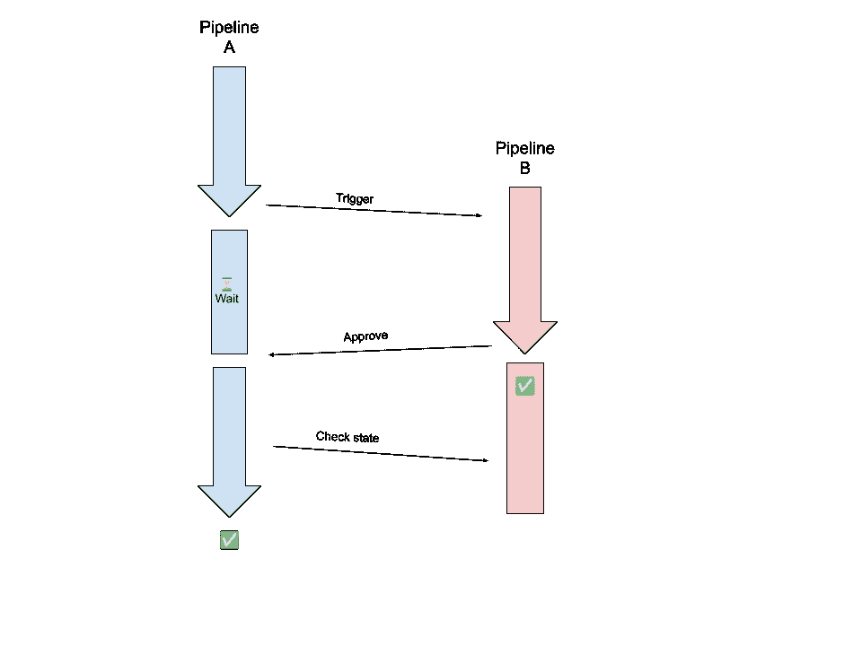

# 采用 circleback 模式| CircleCI 的高级管道编排

> 原文：<https://circleci.com/blog/pipeline-orchestration-circleback/>

> 本教程涵盖:
> 
> 1.  为依赖管道编排触发器
> 2.  circleback 模式介绍
> 3.  为 circleback 管道创建配置

随着多个团队在许多项目上工作，为您的软件拥有一个单一的管道是不够的。在测试和发布之前，需要构建和集成这些项目。那么开发团队如何处理这种情况呢？许多团队通过将软件分解成更小的部分来解决问题，这些部分做得更少，更容易维护和构建。这种方法导致微服务架构在我们的行业中越来越普遍。

不利的一面是将软件分成更小的部分会增加复杂性。更多部件和更高复杂性的结合使得在生产中测试和运行应用程序更加困难。

CI/CD 管道在这里也不例外。在本系列的前一篇文章中，我们研究了从其他管道触发管道。那篇文章描述了如何在 CircleCI 中将多个项目链接在一起，以便一个部署启动另一个。

在这篇文章中，我们将更进一步。我将提供一个管道编排的例子，其中第一个管道不仅触发另一个管道，而且在继续之前等待另一个管道完成。我称之为 circleback 模式，因为它“循环返回”到第二个管道，在它完成工作时发出信号。使用这种模式允许更好的集成测试和更复杂的部署和发布场景。

## 先决条件

*   本教程涵盖了高级管道编排技术，因此必须具备 CircleCI 和 DevOps 的经验。
*   本教程也建立在之前的教程之上:[从其他管道](/blog/triggering-pipelines-from-pipelines/)触发管道。

## 资源和示例代码

本例的源代码位于两个存储库中:

1.  [管道 A -是否触发](https://github.com/CircleCI-Public/circleback-cicd-project-a)

2.  [管道 B -被触发并返回](https://github.com/CircleCI-Public/circleback-cicd-project-a)。

## 介绍 circleback 模式

在这些多管道的 circleback 编排中有三个步骤:

1.  第一个管道等待
2.  第二管道终止
3.  从第一个管道中检索结果。另一种描述方式是，第二个管道调用或“循环回”第一个管道，而第一个管道暂停并等待信号继续。

另一种方法是保持第一个管道运行，定期检查第二个管道是否已经完成。这种方法的主要缺点是正在运行的作业的连续轮询成本增加。

根据第二个管道的状态，第一个管道将继续执行，直到成功终止或失败。



## 为什么管道要等待其他项目完成？

正如在简介中提到的，这是一种高级技术，旨在降低处理多个项目所带来的复杂性。它可以被在多个相互依赖的项目上工作的团队使用，这些项目不希望像 monorepo 一样放在一个存储库中。另一个用途是拥有一个集中的测试库，例如在一个硬件公司。这项技术对于微服务应用程序的集成测试或者编排复杂的部署场景也很有用。有很多种可能。

## 实现管道触发器

我们有 2 个管道，我们想编排

1.  管道 A，它执行触发
2.  管道 B 被触发，并循环回到管道 A

管道 B 依赖于 A，可用于验证 A。

两个管道都需要设置 API 密钥并使其可用。您可以在管道 A 的作业中使用 API 键集作为环境变量(`CIRCLECI_API_KEY`)，在管道 B 回调时也可以在管道 B 中使用。您可以在两个项目中设置它，也可以在组织级别作为上下文设置它。对于本教程，我在组织级别将其设置为`circleci_api`上下文，这样两个项目可以使用相同的 API 键。

### 触发管道

触发过程在本教程的第一部分[从其他管道](/blog/triggering-pipelines-from-pipelines/)触发管道中进行了深入解释。在接下来的教程中，我将只讲述重要的区别。

*   若要从管道返回，请将原始管道的 ID 传递给它。然后可以通过 API 检索和到达它。
*   您还需要存储触发的管道的 ID。你需要稍后得到它的结果。

在示例代码中，该参数称为`triggering-pipeline-id`:

```
curl --request POST \
                --url https://circleci.com/api/v2/project/gh/zmarkan-demos/circleback-cicd-project-b/pipeline \
                --header "Circle-Token: $CIRCLECI_API_KEY" \
                --header "content-type: application/json" \
                --data '{"branch":"main","parameters":{"triggering-pipeline-id":"<< pipeline.id >>"}}' 
```

为了存储管道 ID，将您的`curl`调用包装在`$()`中，并将其分配给变量`CREATED_PIPELINE`。要从响应体中提取 ID，使用`jq`工具，并将其写入文件`pipeline.txt`:

```
CREATED_PIPELINE=$(curl --request POST \
                --url https://circleci.com/api/v2/project/gh/zmarkan-demos/semaphore_demo_project_b/pipeline \
                --header "Circle-Token: $CIRCLECI_API_KEY" \
                --header "content-type: application/json" \
                --data '{"branch":"main","parameters":{"triggering-pipeline-id":"<< pipeline.id >>"}}' \
              | jq -r '.id'
              )
              echo "my created pipeline"
              echo $CREATED_PIPELINE
              mkdir ~/workspace
              echo $CREATED_PIPELINE > pipeline.txt 
```

现在您已经创建了文件`pipeline.txt`，使用`persist_to_workspace`来存储它并在后续的作业中使用它:

```
- persist_to_workspace:
            root: .
            paths: 
              - pipeline.txt 
```

整个作业配置如下:

```
...
jobs:
  trigger-project-b-pipeline:
      docker: 
        - image: cimg/base:2021.11
      resource_class: small
      steps:
        - run:
            name: Ping another pipeline
            command: |
              CREATED_PIPELINE=$(curl --request POST \
                --url https://circleci.com/api/v2/project/gh/zmarkan-demos/semaphore_demo_project_b/pipeline \
                --header "Circle-Token: $CIRCLECI_API_KEY" \
                --header "content-type: application/json" \
                --data '{"branch":"main","parameters":{"triggering-pipeline-id":"<< pipeline.id >>"}}' \
              | jq -r '.id'
              )
              echo "my created pipeline"
              echo $CREATED_PIPELINE
              mkdir ~/workspace
              echo $CREATED_PIPELINE > pipeline.txt
        - persist_to_workspace:
            root: .
            paths: 
              - pipeline.txt  
... 
```

### 精心安排等待

前一个作业将触发管道 B，它需要在循环回到管道 a 之前完成。您可以像这样使用 CircleCI 中的`approval`作业:

```
...
workflows:
  node-test-and-deploy:
    jobs:
      ...
      - trigger-project-b-pipeline:
          context: 
            - circleci-api
          requires:
            - build-and-test
          filters:
            branches:
              only: main
      - wait-for-triggered-pipeline:
          type: approval
          requires: 
            - trigger-project-b-pipeline
      - check-status-of-triggered-pipeline:
          requires:
            - wait-for-triggered-pipeline
          context:
            - circleci-api
      ... 
```

作业`trigger-project-b-pipeline`结束后，进入`wait-for-triggered-pipeline`。因为作业类型是`approval`,所以它将一直等到有人(在本例中是 API)手动批准它。(更多细节在下一节。)在它被批准后，添加一个`requires`节，以便它继续后续的作业。

使用 CircleCI API 的两个作业都指定了`context`，因此 API 令牌作为环境变量对两者都可用。

### 绕回管道 A

现在我们已经完成了管道 A，是管道 B 大放异彩的时候了。CircleCI 的`approval`工作是一种特殊的工作，一直等到被接受。它通常用于将管道保持在挂起状态，直到它被人工交付主管或 infosec 工程师批准。

此时，管道 B 知道管道 A 的 ID，因此您可以使用批准 API 来获取它。您只有正在运行的管道的 ID，而没有需要批准的实际作业，因此您将需要不止一个 API 调用:

1.  获取管道中的所有工作
2.  按名称查找审批作业
3.  发送批准作业的请求

批准该作业将允许管道 A 继续运行。

如果管道 B 中的测试失败，那么该作业将自动失败。在这种情况下，包含所需作业的工作流将不会继续。您可以通过在管道中使用`post-steps`来解决问题，它总是会执行。整个工作流显示在下一个示例代码块中。

参数:

```
parameters:
  triggering-pipeline-id:
    type: string
    default: ""

...

workflows:
  node-test-and-deploy:
    jobs:
      - build-and-test:
          post-steps:
            - approve-job-in-triggering-pipeline
          context: 
            - circleci-api 
```

执行批准 API 调用的脚本可以这样实现。对于本教程，我使用了一个`command`。

```
...
commands:
  approve-job-in-triggering-pipeline:
    steps:
      - run:
          name: Ping CircleCI API and approve the pending job
          command: |
            echo << pipeline.parameters.triggering-pipeline-id >>
            if ! [ -z "<< pipeline.parameters.triggering-pipeline-id >>" ] 
            then
              workflow_id=$(curl --request GET \
                --url https://circleci.com/api/v2/pipeline/<< pipeline.parameters.triggering-pipeline-id >>/workflow \
                --header "Circle-Token: $CIRCLECI_API_KEY" \
                --header "content-type: application/json" \
              | jq -r '.items[0].id')

              echo $workflow_id

              waiting_job_id=$(curl --request GET \
                --url https://circleci.com/api/v2/workflow/$workflow_id/job \
                --header "Circle-Token: $CIRCLECI_API_KEY" \
                --header "content-type: application/json" \
              | jq -r '.items[] | select(.name == "wait-for-triggered-pipeline").id')

              echo $waiting_job_id

              curl --request POST \
                --url https://circleci.com/api/v2/workflow/$workflow_id/approve/$waiting_job_id \
                --header "Circle-Token: $CIRCLECI_API_KEY" \
                --header "content-type: application/json"

            fi
          when: always       
... 
```

该脚本首先检查是否存在`triggering-pipeline-id`管道参数。仅当该参数存在时，它才会继续。命令中的`when: always`行确保不管终止状态如何都会执行。

然后，它进行 3 次 API 调用:

1.  获取管道中的工作流 ID。对于这个示例项目，只有一个工作流正在进行中。
2.  获取该工作流中的作业，使用`jq`选择与批准作业名称(`wait-for-triggered-pipeline`)匹配的作业，并提取批准作业的 ID。
3.  向具有等待作业 ID 的审批端点发出请求。

对于本教程，我们将像工作流 ID 和作业 ID 这样的结果存储在本地 bash 变量中，并在对 API 的后续调用中使用它们。

**注意** : *如果您的任务比单个响应所能发送的要多，那么您可能还需要处理分页。*

现在您已经发出了批准请求，管道 B 已经完成，管道 A 应该可以再次运行了。

### 用 B 的结果更新管道 A

管道 A 获得批准后，工作流中的下一个作业将开始。如果工作流图需要，管道 A 可以触发多个作业。

我们仍然不知道先前工作流程的结果。要获得这些信息，您可以再次使用 API 从管道 a 获得 B 的状态。

首先，您需要检索被触发的管道(管道 b)的 ID，这与在前面的步骤中保存在工作区中的 ID 相同。使用`cat`检索它:

```
 - attach_workspace:
          at: workspace
      - run:
          name: Check triggered workflow status
          command: |
            triggered_pipeline_id=$(cat workspace/pipeline.txt) 
```

然后使用 API 来检索工作流。使用`jq`获取返回的工作流数组中第一个项目的状态:

```
created_workflow_status=$(curl --request GET \
                --url "https://circleci.com/api/v2/pipeline/${triggered_pipeline_id}/workflow" \
                --header "Circle-Token: $CIRCLECI_API_KEY" \
                --header "content-type: application/json" \
              | jq -r '.items[0].status'
            ) 
```

检查状态是否不是`success`。如果不是，使用`exit`终止作业，退出代码-1。如果工作流成功，它将终止:

```
if [[ "$created_workflow_status" != "success" ]]; then
              echo "Workflow not successful - ${created_workflow_status}"
              (exit -1) 
            fi

            echo "Created workflow successful" 
```

以下是作业`check-status-of-triggered-pipeline`的完整配置:

```
 check-status-of-triggered-pipeline:
    docker: 
      - image: cimg/base:2021.11
    resource_class: small 
    steps:
      - attach_workspace:
          at: workspace
      - run:
          name: Check triggered workflow status
          command: |
            triggered_pipeline_id=$(cat workspace/pipeline.txt)
            created_workflow_status=$(curl --request GET \
                --url "https://circleci.com/api/v2/pipeline/${triggered_pipeline_id}/workflow" \
                --header "Circle-Token: $CIRCLECI_API_KEY" \
                --header "content-type: application/json" \
              | jq -r '.items[0].status'
            )
            echo $created_workflow_status
            if [[ "$created_workflow_status" != "success" ]]; then
              echo "Workflow not successful - ${created_workflow_status}"
              (exit -1) 
            fi

            echo "Created workflow successful" 
```

## 结论

在本文中，我们回顾了一个复杂管道编排模式的例子，我将其命名为“circleback”。circleback 模式创建一个依赖管道，并允许您在完成之前等待它终止。它涉及到从两个项目中生成几个 API 键，使用一个批准作业，以及 CircleCI 的 workspace 特性来存储和传递值，例如工作流中作业间的管道 ID。样本项目位于不同的存储库中:[项目 A](https://github.com/CircleCI-Public/circleback-cicd-project-a) ，以及[项目 B](https://github.com/CircleCI-Public/circleback-cicd-project-B) 。

如果这篇文章在某种程度上对你有所帮助，我很想知道，如果你对它有任何问题或建议，或者对未来的文章和指南有任何想法，请通过 [Twitter - @zmarkan](https://twitter.com/zmarkan) 或[电子邮件给我](mailto:zan@circleci.com)联系我。