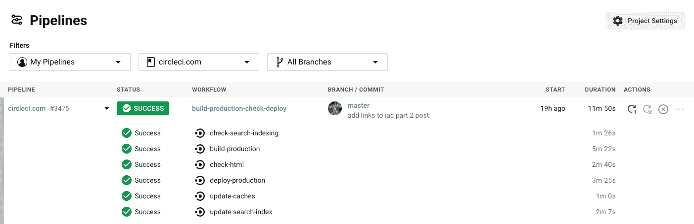

# 关于 CircleCI 的新用户界面，你需要知道什么

> 原文：<https://circleci.com/blog/pipelines-speed-and-a-new-test-summary-what-you-need-to-know-about-circleci-s-new-ui/>

经过几个月的努力，我们今天正式推出了我们的新 UI。

我们要感谢所有 CircleCI 的用户，他们在我们开发界面时发布了帖子，发了推文，并完成了 UX 会议。您的反馈使我们能够确保团队构建、测试和部署高质量代码的最佳体验。

## 管道

新 UI 最大的升级是围绕[管道](https://circleci.com/blog/what-is-a-ci-cd-pipeline/)而不是作业的定位。基于作业的视图是为 CircleCI 1.0 构建的，非常适合配置简单的用户。然而，从事复杂项目的团队需要更多的可见性，而新的 UI 提供了这一点。新的基于管道的视图将所有作业组合到一个工作流中，并将所有工作流组合到一个管道中，这使得参与项目的每个人都可以尽快轻松找到与其运行相关的信息。

最近，我们使用户能够从[管道](https://circleci.com/docs/project-build/#viewing-and-navigating-pipelines)页面取消和重新运行工作流，这是我们特别优先考虑的改进，因为我们的用户要求这样做！

## 速度

领导这个项目的高级产品经理 Kate Catlin 对用户在新的用户界面上体验更快的页面加载时间感到非常兴奋。“开发人员很忙，他们在我们的平台上完成特定的任务，然后回去写代码，”卡特林说。“通过减少每个屏幕加载信息所需的时间，并重新安排信息以优先考虑最重要的内容，我们可以让开发人员更快地提供新功能。”

## 快速导航的其他改进

您将在新用户界面上看到的其他一些激动人心的改进包括:

*   跨项目管道视图，提高跨团队的可见性
*   在分支和项目选择器上键入搜索，轻松过滤管道视图
*   在仪表板上自动打开失败的和最新的管线，以便于导航
*   失败时测试摘要选项卡的默认视图，因此最重要的信息总是在您的指尖

## 接下来会发生什么

在不久的将来，您可以看到更多特定于管道的信息，比如查看每个管道中使用了哪些[orb](https://circleci.com/orbs/)的能力。CircleCI orbs 是 YAML 配置的可重用片段，它将重复的配置压缩成一行代码。它们有助于自动化流程，并且易于与开发人员已经使用的第三方工具集成。

我们将进行的最令人兴奋的更新之一是专门为新的基于管道的 UI 构建的 Insights UI。请继续关注 Insights 的更多信息。

即将推出的其他一些激动人心的 UI 改进包括:

*   通过每页顶部改进的面包屑更快地导航
*   失败测试的更好总结
*   能够通过单击按钮关闭“管道”页面上所有打开的管道

## 在不断变化的世界中支持开发人员

对于 Catlin 来说，改进 circle ci UI 的动力一直是帮助开发人员更好地完成他们的工作——现在比以往任何时候都要多。

“现在世界上有很多不确定性，但我个人认为，软件开发商在推动我们走向可以克服这些挑战的未来方面发挥着关键的、不可替代的作用，”卡特林说。“帮助软件开发人员更好、更快、更少地完成工作有助于我们战胜世界面临的新挑战。”

要了解更多关于我们新用户界面的信息，请查看[我们的文档](https://circleci.com/docs/configuration-reference/)或阅读更多关于为什么新用户界面[是为提高用户工作效率而构建的](https://circleci.com/blog/introducing-our-redesigned-UI-built-for-increased-user-productivity/)。