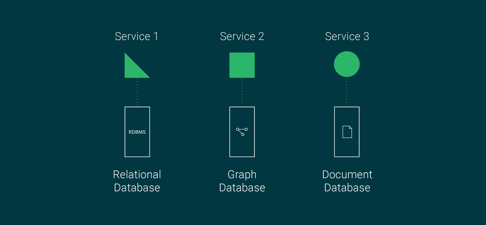
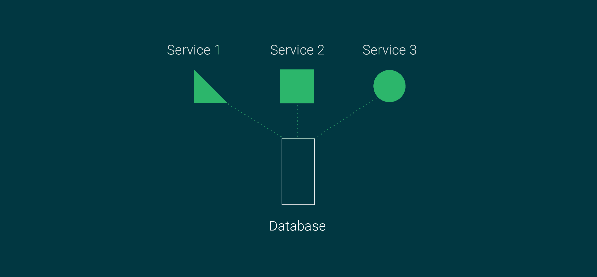

# 微服务的多语言持久性与多模型数据库

> 原文：<https://circleci.com/blog/polyglot-vs-multi-model-databases/>

微服务架构是一种应用系统设计模式，在这种模式下，整个业务应用程序由单个功能范围内的服务组成，这些服务可以按需伸缩。每个团队专注于一个单独的服务，并根据他们的技能或选择的语言来构建它。

除了灵活性之外，这种模式还提供:

*   由于松散耦合的服务模式，引入变更的风险更小
*   每项服务的独立扩展能力
*   集装箱化部署选项

这些特性使得微服务架构成为企业的热门选择。

在微服务时代之前，企业使用单片设计模式构建他们的应用程序，这些应用程序运行在现场的高容量服务器(数据中心)上。无论您的应用程序使用单片还是微服务设计模式，您都必须有一个存储解决方案来持久化它所管理的数据。

您的团队应该选择哪种数据存储解决方案来服务您的微服务架构？在本文中，我们将研究两种流行的方法，多语言持久性和多模型数据库，以及您可以用来确定哪个解决方案最适合您的应用程序的标准。

## 微服务的数据库管理挑战

单体应用通常只有一个数据库，而微服务则有一个更加分散的模型。这意味着在大多数现实部署中，每个微服务都有自己的数据库。

尽管每个团队都可以选择自己的编程语言和数据库，但是这种方法也带来了挑战。一个关键的挑战是为跨多个服务的请求实现查询和原子的、一致的、隔离的和持久的(ACID)事务。

在 monolith 应用程序中，实现 ACID 事务或实现查询逻辑很简单。要查询微服务，您需要格外小心地使用设计良好的方法来实现查询逻辑。

在软件行业中，有一些模式可以解决微服务的这种数据库管理挑战。接下来是对这些模式的简要概述。

### 每个服务的数据库

遵循每个服务一个数据库模式的微服务对于每个服务都有单独的数据库。这种模式在应用程序处理和计算级别以及存储级别促进了松散耦合。如果一个服务依赖于另一个服务的数据，它必须进行 API 调用。

### 传奇模式

有了 Saga 模式，微服务应用程序就有办法以类似事务的方式与多个服务进行通信。在这种情况下，单个业务事务作为每个依赖服务中的一系列事务执行。如果所有服务中的事务都成功，则整个事务都成功。在任何微服务中的事务失败的情况下，等效的反向事务回滚失败的事务。

### API 组合模式

考虑一个基于多个微服务的业务应用。假设用户对一个关键性能指标(KPI)感兴趣，该指标依赖于来自三个不同微服务的数据。您可以部署一个 API 组合模式来简化这个过程，而不是期望用户为每个服务发出一个 API 请求。

使用 API 组合模式，您可以设计一个单独的服务来公开一个 API，该 API 负责抽象从多个服务中检索数据的技术细节。该服务将检索到的数据连接到内存中，并将 KPI 细节返回给用户。

### 事件来源模式

事件源模式提倡在微服务应用程序中存储每个传入事件，并为此铺平了道路。然后，您可以将这些持久化的事件用于审计，并在以后用于事件重放，例如在故障处理场景中。

### 共享数据库反模式

在这种反模式中，多个服务共享一个数据库。它构成了松散耦合的特性，并使微服务容易出现单点故障。注意，与前面描述的微服务设计模式相比，共享数据库方法是一种反模式。

## 什么是多语言持久性？

在大多数情况下，技术团队更喜欢每个服务一个数据库的模式，以从其松散耦合的服务中获益。随着数据库技术的进步，有多种数据存储解决方案可供选择。每一种都在其目标用例中表现最佳。

例如，如果您的微服务需要无模式、类似文档的存储解决方案的灵活性，您可以选择像 MongoDB 这样的文档存储。如果你的微服务需要在数百万或数十亿用户或实体之间建立连接，你可以使用 Neo4j 这样的图商店。

关键是您现在有多种多样的数据库选项来满足您的业务需求。这些选项在您的微服务用例中表现良好，这正是您需要多语言持久性的原因。

Polyglot 持久性涉及到在开发微服务时使用专门的数据库解决方案，因此每个微服务可以使用与另一个微服务不同类型的数据库。

以下是数据库技术类别及其最常见使用案例的列表:

*   RDBMS:当需要严格的模式和 ACID 事务时，使用关系(RDBMS)数据库。
*   图形数据库:当快速遍历链接和关系是必要的时候，使用图形数据库。
*   基于文档的数据库:当需要灵活的模式或无模式结构，并且必须处理大量数据时，使用文档存储。
*   键值数据库:当快速读写很重要时，使用键值存储。

使用 polyglot 持久性模型，每个服务处理其数据库存储解决方案和数据库，以满足您的[功能性和非功能性](https://circleci.com/blog/functional-vs-non-functional-testing/)应用程序目标。

## 什么是多模型数据库？

多模型数据库是存储多种数据模型和类型的单个数据库引擎。使用一个后端引擎，您可以在多模型数据库中设计模式模型来存储关系、非关系、文档、键值和图形数据。

需要注意的是，并非所有多模型数据库引擎都支持市场上的每种数据模型格式。有些可能支持三种数据模型(关系、文档和图形)，而有些可能支持四种模式模型(关系、文档、图形和键值存储)。

那么，多模型数据库引擎是如何在一个引擎中保持各种模式模型或数据类别的呢？答案在于语义模型。通常，多模型数据库通过抽象定义模型和从多个数据模型中检索数据的复杂性，使其数据定义语言和查询语言对用户来说变得简单。

组织可能使用多模型数据库引擎作为其后端选择的主要原因:

*   只需要管理一个数据库，而不是多个，但是仍然可以利用定义多个模型和存储不同数据类型的优势。
*   学习和使用一个语义模型与存储在多模型数据库中的数据进行交互。

## 多语言持久化与多模型数据库:哪一个最适合微服务？

微服务多语言持久性的优势包括:

*   服务保持松散耦合。
*   根据服务的专门数据存储要求，您可以选择最好、最可靠、可伸缩的数据存储，这些数据存储具有相对较长的使用历史和市场上经过验证的成功记录。
*   如果有多个供应商或开源数据库引擎可以为所选的数据模型提供服务，那么您可以根据团队的技能或偏好来选择数据库。

微服务的多模型持久性的优势包括:

*   您需要管理单个多模型数据库引擎，而不是多种数据库。
*   您只需要学习一种语义模型来与存储在数据库中的数据进行交互。
*   管理一种类型的数据库引擎而不是几种类型的数据库引擎使管理变得更加容易。
*   只需管理一个供应商许可证。

现在您已经看到了多语言和多模型持久性的好处，对于给定的用例，哪种解决方案优于另一种呢？答案可能各不相同。

如果您的微服务用例依赖于三种不同的模式模型，例如关系、文档和图形，请检查是否存在在单个数据库引擎中支持这三种模式的多模型数据库引擎。如果是这样，那么您应该为微服务使用多模型数据库。

但是，如果您的用例需要五种不同的模式模型，如关系、文档、列、键值和图形，您可能无法找到一个支持所有这些模型的多模型数据库引擎。在这种情况下，使用多语言持久性或多语言和多模式持久性的组合。

## 后续步骤

许多应用开发团队正在向基于微服务的架构发展。即使对于微服务应用，数据存储的重要性仍然很高。市场上已经发展出不同的模式来应对微服务的数据库管理挑战。

由于其松散耦合的好处和它提供的其他优势，企业已经广泛采用了每服务数据库的设计。当您使用每个服务一个数据库的模式来实现微服务时，您可以在多语言或多模型持久性之间进行选择。选择取决于用例、您的企业规模和您的工作模型。

如果您有一个大型企业，并且有一个由技术熟练的专业人员组成的专门的数据库团队来管理多个数据存储，那么您应该使用多语言持久性。多语言持久性允许您为每个数据模型段选择一个数据库引擎，该数据模型段在该类别中有一个经过验证的历史。

在多模型数据库空间的情况下，几乎所有的供应商都是新的，并且在生产环境中没有长期的记录。因此，如果您认为多模型持久性方法有风险，请选择多语言持久性。

然而，如果您是一家拥有相对较小团队的[初创企业](https://circleci.com/blog/devops-for-startups/)，您可以使用多模型数据库来满足您的微服务和异构数据存储需求。这将提高生产率，降低人工和硬件资源成本。

现在，您已经对这个领域有了足够的了解，可以选择最适合您的微服务应用程序的持久性模型了。为了继续优化您的微服务开发流程，考虑采用持续集成和持续交付来帮助您自动[测试对您的微服务的更改](https://www.youtube.com/watch?v=uqC3ZzE8abo)和[使用 Kubernetes](https://circleci.com/blog/deploy-web-apps-on-kubernetes-with-ci/) 等流行工具部署您的应用。你可以从今天[注册一个免费的 CircleCI 账户](https://circleci.com/signup/)开始。