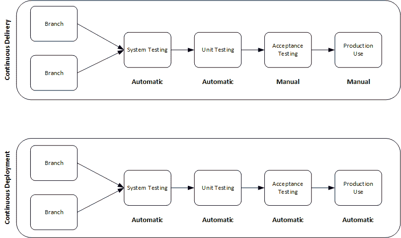
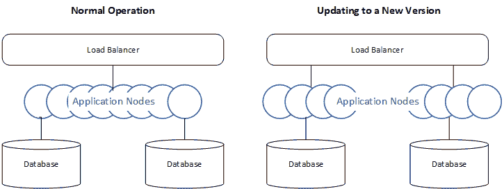

# 让您的团队为持续部署做好准备| CircleCI

> 原文：<https://circleci.com/blog/preparing-for-continuous-deployment/>

任何 DevOps 团队的一个关键目标是缩短软件开发周期，并提供高质量软件的持续交付。大多数公司没有继续下一个逻辑目标，即持续部署，而是止步于此。开发的代码自动进入测试阶段，然后，成功的测试触发手动验收步骤。只有这样，应用程序才能部署到生产环境中。

本文描述了您需要建立的一些计划和实践，以便您的团队能够使用连续的部署过程频繁而可靠地部署应用程序。

## 持续交付与持续部署

在我们探索持续部署的世界之前，理解持续交付的终点是很重要的。随着您的团队走向持续部署，还有一些过程和设计需要考虑。当你接手这个项目时，保持 DevOps 心态也很重要。我将在文章的后面解释这是什么。

在持续的交付过程中，开发人员在每次变更时都要重新构建代码库，以确保没有人会破坏构建。用户验收测试和部署可能完全是手动步骤。相比之下，连续的*部署*试图自动化验收测试和部署，这样构建就可以自动地、定期地进入生产。

通常，连续交付回答了“它构建并运行了吗？”而持续部署回答“它工作吗？它部署了吗？”

## 持续部署的先决条件

要将您的应用程序转移到持续部署中，您的团队将需要采用技术和人员流程变更。不要求使用特定的工具或过程。相反，使用一致的开发和部署方法，并以自动化作为补充。

发布新版本时，应用程序的架构和停机时间会影响部署频率。本文的下一节将探讨其中的一些，为决定连续部署选项提供一些背景知识。

### 敏捷团队

持续交付管道的关键部分是敏捷团队。这些团队不断地构建和交付软件。您的团队对小型快速开发周期越熟悉，您的持续部署实践就越成功。

与每隔几个月进行重大变更相比，频繁地自动化、测试和部署小的变更要容易得多。如果出现问题，回滚小的更改也容易得多。

### DevOps 心态

确保您的 DevOps 团队从一开始就一起工作来构建软件。从设计到部署，他们应该在功能、错误修复、构建和安全性方面进行协作。

开发和部署高质量的软件需要我们 DevOps 团队所有成员的持续投资。孤立的团队、缺乏安全性或测试不充分会破坏开发的连续性，并使部署变得困难。如果您的团队不相信持续部署是可能的，它就不会发生。

### 自动化测试

自动化测试工具应该已经是您的持续集成和持续交付(CI/CD)管道的一部分，以确保您交付的软件符合质量标准。如果没有一套全面的测试来验证您的应用程序的所有现有的和新的组件，您的团队就不能依靠该软件来执行。随着您在应用程序中构建更多的功能，确保对所有功能进行回归测试变得更加重要。

### 稳定的 CI/CD 管道

因为持续部署建立在持续交付的基础上，所以拥有一个稳定的 CI/CD 渠道来扩展将为您的团队取得成功做好准备。如果您的团队不能可靠且一致地交付他们的应用程序，他们也不能可靠且一致地部署应用程序。让专门的 CI/CD 工程师照看您的管道可以保持开发成果的一致性。你可以从电子书[中了解更多如何成为 CI/CD 工程师](https://circleci.com/resources/cicd-engineer/)。

### 灵活的架构

您的应用程序的体系结构也可以在持续部署中发挥重要作用，因为它会影响停机时间。例如，一个团队使用负载平衡器背后的可伸缩应用程序节点来构建应用程序。然后，该团队可以在将负载平衡器从一个版本切换到下一个版本之前，自动修补一批节点。

对数据库层采用非破坏性的方法还可以减少手动干预的需要。Martin Fowler 和 Pramod Sadalage 的文章[进化数据库设计](https://martinfowler.com/articles/evodb.html)更深入地回顾了敏捷环境中的数据库方法。

## 开始连续部署

一旦在您的环境中嵌入了正确的组件，下一步就是检查您当前的端到端构建和交付流程。寻找任何可以简化或自动化的流程或操作。持续部署的目标不是跳过每个手动步骤。我们的目标是尽可能地自动化每一步，或者简化每一步，使其尽可能地快速和无痛。

例如，您仍然需要手工检查代码和合并拉请求。您可以快速、频繁地完成这些过程，以便尽快将特性和修复程序应用到您的应用程序中。

考虑两个我们可以自动化或简化的手动组件:

*   验收测试自动化
*   发布业务流程

### 验收测试自动化

在过去的几年里，终端用户测试自动化和机器人流程自动化工具取得了长足的进步。将这些工具添加到您的验收测试阶段可以帮助减少手工测试。

这些工具要求测试人员尽早参与开发过程。这些测试人员可以通过使用用户故事来记录非技术人员的测试。像 [CloudQA](https://cloudqa.io/) 这样的工具使测试人员能够记录终端用户操作应用程序的情况。然后，您可以编写这些操作的脚本，并将它们添加到您的测试套件中，以便新功能和回归测试在整个验收测试阶段都是自动的。然后，您可以满怀信心地投入生产。

### 发布业务流程

[发布流程编排](/blog/vamp-and-circleci/)通过验证您的应用部署了所有关键组件，增强了您的持续部署渠道。

将新特性快速部署到生产环境听起来不错，但是您仍然需要确保依赖关系和文档存在，并且您已经更新了数据层以反映这些变化。

添加发布协调工具和流程提供了一个由一组清晰的业务规则定义的规划和协调层。这一层可以包括修改基础设施和部署应用程序组件的自动化步骤。它将自动化与手动操作(如批准请求)相结合。版本编排确保您的团队已经正确配置了生产版本。

使用像[蓝绿色部署](/blog/canary-vs-blue-green-downtime/)这样的技术自动化您的部署也可以将您环境的停机时间减少到几乎为零。

## 后续步骤

优化您的部署流程不是一次性的活动。应该定期回顾您的 DevOps 团队的工作方式。

您还应该让开发人员体验工程师(DXEs)跟踪、衡量和优化开发人员的工作方式，并为开发管道寻找更好的工具和流程。要了解更多信息，请阅读[为什么开发人员体验工程师(dxe)是加速您业务发展的关键](https://www2.circleci.com/DevEx.html)。

让您现有的持续交付管道达到高水平的成熟度将有助于确保您的持续部署管道一致地工作。通过在此基础上添加验收测试自动化和发布流程编排，您将获得一个持续的部署管道，进一步简化您的 DevOps 团队的开发流程，并为您的团队提供专注于未来增强的机会。