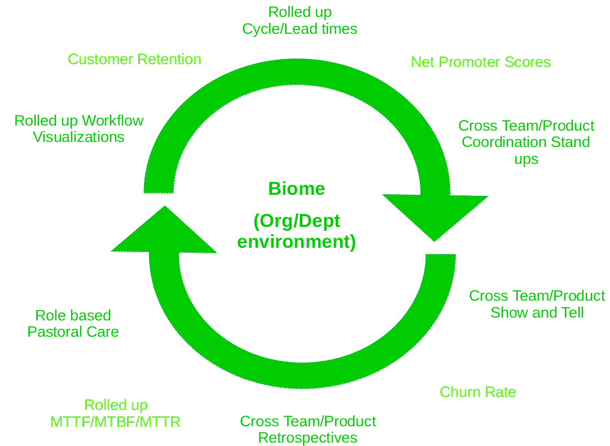

# 进化架构的先决条件

> 原文：<https://circleci.com/blog/prerequisites-for-evolutionary-architectures/>

设计灵活多变的软件可以说是最重要的架构属性。

我经常听到其他软件架构师说“性能怎么样？”或者“安全性呢？”

我并不是说这些其他属性在早期考虑时不重要。他们是。然而，如果我们针对变化(可发展性)优化我们的架构，当我们发现性能问题或安全漏洞时，我们可以改变我们的系统来帮助解决它。快速响应这些问题的能力正是进化架构如此重要的原因。

## 进化中哪些属性是重要的？

你可以像看待进化建筑一样看待一个物种适应环境的方式。为了成功，动物需要产生具有优势特征的新一代，对环境的反馈做出反应，并通过退回到有效的方式为失败留下空间。

软件也差不多。你需要确保它是可适应的，并且你正在根据什么有效来改变你的系统。我们可以通过几种主要方式来创建这些适应性强的架构:

*   挑选约束条件以支持快速变化
*   将部署和发布的概念分开
*   收集并分享快速(适当)的反馈
    *   发展中
    *   生产中
*   建立一种积极响应的文化

## 选择支持可变性的约束

为了支持软件的进化，我们需要知道软件的约束和软件运行的环境。

作为软件架构师和开发人员，我们可以控制构建和运行软件的环境的某些方面。这里有一些我们可能要考虑的约束来支持变化/进化。

### 选择合适的建筑材料

在我职业生涯的开始，我相信任何图灵完全编程语言都是等价的，选择哪种语言并不那么重要。随着我接触越来越多的编程语言、范例、库和框架，我意识到我们选择的“建筑材料”对我们软件系统的固有属性有着巨大的影响，尤其是可变性。

当您开始构建新系统时，请考虑以下几点:

*   支持允许您从更大更复杂的结构中解析所需数据的语言、库和方法。
*   如果您使用的是强静态类型语言，请考虑使用推断类型的语言，以减少需要通过代码库进行的更改。
*   如果您使用弱类型语言，请考虑您可能需要什么库或习惯用法来添加对允许的更改类型的约束，以及它们如何发生(否则您将身处蛮荒的西部，一切都会发生)
*   支持不可变的数据结构——不可变性限制了状态在执行程序中改变的方式，从而简化了对状态的推理，尤其是在多线程环境中。如果你的语言不支持默认的不可变数据结构，那么大多数语言都有大量的库(寻找可重用内存的持久不可变数据结构)。
*   比起命令式方法，更喜欢声明式方法。
*   您对问题的理解是否足以在早期选择一个框架，或者您是否应该通过使用小型库构建解决方案来保持灵活性？选择支持反馈和部署的工具和方法

为了发展，我们的软件需要容易和快速地发布，并且我们需要在开发和生产过程中关于它的适当性的反馈。因此，我们应该选择支持这些属性的工具和方法。

以下是一些需要考虑的事项的非详尽列表:

*   连续累计
*   连续交货
*   黑暗部署
*   金丝雀部署
*   蓝色/绿色部署
*   自动化测试
*   自动化警报/监控

虽然这听起来很可怕，但是将生产测试和其他测试方法结合起来是很有用的。有时，减少测试并允许某些东西在失败时发出警报可能是值得冒的风险，甚至有利于检测生产中的实际问题。生产是唯一真正的测试环境。然而，这是一个依赖于问题、架构等的风险判断。

实现这些方法中的一些或全部可以使您能够通过快速向前修复来响应 bug，而不是采取过度测试和在 bug 发生时恢复的更具防御性的方法。

### 尽可能保持小规模

对于参与编写系统的每一个额外的人来说，你在你的团队中成倍地增加了交流的途径。如果你能保持你的团队和团队的数量尽可能的少，你就减少了实现每一个改变所需要的沟通和协调的数量。

我将把这个原则延伸到保持团队数量尽可能少。

在有限数量的(正确的)人的约束下工作将会产生解决问题的创新方法。只要确保其中之一是不要工作更长的时间(因此，考虑工作时间的上限作为另一个约束！).

### 全组织系统思维

即使是最“实体”的企业也通过软件进行大量的客户互动(即使是 B2B)，因此你的组织应该将软件视为创收的主要手段。

将“项目思维”强加于软件开发是一个坏主意。试图在截止日期和预算内实现一些“特性”通常是必要的，但是如果你的软件的每一个变化都是这样发生的，那么短期的关注永远不会导致对产品或平台及其质量属性的长期考虑。

您可以使用项目来管理预算，但在选择实施什么时，请始终考虑产品或平台。

## 将部署与发布分开

为了进化，我们的软件必须产生新的“突变”一代。如果您可以在 canary 部署中部署您的变更，或者甚至，根据变更，在一个黑暗的部署中，您可以在唯一真实的测试环境，即生产环境中测试变更。

在不强制要求特定架构(例如微服务、事件流、模块化整体)的情况下，领域驱动开发(DDD)和事件风暴对于确定部署单元的边界非常有用。

不要孤立地考虑静态建模如果你孤立地构建一个数据、组件或类模型，你经常会关注错误的属性。例如，您可以对大学学生的数百个属性进行建模，但助学金系统可能只关心身份、费用和支付信息以及改变这些属性状态的事件，而学生服务关心更多的个人信息。使用系统的动态方面来引导哪些信息对该上下文是重要的。

考虑事件和流程通常会发现系统的组件(部署单元)。每个发送和/或接收消息的高级流程都是一个潜在的组件。

下面列出了一些有助于分离部署和发布的技术:

*   功能切换
*   通过抽象进行分支
*   持续集成/持续交付
*   不可变的服务器——将运行时环境的各个方面打包到不可变的映像中，使得部署和回滚的风险大大降低。
*   读取数据库上的模式——它们使得在部署中添加数据更加容易，前提是您总是“增加”您的模式。
*   采用 API“增长”——总是添加到您的 API 中，并且只在逻辑上贬低功能或数据，这对于客户端应用程序来说更容易处理，并且“突破性”的更改实际上是一种新的 API，所以要这样对待它。想想如果您不能完全控制您的客户端，并且不能相信它们只解析它们需要的数据，那么如何处理返回的数据(例如，是否所有的客户端都实现了宽容的读取器模式？).这就是即使在服务到服务的调用中使用 GraphQL 也有好处的地方，因为它的固有约束假设只返回所请求的内容(并且您得到了模式自省)。

## 快速适当的反馈

我喜欢把软件想象成像生物有机体一样“生活”在越来越大的生态系统中。

插图 1:生态系统反馈

图 1 展示了我们的软件“生活”的生态系统的层次。从这个例子中我们可以看出，内部生态系统会受到外部生态系统变化的影响，但是反过来，内部生态系统也会引起外部生态系统的变化。

此外，该图中未示出反馈频率的概念。

*   软件环境反馈以微秒/秒/分/小时为单位进行测量/采样。
*   团队/产品环境反馈可能在几天或几周内被测量/采样。
*   组织/部门的环境反馈可能在几周或几个月内被测量/取样。
*   全球/市场环境反馈可能会按季度/每半年/每年进行衡量/取样。

下面的插图没有详尽地列出可能用于提供反馈的度量标准和技术，但给了你一些你可能要考虑的想法，但和往常一样，没有银弹和 YMMV。

说明 2:软件环境度量

微生态系统转化为运行时环境和用于开发软件的软件开发实践。上图给出了一些可以提供该级别反馈的指标和技术。

说明 3:团队/产品环境度量

生态小区(或栖息地)的生物学概念转化为软件所属的团队和/或产品，图 3 给出了这一级别反馈的一些度量和技术示例。

说明 4:组织/部门环境指标

图 4 显示了一些在组织或部门级别提供反馈的度量和技术的例子。

说明 5:全球/市场环境指标

最后，说明 5 举例说明了目标市场或其他市场的潜在反馈机制。

正如你所看到的，我所建议的示例度量是生产/运行软件的过程的度量和可能影响该软件或受其影响的外部因素的度量的混合。重要的是，不要只关注于度量你可以直接改变的东西，还要度量你只能间接影响的因素，以使你的软件也能适应这些压力。

虽然我已经给出了一些指标，但是您应该从在每个生态系统级别中确定 2 到 5 个指标开始。我还尝试将较低级别的指标映射到上述生态系统中的指标，以确保某个指标正在推动期望的行为。

## 建设回应型文化

最后，如果没有一种拥抱变化、寻求变化并因变化而繁荣的文化，这些技术都无法有效实施。这种文化的典型特征就是你在敏捷和精益书籍/课程中看到的所有东西:

*   无责备文化
*   赋予团队/个人权力
*   将整个问题的责任和权力委托给团队
*   更小的团队以减少通信网络
*   清晰、高水平的目标/目的，带有清晰、可衡量的目标(参见“快速、适当的反馈”)
*   等等。

然而，我认为重要的是要强调这种文化需要渗透到整个组织中。有一个拥有这种文化的软件开发团队或部门是很好的，但是如果组织的其他部分与该团队的接口是在一个严格的等级命令和控制文化中，这将导致摩擦，并最终在响应变化时更加低效。那么，如果组织不认同这种文化，你会怎么做？

理想情况下，你可以说服“C”级管理层和董事会，这种文化是必需的，并展示如何通过采用一些建议的策略，通过一些“本地化”的成功来实现这种文化。

然而，我在将“C”级管理层关注的指标(往往是组织/部门环境或全球/市场环境中的指标)与以下生态系统中的指标联系起来方面取得了一些成功，以显示一个指标中的“移动指针”如何影响其他指标。我还发现，这有助于开始关于软件不是组织的“成本”,而是大多数组织未来创收的主要手段的对话。证明软件不仅仅是自动化过程，而且是在新的市场中创造与客户互动的新方式。这反过来会引起从项目集中开发到产品/平台集中开发的转变。

如果你试图说服高层管理人员/董事会，展示它如何影响他们关心的指标是非常强大的。

## 摘要

我在这篇文章中涉及了很多内容。然而，如果你只能从这里学到三样东西，我希望是:

*   在每个生态系统中挑选几个您希望改变的属性，并为它们确定度量标准(最好将较低级别的度量标准与生态系统“阶梯”中较高级别的度量标准联系起来)
*   选择几个你还没有实现的“约束”,它们可能有助于支持上述所需的变化，并考虑如何实现这些约束
*   使用你选择的约束来指导你使用的“材料”和你需要的“文化”。例如，如果您想更有效地处理数据/消息结构中的变化，您可能会决定专注于结构类型化和只增加接口和数据存储的方法。这可能会让你选择某些语言/库来支持结构化类型、简单的数据解析、宽容的读者模式和不可变的数据库。

当谈到进化架构时，没有放之四海而皆准的解决方案。相反，重要的是在适当的时间尺度上收集反馈，随着你的学习和成长调整你的方法，不要试图一下子改变一切。

我希望这篇文章能给你一些启发和一些实用的方法。

* * *

Chris Howe-Jones 是顾问 CTO、软件架构师、精益/敏捷蔻驰、开发人员和 DevCycle 的技术导航员。他主要从事 Clojure/ClojureScript、Java 和 Scala 方面的工作，客户从跨国组织到小型创业公司。

[阅读更多克里斯·豪-琼斯的文章](/blog/author/chris-howe-jones/)