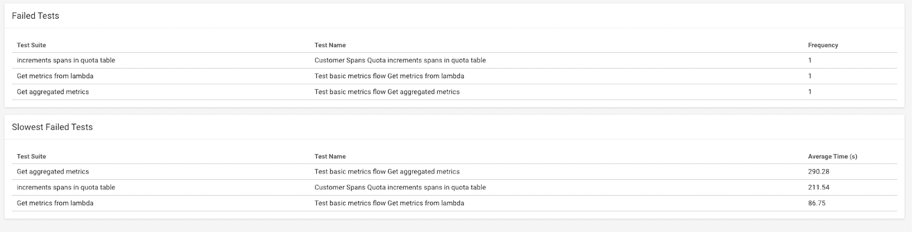
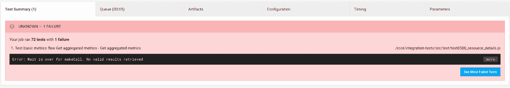
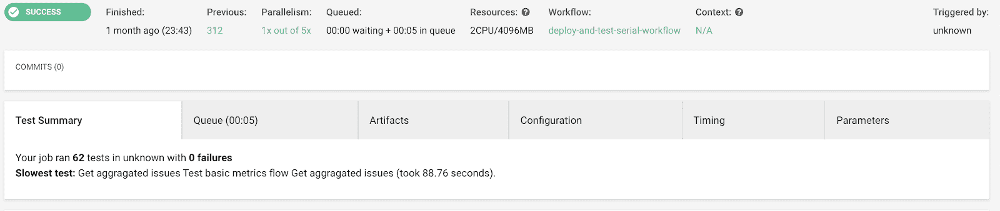

# 主动集成测试| CircleCI

> 原文：<https://circleci.com/blog/proactive-integration-testing/>

*[Lumigo](https://bit.ly/2R6tgrb) 软件工程师 [Idan Sofer](https://isofer.io) 概述了他如何利用 CircleCI 在一个完全无服务器的环境中主动根除脆弱的集成测试。*

当你开发一个无服务器的应用程序时，集成测试是至关重要的。产品的顺利运行比以往任何时候都更加依赖于代码与不受您控制的第三方服务的良好配合。

问题是，在无服务器环境中编写集成测试会很快变得复杂。随着资源的增加，集成点的数量也在增加，复杂性存在于这些资源的配置中。

集成测试失败有几个原因。有时，测试会运行很长时间并超时。有时，一个资源可能会受到另一个无效资源状态的影响。例如，在 Lumigo 这里，我们遇到了一个问题，一些资源依赖于 DynamoDB 表，该表需要在每次测试开始之前为空。问题是，有时项目会从删除批次中被拒绝，并且没有被删除，导致测试失败。

这是一个不可靠测试的例子，失败与开发者新添加的特性没有直接关系。诸如此类的有问题的测试真的会拖团队的后腿，所以我们想要找到一个更好的测试策略，在团队被它们阻碍之前识别出易出问题的测试。

## 集成测试策略的目标

让我们从定义这个项目的目标开始:

*   我们希望生成一份最常失败的测试的报告，这样我们就可以知道哪些测试是不可靠的，需要在 R&D 团队试图合并功能时被阻止之前解决。
*   其次，我们想要通过记录每个失败测试的平均时间来识别运行最慢的测试。
*   最后，我们想要使用这个策略来识别任何干扰其他测试并导致它们失败的测试。

## 我们的集成测试堆栈

由于我们与 CircleCI 合作，我们将使用 [CircleCI Insights](https://circleci.com/docs/insights/) 来生成报告。

## 我们开始吧

我们有一个专用于集成测试的共享环境。每个开发人员在提交新特性的代码以运行集成测试时都会部署特性堆栈。我们使用这个共享环境来运行我们的主动集成测试策略，模拟我们开发人员的工作。为此，我们复制了完整的开发周期，我们的每个工程师在集成环境中测试一个新特性时都会遵循这个周期。这意味着复制栈中所有 AWS 资源的完整部署，配置它们，并运行 Mocha 集成测试。

### CircleCI 工作

我们想同时模拟几个开发人员的周期。为此，我们使用并行运行的 [CircleCI 作业](https://circleci.com/docs/configuration-reference/#jobs)，每个作业代表一个开发人员。

这些作业中的每一个都运行相同的步骤(一个步骤是可执行命令的集合),只有一点不同——每一个都使用不同的变量来定义单独的堆栈:developer 1、developer 2 等。

例如:

```
jobs:
  deploy-and-test-developer1:
    executor: my-executor
    steps:
      - checkout_utils
      - checkout_code
      - prepare_deploy
      - deploy_and_test:
          to: "developer1"

  deploy-and-test-developer2:
    executor: my-executor
    steps:
      - checkout_utils
      - checkout_code
      - prepare_deploy
      - deploy_and_test:
          to: "developer2"

  deploy-and-test-developer3:
    executor: my-executor
    steps:
      - checkout_utils
      - checkout_code
      - prepare_deploy
      - deploy_and_test:
            to: "developer3"

  deploy-and-test-developer4:
    executor: my-executor
    steps:
      - checkout_utils
      - checkout_code
      - prepare_deploy
      - deploy_and_test:
          to: "developer4" 
```

### CircleCI 命令

由于每个作业中的步骤是相同的(变量除外)，我们使用 [CircleCI 命令](https://circleci.com/docs/configuration-reference/#commands-requires-version-21)来定义作业中要执行的步骤序列，这使我们能够在多个作业中重用单个命令定义。

为了处理用于单独标识每个作业的变量，我们使用了[命令参数](https://circleci.com/docs/configuration-reference/#parameters-requires-version-21)，它允许我们用一个键传递变量的字符串值。

下面是一个带有参数的部署和测试命令示例:

```
commands:      
  checkout_utils:
    description: "Checkout various utilities"
    steps:
      # checkout git utils
  checkout_code:
    description: "Checkout code and test it"
    steps:
      - checkout
      - run:
            # Avoid annoying double runs after deploy.
            # See https://discuss.circleci.com/t/job-runs-even-when-tags-ignore-filter-is-triggered-when-combined-with-branches-only/20664
            name: Check if tagged
            command: |
              tags=$(git tag -l --points-at HEAD)
              echo "Tags $tags"
              if [[ ! -z "$tags" ]]
              then
                echo "A tagged commit, skip..."
                circleci step halt
              fi
      - run: sudo chown -R circleci:circleci /usr/local/bin
      - run: sudo chown -R circleci:circleci /usr/local/lib/python3.7/site-packages

      # Download and cache dependencies
      - restore_cache:
          keys:
            - v1-dependencies-{{ checksum "requirements.txt" }}
            # fallback to using the latest cache if no exact match is found
            - v1-dependencies-

      - run:
          name: install dependencies
          command: |
            python3 -m venv venv
            . venv/bin/activate
            pip install -r requirements.txt --upgrade
      # https://discuss.circleci.com/t/activate-python-virtualenv-for-whole-job/14434
      - run: echo "source venv/bin/activate" >> $BASH_ENV
      - run: pip install pytest-cov
      - run: pre-commit install

      - save_cache:
          paths:
            - ./venv
          key: v1-dependencies-{{ checksum "requirements.txt" }}
  prepare_deploy:
    description: "Install and configure what is needed in order to run deployment scripts"
    steps:
      # integration-test setup

  deploy_and_test:
    description: "Deploy code and test it"
    parameters:
      to:
        type: string
        default: "developer1"
    steps:
      # run the deploy script for the first developer
      - run: |
          set +Eeo pipefail
          cd ../utils/deployment/sls_deploy && python3 main.py --env << parameters.to >> --branch ${CIRCLE_BRANCH}
      # deploy integration-tests
      - run: cd ../integration-tests && export USER=<< parameters.to >> && ./scripts/deploy.sh
      # run integration tests
      - run: cd ../integration-tests && npm run test-proactive
      - store_test_results:
          path: ~/integration-tests/src/test/test-results
      - store_artifacts:
          path: ~/integration-tests/src/test/test-results 
```

### CircleCI 工作流程

为了准确模拟我们的日常部署和测试过程，我们需要并行运行这些作业。

使用[circle ci workflows](https://circleci.com/docs/configuration-reference/#workflows)——一组用于定义作业集合及其运行顺序的规则——我们编写了一个工作流，用于并行运行五个开发人员作业，另一个工作流用于按顺序运行它们。

### 安排测试

我们不想在工作时间干扰团队，所以我们[使用 Cron 语法在 UTC 时间安排工作流](https://circleci.com/docs/workflows/#scheduling-a-workflow)在晚上运行。

一旦我们将这些工作流设置为在主分支上运行，我们就能够成功地模拟我们的日常功能交付过程。

在这个阶段，我们有这样的东西:

```
workflows:
  version: 2
  deploy-and-test-parallel-workflow:
    triggers:
      - schedule:
          cron: "30 21 * * *"
          filters:
            branches:
              only:
                - master
    jobs:
      - deploy-and-test-developer1
      - deploy-and-test-developer2
      - deploy-and-test-developer3
      - deploy-and-test-developer4 
```

### 生成测试报告

接下来，我们需要将我们的报告提供给 [CircleCI Insights](https://circleci.com/docs/insights/) 。

首先，为了生成 JUnit XML，我们使用了 [mocha-junit-reporter](https://www.npmjs.com/package/mocha-junit-reporter) 插件，并将测试脚本(在 package.json 中)设置如下:

```
"test-proactive": "mkdir -p test-results && MOCHA_FILE=test-results/junit.xml mocha --reporter mocha-junit-reporter --timeout 300000 --recursive *.js ||  (cat test-results/junit.xml && exit 1)", 
```

为了上传和存储构建的测试结果，我们使用了名为 [store_test_result](https://circleci.com/docs/collect-test-data/) 的 CircleCI 步骤。它从 XML 文件中收集测试元数据，并使用它来为您的工作提供洞察力。

## 结论

有了这个管道，我们可以每天晚上使用 CircleCI 工作流复制我们的整个开发过程，以模拟我们的无服务器环境(使用无服务器框架)的完全部署，并运行我们所有的集成测试。

然后，我们可以从一个 XML 文件(带有`mocha-junit-reporter`)中收集测试结果元数据，存储它，并在 CircleCI Insights 中查看它。这让我们可以看到哪些测试失败了，以及失败的原因。这里有一个这样的报告的例子:



它显示有三个失败的测试是不可靠的。例如，其中一个测试超时:



同样值得注意的是，对于成功的作业运行，我们可以在 Test Summary 选项卡下看到最慢的测试:



在真正的集成测试失败并阻止我们合并完全不相关的特性之前，拥有这些信息是非常有价值的。这不仅节省了我们修复故障的时间，也节省了我们找出故障原因的时间。

测试愉快！如果你对在你的开发工作流程中实现这个测试策略有任何问题，你可以在 Twitter [@AiSofer](https://twitter.com/AiSofer) 上找到我。我也很想听听你们用来识别不可靠测试的工具和技术。

* * *

Idan Sofer 是 Lumigo 的软件工程师，lumi go 是 SaaS 的一个平台，用于监控和调试无服务器应用程序。

[阅读更多 Idan Sofer 的帖子](/blog/author/idan-sofer/)