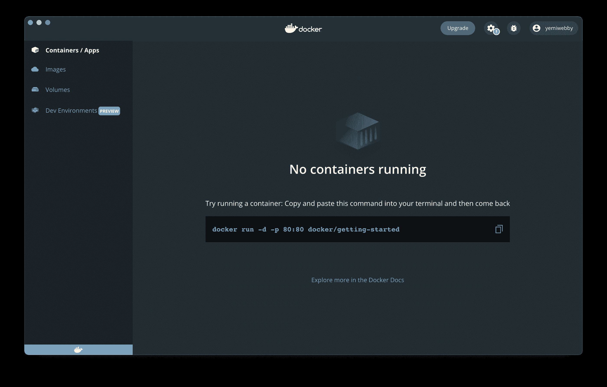
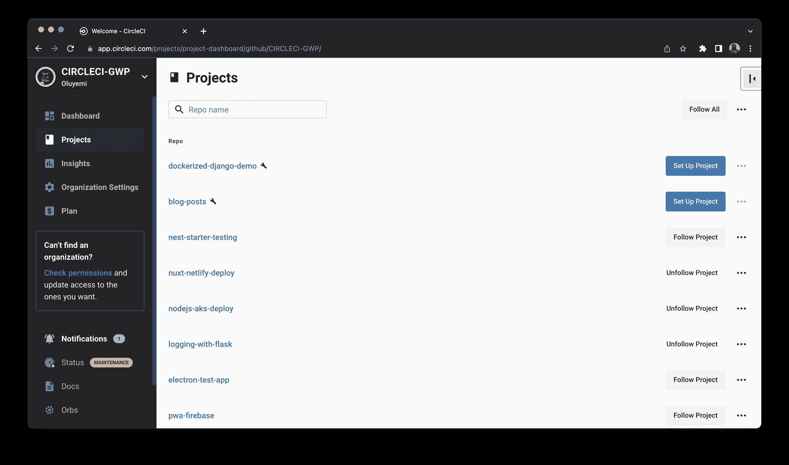
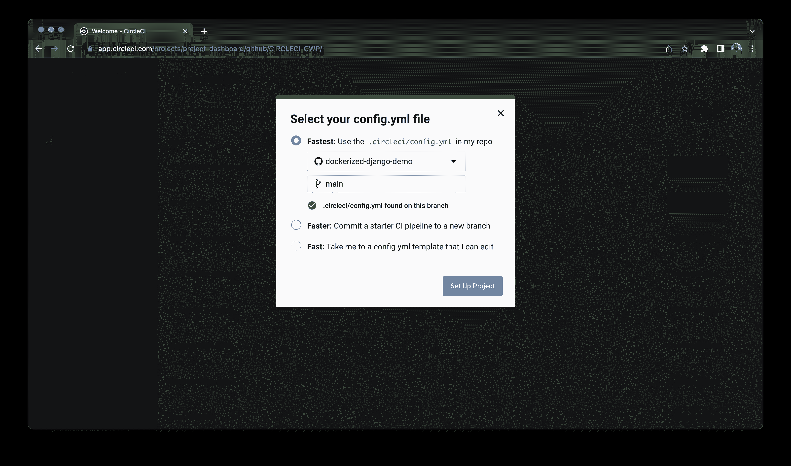
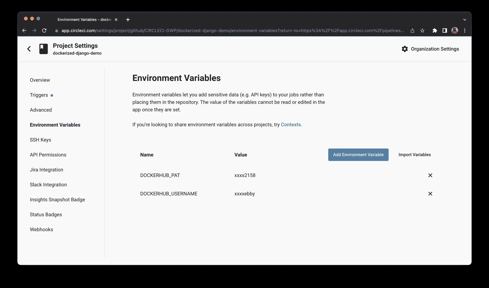

# 面向生产就绪的 Dockerized Django 应用| CircleCI 的持续集成

> 原文：<https://circleci.com/blog/production-ready-dockerized-django/>

> 本教程涵盖:
> 
> 1.  克隆和设置演示项目
> 2.  添加 CircleCI 配置文件，包括作业结构和工作流程
> 3.  使用并行和分割测试

持续集成已经成为软件项目中被广泛接受的实践。随着越来越多的技术被引入到持续集成和软件开发中，开发人员正在寻找实用的方法来从中获益。涵盖玩具示例的基础教程对于现实生活中的从业者来说并不总是足够的。作为 Django、Docker 和 CircleCI 的实际用户，这无疑是我的一个痛点。这就是我写这篇教程的原因。

在本指南中，您将从一位同行那里了解如何为生产就绪的 Dockerized Django 3.2 应用程序建立持续集成管道。

为了让你可以轻松上手，我创建了一个 [demo](https://github.com/CIRCLECI-GWP/dockerized-django-demo) 项目供你从 GitHub 克隆。

当您完成教程后，您项目的 GitHub repo 的每次推送都会自动触发构建，并将覆盖文档上传到 Codecov.io 等代码覆盖云提供商。您甚至会了解如何使用 CircleCI 的并行模式来更快地运行您的测试，并实现更短的迭代周期。

## 先决条件

为了从本教程中获得最大收益，您需要:

> 我们的教程是平台无关的，但是使用 CircleCI 作为例子。如果你没有 CircleCI 账号，请在 注册一个免费的 [**。**](https://circleci.com/signup/)

因为每个 Django 项目都是不同的，我将通过使用[演示](https://github.com/CIRCLECI-GWP/dockerized-django-demo)项目来引导您完成建立[持续集成管道](https://circleci.com/blog/what-is-a-ci-cd-pipeline/)的步骤。

我建议你从头到尾看两遍这个教程。第一次，使用演示项目。对于第二次检查，使用您自己的 Django 项目，从概念上重复相同的步骤，但是根据需要调整过程。

在教程的后面，我将提供一些调整你自己项目的步骤的技巧。现在，专注于跟随演示项目，这样你就能对整个过程从头到尾是如何工作的有一个直觉。

## 克隆演示项目

在这一步中，您将 git 克隆代码库，并确保您对代码库能够在本地运行测试感到满意。本质上，这个代码库遵循了 Django 文档中相同的经典七部分教程。演示项目代码库有一些不同。

主要区别在于:

1.  演示项目维护基于函数的视图，而不是教程中使用的基于类的视图。
2.  演示项目有一个`config`文件夹，其中有一个`settings`子文件夹，包含`base.py`、`local.py`和`production.py`，而不仅仅是`settings.py`。
3.  演示项目有一个带有子文件夹`users`的`dockerized_django_demo_circleci`文件夹。

Git 克隆代码库:

```
$ git clone https://github.com/CIRCLECI-GWP/dockerized-django-demo.git 
```

以下是结果输出:

```
[secondary_label Output]
Cloning into 'dockerized-django-demo-circleci'...
remote: Enumerating objects: 325, done.
remote: Counting objects: 100% (325/325), done.
remote: Compressing objects: 100% (246/246), done.
remote: Total 325 (delta 83), reused 293 (delta 63), pack-reused 0
Receiving objects: 100% (325/325), 663.35 KiB | 679.00 KiB/s, done.
Resolving deltas: 100% (83/83), done. 
```

既然您已经克隆了演示项目，那么您就可以测试 Dockerized 演示项目的本地版本了。

## 在本地运行测试

在这一步中，您将继续上一步，以确保测试可以在您的本地计算机上成功运行。

启动 Docker 桌面应用程序。如果需要复习 how，请参考本[教程](https://docs.docker.com/get-started/)。



进入 Django 的 Docker 容器并运行测试:

```
$ cd dockerized-django-demo
$ docker-compose -f local.yml run web_django bash 
```

根据这个输出，进入 Django Docker 容器的 bash shell。

```
[secondary_label Output]
Creating network "dockerized-django-demo_default" with the default driver
Creating dockerized-django-demo_db_postgres_1 ... done
Creating dockerized-django-demo_web_django_run ... done
Going to use psycopg2 to connect to postgres
psycopg2 successfully connected to postgres
PostgreSQL is available
root@abc77c0122b3:/code# 
```

现在，进行测试。

```
root@abc77c0122b3:/code# python3 manage.py test --keepdb 
```

输出将是:

```
[secondary_label Output]
Using existing test database for alias 'default'...
System check identified no issues (0 silenced).
..........
----------------------------------------------------------------------
Ran 10 tests in 0.454s

OK
Preserving test database for alias 'default'... 
```

这个输出意味着您的测试是正常的。当你把这个推给 CircleCI 的时候应该是一样的结果。

要退出 bash shell，请键入`exit`

```
root@abc77c0122b3:/code# exit 
```

回到你的主机操作系统。

```
[secondary_label Output]
exit
$ 
```

要正确关闭 Docker:

```
$ docker-compose -f local.yml down --remove-orphans 
```

以下是输出:

```
[secondary_label Output]
Stopping dockerized-django-demo_db_postgres_1 ... done
Removing dockerized-django-demo_web_django_run_8eeefb5e1d1a ... done
Removing dockerized-django-demo_db_postgres_1               ... done
Removing network dockerized-django-demo_default 
```

你现在可以安全地停止 Docker 桌面。

到目前为止，您的 Django 项目和测试用例应该会令您满意。现在是时候将代码推送到 GitHub 了。

## 将您自己的 GitHub 存储库连接到 CircleCI

如果您一直在使用演示项目，并且已经创建了自己的 GitHub repo，那么您需要重命名从中克隆代码的 remote。改为将 GitHub repo 添加为 remote `origin`。

将所有提及的`greendeploy-io/test-ddp`替换为回购的实际名称- `org-name/repo-name`

```
$ git remote rename origin upstream
$ git remote add origin git@github.com:greendeploy-io/test-ddp.git
$ git push -u origin main 
```

```
[secondary_label Output]
Enumerating objects: 305, done.
Counting objects: 100% (305/305), done.
Delta compression using up to 10 threads
Compressing objects: 100% (222/222), done.
Writing objects: 100% (305/305), 658.94 KiB | 2.80 MiB/s, done.
Total 305 (delta 70), reused 297 (delta 67), pack-reused 0
remote: Resolving deltas: 100% (70/70), done.
To github.com:greendeploy-io/test-ddp.git
 * [new branch]      main -> main
Branch 'main' set up to track remote branch 'main' from 'origin'. 
```

## 添加 CircleCI 配置文件

在这一步中，您将创建一个 CircleCI 配置文件，并编写脚本来为您的项目配置一个持续集成管道。首先，创建一个名为`.circleci`的文件夹，并在其中创建一个`config.yml`文件。现在，打开新创建的文件，输入以下内容:

```
# Python CircleCI 2.0 configuration file
#
# Check https://circleci.com/docs/language-python/ for more details
#
version: 2.1

# adding dockerhub auth because dockerhub change their policy
# See https://discuss.circleci.com/t/authenticate-with-docker-to-avoid-impact-of-nov-1st-rate-limits/37567/23
# and https://support.circleci.com/hc/en-us/articles/360050623311-Docker-Hub-rate-limiting-FAQ
docker-auth: &docker-auth
  auth:
    username: $DOCKERHUB_USERNAME
    password: $DOCKERHUB_PAT

orbs:
  codecov: codecov/codecov@3.2.2

jobs:
  build:
    docker:
      # specify the version you desire here
      # use `-browsers` prefix for selenium tests, e.g. `3.7.7-browsers`
      - image: cimg/python:3.8.12
        # use YAML merge
        # https://discuss.circleci.com/t/updated-authenticate-with-docker-to-avoid-impact-of-nov-1st-rate-limits/37567/35?u=kimsia
        <<: *docker-auth
        environment:
          DATABASE_URL: postgresql://root@localhost/circle_test?sslmode=disable
          USE_DOCKER: no

      # Specify service dependencies here if necessary
      # CircleCI maintains a library of pre-built images
      # documented at https://circleci.com/docs/circleci-images/
      - image: cimg/postgres:14.1 # database image for service container available at `localhost:<port>`
        # use YAML merge
        # https://discuss.circleci.com/t/updated-authenticate-with-docker-to-avoid-impact-of-nov-1st-rate-limits/37567/35?u=kimsia
        <<: *docker-auth
        environment: # environment variables for database
          POSTGRES_USER: root
          POSTGRES_DB: circle_test

    working_directory: ~/repo

    # can check if resource is suitable at resources tab in builds
    resource_class: large

    # turn on parallelism to speed up
    parallelism: 4

    steps: # a collection of executable commands
      # add deploy key when needed esp when requirements point to github url
      # - add_ssh_keys:
      #     fingerprints:
      #       - "ab:cd:ef..."
      - checkout # special step to check out source code to the working directory
      # using dockerize to wait for dependencies
      - run:
          name: install dockerize
          command: wget https://github.com/jwilder/dockerize/releases/download/$DOCKERIZE_VERSION/dockerize-linux-amd64-$DOCKERIZE_VERSION.tar.gz && sudo tar -C /usr/local/bin -xzvf dockerize-linux-amd64-$DOCKERIZE_VERSION.tar.gz && rm dockerize-linux-amd64-$DOCKERIZE_VERSION.tar.gz
          environment:
            DOCKERIZE_VERSION: v0.4.0
      # the actual wait for database
      - run:
          name: Wait for db
          command: dockerize -wait tcp://localhost:5432 -timeout 1m
      - restore_cache: # restores saved dependency cache if the Branch key template or requirements.txt files have not changed since the previous run
          key: deps1-{{ .Branch }}-{{ checksum "requirements/base.txt" }}-{{ checksum "requirements/local.txt" }}
      - run: # install and activate virtual environment with pip
          command: |
            python3 -m venv venv
            . venv/bin/activate
            pip install --upgrade setuptools && pip install wheel
            pip install --upgrade pip==22.0.4
            pip install --upgrade pip-tools
            pip-sync requirements/base.txt requirements/local.txt
      - save_cache: # special step to save dependency cache
          key: deps1-{{ .Branch }}-{{ checksum "requirements/base.txt" }}-{{ checksum "requirements/local.txt" }}
          paths:
            - "venv"
      - run:
          name: run collectstatic
          command: |
            . venv/bin/activate
            python3 manage.py collectstatic --noinput
      - run: # run tests
          name: run tests using manage.py
          command: |
            # get test files while ignoring __init__ files
            TESTFILES=$(circleci tests glob "*/tests/*.py" | sed 's/\S\+__init__.py//g' | sed 's/\S\+factories.py//g')
            echo $TESTFILES | tr ' ' '\n' | sort | uniq > circleci_test_files.txt
            TESTFILES=$(circleci tests split --split-by=timings circleci_test_files.txt | tr "/" "." | sed 's/\.py//g')
            . venv/bin/activate
            # coverage's --parallel-mode will generate a .coverage-{random} file
            # usage: https://docs.djangoproject.com/en/3.2/topics/testing/advanced/#integration-with-coverage-py
            # add `--verbosity=3` between $TESTFILES --keepdb if need to debug
            coverage run --parallel-mode manage.py test --failfast $TESTFILES --keepdb
          # name: run tests using pytest
          # command: |
          #   . venv/bin/activate
          #   pytest -c pytest.ini -x --cov-report xml --cov-config=.coveragerc --cov
      - store_test_results:
          path: test-results
      - store_artifacts:
          path: test-results
          destination: tr1
      # save coverage file to workspace
      - persist_to_workspace:
          root: ~/repo
          paths:
            - .coverage*
  fan-in_coverage:
    docker:
      # specify the version you desire here
      # use `-browsers` prefix for selenium tests, e.g. `3.7.7-browsers`
      - image: cimg/python:3.8.12
        # use YAML merge
        # https://discuss.circleci.com/t/updated-authenticate-with-docker-to-avoid-impact-of-nov-1st-rate-limits/37567/35?u=kimsia
        <<: *docker-auth
    working_directory: ~/repo
    resource_class: small
    parallelism: 1
    steps:
      - checkout
      - attach_workspace:
          at: ~/repo
      - restore_cache: # restores saved dependency cache if the Branch key template or requirements.txt files have not changed since the previous run
          key: deps1-{{ .Branch }}-{{ checksum "requirements/base.txt" }}-{{ checksum "requirements/local.txt" }}
      - run: # install and activate virtual environment with pip
          command: |
            python3 -m venv venv
            . venv/bin/activate
            pip install --upgrade setuptools && pip install wheel
            # because of https://github.com/jazzband/pip-tools/issues/1617#issuecomment-1124289479
            pip install --upgrade pip==22.0.4
            pip install --upgrade pip-tools
            pip-sync requirements/base.txt requirements/local.txt
      - save_cache: # special step to save dependency cache
          key: deps1-{{ .Branch }}-{{ checksum "requirements/base.txt" }}-{{ checksum "requirements/local.txt" }}
          paths:
            - "venv"
      - run:
          name: combine coverage and generate XML report
          command: |
            . venv/bin/activate
            coverage combine
            # at this point, if combine succeeded, we should see a combined .coverage file
            ls -lah .coverage
            # this will generate a .coverage.xml file
            coverage xml
      - codecov/upload:
          # xtra_args: '-F'
          upload_name: "${CIRCLE_BUILD_NUM}"
workflows:
  main:
    jobs:
      - build
      - fan-in_coverage:
          requires:
            - build 
```

为了方便地从这个脚本访问 Docker registry，您在[上下文](https://circleci.com/docs/contexts/)中设置了一个`docker-auth`字段，并提供了您的 Docker Hub 凭证。这些凭证将作为环境变量包含在本教程的后面部分。

接下来， [Codecov orb](https://circleci.com/developer/orbs/orb/codecov/codecov) 从 [CircleCI Orbs 注册表](https://circleci.com/developer/orbs)中被拉入。这个 orb 有助于将您的覆盖报告上传到 [Codecov](https://about.codecov.io/) 而无需任何复杂的配置。

两个独立的[任务](https://circleci.com/docs/jobs-steps/#jobs-overview)构建项目，在 CircleCI 上运行测试，并将覆盖报告部署到 Codecov:

已配置的工作流将确保`build`作业在`fan-in_coverage`开始之前完全运行，因为其输出将被上传到 Codecov。

### 工作结构和工作流程

如前一节所述，有两个作业:`build`和`fan-in_coverage`。我在这里将它们折叠起来，以便于查看。

```
jobs: build:...
  fan-in_coverage:...
workflows:
  main:
    jobs:
      - build
      - fan-in_coverage:
          requires:
            - build 
```

注意`fan-in_coverage`如何需要来自`build`作业的输出，以及`fan-in_coverage`如何将覆盖工件上传到 codecov.io。使用两个作业允许您使用并行性，并且仍然允许工件上传。

### 平行

为什么使用并行？答案很简单:[并行加速构建](https://circleci.com/blog/config-best-practices-concurrency-parallelism/)。

```
# turn on parallelism to speed up
parallelism: 4 
```

为了允许并行，你需要[分割测试](https://circleci.com/blog/a-guide-to-test-splitting/)。为了分割测试，CircleCI 需要知道测试文件的完整列表。

### 通过拆分测试实现并行

第一行试图找到所有相关的测试文件，跳过`__init__`和`factories.py`。文件列表然后被写入`circleci_test_files.txt`。

```
TESTFILES=$(circleci tests glob "*/tests/*.py" | sed 's/\S\+__init__.py//g' | sed 's/\S\+factories.py//g')
echo $TESTFILES | tr ' ' '\n' | sort | uniq > circleci_test_files.txt
TESTFILES=$(circleci tests split --split-by=timings circleci_test_files.txt | tr "/" "." | sed 's/\.py//g') 
```

然后，CircleCI 将在并行模式下使用`coverage.py`帮助运行测试。如果需要调试，添加一个`--verbosity=3`标志。

```
# add `--verbosity=3` between $TESTFILES --keepdb if need to debug
coverage run --parallel-mode manage.py test --failfast $TESTFILES --keepdb 
```

### 存储工件和文件

最后，配置告诉 CircleCI 在哪里存储工件和其他覆盖相关的文件，以便在`fan-in_coverage`中使用:

```
- store_test_results:
    path: test-results
- store_artifacts:
    path: test-results
    destination: tr1
# save coverage file to workspace
- persist_to_workspace:
    root: ~/repo
    paths:
      - .coverage* 
```

提交所有的更改，并更新您在 GitHub 上的项目资源库。

## 将您的项目连接到 CircleCI

要将您的项目连接到 CircleCI，请登录您的 CircleCI 帐户。如果你注册了 GitHub 账户，你所有的库都可以在你的[项目的仪表板](https://app.circleci.com/dashboard)上看到。从列表中找到您的项目；这种情况下是`dockerized-django-demo`。点击**设置项目**。



系统会提示您选择项目中的`.circleci/config.yml`文件。然后，输入分支机构名称，点击**设置项目**。



您的工作流将成功启动并构建。

## 将 Docker Hub 凭据作为环境变量添加到项目设置中

接下来，您需要将 Docker Hub 用户名和个人访问令牌作为环境变量添加到项目设置中。

进入 GitHub repo 的 CircleCI 项目页面，点击**项目设置**。从左侧菜单工具条中选择**环境变量**。

创建两个环境变量:`DOCKERHUB_PAT`和`DOCKERHUB_USERNAME`。使用您的 Docker Hub 帐户作为值的来源。



完成后，每次对 GitHub 库的推送或拉取请求都会在 CircleCI 上产生一个构建。

因为演示项目是一个公共 repo，所以 CircleCI 项目构建页面和 Codecov 覆盖页面也是公共的。

查看演示项目的 CircleCI 项目[构建页面](https://app.circleci.com/pipelines/github/CIRCLECI-GWP/dockerized-django-demo?filter=all)，了解完成所有步骤后您的构建页面应该是什么样子。

## 结论

在本文中，您克隆了一个生产就绪的 Django 3.2 演示项目。现在您可以对自己的 Dockerized Django 3.2 项目做同样的事情。更重要的是，在文章的后半部分，我深入讨论了应该在`config.yml`文件中包含什么。

如前所述，我建议您在第一次尝试时使用演示项目来遵循教程。第二次，在使用自己的项目时，只要把每一次提到`demo Django project`都换成`your Django project`就可以了。

我强调了解释的某些部分，以便您知道它们如何帮助加快您的 CI/CD 构建。使用并行性可以加速构建，而不会牺牲 Docker 和上传到代码覆盖率提供者等关键部分。需要注意的一点是，这里的设置是为了持续交付，而不是持续部署。访问此[页面](https://circleci.com/continuous-integration/#what-is-the-difference-between-continuous-integration-continuous-delivery-and-continuous-deployment)了解更多差异。

* * *

KimSia 是一名独立的软件工程师，他编写面向企业的 ops 软件服务。他是一个狂热的 Python 开发者，他的项目包括 [GreenDeploy](https://greendeploy.io/) 和 [AutonomyFirst.app](https://www.autonomyfirst.app/home) 。

[阅读更多 KimSia Sim 的帖子](/blog/author/kimsia-sim/)