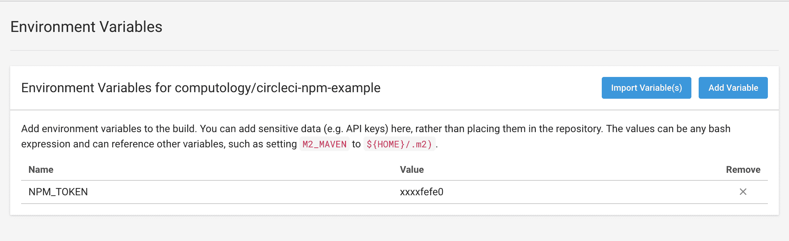
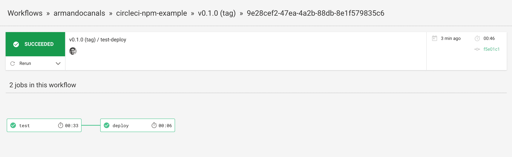

# 使用 CircleCI 发布 npm 软件包

> 原文：<https://circleci.com/blog/publishing-npm-packages-using-circleci-2-0/>

*这是由 [packagecloud](http://packagecloud.io) 的联合创始人 Armando Canals 写的一篇客座博文。*

本文将介绍使用 CircleCI 2.0 为 NodeJS 项目实现连续部署管道的必要步骤。

我们将使用新的 CircleCI 2.0 配置来设置项目，在 CircleCI 中运行测试，并在标记提交被推送到 git 存储库时将包部署到官方 npm 注册表。

## npm 和 npm 包

Npm 是 JavaScript 编程语言的包管理器，它是与 Node.js JavaScript 运行时环境捆绑在一起的默认包管理器。

Npm 包用于方便可靠地分发 JavaScript 代码。使用 Npm 包最常见的情况是分发 Node.js 程序，并轻松地将它们安装在不同的系统上。

在 [npm 文档网站](https://docs.npmjs.com/getting-started/packages)上阅读更多关于 npm 包的信息，或者阅读更多关于[使用 CircleCI 和 packagecloud 进行自动 npm 发布的信息](https://circleci.com/blog/continuous-package-publishing-part-ii-automated-npm-publishing-with-circleci-and-packagecloud/)。

## 为什么要发布 npm 包？

如果您想与其他开发人员、商业客户甚至持续集成工具(如 CircleCI)共享 Node.js 程序和 JavaScript 库，将 npm 包发布到注册表是最简单的方法。

在本帖中，我们将回顾将软件包发布到官方(公共)npm 注册表和托管在 packagecloud.io 上的[私有 npm 注册表。](https://packagecloud.io/l/npm-registry)

## 使用 CircleCI 2.0 配置 npm 注册表

### 向 NodeJS 项目添加一个`.circleci/config.yml`

在项目根目录中，创建一个名为`.circleci`的文件夹，并在该文件夹中创建一个名为`config.yml`的文件。

以下是这篇博文的完整示例 [`.circleci/config.yml`](https://github.com/computology/circleci-npm-example/blob/master/.circleci/config.yml) 文件:

```
# Javascript Node CircleCI 2.0 configuration file
#
# Check {{ '/language-javascript' | docs_url }} for more details
#
version: 2

defaults: &defaults
  working_directory: ~/repo
  docker:
    - image: circleci/node:8.9.1

jobs:
  test:
    <<: *defaults  
    steps:
      - checkout

      - restore_cache:
          keys:
          - v1-dependencies-{{ checksum "package.json" }}
	  # fallback to using the latest cache if no exact match is found
          - v1-dependencies-

      - run: npm install
      - run:
          name: Run tests
          command: npm test

      - save_cache:
          paths:
            - node_modules
          key: v1-dependencies-{{ checksum "package.json" }}

      - persist_to_workspace:
          root: ~/repo
          paths: .
  deploy:
    <<: *defaults
    steps:
      - attach_workspace:
          at: ~/repo
      - run:
          name: Authenticate with registry
          command: echo "//registry.npmjs.org/:_authToken=$npm_TOKEN" > ~/repo/.npmrc
      - run:
          name: Publish package
          command: npm publish

workflows:
  version: 2
  test-deploy:
    jobs:
      - test:
          filters:
            tags:
              only: /^v.*/
      - deploy:
          requires:
            - test
          filters:
            tags:
              only: /^v.*/
            branches:
              ignore: /.*/ 
```

现在，让我们分解这个配置来解释每项工作中涉及的步骤。

### 设置默认值

在`config.yml`中使用的下面一节允许我们通过定义一个名为`defaults`的映射并使用 YAML 合并`(<<: *)`键将其插入配置文件的后续部分来节省一些击键。

```
defaults: &defaults
  working_directory: ~/repo
  docker:
    - image: circleci/node:8.9.1 
```

这些默认值设置项目代码将被检出的工作目录，以及用于作业的版本`NodeJS`。

### 在 CircleCI 中设置`$npm_TOKEN`环境变量

使用 [npm CLI](https://docs.npmjs.com/cli/npm) 并使用`login`命令检索 npm 身份验证令牌。在终端中运行`npm login`命令，并在出现提示时使用您的 npm 凭据。

一旦完成，一个`.npmrc`文件将在运行该命令的机器上的用户目录中创建。

通常这是在`~/.npmrc`里。

这个令牌是假的，永远不要发布你的授权令牌。

从 npm 中检索到 auth 令牌后，在 CircleCI 上的项目设置中创建一个名为`$npm_TOKEN`的环境变量。



或者，如果您喜欢将您的敏感环境变量签入 git，但是加密，您可以遵循在 [circleci/encrypted-files](https://github.com/circleci/encrypted-files) 中概述的过程。

### 作业配置

`config.yml`的作业部分定义了将在工作流中运行的作业，以及每个作业的步骤。

#### 试验

我们定义的第一个作业是`test`作业，它检索项目代码，将依赖项安装到我们的工作区，并运行我们的测试:

```
jobs:
  test:
    <<: *defaults  
    steps:
      - checkout

      - restore_cache:
          keys:
          - v1-dependencies-{{ checksum "package.json" }}.
          # fallback to using the latest cache if no exact match is found
	  - v1-dependencies-

      - run: npm install
      - run:
          name: Run tests
          command: npm test

      - save_cache:
          paths:
            - node_modules
          key: v1-dependencies-{{ checksum "package.json" }}

      - persist_to_workspace:
          root: ~/repo
          paths: . 
```

由`npm test`运行的命令定义在 npm 包中`package.json`的`scripts`部分。

此步骤还会从缓存中恢复任何依赖关系，以便在从以前的作业重建时节省资源。我们可以使用`{{checksum “package.json”}}`作为 CircleCI 的缓存键，这样它只在`package.json`的校验和改变时安装依赖项。

在 [CircleCI 文档](https://circleci.com/docs/language-javascript/)中了解有关此配置的更多信息。

#### 部署

部署作业有几个步骤，运行这些步骤是为了向官方 npm 注册表进行身份验证和发布:

```
jobs:
...
  deploy:
    <<: *defaults
    steps:
      - attach_workspace:
          at: ~/repo
      - run:
          name: Authenticate with registry
          command: echo "//registry.npmjs.org/:_authToken=$npm_TOKEN" > ~/repo/.npmrc
      - run:
          name: Publish package
          command: npm publish 
```

*   步骤 1 -连接到我们配置的工作区

*   步骤 2 -使用 CircleCI 项目设置中设置为环境变量的`$npm_TOKEN`向 npm 注册表进行身份验证。

*   步骤 3 -从工作目录运行`npm publish`命令。

打包回购

#### 部署到私有 npm 注册表

将包部署到私有注册表非常类似于在 npm 提供的官方注册表上发布包。

通过在使用 npm 注册表进行身份验证之前添加额外的步骤，我们可以指定 npm 命令在部署时将使用哪个注册表。

我们将以 [packagecloud](https://packagecloud.io) 上的 npm 注册表为例:

```
jobs:
...
deploy:
    <<: *defaults
    steps:
      - attach_workspace:
          at: ~/repo
      - run:
          name: Set registry URL
          command: npm set registry https://packagecloud.io/armando/node-test-package/npm/
      - run:
          name: Authenticate with registry
          command: echo "//packagecloud.io/armando/node-test-package/npm/:_authToken=$npm_TOKEN" > ~/repo/.npmrc
      - run:
          name: Publish package
          command: npm publish 
```

```
https://packagecloud.io/:username/:repo_name/npm/ 
```

其中，`:username`是 packagecloud npm 注册表上的用户，`:repo_name`是由 packagecloud 用户创建的 npm 注册表的名称。

*   步骤 3 -使用 CircleCI 项目设置中设置为环境变量的`$npm_TOKEN`向 npm 注册表进行身份验证。在这种情况下，有效的 [packagecloud API 令牌](https://packagecloud.io/docs/api#api_tokens)将授予对 packagecloud npm 注册表的写访问权限。查看 [packagecloud.io](https://packagecloud.io) 上的 [`npm login`文档](https://packagecloud.io/docs#npm_login)了解更多信息。

*   步骤 4 -从工作目录运行`npm publish`命令。

### 使用 CircleCI 工作空间

我们在`config.yml`中设置了一个工作区，以便在作业之间共享数据。创建一个工作空间允许我们签出项目代码，并在`test`和`deploy`任务之间共享。

作为`test`作业中的一个步骤，我们将作业中之前完成的步骤保存到工作区，包含以下部分:

```
- persist_to_workspace:
    root: ~/repo
    paths: . 
```

然后，在随后的`deploy`作业中，我们使用以下配置连接到工作区，作为作业的第一步:

```
- attach_workspace:
    at: ~/repo 
```

### Git 标记作业执行-在标记提交时部署

作为我们连续交付管道的一部分，我们希望确保`deploy`作业/仅/在提交被标记了版本号并被推送时运行。

```
workflows:
  version: 2
  test-deploy:
    jobs:
      - test:
          filters:
            tags:
              only: /^v.*/
      - deploy:
          requires:
            - test
          filters:
            tags:
              only: /^v.*/
            branches:
              ignore: /.*/ 
```

上面的工作区配置将在所有分支和所有标记上运行`test`作业，并且仅当提交被标记了版本号并被推送时才运行`deploy`作业。

`tags`部分使用正则表达式来匹配以`v`开头的标签，例如`v0.1.0`。

[在此阅读更多关于 Git 标签作业执行的信息](https://circleci.com/docs/workflows/#git-tag-job-execution)



## 结论

在软件开发生命周期中自动化手动过程可以显著减少错误、开发时间和用户挫折感。使用 CircleCI 这样的工具可以让您的团队构建一个健壮的软件分发管道，快速可靠地将软件提供给用户，而无需增加额外的基础设施。

使用功能强大的 CircleCI 2.0 自动化工具，开始将 npm 软件包直接发布到任何公共或私有注册表。