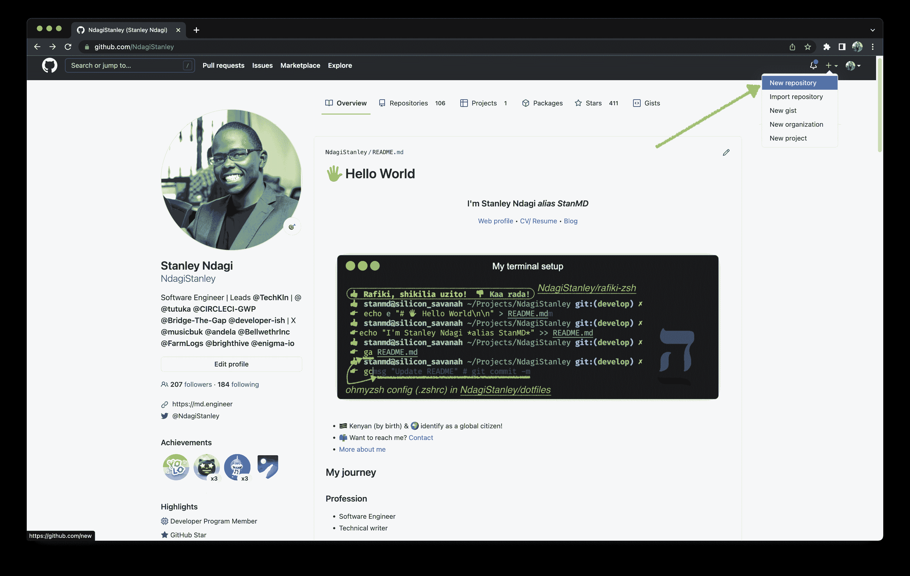
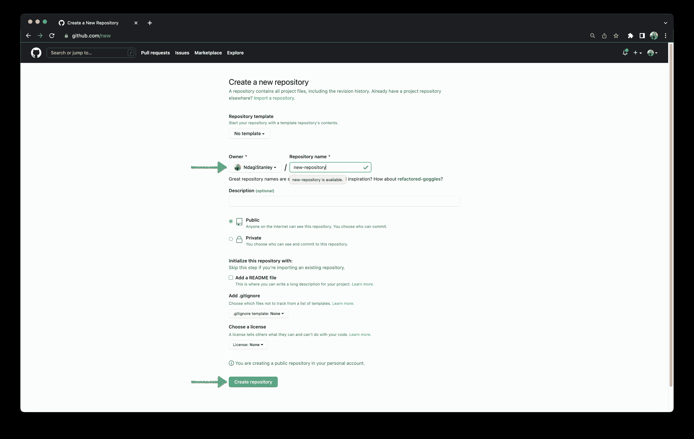
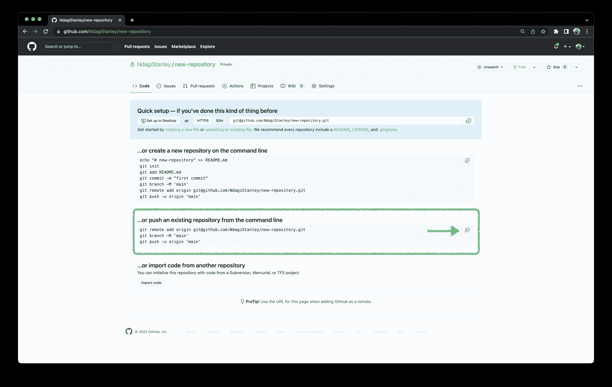

# 将项目推送到 GitHub | CircleCI

> 原文：<https://circleci.com/blog/pushing-a-project-to-github/>

> 本教程涵盖:
> 
> 1.  什么是 GitHub，为什么你想使用它
> 2.  设置和创建 GitHub repo
> 3.  将您的项目推向新的回购

GitHub 是一个基于 web 的平台，用于项目版本控制和代码库托管。GitHub 使用 Git，一个广泛使用的版本控制系统。 [GitLab](https://gitlab.com/) 和 [Bitbucket](https://bitbucket.org/) 是类似的工具。

使用 GitHub 是 CircleCI 博客上大多数教程的必备条件，所以学习使用它是有帮助的。在本教程中，我将向您展示如何将项目推送到 [GitHub](https://github.com/) 。

## 先决条件

要遵循本教程，需要做一些事情:

1.  Git 的基础知识
2.  安装在您系统上的 Git
3.  GitHub 的一个账户

有了这些东西，我们就可以开始教程了。

## 安装

为了简单起见，我们将使用一个 HTML 文件。你可以在这里查看 HTML 文件。

有几种方法可以获得 HTML 文件:

*   将要点中的代码复制到一个`index.html`文件中
*   进入[这个链接](https://circleci-gwp.github.io/profile/)，然后点击**下载这个单页网页简介**。
*   使用终端(或类似的命令提示符或 PowerShell)。转到要使用的项目文件夹并运行:

```
wget https://raw.githubusercontent.com/CIRCLECI-GWP/profile/main/index.html 
```

使用这些方法中的任何一种都会导致在你的根目录下出现一个`index.html`。

在本教程的其余部分，我们将使用终端来运行命令。除非另有指示，否则请在项目目录的根级别运行命令。

### 正在初始化 Git

因为我们在本地创建了我们的文件，所以我们需要将它推送到 GitHub 来存储在那里。第一步是初始化 Git。

运行:

```
git init 
```

git init 命令将您的目录变成一个新的 git 存储库。

### 添加文件

Git 初始化后，我们需要标记 HTML 文件，以便它包含在下一次提交中。这个过程也称为暂存。

**注意:** *提交是对文件变化历史的快照。*

运行:

```
add index.html 
```

这个命令标记了`index.html`文件，这样它就可以包含在下一次提交中。

### 提交文件

我们的文件现在被标记并准备好第一次提交。

运行:

```
git commit -m "Add index.html" 
```

-m 后面的文本是*提交消息*。这是一个关于提交中有什么变化的友好提示。

## 推送至 GitHub

将所有本地提交上传到远程存储库。这使得您的同事可以使用您文件中的更改。这个过程有两个部分:

1.  创建存储库
2.  推进项目

### 创建 GitHub 存储库

在你的浏览器中，去 github.com 登陆，如果你还没有的话。单击页面右上角的加号图标。然后选择**新建存储库**。



选择**所有者**，输入**库名**，然后点击**创建库**。我在本教程中使用了名称`new-repository`。你以后会用到这个名字，所以记下来。



你有了它，一个闪闪发光的新仓库。如果这是你的第一次，恭喜你！您已经达到了一个编程里程碑。

停留在此页面完成下一步。

### 将项目推向 GitHub

请记住，您已经有了一个包含一个文件的本地存储库，并且您已经提交了对它所做的更改。下一步是将这些更改推送到新创建的 GitHub 存储库。



将这些命令粘贴到您的终端中，并按下 **Enter** 来执行它们:

```
git remote add origin https://github.com/NdagiStanley/new-repository.git
git branch -M `main`
git push -u origin `main` 
```

**注意** : *用你的 GitHub 用户名替换例子中显示的用户名。*。

运行这些命令后，重新加载浏览器页面。您的`index.html`文件现在列在在线存储库中。

您可以通过按顺序运行以下命令对存储库进行更多更新:

```
git add .
git commit -m "Commit message"
git push origin main 
```

用您自己的描述性文本替换示例文本`Commit message`。如果您正在处理`main`以外的分支，请使用您的分支的名称。你可以在这里阅读更多关于 git 分支[的内容。](https://git-scm.com/book/en/v2/Git-Branching-Basic-Branching-and-Merging)

## 结论

在本教程中，您将一个本地 Git 存储库推送到 GitHub。熟悉了 Git 和 GitHub 之后，您就可以进入下一步，基于您的 GitHub 存储库建立一个 CircleCI 项目。GitHub 和其他基于 Git 的版本控制系统广泛应用于软件开发和其他需要版本控制的学科。理解它们是开发人员工具箱的一个重要补充。

–

* * *

Stanley 是一名软件工程师和技术文案，他身兼数职，包括技术团队领导和社区参与。他把自己描述成一个数字人(在数字空间中有文化)。

[阅读 Stanley Ndagi 的更多帖子](/blog/author/stanley-ndagi/)