# 将 React 应用程序部署到 Netlify | CircleCI

> 原文：<https://circleci.com/blog/react-netlify-deploy/>

> 本教程涵盖:
> 
> 1.  设置连续部署服务器
> 2.  向构建过程中添加并执行任何自定义步骤
> 3.  将应用程序部署到 Netlify

React 是一个用于构建用户界面的前端框架，它使用基于组件的架构和非固执己见的设计原则，这使它成为开发人员的最爱。React 已被广泛采用，并有一个庞大的开发人员社区支持它。Netlify 是一个用于托管 React 应用程序的流行框架，但是它不能为您的团队提供对部署过程的最高级别的控制。结果，您不能执行像运行自动化测试这样的重要任务。

在本教程中，您将学习如何通过使用 CircleCI 作为连续部署服务器来控制部署过程。通过使用本教程设置的系统，您可以执行所需的任何自定义步骤来完成构建过程并将 React 应用程序部署到 Netlify。

## 先决条件

要完成本教程，您需要:

1.  安装在您系统上的 [Node.js](https://nodejs.org) (版本 12 或更新版本)
2.  净收益账户
3.  一个[圆](https://circleci.com/signup/)的账户
4.  GitHub 的一个账户

> 我们的教程是平台无关的，但是使用 CircleCI 作为例子。如果你没有 CircleCI 账号，请在 注册一个免费的 [**。**](https://circleci.com/signup/)

所有这些安装和设置，我们可以开始教程。

## 创建新的 React 站点

在系统中选择一个位置，创建将部署到 Netlify 的 React 站点。运行以下命令:

```
npx create-react-app netlify-react-app 
```

这个命令将调用`create-react-app` npm 包来构建一个新的 React 应用程序。

结果是在`netlify-react-app`文件夹中创建了一个 React 项目。使用以下命令运行项目:

```
cd netlify-react-app
npm start 
```

这些命令在本地 URL: `http://localhost:8000`启动 React 站点。将此地址加载到您的浏览器中。

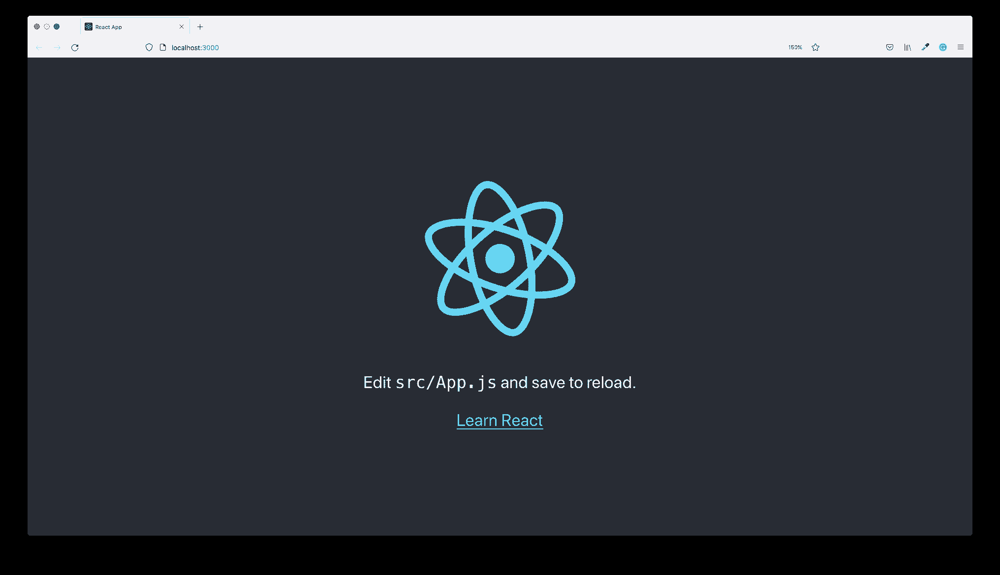

## 设置 GitHub 项目

你需要在 GitHub 上设置你的 React 项目，然后才能在 Netlify 和 CircleCI 上获得它。首先，在 React 项目中安装 [Netlify CLI](https://www.npmjs.com/package/netlify-cli) 包作为开发依赖项。在项目的根目录下运行以下命令:

```
npm install --save-dev netlify-cli 
```

**注意** : *将 Netlify CLI 添加为依赖项可以防止在 CI 环境中对部署进行重大更改。*

你现在可以将你的项目推送到 GitHub 了。一旦你的项目在 GitHub 上，创建一个新的分支。给这个分支取任何你想要的名字；对于本教程，我将命名为`netlify-deploy-ignore`。

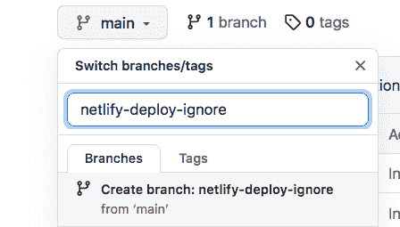

您可能想知道为什么需要这个分支。Netlify 需要一个项目分支来自动触发应用程序的部署。当更改被推送到这个分支时，Netlify 将启动部署过程。您希望避免 Netlify 和 CircleCI 管道并行运行两个部署进程的情况。这个新的分支充当了 Netlify 监视的诱饵。不要将更改推送到此分支。其目的是“分散”Netlify 部署过程的注意力，以便您可以使用 CircleCI 进行部署。你可以在 GitHub 上设置一个受保护的分支，这样你的团队中就没有人会误把它推上来。

## 创建网络应用程序

要创建新的 Netlify 应用程序，请转到您的 Netlify 仪表板，然后单击 Git 按钮中的**新站点。接下来，选择 GitHub 作为您的提供商并搜索项目。**

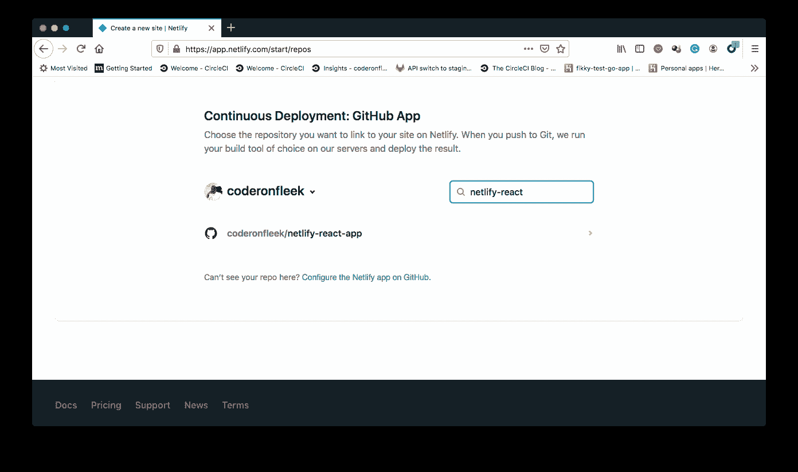

选择项目并转到下一步，为 Netlify 选择要部署的分支。选择你的诱饵分支。

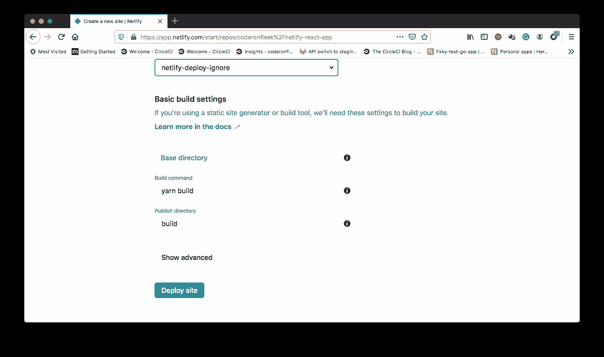

接下来，点击 **Deploy site** 按钮，这样 Netlify 将执行您站点的第一次部署。单击链接，它应该类似于:`sitename.netlify.app`

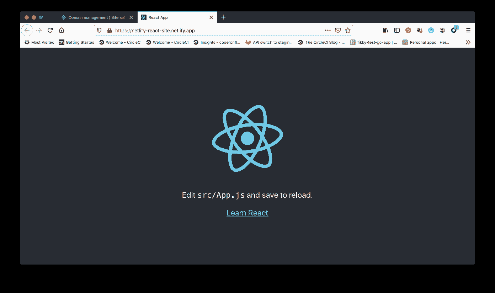

要在 CircleCI 管道中执行自动部署，您需要从 Netlify 应用程序和帐户中获取两个配置值。

*   您刚刚创建的应用程序的`APP ID`可以在您的 Netlify 应用程序的站点详细信息部分找到。
*   **个人访问令牌**允许从您的部署管道访问您的 Netlify 帐户。在`User Settings > Applications`生成访问令牌。

将您的访问令牌保存在一个安全的地方，因为 Netlify 不允许您在创建后查看该值。你只能改变它。

## 在 CircleCI 建立项目

是时候在 CircleCI 上建立你的项目了。将`.circleci`文件夹添加到项目的根目录。在其中，添加一个空的`config.yml`文件。在下一节中，您将向该文件添加配置。将您的更改推送到 GitHub 项目。

接下来，转到 CircleCI 仪表板上的 Add Projects 页面来添加项目。

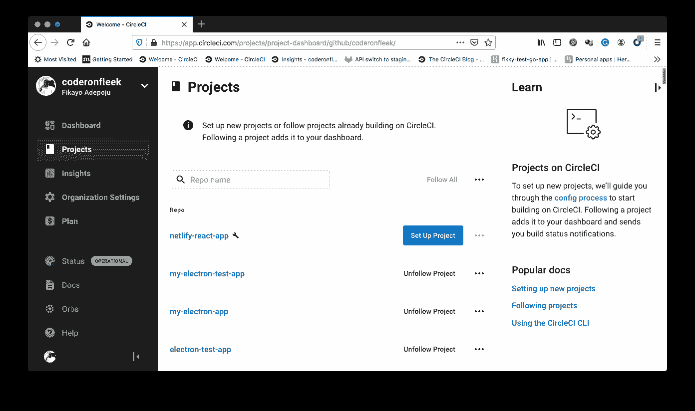

点击**设置项目**。这将加载一个对话框，CircleCI 自动检测您的配置文件。

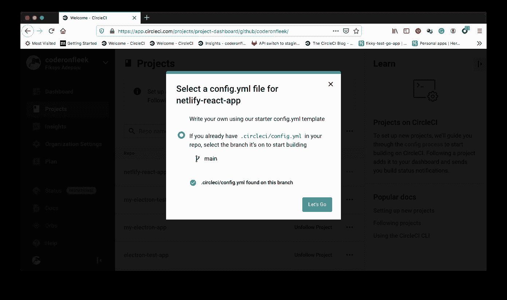

单击 **Let's Go** 首次触发您的构建管道。构建将失败，因为您尚未向配置中添加代码。稍后您将执行此步骤。

在编写配置之前，您需要在 CircleCI 项目中添加 Netlify `APP ID`和 access token 作为环境变量。

确保您的项目是“管道”页面上当前选定的项目。点击**项目设置**按钮。在设置页面上，从侧面菜单中选择**环境变量**。在这个新页面上，点击**添加环境变量**按钮，输入以下信息:

*   `NETLIFY_SITE_ID`:您的网络应用程序的 API ID
*   您的网络个人访问令牌。

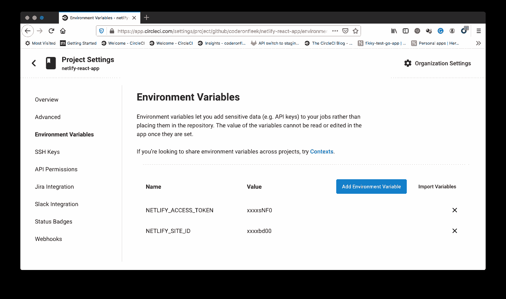

## 编写部署配置

该过程的最后一步是编写部署配置。打开`config.yml`文件并添加以下配置:

```
version: 2.1
jobs:
  build:
    working_directory: ~/repo
    docker:
      - image: cimg/node:16.13.2
    steps:
      - checkout
      - run:
          name: Update NPM
          command: "sudo npm install -g npm"
      - restore_cache:
          key: dependency-cache-{{ checksum "package-lock.json" }}
      - run:
          name: Install Dependencies
          command: npm install
      - save_cache:
          key: dependency-cache-{{ checksum "package-lock.json" }}
          paths:
            - ./node_modules
      - run:
          name: Build React App
          command: npm run build
      - save_cache:
          key: app-build-cache-{{ .Branch }}
          paths:
            - ./build
      - run:
          name: Deploy to Netlify
          command: ./node_modules/.bin/netlify deploy --site $NETLIFY_SITE_ID --auth $NETLIFY_ACCESS_TOKEN --prod --dir=build
workflows:
  version: 2
  build-deploy:
    jobs:
      - build:
          filters:
            branches:
              only:
                - main 
```

在这个配置中，项目从存储库中签出，项目依赖项被安装和缓存。缓存完依赖项后，运行 React 构建命令`npm run build`。它在项目根目录下的`build`目录中创建应用程序的生产版本，然后缓存该版本。

最后，Netlify CLI 使用`$NETLIFY_SITE_ID`和`$NETLIFY_ACCESS_TOKEN`变量部署站点。然后，工作流配置确保只有`main`分支触发网络部署。

在为 CircleCI 推送这个配置以部署站点之前，请将`<p>`标记中的 React 消息改为:

```
<p>Successfully Deployed <code>A React application</code> to Netlify with CircleCI</p> 
```

这使您能够查看已部署应用程序中的更改。

最后，提交你所有的修改，推送到 GitHub。这将自动触发部署管道和成功的构建。

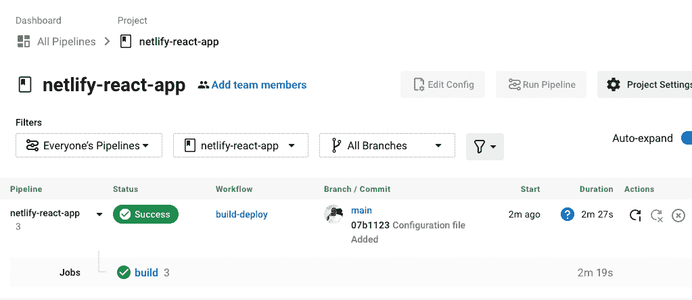

单击构建以查看部署详细信息。

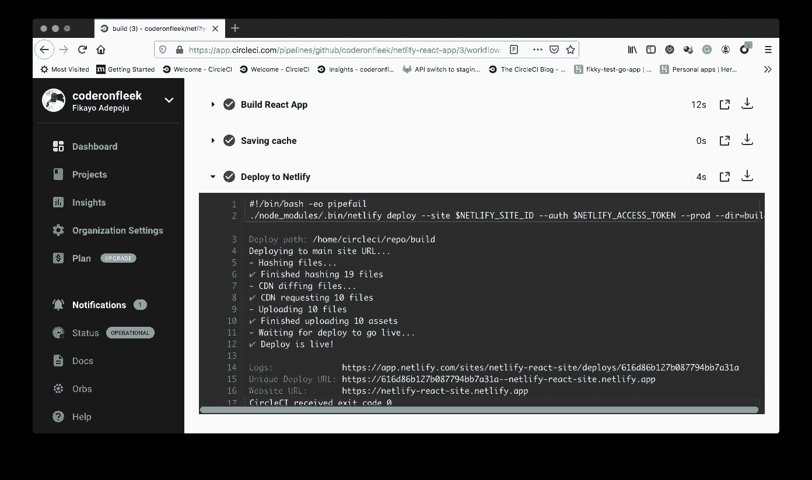

成功构建后，再次访问您的网站以验证您部署的更改。它应该显示新消息。

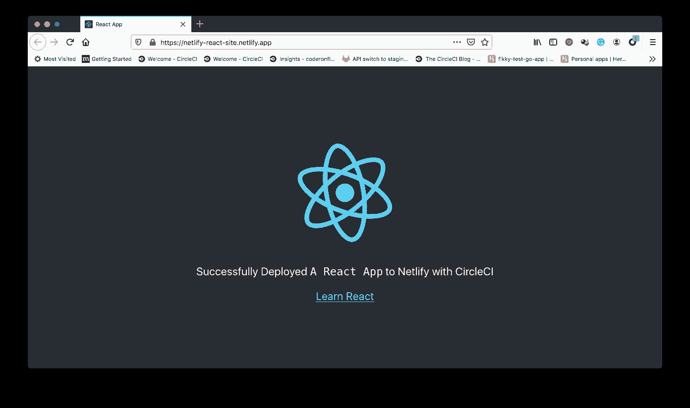

厉害！

要确认 Netlify 没有运行并行部署，请检查 Netlify 部署日志。生产部署中只有一个部署，第一个部署由分支`netlify-deploy-ignore`触发。其余的没有显示分支，因为它们是由 CircleCI 管道触发的。

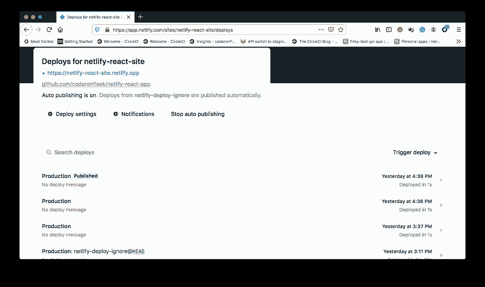

## 结论

这就是使用 CircleCI 将 React 站点自定义部署到 Netlify 的方法。这种设置为您提供了更多的灵活性和对网络部署的控制。这使您的团队能够在流程中运行更多的自定义步骤。

编码快乐！

* * *

Fikayo Adepoju 是 LinkedIn Learning(Lynda.com)的作者、全栈开发人员、技术作者和技术内容创建者，精通 Web 和移动技术以及 DevOps，拥有 10 多年开发可扩展分布式应用程序的经验。他为 CircleCI、Twilio、Auth0 和 New Stack 博客撰写了 40 多篇文章，并且在他的个人媒体页面上，他喜欢与尽可能多的从中受益的开发人员分享他的知识。你也可以在 Udemy 上查看他的视频课程。

[阅读 Fikayo Adepoju 的更多帖子](/blog/author/fikayo-adepoju/)