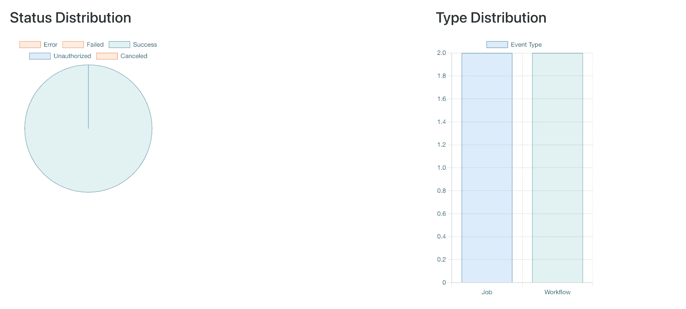
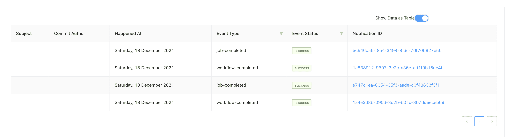

# 构建 React 仪表板以可视化工作流和作业事件| CircleCI

> 原文：<https://circleci.com/blog/react-webhook-dashboard/>

数据可视化是将大型数据集和指标转化为图表、图形和其他视觉效果的过程。由此产生的数据可视化表示使得识别和共享实时趋势、异常值以及关于数据中所表示信息的新见解变得更加容易。使用 CircleCI [webhooks](https://circleci.com/docs/webhooks/) ，我们可以收集工作流和作业事件的数据。在本教程中，我将引导您创建一个基于 React 的仪表板来可视化这些数据。

## 先决条件

要跟随本教程，您需要很好地掌握 JavaScript ES6。您还需要了解一些基本的 React 概念，比如钩子和功能组件。

您需要在工作站上安装这些软件:

1.  一个最新安装的 [node.js](https://nodejs.org/en/download/) ，还有一个类似 [npm](https://www.npmjs.com/get-npm) 或者 [yarn](https://yarnpkg.com/getting-started/install#) 的包管理器
2.  您首选的代码编辑器
3.  一个与你的 CircleCI webhook 通信的 API。你可以在这里了解如何设置一个[。](https://github.com/yemiwebby/circle_ci_webhook)
4.  确保[本教程](https://circleci.com/blog/building-a-laravel-api-for-circleci-webhooks/)中涉及的[Laravel API circle ci web hook](https://github.com/CIRCLECI-GWP/laravel-api-circleci-webhook)已经启动并运行。

> 我们的教程是平台无关的，但是使用 CircleCI 作为例子。如果你没有 CircleCI 账号，请在 注册一个免费的 [**。**](https://circleci.com/signup/)

## 入门指南

使用以下命令创建一个新的 React 应用程序:

```
yarn create react-app circleci_workflow_dashboard

cd circleci_workflow_dashboard 
```

对于这个项目，我们将使用 [Ant Design](https://ant.design/) 来布置 UI，使用 [react-chartjs-2](https://github.com/reactchartjs/react-chartjs-2) 来显示我们的图表。

使用 yarn 添加项目依赖关系:

```
yarn add antd react-chartjs-2@3.3.0 chart.js 
```

下一步是为 ant design 导入样式。用这个更新`src/App.css`:

```
@import '~antd/dist/antd.css'; 
```

## 添加实用功能

接下来，我们需要一种与 API 通信的方式。在`src`文件夹中，创建一个名为`utility`的新文件夹。在`utility`文件夹中，创建一个名为`API.js`的新文件。在`src/utility/API.js`文件中，添加以下内容:

```
export const makeGETRequest = (url) => {
  return fetch(url, {
    method: "GET",
    headers: {
      "Content-Type": "application/json",
    },
  }).then((response) => response.json());
}; 
```

使用这个函数，我们可以向 API 发出一个`GET`请求。该函数从 API 返回 JSON 响应。

> 为了简单起见，函数中不包括错误处理。

为了以可读的格式表示日期，我们可以创建一个实用函数。在`utility`文件夹中，创建一个名为`Date.js`的新文件，并添加:

```
export const formatDate = (date) =>
  new Date(date).toLocaleString("en-GB", {
    month: "long",
    weekday: "long",
    day: "numeric",
    year: "numeric",
  }); 
```

## 构建仪表板组件

我们的控制面板将显示一个事件表，您可以根据状态和事件类型进行筛选。您还可以在表格显示和图表显示之间切换仪表板。

在`src`文件夹中，创建一个名为`components`的新文件夹。该文件夹将保存我们将创建的所有自定义组件。

在`components`目录中，创建一个名为`StatusTag.jsx`的新文件。该组件将用于显示一个标签，标签的颜色由事件的状态决定。将此添加到`StatusTag.jsx`:

```
import React from "react";
import { Tag } from "antd";

const StatusTag = ({ status }) => {
  const statusColours = {
    success: "green",
    failed: "volcano",
    error: "red",
    canceled: "orange",
    unauthorized: "magenta",
  };
  return <Tag color={statusColours[status]}>{status}</Tag>;
};

export default StatusTag; 
```

接下来，在`components`目录中创建一个名为`TableView.jsx`的新文件。该组件将通知作为道具，并将其呈现在一个表格中，能够根据类型和状态进行过滤。将此代码添加到`TableView.jsx`:

```
import React from "react";
import { Table } from "antd";
import { formatDate } from "../utility/Date";
import StatusTag from "./StatusTag";

const TableView = ({ notifications }) => {
  const filterHandler = (value, record, key) => record[key] === value;

  const columns = [
    {
      title: "Subject",
      dataIndex: "commit_subject",
    },
    {
      title: "Commit Author",
      dataIndex: "commit_author",
    },
    {
      title: "Happened At",
      dataIndex: "happened_at",
      render: (text) => formatDate(text),
    },
    {
      title: "Event Type",
      dataIndex: "type",
      filters: [
        { text: "Job", value: "job-completed" },
        { text: "Workflow", value: "workflow-completed" },
      ],
      onFilter: (value, record) => filterHandler(value, record, "type"),
    },
    {
      title: "Event Status",
      dataIndex: "event_status",
      filters: [
        { text: "Success", value: "success" },
        { text: "Failed", value: "failed" },
        { text: "Error", value: "error" },
        { text: "Canceled", value: "canceled" },
        { text: "Unauthorized", value: "unauthorized" },
      ],
      render: (text) => <StatusTag status={text} />,
      onFilter: (value, record) => filterHandler(value, record, "event_status"),
    },
    {
      title: "Notification ID",
      dataIndex: "notification_id",
      render: (text, record) => (
        <a href={record["workflow_url"]} target="_blank" rel="noreferrer">
          {text}
        </a>
      ),
    },
  ];

  return (
    <Table dataSource={notifications} columns={columns} rowKey="id" bordered />
  );
};

export default TableView; 
```

该表有六列:主题、提交作者、发生时间、事件类型、事件状态和通知 ID。

每一列由`columns`常量中的一个对象表示。在不需要特殊渲染的地方，`title`和`dataIndex`对于列声明就足够了。`title`用作列的标题，而`dataIndex`条目让 antd 知道该列填充了哪个属性。

为了指定要在列中呈现的组件或 JSX 元素，我们向列的对象表示添加了一个`render`键。我们用它来呈现我们之前创建的`StatusTag`组件。我们还使用它为`Happened At`列呈现一个格式良好的日期，并将通知 ID 作为工作流的链接。

## 构建图表组件

对于本教程，我们将在三个图表中呈现数据:

1.  按状态显示事件分布的饼图:成功、失败、错误、已取消或未授权。
2.  按类型显示事件分布的条形图:工作流或作业
3.  显示事件时间线的折线图

要构建饼图，在`components`文件夹中创建一个名为`StatusDistribution.jsx`的新文件，并将以下代码添加到其中:

```
import React from "react";
import { Pie } from "react-chartjs-2";

const StatusDistribution = ({ notifications }) => {
  const sortedNotifications = notifications.reduce(
    (sortedNotifications, notification) => {
      sortedNotifications[notification["event_status"]]++;
      return sortedNotifications;
    },
    { error: 0, failed: 0, success: 0, unauthorized: 0, canceled: 0 }
  );

  const data = {
    labels: ["Error", "Failed", "Success", "Unauthorized", "Canceled"],
    datasets: [
      {
        data: Object.values(sortedNotifications),
        backgroundColor: [
          "rgba(255, 99, 132, 0.2)",
          "rgba(255, 206, 86, 0.2)",
          "rgba(75, 192, 192, 0.2)",
          "rgba(153, 102, 255, 0.2)",
          "rgba(255, 159, 64, 0.2)",
        ],
        borderColor: [
          "rgba(255, 99, 132, 1)",
          "rgba(255, 206, 86, 1)",
          "rgba(75, 192, 192, 1)",
          "rgba(153, 102, 255, 1)",
          "rgba(255, 159, 64, 1)",
        ],
        borderWidth: 1,
      },
    ],
  };

  return (
    <>
      <div className="header">
        <h1 className="title">Status Distribution</h1>
      </div>
      <Pie data={data} height={50} />
    </>
  );
};

export default StatusDistribution; 
```

使用通知阵列上的`reduce`功能，根据状态对通知进行分类和计数。然后，这些值被传递给`datasets`配置中的`data`键，该键被传递给`Pie`组件。

要构建条形图，在`components`目录中创建一个名为`TypeDistribution.jsx`的新文件，并将这段代码添加到其中。

```
import React from "react";
import { Bar } from "react-chartjs-2";

const TypeDistribution = ({ notifications }) => {
  const sortedNotifications = notifications.reduce(
    (sortedNotifications, notification) => {
      sortedNotifications[notification["type"]]++;
      return sortedNotifications;
    },
    { "job-completed": 0, "workflow-completed": 0 }
  );

  const data = {
    labels: ["Job", "Workflow"],
    datasets: [
      {
        label: "Event Type",
        data: Object.values(sortedNotifications),
        backgroundColor: ["rgba(54, 162, 235, 0.2)", "rgba(75, 192, 192, 0.2)"],
        borderColor: ["rgba(54, 162, 235, 1)", "rgba(75, 192, 192, 1)"],
        borderWidth: 1,
      },
    ],
  };

  const options = {
    scales: {
      y: {
        beginAtZero: true,
      },
    },
  };

  return (
    <>
      <div className="header">
        <h1 className="title">Type Distribution</h1>
      </div>
      <Bar data={data} options={options} height={500} />
    </>
  );
};

export default TypeDistribution; 
```

正如我们对状态分布图所做的那样，我们根据通知类型对通知进行排序和计数。然后，这些值被传递给`datasets`配置中的`data`键，该键被传递给`Bar`组件。

要构建通知的时间线，在`components`目录中创建一个名为`Timeline.jsx`的新文件，并向其中添加以下代码:

```
import React from "react";
import { Line } from "react-chartjs-2";
import { formatDate } from "../utility/Date";

const Timeline = ({ notifications }) => {
  const sortedNotifications = notifications.reduce(
    (sortedNotifications, notification) => {
      const notificationDate = formatDate(notification["happened_at"]);
      if (notificationDate in sortedNotifications) {
        sortedNotifications[notificationDate]++;
      } else {
        sortedNotifications[notificationDate] = 1;
      }
      return sortedNotifications;
    },
    {}
  );

  const data = {
    labels: Object.keys(sortedNotifications),
    datasets: [
      {
        label: "Number of events",
        data: Object.values(sortedNotifications),
        fill: false,
        backgroundColor: "rgb(255, 99, 132)",
        borderColor: "rgba(255, 99, 132, 0.2)",
      },
    ],
  };

  const options = {
    scales: {
      y: {
        beginAtZero: true,
      },
    },
  };
  return (
    <>
      <div className="header">
        <h1 className="title">Event Timeline</h1>
      </div>
      <Line data={data} options={options} height={500} width={1500} />
    </>
  );
};

export default Timeline; 
```

该组件的排序功能略有不同。因为我们不能在初始对象中指定所有可能的日期，所以我们从一个空对象开始。然后，对于每个通知，我们检查该日期是否已经存在一个键。如果是，我们增加计数，如果不是，我们把日期的值加 1。

接下来，我们需要构建一个组件来呈现网格中的所有图表。在`components`目录中创建一个名为`ChartView.jsx`的新文件，并将以下代码添加到其中:

```
import React from "react";
import StatusDistribution from "./StatusDistribution";
import { Col, Row } from "antd";
import TypeDistribution from "./TypeDistribution";
import Timeline from "./Timeline";

const ChartView = ({ notifications }) => {
  return (
    <>
      <Timeline notifications={notifications} />
      <Row style={{ marginTop: "30px" }} gutter={96}>
        <Col>
          <StatusDistribution notifications={notifications} />
        </Col>
        <Col offset={6}>
          <TypeDistribution notifications={notifications} />
        </Col>
      </Row>
    </>
  );
};

export default ChartView; 
```

在这个组件中，我们将状态分布和类型分布与上面的时间轴并排呈现。

像我们在这里所做的那样传递通知被称为[道具演练](https://kentcdodds.com/blog/prop-drilling)。虽然一般不提倡。我们这样做是为了简化教程。在生产应用程序中，您应该考虑适当的状态管理实现。

## 把所有的放在一起

所有子组件就位后，更新`src/App.js`以匹配:

```
import "./App.css";
import { makeGETRequest } from "./utility/Api";
import { useEffect, useState } from "react";
import { Card, Col, Row, Switch } from "antd";
import TableView from "./components/TableView";
import ChartView from "./components/ChartView";

const App = () => {
  const [notifications, setNotifications] = useState([]);
  const [showTableView, setShowTableView] = useState(false);

  useEffect(() => {
    makeGETRequest("http://127.0.0.1:8000/api/circleci").then((response) => {
      setNotifications(response);
      console.log(response);
    });
  }, []);

  const handleSwitchValueChange = () => {
    setShowTableView((showTableView) => !showTableView);
  };

  return (
    <Card style={{ margin: "2%" }}>
      <Row style={{ marginBottom: "10px" }}>
        <Col span={6} offset={18}>
          Show Data as Table
          <Switch checked={showTableView} onChange={handleSwitchValueChange} />
        </Col>
      </Row>
      {showTableView ? (
        <TableView notifications={notifications} />
      ) : (
        <ChartView notifications={notifications} />
      )}
    </Card>
  );
};

export default App; 
```

在这个组件中，我们从 API 的`useEffect`钩子中检索通知，并使用`setNotifications`函数将其保存到 state。然后我们声明一个函数来处理`showTableView`状态变量的切换，它决定数据是显示在表格中还是图表中。

为了在视图之间切换，我们渲染一个`Switch`，并把`showTableView`和`handleSwitchValueChange`值作为道具传递给它。

最后，根据`showTableView`的值，渲染`TableView`或`ChartView`组件。

### 表格视图



### 图表视图



## 结论

在本教程中，我们研究了如何使用 API 构建 React 仪表板来可视化管道事件。通过在图表中可视化数据，我们可以对我们的管道有一个高层次的了解，也可以理解数据集，不管它有多大。虽然我们没有实现这一功能，但您也可以将数据导出到电子表格中以供进一步分析。与您的团队分享这个示例项目并扩展您的学习！

这篇文章的代码可以在 [GitHub](https://github.com/yemiwebby/circleci_board) 上找到，CircleCI webhooks 的完整文档可以在[这里](https://circleci.com/docs/webhooks/)找到。

* * *

[Oluyemi](https://twitter.com/yemiwebby) 是一名拥有电信工程背景的技术爱好者。出于对解决用户日常遇到的问题的浓厚兴趣，他冒险进入编程领域，并从那时起将他解决问题的技能用于构建 web 和移动软件。Oluyemi 是一名热衷于分享知识的全栈软件工程师，他在世界各地的几个博客上发表了大量技术文章和博客文章。由于精通技术，他的爱好包括尝试新的编程语言和框架。

* * *

Oluyemi 是一名拥有电信工程背景的技术爱好者。出于对解决用户日常遇到的问题的浓厚兴趣，他冒险进入编程领域，并从那时起将他的问题解决技能用于构建 web 和移动软件。Oluyemi 是一名热衷于分享知识的全栈软件工程师，他在世界各地的几个博客上发表了大量技术文章和博客文章。作为技术专家，他的爱好包括尝试新的编程语言和框架。

[阅读更多 Olususi Oluyemi 的帖子](/blog/author/olususi-oluyemi/)