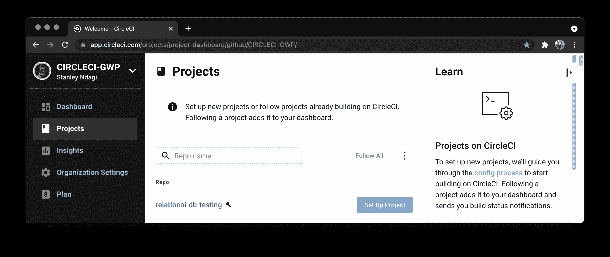
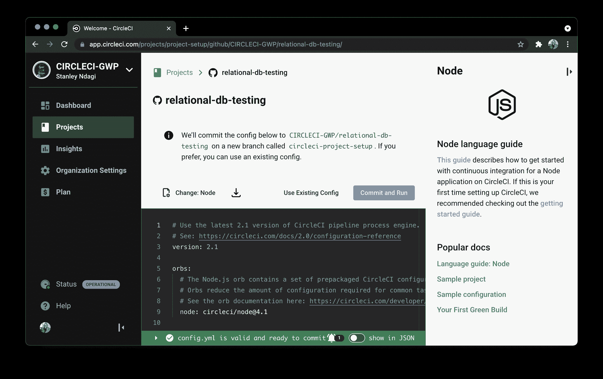
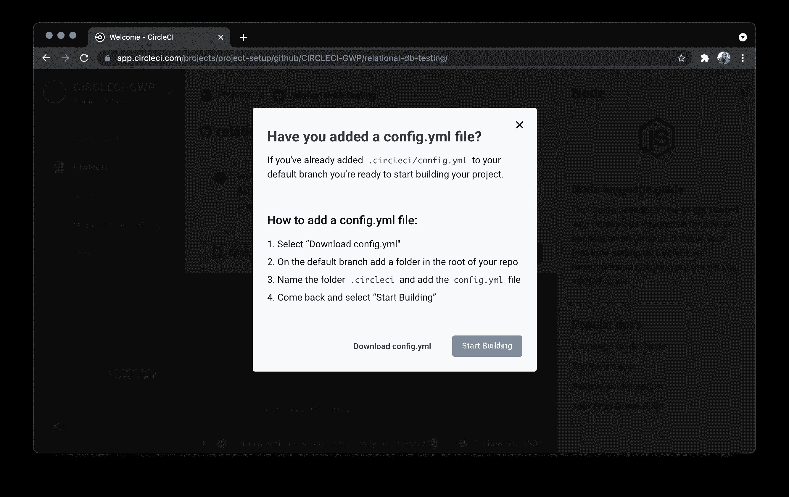
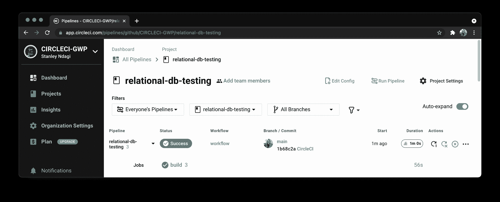
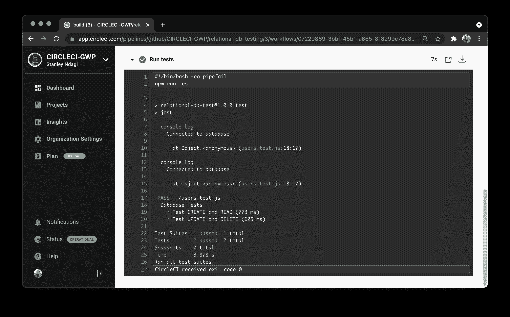

# 在 SQL 数据库| CircleCI 上执行数据库测试

> 原文：<https://circleci.com/blog/relational-db-testing/>

测试是那些活动中的一种，如果不是详尽的，就不会对你的软件开发过程产生完全的影响。开发人员常常只关心测试系统的应用层(也称为代码库)，而忽略了测试数据层(数据库)，这与测试代码本身同样重要。

什么是数据库测试？数据库测试主要包括构建 [SQL](https://en.wikipedia.org/wiki/SQL) 查询，以断言和验证数据库应用程序所需的不同数据库操作、结构和属性。这些可能包括验证模式、测试 CRUD 操作和事务，以确保正确设置数据库来为应用程序服务。关于数据库测试和执行测试的策略的更多信息，您可以查看我们的[数据库测试介绍文章](https://circleci.com/blog/intro-db-testing/)。

在本教程中，您将学习并演示如何测试关系型 [MySQL](https://www.mysql.com/) 数据库，然后着手建立一个持续集成管道来自动化测试过程。

## 先决条件

要跟进，你需要几样东西:

1.  JavaScript 的基础知识
2.  安装在您系统上的 [Node.js](https://nodejs.org) (版本> = 12)
3.  一个[圆](https://circleci.com/)的账户
4.  GitHub 的一个账户
5.  [SQL](https://en.wikipedia.org/wiki/SQL) 的基础知识。

安装并设置好所有这些之后，您就可以开始了。

## 获取远程 MySQL 实例

运行数据库测试时，您希望确保不是在生产数据库上运行这些测试。确保测试数据库与生产数据库完全相似。

对于本教程，您将需要一个远程 MySQL 数据库来运行测试。许多云提供商提供免费的 MySQL 数据库，您可以在以后使用和删除。你可以从任何你喜欢的服务中免费获得你的 MySQL 数据库，只要你有连接细节。

对于本教程，我使用来自[云团](https://www.cloudclusters.io/)的数据库。一旦你注册，导航到 [MySQL](https://www.cloudclusters.io/plans/MySQL) 。MySQL 的 Express 计划对我们的项目来说应该足够好。点击**免费试用**。使用默认设置，建立一个免费的 MySQL 数据库。我们将在下一节使用数据库细节。

**注意事项**:

*   如果您使用的服务在实例化时不创建默认表，则创建一个表。
*   *对于本教程，您可以使用 MySQL 5.7 或 MySQL 8.0 版本，以及`latin`、`utf8`、`utf8mb4`和`gbk`字符集。唯一的例外是 MySQL 8.0 版本中的`utf8mb4`字符集，它会抛出一个错误。*

你可以在 GitHub 上获得最终的项目代码[。这里使用的 MySQL 实例是 MySQL 5.7 版本。名为`circleci`的数据库使用了`utf8`字符集。](https://github.com/CIRCLECI-GWP/relational-db-testing)

## 用 Jest 和 MySQL SDK 设置测试项目

一旦设置好远程 MySQL，现在就可以开始设置测试环境了。不同的代码库有不同的测试运行器来执行测试。在本教程中，您将使用 [Jest](https://jestjs.io/) 测试框架和 [MySQL Node.js SDK](https://www.npmjs.com/package/mysql2) 来执行数据库测试，因为我们使用的是 JavaScript 项目。

通过创建一个文件夹并移动到其根目录来启动一个新的 Node.js 项目:

```
mkdir relational-db-testing
cd relational-db-testing 
```

然后，使用以下命令初始化 Node.js 项目并构建一个基本的`package.json`文件:

```
npm init -y 
```

接下来，安装`jest`作为开发依赖项:

```
npm install --save-dev jest 
```

然后，安装`mysql2`和`faker`包以连接到您的 MySQL 实例并生成假的测试数据:

```
npm install mysql2 faker 
```

现在您已经有了项目设置和所有的包，是时候开始编写测试了。

## CRUD 测试的数据完整性

对于本教程，您将运行简单的 CRUD(创建-读取-更新-删除)测试来验证 CRUD 操作中的数据完整性。

在项目的根目录下创建一个新文件`users.test.js`。在这个文件中，您将通过添加用户、读取添加的用户、更新用户和删除用户数据来测试一个`users`数据库表。

将以下代码添加到文件中。包括测试`CREATE`和`READ`操作的测试。

```
const { createPool } = require("mysql2/promise");
const faker = require("faker");

describe("Database Tests", () => {
  let connection;

  beforeEach(async () => {
    let createTableSQL =
      "CREATE TABLE `users` ( `id` INT(2) NOT NULL AUTO_INCREMENT , `name` VARCHAR(100) NOT NULL , `email` VARCHAR(50) NOT NULL , PRIMARY KEY (`id`)) ENGINE = InnoDB;";

    connection = await createPool({
      host: "YOUR_DB_HOST",
      user: "YOUR_DB_USER",
      password: "YOUR_DB_PASSWORD",
      port: YOUR_DB_PORT,
      database: "YOUR_DB_NAME"
    });
    console.log("Connected to database");

    await connection.query(createTableSQL);
  });

  it("Test CREATE and READ", async () => {
    try {
      const total_test_users = 3;
      let insertQueries = [];

      for (let i = 0; i < total_test_users; i++) {
        let insertSQL = `INSERT INTO users (id, name, email) VALUES (NULL, '${faker.name.findName()}', '${faker.internet.email()}');`;

        insertQueries.push(connection.query(insertSQL));
      }

      await Promise.all(insertQueries);

      const [rows, fields] = await connection.query("SELECT * FROM users");

      expect(rows.length).toBe(total_test_users);
    } catch (error) {
      console.log(error);
      let dropTableSQL = "DROP TABLE IF EXISTS `users`";
      await connection.query(dropTableSQL);
      await connection.end();
    }
  }, 60000);

  afterEach(async () => {
    let dropTableSQL = "DROP TABLE IF EXISTS `users`";
    await connection.query(dropTableSQL);
    await connection.end();
  });
}); 
```

这项测试:

*   建立与数据库实例的连接
*   在`beforeEach`函数调用中，它创建了一个带有字段`id`、`name`和`email`的`users`表
*   在`afterEach`函数调用中，表格被删除，连接结束

删除这个表可以确保套件中的每个测试都有一个新的`users`表实例，以避免测试使用相同的共享数据。记住分别用您的远程 MySQL 数据库主机、用户、密码、端口和数据库名称替换`YOUR_DB_HOST`、`YOUR_DB_USER`、`YOUR_DB_PASSWORD`、`YOUR_DB_PORT`和`YOUR_DB_NAME`。

在`Test CREATE and READ`测试用例中，`faker`库用于向`users`表添加 3 个用户。然后查询该表，以确保它包含刚刚添加的用户的确切数量。

要运行这个测试，更新您的`package.json`文件中的`test`脚本:

```
....,
"scripts" : {
    "test" : "jest"
} 
```

现在转到您的终端，通过运行以下命令来运行测试:

```
npm run test 
```

测试完成后，您的终端会显示以下输出。

```
> jest

  console.log
    Connected to database

      at Object.<anonymous> (users.test.js:18:17)

 PASS  ./users.test.js (5.5 s)
  Database Tests
    ✓ Test CREATE and READ (4292 ms)

Test Suites: 1 passed, 1 total
Tests:       1 passed, 1 total
Snapshots:   0 total
Time:        5.554 s
Ran all test suites. 
```

通过了对`CREATE`和`READ`的测试，这意味着可以用简单的`INSERT`查询对我们的模式和数据库执行这些操作。这可以进一步扩展，以检查重复的电子邮件或用户名等情况。

对于`UPDATE`和`DELETE`操作，继续在第一个测试的`it`模块下添加以下测试用例:

```
it("Test UPDATE and DELETE", async () => {
  try {
    let name = "Test user";
    let email = "test@user.com";
    let nameUpdate = "My Test User";

    let insertSQL = `INSERT INTO users (id, name, email) VALUES (NULL, '${name}', '${email}');`;

    await connection.query(insertSQL);

    //Run and test update
    let updateSQL = `UPDATE users SET name='${nameUpdate}' WHERE email='${email}'`;
    await connection.query(updateSQL);

    const [rows, fields] = await connection.query("SELECT * FROM users");
    expect(rows[0].name).toBe(nameUpdate);

    //Run and test delete
    let deleteSQL = `DELETE FROM users WHERE email='${email}'`;
    await connection.query(deleteSQL);

    const [allrows] = await connection.query("SELECT * FROM users");
    expect(allrows.length).toBe(0);
  } catch (error) {
    console.log(error);
    let dropTableSQL = "DROP TABLE IF EXISTS `users`";
    await connection.query(dropTableSQL);
    await connection.end();
  }
}, 60000); 
```

在这个测试中，通过创建一个新用户并更新该用户的`name`字段来测试`UPDATE`操作。然后查询该表以检查更新是否持续。

接下来，使用用户的电子邮件对用户数据运行一个`DELETE`操作。再次查询该表以检查该用户是否不再存在。

保存该文件并再次运行测试命令(`npm run test`)。这一次，您将在终端中看到以下输出:

```
> jest

  console.log
    Connected to database

      at Object.<anonymous> (users.test.js:18:17)

  console.log
    Connected to database

      at Object.<anonymous> (users.test.js:18:17)

 PASS  ./users.test.js (8.165 s)
  Database Tests
    ✓ Test CREATE and READ (3452 ms)
    ✓ Test UPDATE and DELETE (3205 ms)

Test Suites: 1 passed, 1 total
Tests:       2 passed, 2 total
Snapshots:   0 total
Time:        8.226 s
Ran all test suites. 
```

## 自动化测试过程

既然您已经正确地运行了您的测试，那么是时候自动化测试过程了。首先，您需要保存对测试文件的所有更改。

然后，将当前目录作为本地 git 存储库，并添加一个`.gitignore`文件。运行这些命令:

```
git init
wget https://raw.githubusercontent.com/github/gitignore/master/Node.gitignore && mv Node.gitignore .gitignore 
```

第二个命令复制 GitHub 官方文件`.gitignore`的内容，用于托管在[这里](https://github.com/github/gitignore/blob/master/Node.gitignore)的 JavaScript 项目。

接下来，[将项目推送到 GitHub](https://circleci.com/blog/pushing-a-project-to-github/) 。

转到 CircleCI 仪表板上的`Projects page`添加项目。



点击**设置项目**开始设置项目。在弹出的模式上点击**跳过这一步**。我们将在本教程的后面手动添加 CircleCI 配置。



在设置页面上，单击**使用现有配置**以指示 CircleCI 您将手动添加一个配置文件，而不是使用示例。接下来，系统会提示您下载管道的配置文件或开始构建。



点击**开始建造**。这个构建将会失败，因为我们还没有设置配置文件。那将是你的下一步。

要添加持续集成管道脚本，请返回到您的项目。在项目文件夹的根目录下创建一个名为`.circleci`的文件夹，并向其中添加一个名为`config.yml`的文件。在`config.yml`里面，输入这个代码:

```
version: 2.1
jobs:
  build:
    working_directory: ~/repo
    docker:
      - image: circleci/node:12
    steps:
      - checkout
      - run:
          name: Update NPM
          command: "sudo npm install -g npm"
      - restore_cache:
          key: dependency-cache-{{ checksum "package-lock.json" }}
      - run:
          name: Install Dependencies
          command: npm install
      - save_cache:
          key: dependency-cache-{{ checksum "package-lock.json" }}
          paths:
            - ./node_modules
      - run:
          name: Run tests
          command: npm run test 
```

这个配置获取适当的 Node.js 映像并更新其中的`npm`。然后安装并缓存依赖项，以加快后续的构建。最后，使用`npm run test`命令运行测试。

提交对项目的所有更改，并推送到您的远程 GitHub 存储库。这将触发构建管道，应该会成功。



点击**构建**，然后展开**运行测试**查看测试细节。



## 结论

在本教程中，您已经演示了如何测试关系数据库(MySQL)以及如何使用 CircleCI 自动化测试过程。如果测试对你的团队来说不是优先考虑的事情，与他们分享这个教程，这样他们就可以自己了解设置测试是多么容易。数据是您将要开发的几乎每个应用程序的核心。故障、损坏或数据泄露会导致用户对产品的可信度失去信心，并导致公司失去业务。在您的软件开发操作中，将数据库测试放在首位。

编码快乐！

* * *

Fikayo Adepoju 是 LinkedIn Learning(Lynda.com)的作者、全栈开发人员、技术作者和技术内容创建者，精通 Web 和移动技术以及 DevOps，拥有 10 多年开发可扩展分布式应用程序的经验。他为 CircleCI、Twilio、Auth0 和 New Stack 博客撰写了 40 多篇文章，并且在他的个人媒体页面上，他喜欢与尽可能多的从中受益的开发人员分享他的知识。你也可以在 Udemy 上查看他的视频课程。

[阅读 Fikayo Adepoju 的更多帖子](/blog/author/fikayo-adepoju/)