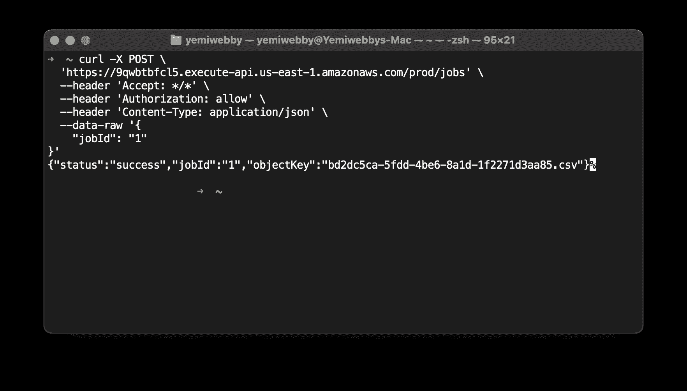
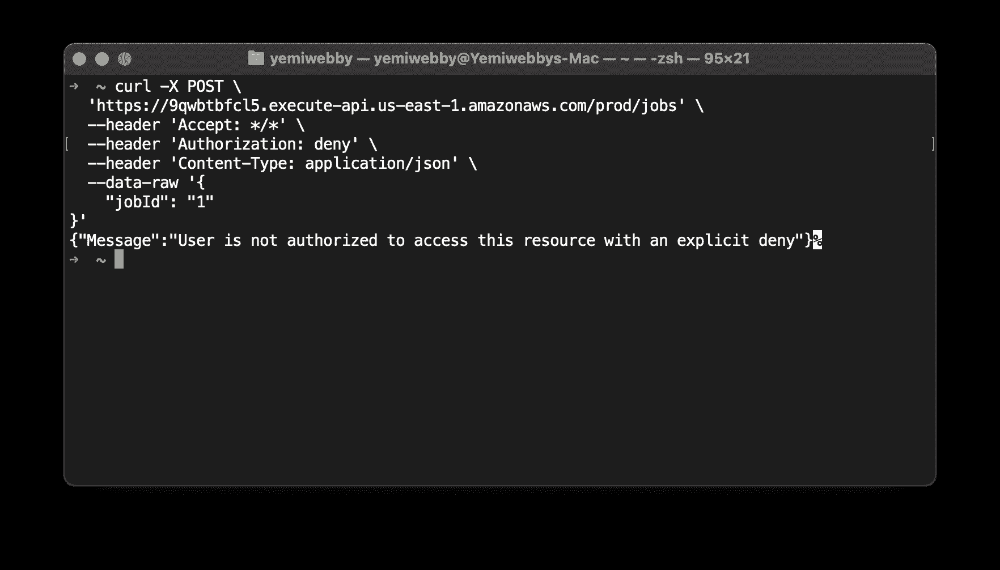
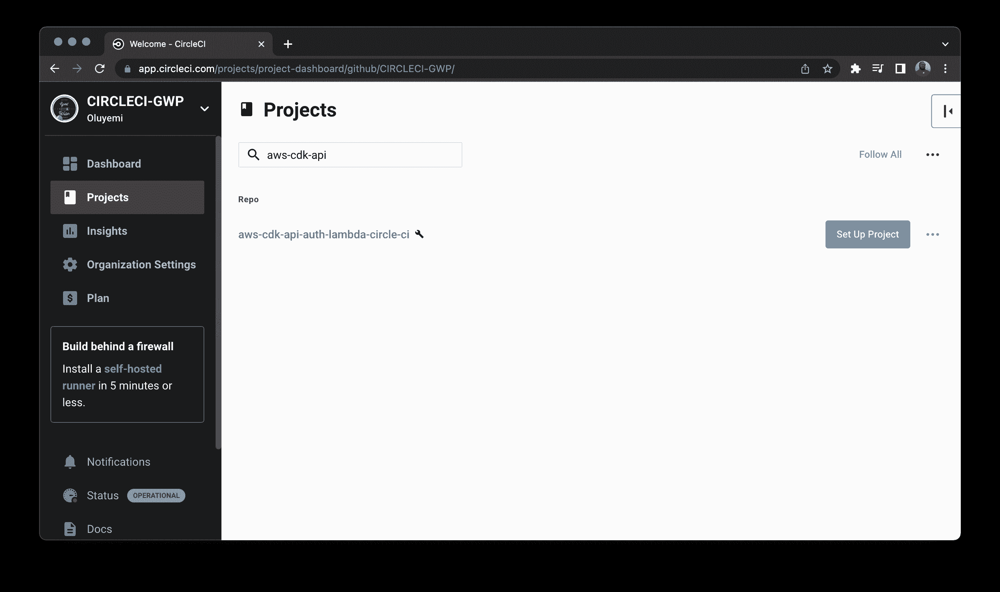
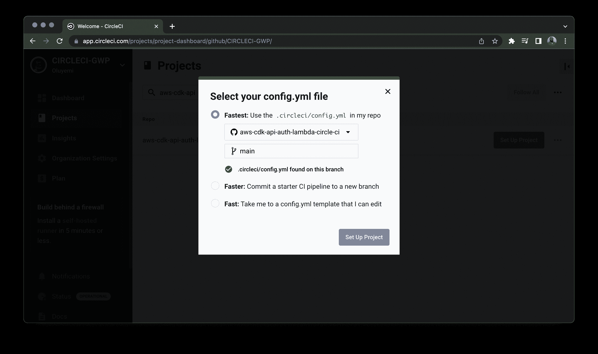
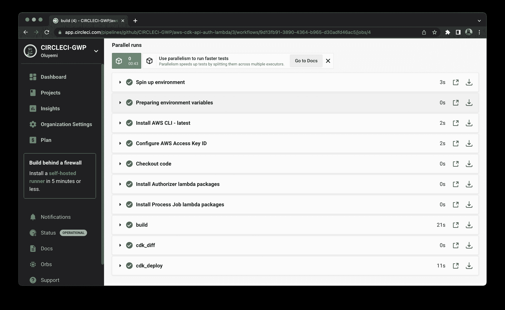

# 使用 AWS CDK 通过 Lambda 授权器自动部署 REST APIs

> 原文：<https://circleci.com/blog/rest-api-lambda-authorizer/>

> 本教程涵盖:
> 
> 1.  创建新的 AWS CDK 应用程序
> 2.  添加 Lambda 授权器并定义 CDK 结构
> 3.  自动化和测试 CDK 堆栈的部署

这是由两部分组成的系列教程的第二部分。您还可以了解如何自动将 AWS Lambda 功能部署到 AWS CDK 。

AWS 云开发工具包(AWS CDK)是一个开源框架，允许您使用自己选择的编程语言来定义和部署云资源。AWS CDK 是一个基础设施即代码(IaC)解决方案，类似于 [Terraform](https://www.terraform.io/) ，它允许您使用面向对象编程语言的表达能力来定义您的云资源。AWS CDK 框架为所有主要的 AWS 服务提供了大多数流行编程语言的库。您可以使用这些库轻松地为您的整个系统定义云应用程序栈。它消除了上下文切换，有助于加速开发过程。开发者不需要学习新的编程语言或新的工具来从 AWS CDK 中获益。

在本教程中，我将指导您使用 AWS CDK 通过基于 AWS Lambda 的授权器部署 REST APIs。您将了解如何通过添加授权者、使用计划、节流、速率限制等来使用 API 网关构造定制 API 的行为。

## 先决条件

对于本教程，您需要在您的机器上设置 NodeJS，因为您将使用它来定义 AWS CDK 应用程序和 AWS Lambda 处理程序。您还需要在您的系统上安装 AWS CLI 和 AWS CDK CLI，以便您可以配置 AWS 凭据并手动构建您的 CDK 应用程序。您将需要一个用于部署应用程序的 AWS 帐户和一个用于自动化部署的 CircleCI 帐户。下面是跟随本教程所需的所有东西的列表:

> 我们的教程是平台无关的，但是使用 CircleCI 作为例子。如果你没有 CircleCI 账号，请在 注册一个免费的 [**。**](https://circleci.com/signup/)

## 创建新的 AWS CDK 项目

为 CDK 项目创建一个新目录，并导航到其中。运行这些命令:

```
mkdir aws-cdk-api-auth-lambda-circle-ci
cd aws-cdk-api-auth-lambda-circle-ci 
```

使用 CDK CLI，运行`cdk init`命令，在 TypeScript 中创建一个新的 CDK 项目:

```
cdk init app --language typescript 
```

这个命令创建一个新的 CDK 项目，它只有一个堆栈和一个应用程序。

**注意:** *AWS CDK 支持所有主流编程语言，包括 TypeScript、Python、Java、C#。如果您选择不同的编程语言，您仍然可以遵循本教程中的步骤，但是语法将根据您选择的编程语言而改变。*

## 添加 NodeJS Lambda 函数

在本节中，您将使用 NodeJS 定义一个 AWS Lambda 函数，该函数可用于与 AWS API Gateway 的代理集成。API Gateway 的 AWS Lambda 代理集成提供了一种简单而强大的机制来构建 API 的业务逻辑。每当通过 API Gateway 调用 REST API 时，代理集成允许客户端在后端调用单个 AWS Lambda 函数。

这个例子使用的 AWS Lambda 函数与本系列第一篇教程[中定义的非常相似，自动将 AWS Lambda 函数部署到 AWS CDK](https://circleci.com/blog/deploy-aws-lambda-cdk/) 。只需更改 AWS Lambda 代理集成的请求和响应对象。

首先，在 CDK 项目的根目录下创建一个`lambda`目录。在`lambda`文件夹中，创建另一个名为`processJob`的文件夹。在`processJob`目录下创建一个`package.json`文件，用于定义依赖关系。打开`package.json`文件，添加以下内容:

```
{
  "name": "circle-ci-upload-csv-lambda-function",
  "version": "0.1.0",
  "dependencies": {
    "csv-stringify": "^6.0.5",
    "fs": "0.0.1-security",
    "uuid": "^8.3.2"
  }
} 
```

这个脚本定义了项目的名称，并添加了一些 Lambda 处理程序将使用的依赖项。

现在，从终端导航到 processJob 文件夹来安装 NPM 包。

```
cd lambda/processJob
npm install 
```

接下来，在`processJob`目录中创建一个`index.js`文件，并向其中添加以下代码片段。我们从[链接教程](https://circleci.com/blog/deploy-aws-lambda-cdk/)中获取了完整的代码片段，并修改了请求和响应对象。

```
"use strict";

const AWS = require('aws-sdk');
const { v4: uuidv4 } = require('uuid');
var fs = require('fs');
const { stringify } = require('csv-stringify/sync');
AWS.config.update({ region: 'us-west-2' });

var ddb = new AWS.DynamoDB();
const s3 = new AWS.S3();

const TABLE_NAME = process.env.TABLE_NAME;
const BUCKET_NAME = process.env.BUCKET_NAME;

exports.handler = async function (event) {
  try {
    const uploadedObjectKey = generateDataAndUploadToS3();
    const eventBody = JSON.parse(event["body"]);
    const jobId = eventBody["jobId"];
    console.log("event", jobId);
    var params = {
      TableName: TABLE_NAME,
      Item: {
        jobId: { S: jobId },
        reportFileName: { S: uploadedObjectKey },
      },
    };

    // Call DynamoDB to add the item to the table
    await ddb.putItem(params).promise();

    return {
      statusCode: 200,
      headers: { "Content-Type": "application/json" },
      body: JSON.stringify({
        status: "success",
        jobId: jobId,
        objectKey: uploadedObjectKey,
      }),
    };
  } catch (error) {
    throw Error(`Error in backend: ${error}`);
  }
};

const generateDataAndUploadToS3 = () => {
  var filePath = "/tmp/test_user_data.csv";
  const objectKey = `${uuidv4()}.csv`;
  writeCsvToFileAndUpload(filePath, objectKey);
  return objectKey;
};

const uploadFile = (fileName, objectKey) => {
  // Read content from the file
  const fileContent = fs.readFileSync(fileName);

  // Setting up S3 upload parameters
  const params = {
    Bucket: BUCKET_NAME,
    Key: objectKey,
    Body: fileContent,
  };

  // Uploading files to the bucket
  s3.upload(params, function (err, data) {
    if (err) {
      throw err;
    }
    console.log(`File uploaded successfully. ${data.Location}`);
  });
  return objectKey;
};

function writeCsvToFileAndUpload(filePath, objectKey) {
    var data = getCsvData();
    var output = stringify(data);

    fs.writeFileSync(filePath, output);
    // we will add the uploadFile method later
    uploadFile(filePath, objectKey);
}

function getCsvData() {
    return [
      ['1', '2', '3', '4'],
      ['a', 'b', 'c', 'd']
    ];
} 
```

请求和响应对象需要修改是有原因的。当通过 API Gateway 调用 Lambda 函数时，请求对象由一个 JSON 组成，其中包括请求体、HTTP 方法类型、REST API 资源路径、查询参数、头和请求上下文。下面是展示这一点的一个片段:

```
{
  "body": "{\"jobId\": \"1\"}",
  "path": "/path/to/resource",
  "httpMethod": "POST",
  "isBase64Encoded": false,
  "queryStringParameters": {
    ...
  },
  "headers": {
    ...
  },
  "requestContext": {
    ...
  }
} 
```

JSON 请求负载被字符串化，并在`body`参数下设置。要提取 Lambda 中的有效负载，您必须修改代码，如下所示。

```
const eventBody = JSON.parse(event["body"]);
const jobId = eventBody["jobId"]; 
```

此外，由于 Lambda 响应将被 API 网关直接使用，因此您需要将响应格式化为 JSON REST API 响应，其中包括状态代码、状态、消息头和响应体。因此，您将实际的响应字符串化并添加到 JSON 对象的`body`参数下，如下所示。

```
{
    "statusCode": 200,
    'headers': {'Content-Type': 'application/json'},
    "body": JSON.stringify({
      "status": "success",
      "jobId": jobId,
      "objectKey": uploadedObjectKey
    })
} 
```

## 添加 Lambda 授权者

接下来，定义另一个 AWS Lambda 函数作为定制授权器。每当客户端调用 REST API 时，API Gateway 都会调用这个 Lambda 函数，并将`Authorization`头值传递给它。Lambda 处理程序将验证在`Authorization`头中发送的令牌，如果令牌有足够的权限，将返回一个 IAM 策略语句。如果令牌没有被授权调用 REST API，Lambda 处理程序将返回一个错误响应。

首先，在 CDK 项目的根目录下创建一个`lambda/authorizer`目录。在`authorizer`目录中添加一个用于定义依赖关系的`package.json`文件。在`package.json`中，定义项目的名称，并添加一些 Lambda 处理程序将使用的依赖项。

```
{
  "name": "circle-ci-auth-lambda-function",
  "version": "0.1.0",
  "dependencies": {}
} 
```

接下来，在`authorizer`目录中为授权者 Lambda 处理程序创建一个`index.js`文件，并向其中添加一个空的 Lambda 处理程序。

```
exports.handler =  function(event, context, callback) {

}; 
```

在实现 Lambda 处理程序之前，定义一个生成 IAM 策略语句的方法，将`execute-api:Invoke`权限授予调用授权 Lambda 的 REST API。

```
var generatePolicy = function(principalId, effect, resource) {
    var authResponse = {};

    authResponse.principalId = principalId;
    if (effect && resource) {
        var policyDocument = {};
        policyDocument.Version = '2012-10-17'; 
        policyDocument.Statement = [];
        var statementOne = {};
        statementOne.Action = 'execute-api:Invoke'; 
        statementOne.Effect = effect;
        statementOne.Resource = resource;
        policyDocument.Statement[0] = statementOne;
        authResponse.policyDocument = policyDocument;
    }

    return authResponse;
} 
```

既然已经定义了`generatePolicy`函数，那么就实现 Lambda 处理程序。Lambda 处理程序将从`event`参数中提取授权令牌，然后验证该令牌。对于有效的令牌，它将调用`generatePolicy`方法来返回适当的 IAM 策略。

```
exports.handler = function (event, context, callback) {
  var token = event.authorizationToken;
  switch (token) {
    case "allow":
      callback(null, generatePolicy("user", "Allow", event.methodArn));
      break;
    case "deny":
      callback(null, generatePolicy("user", "Deny", event.methodArn));
      break;
    case "unauthorized":
      callback("Unauthorized"); // Return a 401 Unauthorized response
      break;
    default:
      callback("Error: Invalid token"); // Return a 500 Invalid token response
  }
}; 
```

既然已经为处理作业定义了 Lambda，也为授权定义了 Lambda，那么就可以为应用程序定义 CDK 结构了。

## 为应用程序定义 CDK 结构

AWS CDK 构造封装了多个 AWS 服务的配置细节和粘合逻辑。CDK 提供了大多数主流编程语言的库。

用下面的代码片段替换`lib/aws-cdk-api-auth-lambda-circle-ci-stack.ts`文件的内容，该代码片段定义了 AWS S3 桶、AWS Lambda 函数和 AWS DynamoDB 的构造。

```
import {
  Stack,
  StackProps,
  aws_s3 as s3,
  aws_dynamodb as dynamodb,
  aws_lambda as lambda,
  Duration
} from 'aws-cdk-lib';
import { Construct } from 'constructs';

export class AwsCdkApiAuthLambdaCircleCiStack extends Stack {
  constructor(scope: Construct, id: string, props?: StackProps) {
    super(scope, id, props);

    // we will add all the constructs here
    // replace bucket name with a unique name
    const circleCiGwpBucket = new s3.Bucket(this, "CircleCIGwpAuthExampleBucket", {
      bucketName: "<YOUR_BUCKET_NAME>",
    });

    const circleCiGwpTable = new dynamodb.Table(this, "CircleCIGwpAuthExampleTable", {
      tableName: "CircleCIGwpAuthExampleTable",
      partitionKey: { name: "jobId", type: dynamodb.AttributeType.STRING },
    });

    const circleCiGwpLambda = new lambda.Function(
      this,
      "CircleCiGwpProcessJobLambda",
      {
        runtime: lambda.Runtime.NODEJS_14_X,
        handler: "index.handler",
        timeout: Duration.seconds(30),
        code: lambda.Code.fromAsset("lambda/processJob/"),
        environment: {
          TABLE_NAME: circleCiGwpTable.tableName,
          BUCKET_NAME: circleCiGwpBucket.bucketName
        },
      }
    );

    circleCiGwpBucket.grantPut(circleCiGwpLambda);
    circleCiGwpTable.grantReadWriteData(circleCiGwpLambda);
  }
} 
```

这些构造与本系列第一篇教程中定义的相匹配，[自动将 AWS Lambda 函数部署到 AWS CDK](https://circleci.com/blog/deploy-aws-lambda-cdk/) ，所以我不会详细介绍这些构造的创建。这些是基本的 CDK 构造，使用在`lambda/processJob`目录中定义的 Lambda 处理程序创建一个新的 S3 桶、一个新的 DynamoDB 表和一个 Lambda 函数。定义构造后，向 Lambda 函数授予适当的 IAM 权限。

AWS S3 时段名称在所有 AWS 帐户中都是唯一的，因此您需要为您的时段提供一个唯一的名称。

*   `TABLE_NAME`和`BUCKET_NAME`作为`environment`变量被传递，它们可以在 AWS Lambda 处理程序中使用。

在定义任何更多的构造之前，您需要在堆栈中定义:

*   定义授权 Lambda 的 CDK 构造。
*   API 网关`TokenAuthorizer`构造使用授权 Lambda 作为其处理程序。
*   服务的 API 网关`RestApi`构造。
*   API 网关`LambdaIntegration`构造使用流程作业`Lambda`作为其处理程序。

使用 Lambda 集成构造将授权处理程序方法添加到 API 令牌授权器资源设置中。

### 定义授权 Lambda

接下来，添加一个 CDK 构造来为自定义授权创建一个 AWS Lambda 函数。授权 Lambda 将使用 NodeJS 运行时和您在`lambda/authorizer`目录中定义的代码。

```
constructor(scope: Construct, id: string, props?: StackProps) {
  // add this snippet below the existing code
  const circleCiAuthLambda = new lambda.Function(
    this,
    "CircleCiAuthLambda",
    {
      runtime: lambda.Runtime.NODEJS_14_X,
      handler: "index.handler",
      timeout: Duration.seconds(30),
      code: lambda.Code.fromAsset("lambda/authorizer/"),
    }
  );
} 
```

### 定义授权令牌

要定义 API 网关令牌授权者，需要为`TokenAuthorizer`添加一个 CDK 构造。令牌授权器使用您之前定义的授权 Lambda 函数。

```
import {
  Stack,
  StackProps,
  aws_s3 as s3,
  aws_dynamodb as dynamodb,
  aws_lambda as lambda,
  //update existing import to add aws_apigateway
  aws_apigateway as apigateway,
  Duration
} from 'aws-cdk-lib';

constructor(scope: Construct, id: string, props?: StackProps) {
  // add this snippet below the existing code
  const circleCiAuthorizer = new apigateway.TokenAuthorizer(this, 'CircleCIGWPAuthorizer', {
    handler: circleCiAuthLambda
  });
} 
```

### 定义 REST API 服务

接下来，定义一个 API Gateway REST API 服务，并为其提供名称和描述。您将使用这个`RestApi`服务向其添加资源。

```
constructor(scope: Construct, id: string, props?: StackProps) {
  // add this snippet below the existing code
  const circleCiGwpApi = new apigateway.RestApi(this, "CircleCIGWPAPI", {
    restApiName: "Circle CI GWP API",
    description: "Sample API for Circle CI GWP"
  });
} 
```

您现在可以向`circleCiGwpApi`服务添加资源。资源是您正在创建的实际端点，不包括基本 URL。

```
constructor(scope: Construct, id: string, props?: StackProps) {
  // add this snippet below the existing code
  const jobResource = circleCiGwpApi.root.addResource("jobs");
} 
```

### 添加 Lambda 集成

Lambda 集成将 AWS Lambda 函数集成到 API 网关方法中。您将使用前面定义的流程作业 Lambda 函数作为 Lambda 集成的处理程序。

```
constructor(scope: Construct, id: string, props?: StackProps) {
  // add this snippet below the existing code
  const processJobIntegration = new apigateway.LambdaIntegration(
    circleCiGwpLambda
  );
} 
```

### 添加具有 lambda 授权的 api 网关方法

最后，向`jobResource`添加一个`POST`方法，并使用授权 Lambda 作为 auth 处理程序。

```
constructor(scope: Construct, id: string, props?: StackProps) {
  // add this snippet below the existing code
  jobResource.addMethod("POST", processJobIntegration, {
    authorizer: circleCiAuthorizer,
    authorizationType: apigateway.AuthorizationType.CUSTOM,
  });
} 
```

## 定制 API 使用计划

在本节中，您将学习如何通过定义使用计划、节流设置和速率限制来定制 REST APIs 的行为和体验。

该计划使用 API 键来标识 API 客户端以及谁可以访问每个键的相关 API 阶段。

*   使用计划:使用计划指定谁可以访问已部署的 API。可以选择在方法级别设置使用计划。API 键与一个使用计划相关联，并用于标识可以访问每个键的 API 的 API 客户端。
*   API 密钥:API 密钥是字符串值，可用于授予对 API 的访问权限。
*   节流限制:节流限制确定请求节流应该开始的阈值，它可以在 API 或方法级别设置。

现在您可以为 API 定义一个使用计划了。

```
constructor(scope: Construct, id: string, props?: StackProps) {
  // add this snippet below the existing code
  const circleCiUsagePlan = circleCiGwpApi.addUsagePlan('CircleCiUsagePlan', {
    name: 'CircleCiEasyPlan',
    throttle: {
      rateLimit: 100,
      burstLimit: 2
    }
  });
} 
```

请注意，您还将定义带宽限制和使用计划。`rateLimit`指的是 API 在一段时间内每秒的平均请求数。`burstLimit`指的是从一秒到几秒时间范围内的最大 API 请求速率限制。设置节流限制是可选的，您可以选择不对您的 API 实施任何此类限制。

因为使用计划需要一个与之相关联的 API 密钥来标识客户端，所以需要为其添加一个 API 密钥。

```
constructor(scope: Construct, id: string, props?: StackProps) {
  // add this snippet below the existing code
  const circleCiApiKey = circleCiGwpApi.addApiKey('CircleCiApiKey');
  circleCiUsagePlan.addApiKey(circleCiApiKey);
} 
```

`CircleCiApiKey`与 CircleCI 仪表板没有任何关联。根据您的需求，您可以为 API 键使用任何其他名称。

## 部署 CDK 堆栈

既然已经在堆栈中定义了 CDK 结构，那么就可以继续将应用程序部署到 AWS 帐户了。首先，在使用 CircleCI 自动化部署之前，手动部署应用程序。确保您的系统上安装了 AWS CDK CLI。除此之外，您还需要安装 AWS CLI 并配置访问凭据。您可以按照先决条件部分中的链接安装 CLI 并配置凭据。

运行以下命令来引导并部署应用程序。

```
cdk bootstrap
cdk deploy 
```

当您执行`cdk deploy`命令时，它会提示您确认将应用于您的帐户的 IAM 角色/策略更改。注意，终端将显示您部署的 REST API 服务的基本 URL。获取这个 URL 并保存在手边，因为您将在下一节中使用它来测试 API。

## 测试部署的 API

现在应用程序已经部署到 AWS 帐户，通过使用`curl`调用 API 端点来测试 API。在`curl`请求中替换您在上一节中获得的基本 URL。

```
curl -X POST \
  '<base_URL>/jobs' \
  --header 'Accept: */*' \
  --header 'Authorization: allow' \
  --header 'Content-Type: application/json' \
  --data-raw '{
    "jobId": "1"
}' 
```

注意，您已经设置了`Authorization: allow`头，它充当将由授权 Lambda 验证的令牌。

在执行`curl`请求时，您应该会收到一个类似如下所示的成功响应。



不要在`Authorization`头中传递`allow`值，而是尝试传递`deny`或其他值，以确保 API 只有在收到有效令牌时才返回成功响应。

```
curl -X POST \
  '<baseURL>/jobs' \
  --header 'Accept: */*' \
  --header 'Authorization: deny' \
  --header 'Content-Type: application/json' \
  --data-raw '{
    "jobId": "1"
}' 
```

正如所料，API 返回一个授权响应，因为令牌无效。



## 使用 CircleCI 自动化应用程序部署

既然您已经能够使用命令行手动部署 CDK 应用程序，那么请自动化工作流，以便在您每次将代码推送到主分支时，可以自动打包和部署基础架构更改。要实现部署自动化，您需要:

*   更新。gitignore
*   更新 NPM 脚本
*   添加配置脚本
*   创建 CircleCI 项目
*   设置环境变量

### 更新。gitignore

由`cdk init`命令生成的代码包含一个默认忽略所有`.js`文件的`.gitignore`文件。确保用下面的代码片段替换`.gitignore`的内容。

```
!jest.config.js
*.d.ts
node_modules

# CDK asset staging directory
.cdk.staging
cdk.out 
```

### 更新 NPM 脚本

我们的 CircleCI 部署配置使用 NPM 脚本来执行 deploy 和 diff 命令。将以下脚本添加到根级`package.json`文件中。

```
// update the aws-cdk-api-auth-lambda-circle-ci/package.json file with the following scripts
{
  ... 
  "scripts": {
    ...
    // add the ci_diff and ci_deploy scripts
    "ci_diff": "cdk diff -c env=${ENV:-stg} 2>&1 | sed -r 's/\\x1B\\[([0-9]{1,2}(;[0-9]{1,2})?)?[mGK]//g' || true",
    "ci_deploy": "cdk deploy -c env=${ENV:-stg} --require-approval never"
  },
  ...
} 
```

### 添加配置脚本

首先，在包含 CI 管道配置文件的项目根目录中添加一个`.circleci/config.yml`脚本。将下面的代码片段添加到`config.yml`中。

```
version: 2.1

orbs:
  aws-cli: circleci/aws-cli@2.0.6
executors:
  default:
    docker:
      - image: "cimg/node:14.18.2"
    environment:
      AWS_REGION: "us-west-2"
jobs:
  build:
    executor: "default"
    steps:
      - aws-cli/setup:
          aws-access-key-id: AWS_ACCESS_KEY
          aws-secret-access-key: AWS_ACCESS_SECRET
          aws-region: AWS_REGION_NAME
      - checkout
      - run:
          name: 'Install Authorizer lambda packages'
          command: |
            cd lambda/processJob && npm install
      - run:
          name: 'Install Process Job lambda packages'
          command: |
            cd lambda/processJob && npm install
      - run:
          name: "build"
          command: |
            npm install
            npm run build
      - run:
          name: "cdk_diff"
          command: |
            if [ -n "$CIRCLE_PULL_REQUEST" ]; then
              export ENV=stg
              if [ "${CIRCLE_BRANCH}" == "develop" ]; then
                export ENV=prd
              fi 
              pr_number=${CIRCLE_PULL_REQUEST##*/}
              block='```'
              diff=$(echo -e "cdk diff (env=${ENV})\n${block}\n$(npm run --silent ci_diff)\n${block}")
              data=$(jq -n --arg body "$diff" '{ body: $body }') # escape
              curl -X POST -H 'Content-Type:application/json' \
                -H 'Accept: application/vnd.github.v3+json' \
                -H "Authorization: token ${GITHUB_TOKEN}" \
                -d "$data" \
                "https://api.github.com/repos/${CIRCLE_PROJECT_USERNAME}/${CIRCLE_PROJECT_REPONAME}/issues/${pr_number}/comments"
            fi
      - run:
          name: "cdk_deploy"
          command: |
            if [ "${CIRCLE_BRANCH}" == "main" ]; then
              ENV=prd npm run ci_deploy
            elif [ "${CIRCLE_BRANCH}" == "develop" ]; then
              ENV=stg npm run ci_deploy
            fi 
```

CI 脚本使用 [aws-cli orb](https://circleci.com/developer/orbs/orb/circleci/aws-cli) 来设置 aws 配置，例如访问密钥和密码。

`cdk_deploy`命令检查分支，并相应地部署在`prd`或`stg`环境中。注意，`cdk_deploy`命令执行在`package.json`文件中定义的`ci_deploy`脚本。

我们的管道配置将负责构建、打包和部署 CDK 堆栈到指定的 AWS 帐户。提交更改并将其推送到 GitHub 存储库。

### 为应用程序创建一个 CircleCI 项目

接下来，使用 [CircleCI 控制台](https://app.circleci.com/)将存储库设置为 CircleCI 项目。在 Circle CI 控制台上，单击**项目**选项卡并搜索 GitHub repo 名称。为您的项目点击**设置项目**按钮。



将出现一个对话框提示，询问您是要手动添加新的配置文件还是使用现有的配置文件。因为您已经将所需的配置文件推送到代码库，所以选择最快的选项，并输入承载您的配置文件的分支的名称。单击“设置项目”继续。



完成设置将自动触发管道。管道在第一次运行时会失败，因为您还没有定义环境变量。

### 设置环境变量

在项目页面，点击**项目设置**，进入**环境变量**选项卡。在出现的屏幕上，点击**添加环境变量**按钮，添加以下环境变量。

*   `AWS_ACCESS_KEY`从 AWS 控制台的 IAM 角色页面获得
*   `AWS_ACCESS_SECRET`从 AWS 控制台的 IAM 角色页面获得
*   `AWS_REGION_NAME`到您想要部署应用程序的区域

一旦您添加了环境变量，它应该在仪表板上显示键值。

现在环境变量已经配置好了，再次触发管道。这一次构建应该会成功。



## 结论

在本教程中，您了解了如何使用 AWS CDK 构造轻松部署应用程序，并使用 REST APIs 公开其功能。CDK 可用于轻松插入基于 Lambda 的定制授权器，并通过定义使用计划、API 密钥和节流限制来进一步定制应用体验。AWS CDK 允许您使用熟悉的工具和编程语言编写 IaC 代码。它还允许您编写可测试的代码，并将基础设施代码与您现有的代码评审工作流集成在一起。

你可以在 GitHub 上查看本教程中使用的完整的[源代码](https://github.com/CIRCLECI-GWP/aws-cdk-api-auth-lambda)。如果你想定义一个类似的堆栈，GitHub 项目也可以作为你的模板。

* * *

Vivek Kumar Maskara 是 JP 摩根的一名软件工程师。他喜欢写代码，开发应用程序，创建网站，并写关于他的经历的技术博客。他的简介和联系方式可以在[maskaravivek.com](https://www.maskaravivek.com/)找到。

[阅读更多 Vivek Maskara 的帖子](/blog/author/vivek-maskara/)