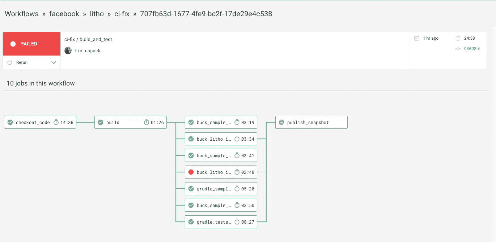
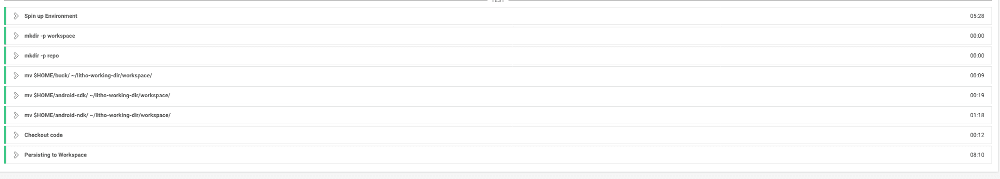
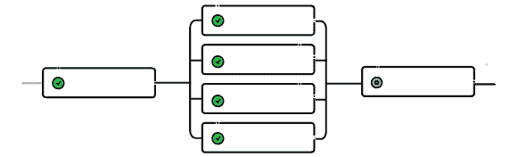
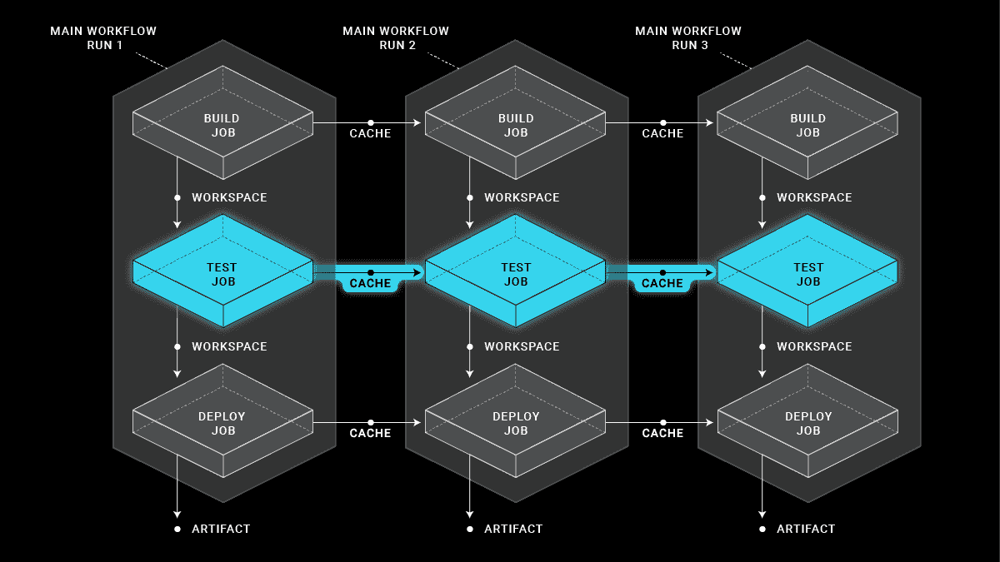
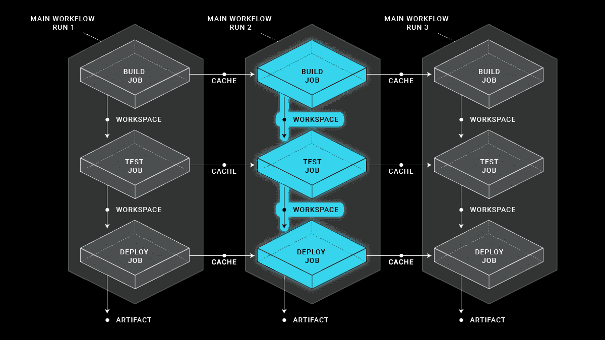

# 正在为工作流重新构建 Litho 的 CircleCI 配置- CircleCI

> 原文：<https://circleci.com/blog/restructuring-litho-s-circleci-config-for-workflows/>

这是 Pavlos-Petros Tournaris 的客座博文。它最初出现在他的博客[这里](https://medium.com/@p.tournaris/restructuring-lithos-circeci-config-for-workflows-38bb9e28f56a)。Pavlos-Petros 在 Workable 担任 Android 软件工程师。我们希望你喜欢！



大约一年半前，脸书发布了作为开源项目的 [Litho](https://fblitho.com/) 。Litho 是一个 Android 框架，它让你以声明的方式定义你的 UI。它立即引起了我的兴趣，我开始用一些例子和宠物项目来弄脏我的手。这是一个很好的经验，接触石和它的反应一样的性质，这是我的第一次。对这个新领域的兴趣让我意识到我可以更深入地研究它，也可以为这个项目做贡献。因此，就像我喜欢的任何其他开源项目一样，我开始检查“问题”选项卡，看看我是否能帮助解决任何错误或贡献新功能。

## 自动化测试

Litho，就像大多数开源项目一样，包含许多测试(没有测试通常很难获得开发人员的信任)。Litho 上的测试基础设施是基于单元测试的，这些单元测试要么通过 [Buck](https://buckbuild.com/) 运行，要么使用 Gradle。

但是如果你不能对你的 PRs 有适当的反馈，并且确保进入`master`分支的每个提交都是绿色的，那么测试本身没有任何意义。

Litho 使用 CircleCI 来利用其单元测试套件的运行，收集测试结果，并为每个推送到`master`的提交发布快照。

## 以前的情况

此前，Litho 使用的是由 Litho 的机器人工程师之一 Pascal Hartig 制作的定制 Docker 图像。

这个映像正在下载 Buck，构建它并保存在 Docker 环境中。同样的事情也分别发生在安卓 NDK 和安卓 SDK 上。当 CircleCI 开始构建 commit 时，它会配置一些所需的键，用于上传档案和将 Buck 导出到 Path 中。最后，它开始执行样本项目的所有 Buck & Gradle 构建，以及执行 BUCK & Gradle 测试，这通过发布快照和存储测试结果来完成。

虽然这样做效果很好，但是仍然需要为 Buck 和 Gradle 测试以及样本构建配置并行作业。

## 以前情况的问题

在开始调查哪些地方可以改进的时候，我注意到了一些可以提高性能的东西，还有一些是在与 Pascal 讨论之后出现的。

*   CircleCI 配置使用自定义的 Docker 映像，由于 CircleCI 在其容器上缓存 Docker 映像的方式，每次作业运行时都会有效地提取该映像，运行一个环境大约需要 5-6 分钟。



*   构建和测试不是并行运行的，这意味着即使 Buck 构建需要两分钟来执行测试，它也必须等待 Gradle 完成测试后才能继续。

*   用于收集测试结果的正则表达式没有收集 Buck 测试结果。

### 工作流来了

CircleCI 提供了一个名为 Workflows 的特性，它允许我们定义并行运行的作业列表，但是您也可以声明作业之间的依赖关系，这将有效地将它们的执行更改为顺序执行。

```
- checkout_code      
- build:          
    requires:            
      - checkout_code      
- buck_sample_build:          
    requires:            
      - build      
- buck_sample_barebones_build:          
    requires:            
      - build      
- buck_sample_codelab_build:          
    requires:            
      - build      
- gradle_sample_kotlin_build:          
    requires:            
      - build      
- buck_litho_it_tests_run:          
    requires:            
      - build      
- buck_litho_it_powermock_tests_run:          
    requires:            
      - build      
- gradle_tests_run:          
    requires:            
      - build 
```

## 将平版印刷转变为使用工作流程

第一步是创建一个检查回购代码的工作，并开始设置所需的依赖项，包括:Buck，将帮助我们构建 Buck 的依赖项，如 Ant 和 Android NDK。这项工作被定义为 Litho`build_and_test`工作流程的第一步。

依赖于该作业的是`build`作业，它负责构建 Litho 并保存任何 Gradle 产生的缓存。

之后，build 将分发给其他七个负责构建样本和执行测试的任务。这些作业中的每一个还被配置为存储测试结果并上传任何产生的工件。


*扇出*

这个工作流由一个`publish_snapshot`作业完成，这个作业依赖于每一个执行测试的作业。在它们成功执行后，Gradle 任务负责将包含最新更改的档案作为快照上传到 Bintray 上。

```
- publish_snapshot:          
    requires:            
      - buck_litho_it_tests_run            
      - buck_litho_it_powermock_tests_run            
      - gradle_tests_run 
```

## 缓存和工作空间

CircleCI 的配置 DSL，其中包括`cache` & `workspace`。为了更好地解释这些术语，让我将它们定义如下:

*   `cache`是将在工作流执行之间保留的已保存内容。

 *缓存在 CircleCI*

```
- &save-repo-cache    
  paths:      
    - ~/.gradle/caches      
    - ~/.gradle/wrapper 
```

*   `workspace`是保存的内容，将在同一工作流程的作业执行中保留。

 *用工作区保存内容*

```
- persist_to_workspace:          
    root: workspace          
    paths:            
      - repo 
```

例如，只要有适当的缓存破坏机制，任何梯度缓存的依赖项都是值得缓存的。然而，我们的回购代码是所有作业都需要的，因此值得将它保存到我们的工作区，以便每个作业都能够“附加”并访问该内容。

```
attach_workspace: &attach_workspace  
  attach_workspace:    
    at: ~/litho-working-dir/workspace 
```

## 作业配置

作为工作流一部分的作业也可以为分支定义`filters`。这尤其有用，因为我们不想执行`publish_snapshot`作业，以防我们运行的提交不在`master`分支上，而是在 PR 上。这可能看起来是一个小变化，但它可以节省 7-8 分钟等待工作流执行完成的时间。

```
filters:            
  branches:              
    only: master 
```

## 重组后的改进

在大量的提交、工作流执行和与 Pascal 讨论可改进点之后，我们最终设法在大约 15-20 分钟内运行了一个工作流。以下是我们改进的几点:

*   我们通过使用 CircleCI 的 Android 映像并在启动时提取任何所需的依赖项，删除了自定义 Docker 映像。为我们提供了 95%(甚至更多)的作业执行的 1 秒容器配置。
*   我们用了 CircleCI 的 Android Docker 镜像 Android SDK，而不是从头开始下载。
*   我们让测试和构建工作并行运行，例如，在某个“示例”模块出现问题时，允许早期反馈。与 Github 的集成相结合，这真的提供了很多信息，因为如果负责对您的更改执行测试的工作失败了或没有失败，您可以立即得到通知，而不必等待整个工作流完成。
*   我们从 Buck 测试执行中收集了以前未收集的测试结果。

## 结论

这是一次有趣的经历，也是一次大开眼界的经历。我以前从未在这种程度上处理过 CI 工具，我完全可以说开发运维或 CI 配置肯定是一项困难的工作(尊重我们每天都要处理这些工作的同事)。

此外，感谢 [Pascal Hartig](https://medium.com/@passy) 对流程的帮助以及对改进点的讨论。

你可以在这里找到重构 config.yml 的 commit:[https://github . com/Facebook/litho/commit/2c 411830d 11d 08 fc 2 af 194 D8 ea 244d 0 cbdf 33 f 76](https://github.com/facebook/litho/commit/2c411830d11d08fc2af194d8ea244d0cbdf33f76)

而 Litho 的最终 config.yml 在这里:[https://github.com/facebook/litho/blob/master/.circleci/config.yml](https://github.com/facebook/litho/blob/master/.circleci/config.yml)